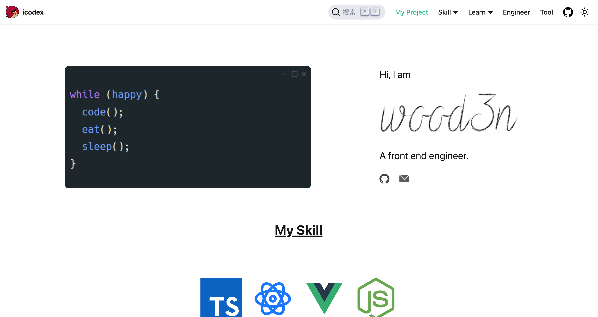

  <a href="https://icodex.me">
    
    <h2 align="center">icodex</h2>
  </a>

 

Creative FrontEnd Web Developer

# 😀 Introduce

Hi! Guys, I'm a frontend engineer, thanks for visiting my blog which was built on ducusaurus.

# 💪 Skill

The programming skills I am good at are as follows：

If you have any question or suggestion, you can leave a comment on my blog page — [icodex](https://icodex.me/), hope we could be good friends.

