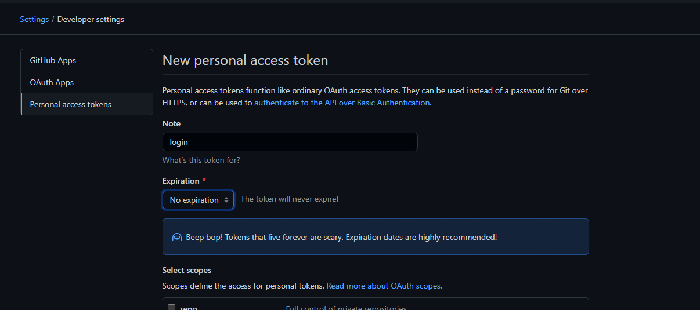

## GitHub 取消密码登录验证的方式

2021 年 8 月 13 日以后，[GitHub 宣布不再支持密码登录的客户端授权方式](https://github.blog/changelog/2021-08-12-git-password-authentication-is-shutting-down/)。


<!--truncate-->

## 解决方式

> [git - Support for password authentication was removed. Please use a personal access token instead - Stack Overflow](https://stackoverflow.com/questions/68775869/support-for-password-authentication-was-removed-please-use-a-personal-access-to)

参考 StackOverflow 上的解释，现在只能通过在 GitHub 网站生成 PAT (Personal Access Token)的方式保存在客户端来进行校验和授权。

### 生成 PAT

在 GitHub 官网生成 PAT 按照以下方式：

1. 右上角点击个人头像，找到 **Settings** 并打开；
2. 然后在 **Settings** 面板左侧目录找到 **Developer Settings**，点击进去就可以看到 **Personal access tokens** 了



### 设置 PAT

生成 PAT 以后呢，以 windows10 系统为例，在**控制面板 => 个人账户**下找到**凭据管理器**


然后点击右侧 Windows 凭据，找到`git:https://github.com`，如果没有就点击添加，用户名就是邮箱地址，密码是刚才生成的 token，保存即可。


## 注意

如果本地设置了 Git 代理地址，则需要重置代理

```shell
git config --global https.proxy http://127.0.0.1:1080

git config --global https.proxy https://127.0.0.1:1080

git config --global --unset http.proxy

git config --global --unset https.proxy
```