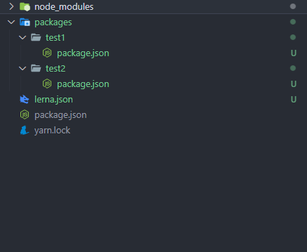

## monorepo

### 什么是 monorepo

`monorepo`这个词是`meno`和`repo`两个缩写词的组合，`meno`是更少的意思，`repo`是`repository`的缩写，也就是仓库，合起来就是使用更少的仓库来进行版本管理控制，将所有项目都放在一个代码仓库进行管理。

截止到目前，主流的前端开源项目基本全部使用`monorepo`，例如`react`，`vue`，`babel`等。

<!--truncate-->

### 为什么要使用 monorepo

使用`monorepo`有以下好处：

- 代码复用更简单，**类似的功能或通信协议可以抽象到共享库中**，而不需要依赖包管理器；
- 原子级别的提交使得不同项目版本管理更加方便，例如`babel`内部包含`@babel/parser`，`@babel/traverse`等许多子项目，这些模块同时修改都在一个仓库代码内，修改完一次提交就行了；
- 避免重复安装第三方依赖，在大型项目中肯定会使用大量第三方依赖包，这些包的版本管理和安装需要不断重复进行，而`monorepo`内部只需要管理和安装一次，其他`package`都可以共享；
- 跨团队协作更加方便，由于代码都在一个仓库内部，所以基本没有权限限制，大家都可以参与和维护

不过，使用`monorepo`也有一些不便：

- `package`划分的粒度不好控制，这一般取决于架构的水平
- 随着不同项目的进行，整个`monorepo`会越来越大
- 权限控制没有`multirepo`那样精细到项目
- 团队协作导致的修改可能因为沟通不及时的问题而影响很多面，不过这都是开发者不规范使用的问题

## lerna

> lerna 是一个工具，它优化了使用 git 和 npm 管理多包存储库的工作流。

在`lerna`架构中，每个单独的项目都是放在`package`目录的子文件夹下进行管理，每个`package`内部都有管理自身配置项的`package.json`文件，依赖也都会安装在各个`package`文件夹内的`node_modules`内部。

### 使用

使用`lerna`需要全局安装 CLI 工具

```bash
yarn global add lerna

lerna init

lerna bootstrap

lerna publish
```


### 版本控制

`lerna`提供两种版本控制的方式：

1. 一种是所有项目固定使用一个版本号，位于`monorepo`内部的`lerna.json`内部指定的`version`，这样就会导致执行`lerna publish`会更新所有`package`的版本号；
2. 另一种是使用`lerna init --independent`创建的项目，可以独立管理每个`package.json`内部的版本号，每次执行`lerna publish`的时候，可以单独选择每个修改过的`package`内部的版本号。

### 配置项

在`lerna.json`中可以指定以下配置项：

```json
{
  "version": "1.1.3",
  "npmClient": "npm",
  "command": {
    "publish": {
      "ignoreChanges": ["ignored-file", "*.md"],
      "message": "chore(release): publish",
      "registry": "https://npm.pkg.github.com"
    },
    "bootstrap": {
      "ignore": "component-*",
      "npmClientArgs": ["--no-package-lock"]
    }
  },
  "packages": ["packages/*"]
}
```

- `version`：版本号，指定为`independent`表示每个`package`单独管理
- `npmClient`：使用`npm`还是`yarn`安装依赖
- `command.publish.ignoreChanges`：忽略以某些文件修改导致的发布更新，使用`glob`模式
- `command.publish.message`：执行发布的提交信息
- `command.publish.registry`：发布源
- `command.bootstrap.ignore`：取消引导安装依赖的文件
- `command.bootstrap.npmClientArgs`：执行`lerna bootstrap`时传递给`npm install`或者`yarn install`命令的参数
- `command.bootstrap.scope`：限制`lerna bootstrap`引导的`package`
- `packages`：指定`lerna package`目录，默认就是`packages`文件夹
- `useWorkspaces`：是否使用`yarn workspace`，如果开启需要在仓库根目录下的`package.json`指定`workspaces`

### 命令行

#### lerna init

创建基于`lerna`的`monorepo`仓库，或者更新当前仓库的`lerna`版本。

#### lerna bootstrap

安装所有`package`的依赖项。`lerna`为项目内的每个`package`执行`npm install`或者`yarn install`，然后在这些包之间创建[`symlink`](https://zh.wikipedia.org/wiki/%E7%AC%A6%E5%8F%B7%E9%93%BE%E6%8E%A5)，以相互引用。

例如`babel`项目中`babel-core`依赖`@babel/generator`，而且它们都在同一个`monorepo`中，那么在`packages/babel-core`下安装的`@babel/generator`会通过`symlink`链接到同级的`@babel/generator`目录。

`symlink`是一类特殊的文件，包含一条以绝对路径或者相对路径形式指向其他文件或者目录的引用。目前 Unix，Windows 都支持`symlink`，一个符号链接文件仅包含有一个文本字符串，其被操作系统解释为一条指向另一个文件或者目录的路径。

`lerna bootstrap --use-workspaces`使用`yarn workspace`的形式管理`packages`的依赖。

#### lerna add

```bash
lerna add <package> --scope=[package] --dev
```

`lerna add`用于安装依赖到指定`package`内部，如果没有指定`scope`，那么默认安装到所有`package`内部。

注意不同`package`之间如果相互依赖，也需要通过`lerna add`安装，这样`lerna`才能创建`symlink`关联到依赖的`package`内部。

#### lerna publish

发布所有更新过内容的`package`仓库到`npm`，会提示`version`的更新。

#### lerna run [script]

在包含指定`script`的`package`内部执行该命令。

### lerna 的局限性

`lerna`作为`package`管理的容器，`lerna`无法做到高效地管理`node_modules`：

- `lerna`为每个`package`单独执行`xxx install`的操作，并且依赖之间无法共享，所以会导致依赖的重复安装，可以参考上文使用`lerna`创建的项目内部管理`react`的安装项。
- `lerna`必须通过执行`lerna bootstrap`才能为不同`package`创建`symlink`，而如果单独在`package`内部执行`yarn install`等命令就会导致`symlink`被破坏，因此`package`管理非常受限制。

## yarn workspace

为了解决`lerna`的局限性，`yarn`从`0.28`版本（目前 1.22）以后支持`monorepo`管理`package`之间的依赖。

并且从`yarn-1.0`版本以后，`yarn`默认支持，这种方式在`yarn`内部称为`workspace`。使用上来说，只需要在

`monorepo`根目录下的`package.json`中注册`workspace`的文件夹即可。

```json
{
  "private": true,
  "workspaces": ["packages/*"]
}
```

`yarn workspace`不能取代`lerna`，主要是为了解决`lerna`的问题，因此`lerna`从`2.0.0`版本以后，支持使用`lerna bootstrap --use-workspace`来使用`yarn`引导`monorepo`依赖的管理和创建，这样`monorepo`内部所有`package`的依赖都只会安装在仓库根目录的`node_modules`下。



### 命令行

### yarn install

安装依赖

#### yarn workspace

```bash
yarn workspace <workspace_name> <command>
```

`yarn workspace`命令用于在指定`package`内部执行命令，类似于`lerna add`。

例如安装依赖到指定`package`内部：

```bash
yarn workspace package1 add react react-dom --D
```

### yarn workspaces

```bash
yarn workspaces run <command>
```

在每个`packages`内部执行命令，类似于`lerna run`。

