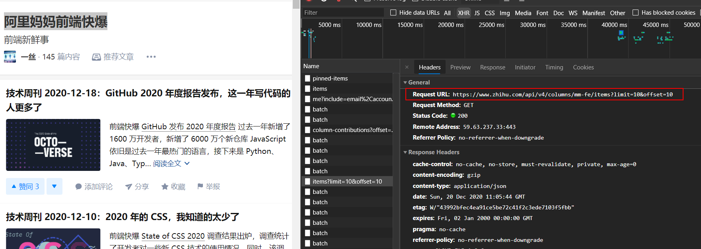

## devServer

[`webpack-devServer`](https://webpack.docschina.org/configuration/dev-server/#devserver)，一般简称`WDS`，是 webpack 内置的用于开发环境的服务器配置。`webpack`本身提供三种方式用于开发环境修改代码以后自动编译，以提高开发效率：

- [观察模式](https://webpack.docschina.org/guides/development/#using-watch-mode)
- [WDS](https://webpack.docschina.org/configuration/dev-server/#devserver)

- [webpack-dev-middleware](https://webpack.docschina.org/guides/development/#using-webpack-dev-middleware)

总体来说，WDS 配置最容易，并且提供 HMR 的功能，只需要配置`devServer.hot: true`就直接启用，方便到了极致！下面就重点看一下 WDS 的`proxy`配置。

<!--truncate-->

## http-proxy-middleware

`webpack`的 WDS 内置的`proxy`功能来自于[`http-proxy-middleware`](https://github.com/chimurai/http-proxy-middleware)这个第三方工具，正如我以前看到的一句话所说，**开源最重要的不是贡献自己的代码，而是把别人的拿过来用**，从开源社区的发展角度来看，这的确是核心，只有开源带动开源，才能让社区氛围更好。

废话不多说了，来看一下`http-proxy-middleware`都有哪些配置吧。

## 配置

### URL

在了解详细配置之前，先来回顾一下 HTTP 协议下 URL 的构成：


`http-proxy-middleware`本身融合了`http-proxy`的一些配置，但是文档配置写的比较抽象，并且多数配置实际开发的时候根本用不到，这里重点关注几个比较重要的属性。

### target | string

`target`用于指定代理转发的目标域名，在 WDS 中可以按照如下设置，这样当本地请求`localhost:3000/api`的时候，就会被 WDS 转发请求`https://xxx.com/api`去

```javascript
devServer: {
  proxy: {
    "/api": {
      target: "https://xxx.com"
    },
  },
}
```

### router | object/function

`router`和`target`有点类似，也是重定向转发域名的，区别是`target`只能设置一个`string`类型的域名，`router`可以指定多个域名转发的映射对象或者函数，并且会覆盖`target`

```javascript
router: {
    'integration.localhost:3000' : 'http://localhost:8001',  // host only
    'staging.localhost:3000'     : 'http://localhost:8002',  // host only
    'localhost:3000/api'         : 'http://localhost:8003',  // host + path
    '/rest'                      : 'http://localhost:8004'   // path only
}

router: function(req) {
    return 'http://localhost:8004';
}
```

### pathRewrite | object/function

重写本地请求的 URL 中的`path`部分，设置的`key`字符串会被构造成一个正则表达式来匹配请求的 URL，需要注意的是只会重写`path`部分，前面的`host`以及后面的`queryString`都会保留下来和重写后的域名进行拼接。

```javascript
devServer: {
  proxy: {
    "/api": {
      pathRewrite: {
        "^/api": "/newApi", // rewrite path
      },
    },
  },
}

pathRewrite: async function (path, req) {
  const should_add_something = await httpRequestToDecideSomething(path);
  if (should_add_something) path += "something";
  return path;
}
```

### changeOrigin | boolean

因为`http-proxy-middleware`依赖于[node-http-proxy](https://github.com/http-party/node-http-proxy)实现的，`changeOrigin`这个参数是从`http-proxy`中直接拿过来的，找到`node-http-proxy`的源码部分，可以发现如下有关`changeOrigin`的实现 —— [changeOrigin](https://github.com/http-party/node-http-proxy/blob/9b96cd725127a024dabebec6c7ea8c807272223d/lib/http-proxy/common.js#L99)，用到的地方在这里 —— [Request initalization](https://github.com/http-party/node-http-proxy/blob/9b96cd725127a024dabebec6c7ea8c807272223d/lib/http-proxy/passes/web-incoming.js#L126)

```javascript
// requires-port是判断指定端口在当前协议下是否要求添加在 host 后面，如果是协议默认的端口就不用添加，例如HTTP默认80，会返回false
var required = require('requires-port');

if (options.changeOrigin) {
  outgoing.headers.host =
    required(outgoing.port, options[forward || 'target'].protocol) &&
    !hasPort(outgoing.host)
      ? outgoing.host + ':' + outgoing.port
      : outgoing.host;
}
```

设置[`request.header.host`](https://developer.mozilla.org/zh-CN/docs/Web/HTTP/Headers/Host)到底有啥用呢？首先在 HTTP 1.1 的时候要求必须设置这个请求头参数，因为部分网站的部署是[基于域名](https://en.wikipedia.org/wiki/Virtual_hosting#Name-based)的部署方案，也就是一个后台服务器的 IP 地址绑定多个域名，这很容器做到，只需要在域名管理机构的 DNS 解析处添加域名解析规则即可。

基于域名的部署方案取决于支持 HTTP 1.1 的浏览器能够在请求域名绑定的 IP 地址的时候发送`host`这个请求头参数，以标识当前请求的是什么域名，不然即使是不同域名，服务器接收到的都是相同的 IP 地址，仍然无法区分。

但是基于域名部署的方案最大问题是难以托管多个 HTTPS 的网站，因为在建立正式的 TCP 连接前，需要通过 TCP 进行一段 SSL/TLS 的握手过程，来验证双方身份，这边还没发送`host`呢，SSL/TLS 已经开始了。TLS 提供了一种拓展方法 [SNI](https://en.wikipedia.org/wiki/Server_Name_Indication) 来保证握手开始前将请求域名发送到服务器，这样就可以让服务器明确知道对方是谁，发送什么样的证书给它。

所以在请求`https`协议的网站时，一定要配置`changeOrigin`这个请求头，不然就会出现以下错误：


## 实践

比如现在本地我要把知乎专栏《阿里妈妈前端快爆》的内容抓取下来，首先看一下请求是啥，大致是这个地址：

```javascript
Request URL: https://www.zhihu.com/api/v4/columns/mm-fe/items?limit=10&offset=10
```



那么我本地`webpack`的 WDS 可以这样配置：

```javascript
    proxy: {
      "/api": {
        target: "https://www.zhihu.com",
        changeOrigin: true,
        pathRewrite: {
          "^/api": "/api/v4/columns/mm-fe/items", // rewrite path
        },
      },
    },
```

请求的地址是`/api?limit=10&offset=20`：

```javascript
fetch('/api?limit=10&offset=20')
  .then(function(response) {
    return response.json();
  })
  .then(function(myJson) {
    console.log(myJson);
  });
```

这样就可以成功转发请求获取数据了，可以看到这样一种重写 URL 的方式首先根据`/api`匹配请求 URL，如果包含则使用`target`定义的路径重写`host`，最后根据`pathRewrite`重写 URL 中的`path`部分，得到最后的 URL 为：

```
URL = target + pathRewrite + queryString + hash
```


### 通用配置

在实际使用过程中，针对`pathRewrite`这样配置：

```javascript
    proxy: {
      '/api': {
        target: 'http://localhost:3000',
        changeOrigin: true,
        pathRewrite: {
          '^/api': '/',
        },
      },
    },
```

这样在项目中请求的 URL 都是这种形式，以达到通用性：

```javascript
fetch('/api/xxx?name=xxx')
  .then(res => res.json())
  .then(res => console.log(res));
```