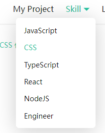

新年伊始，将个人网站从 dumi 迁移到了 docusaurus。

> 地址：https://icodex.me
>
> 仓库：[wood3n/icodex-next: blog (github.com)](https://github.com/wood3n/icodex-next)

<!--truncate-->

## 背景

过去一年多的时间，我都在用 dumi 构建自己的前端知识体系文档，期间升级过很多次 dumi 的版本，也看着 dumi 从 200 多 star 逐渐增长到 2k 多 star。

过去选择 dumi，主要看中的是 dumi 对于在线文档的交互能力，因为有时候学习一个新的知识点总想着用 demo 的方式去实现，尤其是 CSS 这种的。而 dumi 提供的交互能力恰好可以满足我的这一个需求。同时配合 Typora 编写 markdown 文档十分的方便。

不过同时我也注意到了 docusaurus （这个取自`document`和`saurus`组合词的名称真的太难记了）这个文档生成工具，不过一年前这个工具还比较稚嫩，提供的能力不太全面，所以就放弃了。不过随着越来越多的网站开始使用 docusaurus，我也开始了迁移之路。

## 迁移步骤

docusaurus 提供脚手架工具直接生成站点项目代码，这里直接利用脚手架来创建。

```bash
npx create-docusaurus@latest my-website classic --typescript
```

生成的项目目录如下：

```
my-website
├── blog
│   ├── 2019-05-28-hola.md
│   ├── 2019-05-29-hello-world.md
│   └── 2020-05-30-welcome.md
├── docs
│   ├── doc1.md
│   ├── doc2.md
│   ├── doc3.md
│   └── mdx.md
├── src
│   ├── css
│   │   └── custom.css
│   └── pages
│       ├── styles.module.css
│       └── index.js
├── static
│   └── img
├── docusaurus.config.js
├── package.json
├── README.md
├── sidebars.js
└── yarn.lock
```

### 插件和预设能力

docusaurus 提供插件和预设的配置，类似于 babel，webpack 这些工具的能力，使用 CLI 指定`@docusaurus/preset-classic`预设会同时包含至关重要的三个插件：

- `@docusaurus/plugin-content-docs`：提供文档编写能力，对应生成的`docs`目录
- `@docusaurus/plugin-content-blog`：提供博客渲染能力，对应生成的`blog`目录
- `@docusaurus/plugin-content-pages`：提供普通前端页面的渲染能力，对应生成的`pages`目录

这三种插件的配置都在`docusaurus.config.js`这个文件下，对于我个人需求来说这三种能力都需要，因此我都开启了，如果不需要的话，直接在`presets.docs|blog|pages`设置成`false`即可。

### 修改主页指向

我希望将个人博客页面作为站点主页，那么需要在`docusaurus.config.js`将`blog`对应的[`routeBasePath`](https://www.docusaurus.cn/docs/api/plugins/@docusaurus/plugin-content-blog#routeBasePath)设置成`/`，同时指定博客文档所在的目录`path`；这样其他在`docs`或者`pages`就是相对于`blog`的路由路径。

```js
// docusaurus.config.js

module.exports = {
  presets: [
    "classic",
    {
      blog: {
        // blog作为主页
        routeBasePath: "/",
        path: "./blog",
        ...
      },
      pages: {
        path: "src/pages",
        // 指定 pages 的路由路径，因为 blog 作为主页了
        routeBasePath: "/pages",
        ...
      }
    }
  ]
}
```

### 顶部导航栏配置

顶栏无非就是 Logo，导航栏这些，对应 docusaurus 提供的主题配置项的[`navbar`](https://docusaurus.io/docs/api/themes/configuration#navbar)。

| 配置项         | 类型                 | 默认值      | 描述                               |
| -------------- | -------------------- | ----------- | ---------------------------------- |
| `title`        | `string`             | `undefined` | 顶部标题                           |
| `logo`         | `object`             | `undefined` | 顶部 logo                          |
| `items`        | `NavbarItem[]`       | `[]`        | 顶部菜单导航                       |
| `hideOnScroll` | `boolean`            | `false`     | 是否在页面向下滚动时自动隐藏导航栏 |
| `style`        | `'primary' | 'dark'` |             | 自定义导航栏整体样式               |

导航菜单通过`items`配置，docusaurus 提供 5 种菜单配置类型：

- `type="link"`：默认形式，配置`to`或者`href`指定菜单点击跳转路由；
- `type="dropdown"`：下拉菜单导航



- `type="docsVersionDropdown"`：文档版本下拉菜单
- `type="localeDropdown"`：文档多国语选择下拉菜单
- `type="search"`：搜索框，需要配置[搜索引擎](https://docusaurus.io/docs/search#using-algolia-docsearch)才可用

同时顶部默认是提供网站夜间和白天主题的切换按钮。

我觉得唯一的不足就是不支持自定义菜单项的`icon`，例如需要显示 GitHub 链接，需要自己在`src/custom.css`里进行样式覆盖：

```js
{
  href: "https://github.com/wood3n/icodex",
  position: "right",
  // custom logo in custom.css
  className: "header-github-link",
 "aria-label": "GitHub repository",
}
```

```css
/* GitHub Link */
.header-github-link:hover {
  opacity: 0.6;
}

.header-github-link:before {
  content: "";
  width: 24px;
  height: 24px;
  display: flex;
  background: url("data:image/svg+xml,%3Csvg viewBox='0 0 24 24' xmlns='http://www.w3.org/2000/svg'%3E%3Cpath d='M12 .297c-6.63 0-12 5.373-12 12 0 5.303 3.438 9.8 8.205 11.385.6.113.82-.258.82-.577 0-.285-.01-1.04-.015-2.04-3.338.724-4.042-1.61-4.042-1.61C4.422 18.07 3.633 17.7 3.633 17.7c-1.087-.744.084-.729.084-.729 1.205.084 1.838 1.236 1.838 1.236 1.07 1.835 2.809 1.305 3.495.998.108-.776.417-1.305.76-1.605-2.665-.3-5.466-1.332-5.466-5.93 0-1.31.465-2.38 1.235-3.22-.135-.303-.54-1.523.105-3.176 0 0 1.005-.322 3.3 1.23.96-.267 1.98-.399 3-.405 1.02.006 2.04.138 3 .405 2.28-1.552 3.285-1.23 3.285-1.23.645 1.653.24 2.873.12 3.176.765.84 1.23 1.91 1.23 3.22 0 4.61-2.805 5.625-5.475 5.92.42.36.81 1.096.81 2.22 0 1.606-.015 2.896-.015 3.286 0 .315.21.69.825.57C20.565 22.092 24 17.592 24 12.297c0-6.627-5.373-12-12-12'/%3E%3C/svg%3E")
    no-repeat;
}

html[data-theme="dark"] .header-github-link:before {
  background: url("data:image/svg+xml,%3Csvg viewBox='0 0 24 24' xmlns='http://www.w3.org/2000/svg'%3E%3Cpath fill='white' d='M12 .297c-6.63 0-12 5.373-12 12 0 5.303 3.438 9.8 8.205 11.385.6.113.82-.258.82-.577 0-.285-.01-1.04-.015-2.04-3.338.724-4.042-1.61-4.042-1.61C4.422 18.07 3.633 17.7 3.633 17.7c-1.087-.744.084-.729.084-.729 1.205.084 1.838 1.236 1.838 1.236 1.07 1.835 2.809 1.305 3.495.998.108-.776.417-1.305.76-1.605-2.665-.3-5.466-1.332-5.466-5.93 0-1.31.465-2.38 1.235-3.22-.135-.303-.54-1.523.105-3.176 0 0 1.005-.322 3.3 1.23.96-.267 1.98-.399 3-.405 1.02.006 2.04.138 3 .405 2.28-1.552 3.285-1.23 3.285-1.23.645 1.653.24 2.873.12 3.176.765.84 1.23 1.91 1.23 3.22 0 4.61-2.805 5.625-5.475 5.92.42.36.81 1.096.81 2.22 0 1.606-.015 2.896-.015 3.286 0 .315.21.69.825.57C20.565 22.092 24 17.592 24 12.297c0-6.627-5.373-12-12-12'/%3E%3C/svg%3E")
    no-repeat;
}
```

### 文档侧栏菜单配置

`docusaurus`默认是会渲染在`blog`文件夹下的`.md`或者`.mdx`文件，对于`src/pages`目录的任何文件都会渲染成页面，而对于`docs`目录的 markdown 文件可以通过[`sidebarPath`](https://docusaurus.io/docs/api/plugins/@docusaurus/plugin-content-docs#sidebarPath)来配置生成不同的侧边菜单栏。

如果使用脚手架创建文档站点，ducusaurus 会默认生成一个`sidebars.js`文件，包含下面这个默认配置项：

```js
module.exports = {
  mySidebar: [
    {
      type: 'autogenerated',
      dirName: '.'
    },
  ],
};
```

默认情况下，在`docs`目录的 markdown 文件会全部显示出来，不会自动归类，而我的需求是能够根据我在 `docs`目录下创建的文件夹进行分类，并自动生成每篇文档的路由地址。来看一下 docusaurus 提供的能力 —— [Sidebar | Docusaurus](https://docusaurus.io/docs/sidebar#understanding-sidebar-items)，对于侧边栏生成的类型有以下几种：

- `type="doc"`：配合`id`指定单个文档的标题和链接
- `type="link"`：配合`href`指定任意跳转链接
- `type="category"`：配合`items`指定分类包含的文档
- `type="autogenerated"`：配合`dirName`自动生成侧边栏

看起来`type="category"`可以满足我的需求，但是每篇文章写完我都要配置一下侧边栏这也太麻烦了，于是我尝试了下`type="autogenerated"`这个自动生成的，`dirname`配置成在`docs`下创建的目录名称就可以自动对该目录下文档进行分类，再配合顶部导航栏的`docId`指向每个文档分类下的第一篇文章，点击以后就会自动打开不同目录下归类的文档列表。

```js
// sidebars.js
const sidebars = {
  javascript: [
    {
      type: "autogenerated",
      dirName: "javascript",
    },
  ],
  typescript: [
    {
      type: "autogenerated",
      dirName: "typescript",
    },
  ],
  css: [
    {
      type: "autogenerated",
      dirName: "css",
    },
  ]
}
```

```js
// docusaurus.config.js
module.exports = {
  themeConfig: {
    navbar: {
      items: [
        {
          type: "dropdown",
          label: "Skill",
          position: "right",
          items: [
            {
              type: "doc",
              label: "JavaScript",
              docId: "javascript/类型/类型定义",
            }
            ...
          ]
        }
      ]
    }
  }
}
```

### 图片目录

对于图片的处理，我这边没有选择图床，直接复制到指定目录下，docusaurus 提供[`staticDirectories`](https://docusaurus.io/docs/static-assets)配置项用于指定静态资源目录，默认是`static`文件夹，对于`static`文件夹的文件，全部都会在构建以后复制到网站根目录下。

而对于`staticDirectories`没有包含的文件目录，包括 markdown 中引用的图片文件等，都会在构建后复制到网站根目录的`assets`目录下(图片的话就是`assets/images`)，并且会对路径自动进行转换。利用这个能力，我在网站代码根目录下创建了`public/images`目录用于保存所有在 markdown 页面包含的图片，配合 Typora 复制图片并转换图片相对路径的能力，就可以做到在任何地方打开 markdown 都能正常显示图片。


### 网站部署

网站部署不用多说了，依旧白嫖 GitHub Pages，docusaurus 也提供了集成 GitHub Actions 自动部署的配置参考 —— [Deployment | Docusaurus](https://docusaurus.io/docs/deployment#triggering-deployment-with-github-actions)：

```yaml
name: Deploy to GitHub Pages

on:
  push:
    branches: [main]
    paths: [website/**]

jobs:
  deploy:
    name: Deploy to GitHub Pages
    runs-on: ubuntu-latest
    steps:
      - uses: actions/checkout@v2
      - uses: actions/setup-node@v2
        with:
          node-version: 14.x
          cache: yarn
      - name: Build website
        run: |
          yarn install --frozen-lockfile
          yarn build

      # Popular action to deploy to GitHub Pages:
      # Docs: https://github.com/peaceiris/actions-gh-pages#%EF%B8%8F-docusaurus
      - name: Deploy to GitHub Pages
        uses: peaceiris/actions-gh-pages@v3
        with:
          github_token: ${{ secrets.GITHUB_TOKEN }}
          # Build output to publish to the `gh-pages` branch:
          publish_dir: ./build
```

这样在使用 Typora 写完文档或者博客以后，直接`push`到 GitHub 仓库，触发 GitHub Actions 完成自动构建打包和部署，一气呵成，妈妈再也不用担心我写博客时候手忙脚乱的部署了。


### 网站全局搜索

docusaurus 优先提供支持 Algolia 的能力，使用起来也很简单，分为三步：

1. 首先在[`algolia`仓库](https://github.com/algolia/docsearch-configs)提交一个配置网站索引的 pr；
2. 等 PR 合并以后在[DocSearch](https://docsearch.algolia.com/apply/)网站提交网站的域名和联系邮箱获取`appId`和`apiKey`；
3. 在`docusaurus.config.js`完成[配置](https://docusaurus.io/docs/search#connecting-algolia)即可

