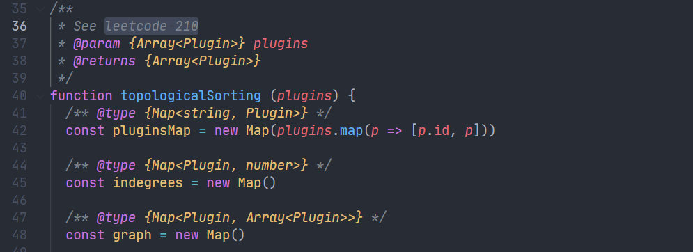

上文说到创建完`package.json`文件并安装`plugins`的依赖，然后后续会初始化`Generator`实例，`Generator`内部会调用各个`plugin`，涉及到插件机制的实现，这里单独起一篇介绍。

<!--truncate-->

## plugin程序

`@vue/cli`约定`plugin`由一个 Service 插件`index.js`文件作为引导，此外还可以包含`generator.js `，`prompts.js`这些文件。

`index.js`可以修改 webpack 配置，创建新的 vue-cli service 命令或者修改已经存在的命令。

`generator`主要用于拓展项目依赖，创建新的文件或者编辑已经存在的文件；且必须是一个函数。

`prompts.js`则在创建一个新的项目或者在已有项目中添加新的插件时处理用户选项，通过`inquirer`实现。

```shell
.
├── README.md
├── generator.js  # generator（可选）
├── index.js      # service 插件
├── package.json
├── prompts.js    # prompt 文件（可选）
└── ui.js         # Vue UI 集成（可选）
```

### resolvePlugins

通过`resolvePlugins`方法会对目前所有的`plugins`的执行顺序进行排列，保证`vue-cli-service`始终第一个执行。

然后会加载`plugin`内部的`generator.js`和`prompts.js`程序


## Generator

获取所有`plugins`内部的`generator`和`prompt`后初始化`Generator`实例，传入当前项目的文件夹，以及`package.json`，`plugins`。


### plugins排序

在`Generator`构造函数内部会对`plugins`进行排序，这个排序有点讲究的，根据代码里的注释来看使用了 leetcode 210 题的算法，没仔细研究过



### 加载所有plugins的generator

然后通过`resolveAllPlugins`加载`package.json`下面所有`plugin`的`generator`程序

### 初始化plugin并执行

如果`generator`暴露的有`hooks`方法，会先执行`hooks`方法，然后再执行

