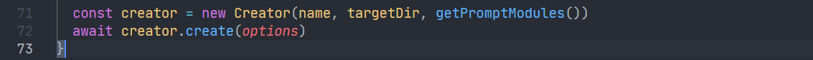
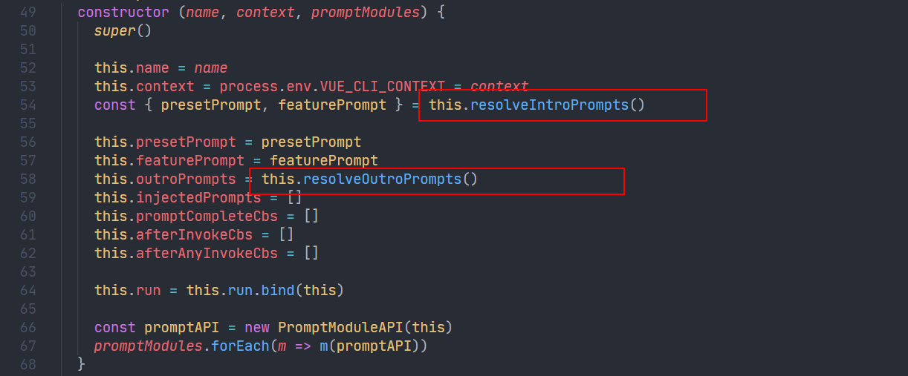
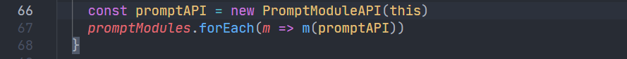

`vue-cli`是 vue 官方出品的脚手架项目，用来快速搭建`vue`项目，一键生成项目基础代码。

一直对其内部的运行原理比较好奇，并且开发脚手架的能力也是一名前端开发人员需要掌握的技能，所以这里以`v4.5.15`版本为例，记录一下源码研究的过程和学习点。

<!--truncate-->

## 入口

`vue-cli`采用的仍然是通过`lerna`管理的 monorepo，不知道未来会不会迁移到 pnpm，从`package.json`可以看到核心仓库就是以下三个，其中`@vue`就是一些核心代码，包括脚手架`@vue/cli`、`vue-cli-service`以及一些插件。


```shell
vue-cli
├─ docs													// 文档
├─ packages											
│    ├─ @vue
│    │    ├─ babel-preset-app
│    │    ├─ cli								// @vue/cli
│    │    ├─ cli-init
│    │    ├─ cli-overlay
│    │    ├─ cli-plugin-babel
│    │    ├─ cli-plugin-e2e-cypress
│    │    ├─ cli-plugin-e2e-nightwatch
│    │    ├─ cli-plugin-e2e-webdriverio
│    │    ├─ cli-plugin-eslint
│    │    ├─ cli-plugin-pwa
│    │    ├─ cli-plugin-router
│    │    ├─ cli-plugin-typescript
│    │    ├─ cli-plugin-unit-jest
│    │    ├─ cli-plugin-unit-mocha
│    │    ├─ cli-plugin-vuex
│    │    ├─ cli-service				// vue-cli-service
│    │    ├─ cli-shared-utils
│    │    ├─ cli-test-utils			// 一些第三库的源代码，或者一些工具函数等
│    │    ├─ cli-ui
│    │    ├─ cli-ui-addon-webpack
│    │    └─ cli-ui-addon-widgets
├─ scripts											// 一些管理monorepo的程序
```

## @vue/cli

先从脚手架启动引导程序`@vue/cli`开始分析，从`package.json`注册的`bin`属性找到入口程序为`bin/vue.js`.

```json
{
  "bin": {
    "vue": "bin/vue.js"
  },
}
```

### 检查Nodejs版本

首先会通过`semver`这个库检查使用者本地 Nodejs 的版本和在`@vue/cli`的`package.json`下要求的版本是否符合。


这里简单了解下 Nodejs 的版本管理，Nodejs 版本有以下几种：

- `CURRENT`：当前状态，也就是当前最新的 Nodejs 版本，`ACTIVE`版本的 Nodejs 会维护持续 6 个月时间，6 个月之后奇数版本会不再维护，而偶数版本会变成`ACTIVE`状态的`LTS`版本
- `ACTIVE`：活跃状态，是正在积极维护和升级的版本，包括一些 BUG 修复，功能改进等
- `MAINTENANCE`：维护状态，只修复 BUG，维护时间不定
- `EOL`：End of Life，也就是终止维护的版本
- `LTS`：long-term support，也就是长期维护版本，这意味着重大的 Bug 将在后续的 30 个月内持续得到不断地修复。

如下图所示，Nodejs 12 已进入维护状态，并且在 2022 年 4 月份就会终止维护，到时候Nodejs 18 也会发布，Nodejs 17 也会终止维护。 反正一个原则是始终用 LTS 版本就行了。可以使用`nvm`便捷的管理 Nodejs 的版本。


### 注册命令

然后使用`commanderjs`注册命令`create`，并且包含必填的`app-name`参数，可以看到`create`注册以后，会去加载上层`lib`下的`create.js`程序，这里还传递了项目名称和额外的 CLI 参数。


### 校验项目名称

`create.js`内部首先会通过`validate-npm-package-name`这个库去校验项目名称，并且会额外处理使用`.`作为当前目录的情况，考虑的非常周到。


如果通过 CLI 指定`--merge`，则会清空目标文件夹，否则会使用`inquirer`在 CLI 发起选项选择是否合并目录文件或者选择清空。这里使用了`fs-extra`来操作文件系统。

### 初始化Creator实例

在确认了目标文件夹以后，会初始化`Creator`的实例，并传递 CLI 参数来调用实例的`create`方法。



这里传递了三个初始化参数：

- `name`：项目名称
- `targetDir`：创建项目的文件夹
- `getPromptModules()`：加载位于上层`promptModules`文件夹下的一些函数


位于`promptModules`下的都是一些用户在创建项目时手动选择的功能项，例如`vue`的版本，是否使用 TS，CSS预处理器等。

以`../promptModules/babel.js`为例，可以看到其内部是一个函数，接收一个`cli`对象，并且调用了`cli`对象暴露的`injectFeature`和`onPromptComplete`这两个方法。


### 获取prompt选项



在`Creator`的构造函数内部会初始化一些实例属性：

- `name`：项目名称
- `context`：当前创建的目录

- `presetPrompt`：`preset`的选项；通过`resolveIntroPrompts`获取`preset`信息，其中包括加载用户创建的保存在本地`.vuerc`下的`preset`，以及`@vue/cli`内置默认的`preset`信息，然后组合成`inquirer`选项参数保存在这个属性下


默认的`preset`只有两个：选择`vue2`和`vue3`的版本，并且都会包含`@vue/cli-plugin-babel`和`@vue/cli-plugin-eslint`两个`plugin`


- `featurePrompt`：如果用户选择不使用任何`preset`而是手动选择一些功能来创建项目，例如是否使用 TS，选择 CSS 预处理器等，那么就会从`featurePrompt`加载一些选项


- `outroPrompts`：主要是通过`inquirer`指定的一些选项，例如保存配置文件的方式、选择使用的依赖管理工具npm,yarn,pnpm等

之后会通过传入当前实例对象`this`来初始化一个`PromptModuleAPI`的实例。



`PromptModuleAPI`内部会往自身的实例上挂载一个`creator`对象，也就是`Creator`的实例，这样在`PromptModuleAPI`内部的实例就可以通过`creator`对象访问`Creator`的实例内部的属性和方法。


这时候初始化`Creator`实例时传入的`promptModules`内部的每个函数就会被调用，并传入`PromptModuleAPI`的实例作为参数，每个函数内部通过调用`PromptModuleAPI`内部的方法再向`Creator`实例内部的属性注入自身的`prompt`选项，不得不说逻辑有点绕，但是提高了程序的拓展性，以后`@vue/cli`内部想拓展一些功能，只需要在`promptModules`文件夹下编写程序即可。

- `injectFeature`：往实例的`featurePrompt.choices`推入一些`feature`
- `injectPrompt`：往实例的`injectedPrompts`推入一些`prompt`
- `injectOptionForPrompt`：往`injectedPrompts.choices`推入一些选项
- `onPromptComplete`：往实例的`promptCompleteCbs`推入回调函数，在`prompt`执行完以后执行

### 组合prompt并获取preset

初始化`Creator`实例以后会调用`create`方法，接收 CLI 命令行指定的所有参数，在使用`vue create xx`命令没有指定任何其他参数的情况下会进入`promptAndResolvePreset`方法。`promptAndResolvePreset`内部主要做了两件事：

- 合并`Creator`实例的`presetPrompt`，`featurePrompt`，`injectedPrompts`以及`outroPrompts`这些选项，并且默认的选项`presetPrompt`作为第一个，后续的`prompt`会通过`inquirer`的`when`函数来判断其是否需要执行，如果用户选择不使用`preset`，那么才会执行后续手动选择`feature`的部分


- 当用户选择了`preset`以后，就会通过`resolvePreset`再次获取`preset`的信息


### 注入vue-cli-service

`vue-cli-service`在这里也是作为一个`plugin`，上文获取`preset`信息以后，会在其默认`plugins`的基础上再注册`vue-cli-service`


### 生成package.json

获取所有`plugin`以后，会创建`package.json`对象，写入`plugin`的版本，并生成文件


### 初始化git

如果通过 CLI 指定初始化 git，这里还会调用`git init`命令，初始化 git 本地存储服务。


### 安装依赖

`@vue/cli`内部定义了依赖管理基类`PackageManager`，内部会判断客户端使用的依赖管理工具，使用的源地址等信息，代码很多，就不一一展开了。这里安装的依赖从前面来看主要有三个：

- `@vue/cli-plugin-babel`
- `@vue/cli-plugin-eslint`
- `@vue/cli-service`


