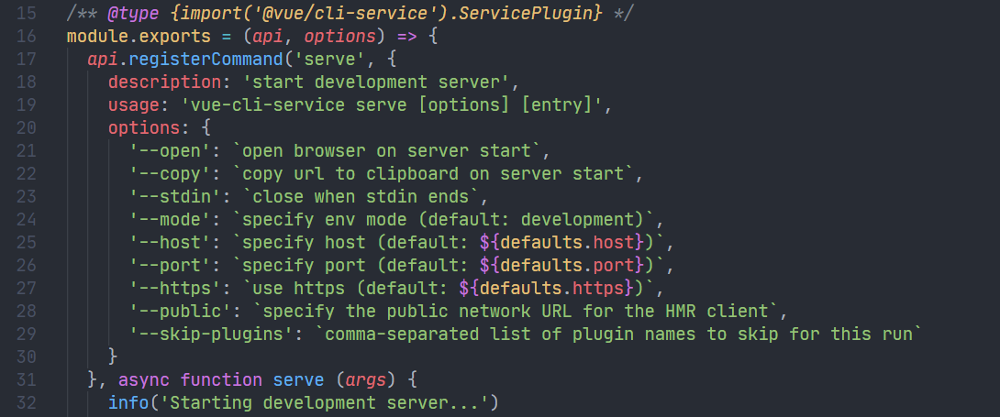
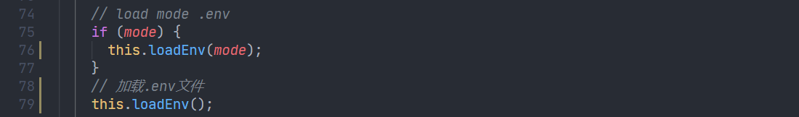

`vue-cli-service`作为第一个必然会被调用的`plugin`，其功能主要是生成项目模板文件，以及通过`serve`、`build`等命令进行开发环境`server`的启动和生产环境的构建打包等。下面分析其内部逻辑。

<!--truncate-->

## 检查 Node 版本

`vue-cli-service`位于`@vue/cli-service`目录下，通过`package.json`找到其入口程序为`bin/vue-cli-service.js`，首先依旧是检查 Node 版本。

## 初始化Service实例

传入执行当前命令的目录，也就是创建项目的文件夹，来初始化`Service`实例。

## 加载项目运行程序和webpack配置项

`resolvePlugins`会从上层的`commands`以及`config`目录加载进来所有`index.js`文件。`commands`目录下包括开发环境执行程序`serve.js`以及生产环境打包`build.js`等，`config`目录包含`webpack`的配置程序，都是项目运行所需的程序，因为通过`@vue/cli`创建的项目不会暴露`webpack`等配置项，所以需要这些程序来执行。

这些程序被看做`plugin`，包含一个`id`作为标识符，和一个`apply`方法，需要执行的时候调用`apply`方法即可。

然后还会对`plugins`进行排序。

### serve.js

`serve.js`是开发环境下启动 webpack dev server 的程序，其返回的是一个函数，函数内部通过调用`api.registerCommand`传递了三个参数，那么`serve.js`通过`plugin`的方式注册，肯定会有执行的时候，见下文继续探索。

并且导出的模块还有一个`defaultModes`对象，包含命令名称和环境变量参数的映射关系，这样`Service`实例内部可以通过`defaultModes`获取当前程序执行的环境。

### build.js

`build.js`是生产环境的打包程序，则通过调用`api.registerCommand`传递`build`字符串等参数，以及暴露了`production`的环境变量。

### css.js

在`config`目录下的`css.js`为例，其通过`api.chainWebpack`来配置`webpack`

## 注册命令行参数

初始化完`Service`实例，加载完项目所需要的所有执行程序，然后会执行`run`方法，`run`内部首先会走`init`方法。

### 加载env

在`init`方法内部会加载指定环境的`.env`文件内部设置环境变量参数，这里使用了`dotenv`和`dotenv-expand`这两个库来加载`.env`文件的环境变量到`process.env`中。

### 获取项目配置项

在加载了环境变量参数以后，会调用`loadUserOptions`方法，`loadUserOptions`内部会调用`loadFileConfig`获取项目内部的`vue.config.js`等形式的配置文件。

然后用户项目配置项会传入`loadedCallback`函数内部，使用`lodash.defaultsDeep`和`vue-cli-service`内部的默认配置合并。

### 注入PluginAPI实例

`loadedCallback`内部会调用每个`plugin`的`apply`方法，传入`PluginAPI`的实例和当前项目的配置项作为参数。

其中`PluginAPI`在初始化的时候传递了两个参数：

- `id`：`plugin`程序的名称
- `this`：指向当前的`Service`实例

在构造函数内部初始化以后，`Service`实例会挂载在`PluginAPI`实例的`service`属性上。

上文介绍到`apply`也就是`serve.js`等构建模块导出的函数，其接收两个参数：

- `api`：`PluginAPI`的实例
- `options`：项目的配置项

`PluginAPI`内部定义了一系列方法可以通过`api`来调用，其中`api.registerCommand`是往`Service`实例的`commands`上注册`vue-cli-service`的 CLI 命令参数名称`serve`，不过这里只是注册，并没有开始执行，所以到这里程序的目的只是将构建项目需要的程序加载进来，并且和命令行参数对应起来而已。

后面的话，如果在配置文件中包含`chainWebpack`和`webpackConfig`配置项也会挂载到`Service`实例的`webpackChainFns`和`webpackRawConfigFns`属性上。

### 组合webpack配置项

上文说到`config`目录下的程序会通过`api.chainWebpack`注册一些 webpack 的配置项，这些配置项会保存在`Service`实例的`webpackChainFns`和`webpackRawConfigFns`内部。

## 执行程序

命令行参数现在和执行程序已经通过`init`方法关联起来了，接下来便是找到在 CLI 输入的命令参数对应的执行程序，然后执行。

接着看`run`方法内部的逻辑。这里通过`this.commands`找到了和命令行参数`name`对应的执行程序`command`，然后便调用`command.fn`这个方法，也就是`serve.js`内部传递的回调函数，也就是开发环境启动 webpack dev server 等操作。

