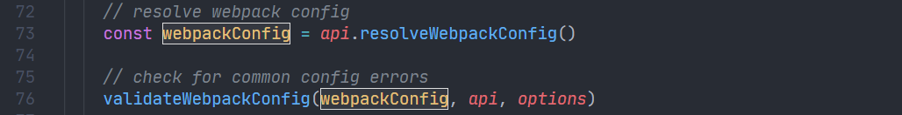

上文说到通过`@vue/cli-service`会加载执行文件，并通过插件机制注册命令行参数和执行文件的对应关系，这样在输入特定 CLI 命令参数的时候就能找到对应的执行程序，例如`vue-cli-service serve`会去执行`servs.js`程序。

这篇文章就来分析`servs.js`在开发环境下是如何构建运行`vue`项目的。

<!--truncate-->

## 获取webpack配置项

从在控制台打印`Starting development server...`开始，首先获取`webpack`的配置项并校验，`vue.config.js`支持`chainWebpack`和`configureWebpack`两种拓展`webpack`配置项的方式，所以这里都要考虑到。

通过`chainWebpack`拓展的配置项会使用`webpack-chain`获取；通过` configureWebpack`拓展的配置项保存在`Service`实例的`webpackRawConfigFns`内部，其中还包括上篇文章提到的位于`config`目录下通过`api.chainWebpack`插入的 webpack 配置项。

这些配置项会依次读取并和`chainWebpack`合并；最后使用`webpack-merge`进行合并。

## 获取 WDS 配置项

将通过`chainWebpack`和`configureWebpack`内部的`devServer`配置项和`vue.config.js`中的`devServer`配置项进行合并。

## 查找可用端口

通过第三方库`portfinder`来查找可用端口

## 获取URL和proxy信息

这里用了两个`create-react-app`的库来获取 URL，以及 WDS 的`proxy`配置

## 隐藏webpack的控制台信息

通过设置 webpack 的`infrastructureLogging: { level: 'none' }`来隐藏 WDS 的输出信息，设置`stats: 'errors-only'`让`webpack`仅在出错时报错。

## 创建webpack编译实例

## 创建 WDS 实例

通过 WDS 提供的 [Nodejs API](https://webpack.js.org/api/webpack-dev-server/) 来初始化一个实例

## 注册webpack编译完成事件

`webpack`的 Nodejs API在初始化以后具有[Compiler Hooks](https://webpack.js.org/api/compiler-hooks/#hooks)，hooks 暴露了在 webpack 运行中的每个生命周期事件，可以来注册定期执行的回调函数。

这里注册了一个在 webpack 编译完成后的回调事件 —— [`compiler.hooks.done`](https://webpack.js.org/api/compiler-hooks/#done)，主要是在 webpack 编译完成以后在控制台打印 URL 等一些信息。

这里这么做的原因是 WDS 本身的 Nodejs API 比较简陋，只提供了以下四个方法，并未暴露 webpack 编译完成的方法，所以这里需要利用 webpack 的 hooks 来注册。

- `start`：启动 WDS 的异步方法
- `startCallback`：启动之后的回调函数
- `stop`：停止 WDS
- `stopCallback`：停止 WDS 后的回调

## 启动 WDS

通过`start`方法启动 WDS，可以看到这里最后返回的是一个 Promise 实例。

主要的逻辑就是这些，到此，从使用`vue create [app name]`开始到开发环境执行`vue-cli-service serve`的整个流程全部分析完毕。