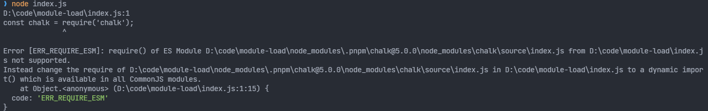

Node 从`v12.17(LTS)`版本开始正式支持 ESM 模块语法，但是 node 本身又支持 CJS 语法，直接迁移的话还是有些成本的。

<!--truncate-->

## 模块判定标准

### ESM 模块

使用的时候 Node 根据以下条件判断传入`import`或者`import()`的模块为 ESM：

- `.mjs`模块名后缀
- 离模块最近的 `package.json`内定义的`type="module"`字段
- 在 CLI 内部执行一行代码时传递给`node`参数`--input-type=module`

```shell
node --input-type=module --eval "import { sep } from 'path'; console.log(sep);"
```

### CJS模块

但是 Node 同时又需要支持 CommonJS 语法，对于使用`import`或者`import()`传入的模块根据以下条件判定其为 CJS 模块：

- `.cjs`模块名后缀
- 离模块最近的 `package.json`内定义的`type="commonjs"`字段
- 在 CLI 内部执行一行代码时传递给`node`参数`--input-type=commonjs`

```shell
node --input-type=commonjs --eval "import { sep } from 'path'; console.log(sep);"
```

## 什么是 Pure ESM

Pure ESM 是 [sindresorhus](https://gist.github.com/sindresorhus) 提出来的一个概念 —— [Pure ESM package (github.com)](https://gist.github.com/sindresorhus/a39789f98801d908bbc7ff3ecc99d99c)，指的是一个使用 Node 开发的模块只能使用 ESM 模块语法导入。

作者建议 Node  开发应该迁移到 ESM，原因就是上文说的`import`语法既支持 ESM 也支持 CJS，但是 CJS 的语法`require`只支持 CJS 模块。

作者还介绍了 CommonJS 迁移到 ESM 的情况：

### 从 CommonJS 迁移到 ESM

- 在`package.json`添加`"type": "module"`
- 使用`exports`替换`package.json`的`main`字段来指定入口文件，因为`main`只适用于 CJS 语法
- 在`package.json`指定 Node 版本必须大于`12.20`

```json
"engines": {
  "node": "^12.20.0 || ^14.13.1 || >=16.0.0"
}
```

- 如果是 TypeScript 项目，还需要在`tsconfig.json`指定`module: "es2020"`
- 最后一步，改造 CJS 语法`require()`/`module.export`到 ESM 语法`import`/`export`，对于异步模块需要使用[`import()`](https://developer.mozilla.org/en-US/docs/Web/JavaScript/Reference/Statements/import#dynamic_import)或者`top level await`。

### 升级报错的问题

如果一个 node 开发的 package 是使用的 ESM 模块语法导出，那么只能在 ESM 模块中使用，否则就会报错`ERR_REQUIRE_ESM`，例如使用`chalk5.0+`

```js
// index.js
const chalk = require('chalk');
```



这时候最简单的方法是直接把当前模块改成`.mjs`后缀，然后使用 ESM 的`import`语法引入。

```js
// index.mjs
import chalk from 'chalk';

console.log(chalk.blue('Hello world!'))
```

这样是能在当前模块处理第三方 ESM 模块了，但是使用该`.mjs`模块的模块也需要是 ESM 模块，同样需要`import(xxx.mjs)`。可想而知，不断改造下去整个项目都迁移到了 ESM 模块，所以要在 CJS 项目中使用 ESM 模块，整个项目都必须遵循 ESM 模块语法，这时候直接使用`type: "module"`最好。

```json
// package.json
{
  "type": "module"
}
```

