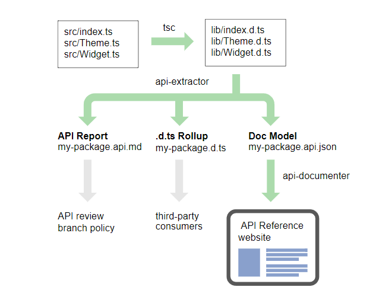
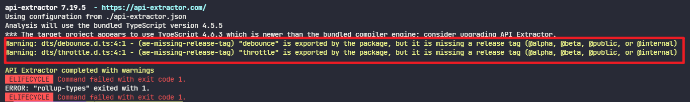

## 背景

在业务场景开发过程中，经常会需要我们手动编写一些方法来解决一些业务场景问题，例如防抖、节流、正则表达式表单校验方法等。一般我们会把这些方法统一放在项目的某个目录，例如`utils`下维护。

但是当涉及到跨团队使用的时候，这些方法通过`npm`包的形式来维护会减少团队开发成本。这篇文章主要探索使用`rollup`和`api-extractor`打包基于 TypeScript 开发的类库的使用过程。

<!--truncate-->

## rollup 是干嘛的

`rollup`(汇总)是一个支持 ES Modules 模块语法的 JS 应用打包工具，可以将 ES 模块语法编译成 CommonJS，AMD，IIFE 等形式的代码。同时，`rollup`支持`Tree-Shaking`。

### Tree-Shaking

`rollup`提出`Tree-Shaking`这个词，用来删减无用的代码段。原理上简单来说从编译代码得到的`AST`（Abstract Syntax Tree），首先标记相关联的代码，然后移除没被标记的代码，类似于`标记-清除`的内存回收机制。

通过 ES Modules 模块语法支持静态分析的特性，可以让`Tree-Shaking`更好地发挥作用，但是许多第三方包并不是以  ES Modules 形式对外界暴露 API，例如`lodash`，要想在代码层面上配合`Tree-Shaking`，可以通过引入子模块来解决问题。例如使用`import map from 'lodash-es/map'`而不是`import { map } from 'lodash-es'`。

### 不支持第三方包

`rollup`本身不支持处理从`node_modules`引入的第三方模块，需要通过额外的`plugin` —— `@rollup/plugin-node-resolve`来处理。

```js
// rollup.config.js
import resolve from '@rollup/plugin-node-resolve';

export default {
  input: 'src/main.js',
  output: {
    file: 'bundle.js',
    format: 'cjs'
  },
  plugins: [resolve()]
};
```

### 配置项

`rollup`支持 CLI 命令`rollup`，默认查找项目根目录下的`rollup.config.js`配置文件，默认配置文件使用 CJS 模块语法，但是也支持以`.cjs`和`.mjs`两种后缀来区分在配置文件中使用的模块语法。

```typescript
// rollup.config.js
interface Configuration {
  // 打包入口
  input?: string | string[] | { [entryAlias: string]: string };
  // 插件数组
  plugins?: (Plugin | null | false | undefined)[];
  // 忽略打包的模块
  external?: (string | RegExp)[]
    | string
    | RegExp
    | ((
        source: string,
        importer: string | undefined,
        isResolved: boolean
      ) => boolean | null | undefined);

  // 缓存之前的构建产物，在 watch 模式下提高后续构建速度，开启的时候 rollup 会只分析改变的模块
  // 可以指定缓存 plugin 和 module
  cache?: false | RollupCache;
  // 警示信息自定义处理函数
  onwarn?: Function;
  preserveEntrySignatures?: false | 'strict' | 'allow-extension' | 'exports-only';
  // 是否对使用了 rollup 过时的特性直接报错
  strictDeprecations?: boolean;

  // acorn 编译器的配置项
  acorn?: AcornOptions;
  // acorn 使用的插件
  acornInjectPlugins?: (() => unknown)[] | (() => unknown);
  // 全局上下文对象，例如 window
  context?: string;
  // 单独配置每个模块的上下文对象
  moduleContext?: ((id: string) => string | null | undefined) | { [id: string]: string };
  preserveSymlinks?: boolean;
  // 是否对使用未定义的模块提示报错
  shimMissingExports?: boolean;
  // 自定义 tree-shaking 的过程
  treeshake?: boolean | TreeshakingPreset | TreeshakingOptions;,

  // 确定在运行了多少次之后，插件不再使用的缓存资源应该被删除，默认 10 
  experimentalCacheExpiry?: number,
  // 是否计算构建性能，例如构建时间等
  perf?: boolean,

  // 构建输出配置，可以是一个数组
  output: {
    // 输出文件目录
    dir?: string;
    // 输出文件名
    file?: string;
    // 指定输出产物的模块语法，默认 es，也就是 ES Modules 语法
    format?: 'amd' | 'cjs' | 'es' | 'iife' | 'system' | 'umd'| 'commonjs' | 'esm' | 'module' | 'systemjs';
    // 将外部模块 ID 转换为全局变量名，例如 jquery => $, 在所有模块内部不需要引用 jquery 就可以直接使用 $
    globals: { [name: string]: string } | ((name: string) => string);
    // 打包产物对外暴露的全局变量名
    name?: string;
    // 只作用于当前输出的插件
    plugins?: (OutputPlugin | null | false | undefined)[];

    // 其他静态资源的输出文件名
    assetFileNames?: string | ((chunkInfo: PreRenderedAsset) => string);
    // 放置在打包产物顶部的字符串内容，例如作者信息，版本声明等，和下面的 footer 一样
    banner?: string | (() => string | Promise<string>);
    footer?: string | (() => string | Promise<string>);
    // 指定 code-splitting 拆分出来的 chunk 的文件名
    chunkFileNames?: string | ((chunkInfo: PreRenderedChunk) => string);
    // 减少 rollup 生成的包装器的代码，可以用于优化生成产物体积，默认 false
    compact?: boolean;
   	// 指定从 entry 指定的 chunk 的文件名
    entryFileNames?: string | ((chunkInfo: PreRenderedChunk) => string);
    // 是否拓展 name 指定的全局变量的名称
    extend?: boolean,
    // 当拆分多个 chunk 的时候，rollup 会把后续关联的模块添加到入口模块 import 进来，这样JS 引擎在从
    // 入口开始加载 chunk 的时候就会提前发现其他关联的模块并加载它们，从而提升多个 chunk 的加载速度
    hoistTransitiveImports?: boolean,
    // 当指定一个入口模块的时候，将其内部使用动态导入 import() 的模块直接打包进来而不是创建单独的 chunk
    inlineDynamicImports?: boolean,
    interop?: boolean | 'auto' | 'esModule' | 'default' | 'defaultOnly';
    // 放置在打包产物内部的介绍信息
    intro?: string | (() => string | Promise<string>);
    outro?: string | (() => string | Promise<string>);
    // code-splitting 的方式，可以将第三方包拆分出来成单独的 chunk
    manualChunks?: { [chunkAlias: string]: string[] } | GetManualChunk;
    // 对于 es 模块或者 compact 设置为 true，会将模块名混淆成单个字母来表示，更好的压缩代码体积
    minifyInternalExports?: boolean;
    // 配置 external 指定的模块名和模块路径的映射关系，可以是 CDN URL 地址
    paths?: Record<string, string> | ((id: string) => string);
    // 将每个模块都拆分成单独的 chunk 打包输出，可用于将文件结构转换为不同的模块格式来输出不同打包产物
    preserveModules?: boolean;
    // 保证指定目录的模块从入口进入可以输出到 output 指定的输出文件夹，从而和 preserveModules 隔离开
    preserveModulesRoot?: string;
    // 输出 sourcemap 的形式，默认 false
    sourcemap?: boolean | 'inline' | 'hidden';
    // 指定源代码的实际代码是否被添加到 sourcemap 中，可减小 sourcemap 的体积
    sourcemapExcludeSources?: boolean;
    sourcemapFile?: string;
    sourcemapPathTransform,
    // 校验生成的 JS 代码是否有效
    validate?: boolean;

    // 以下属于模块语法相关的配置项
    amd;
    esModule?: boolean;
    // 决定模块导出的语法形式，默认情况下 rollup 会根据入口模块来决定
    exports?: 'default' | 'named' | 'none' | 'auto';
    // 是否不允许修改导出的模块
    externalLiveBindings?: boolean;
    // 是否使用 Object.freeze 冻结 import as 形式导出的模块
    freeze?: boolean;
    // 是否使用缩进字符
    indent?: boolean | string;
    namespaceToStringTag?: boolean;
    // 为 UMD 模块添加额外的不会导致冲突的导出
    noConflict?: boolean;
    // 使用 const 定义导出的模块而不是 var
    preferConst?: boolean;
    // 移除 chunk 名称中的 \0, ? and * 字符
    sanitizeFileName?: boolean | (string) => string;
    // 是否在非 ES Modules 模块顶部添加 use strict，默认添加
    strict?: boolean;
    // 当打包模块输出为 SystemJS 的时候，是否用 null 替换空的 setter 方法
    systemNullSetters?: boolean;
  },
	// 热更新监听配置
  watch: {
    // 配置 Rollup 在触发重新构建之前等待进一步更改的时间
    buildDelay?: number;
    chokidar?: ChokidarOptions;
    // 是否在重新构建的时候清空控制台
    clearScreen?: boolean;
    // 排除监听的文件
    exclude?: string | RegExp | (string | RegExp)[];
    include?: string | RegExp | (string | RegExp)[];
    // 触发热更新的时候是否跳过 bundle.write() 
    skipWrite?: boolean;
  }
};
```

### 常用plugin

`rollup`目前支持的`plugin`都在这个列表里 —— [rollup/awesome: ⚡️ Delightful Rollup Plugins](https://github.com/rollup/awesome)。常用的有以下这些：

- `@rollup/plugin-node-resolve`：解析`node_modules`中第三方模块
- `@rollup/plugin-typescript`：解析 TypeScript 模块，注意配置`tsconfig`路径
- `@rollup/plugin-alias`：`alias`模块名
- `rollup-plugin-visualizer`：`rollup`打包产物可视化图分析依赖项
- `rollup-plugin-progress`：构建进度条

## api-extractor 是什么

`api-extractor`是辅助打包 TypeScript 类型系统的工具，属于 TypeScript 语言领域的`rollup`。一般来说，我们使用`rollup`只为打包生成`.js`文件，借助`@rollup/plugin-typescript`这样的插件也可以生成`.d.ts`后缀的类型定义文件，但是类型定义往往分散在项目不同的文件下，导致构建产物有很多`.d.ts`文件，看起来很乱，那么别人用的时候往往还需要从`node_modules`下引用不同的`.d.ts`模块，这就很不方便了。

`api-extractor`主要就是解决上面这个问题的，它可以将所有类型定义从一个入口获取到，最后汇总到一个`.d.ts`文件内部。此外，还有以下功能：

- 将所有 TS 类型定义导出到一个`.d.ts`文件，这一项功能最有用；

- 从项目入口遍历所有`export`的类型，并生成一个 markdown 报告，一般没用；
- 根据类型生成包含类型签名和注释的 JSON 文件，然后内置的`api-documenter`可以根据这些 JSON 文件生成 API 文档，一般没用；



### 使用

`api-extractor`使用比较简单：

1. 首先全局安装`@microsoft/api-extractor`

```shell
pnpm add @microsoft/api-extractor -g
```

2. 然后在项目根目录执行`api-extractor init`会生成一个`api-extractor`的 JSON 配置文件`api-extractor.json`
3. 配置`api-extractor.json`，关键需要为其指定两个路径：类型入口文件路径`mainEntryPointFilePath`和汇总输出的文件路径`untrimmedFilePath`

```json
{
  // 类型入口文件路径，必须为 .d.ts 后缀
  "mainEntryPointFilePath": "<projectFolder>/lib/index.d.ts",
  "compiler": {
    "tsconfigFilePath": "<projectFolder>/tsconfig.json"
  }，
  "apiReport": {
  	// 是否生成 API 报告，一般用不到，关掉
  	"enabled": false
	},
	"docModel": {
    // 是否生成 doc model 文档，一般用不到，关掉
    "enabled": false
  },
	"dtsRollup": {
    "enabled": true,
    // 汇总 *.d.ts 文件后输出的目录，有用而且是关键配置
    "untrimmedFilePath": "<projectFolder>/lib/index.d.ts"
	}
}
```

4. 接着我们需要保证项目生成了`api-extractor`需要的类型入口文件，因此可以先执行`tsc`得到构建输出的`*.d.ts`文件；

5. 最后执行`api-extractor run`即可，会在`dtsRollup.untrimmedFilePath`配置的路径下重新生成`.d.ts`文件，内部汇总项目所有的类型定义。


### vite 是怎么用 api-extractor 的

从`api-extractor`官网的介绍里，我根本看不出`api-extractor`的使用收益在哪，这里只能先学习`vite`是怎么用的了。

从`vite`配置的`api-extractor.json`来看，其指定的类型文件入口为`./temp/node/index.d.ts`，汇总生成的`.d.ts`文件位于`./dist/node/index.d.ts`。

```json
{
  "$schema": "https://developer.microsoft.com/json-schemas/api-extractor/v7/api-extractor.schema.json",
	// 项目目录
  "projectFolder": "./src/node",
	// 类型定义入口
  "mainEntryPointFilePath": "./temp/node/index.d.ts",

  "dtsRollup": {
    "enabled": true,
    "untrimmedFilePath": "",
    // 整理汇总后的 .d.ts 输出目录
    "publicTrimmedFilePath": "./dist/node/index.d.ts"
  },

  "apiReport": {
    "enabled": false
  },

  "docModel": {
    "enabled": false
  },

  "tsdocMetadata": {
    "enabled": false
  }
}
```

但是在实际项目中并未发现该文件，猜测是经过`tsc`编译生成的目录，于是查找`package.json`下`scripts`的配置，果然找到和`tsc`相关的命令。

这里一共四个相关的命令：

- `build-temp-types`：使用`tsc`编译 TypeScript，但是指定了`emitDeclarationOnly`，只生成`.d.ts`文件到`temp/node`目录
- `patch-types`：使用`ts-node`运行`scripts`目录下的`patchTypes.ts`程序
- `roll-types`：运行`api-extractor`程序，完事后移除`temp`文件夹
- `build-type`：使用[npm-run-all](https://github.com/mysticatea/npm-run-all)的`run-s`按顺序执行命令

```json
{
  "scripts": {
    "build-types": "run-s build-temp-types patch-types roll-types",
    "build-temp-types": "tsc --emitDeclarationOnly --outDir temp/node -p src/node",
    "patch-types": "ts-node scripts/patchTypes.ts",
    "roll-types": "api-extractor run && rimraf temp",
  }
}
```

下面我进入`packages/vite`分别执行以上命令看看效果。

```shell
cd packages/vite

pnpm run build-temp-types
```

执行`build-temp-types`得到所有文件的`.d.ts`文件


然后继续执行`patch-types`，`patch-types`这个程序会把`src/node`目录下代码中从`types/*`引入的类型转换成相对路径，这样`api-extractor`才能查找得到。

例如`import type { Alias } from "types/alias"`转换后得到`import type { Alias } from "../../../types/alias"`。

最后执行`api-extractor run`来汇总所有的类型定义，并输出到`./dist/node/index.d.ts`目录下，这个目录同时也是`rollup`打包输出的 JS 文件目录。

其中关键的地方就在于`api-extractor`的入口文件，在`vite`内部的`src/node/index.ts`只用作类型定义入口，内部负责从其他目录`export`类型或者方法等成员。

```js
export { resolvePackageEntry } from './plugins/resolve'
export {
  splitVendorChunkPlugin,
  splitVendorChunk
} from './plugins/splitVendorChunk'
export { resolvePackageData } from './packages'
export { normalizePath } from './utils'
// ...
```

## 最佳实践

介绍完以上两种工具的使用，下面开搞，项目结构如下：

```js
-scripts
	-build.js     // rollup 打包程序
-src				
	-debounce.ts
	-throttle.ts
	-index.ts			// 导出其他方法
```

安装`rollup`到项目依赖后，使用`rollup`的 JavaScript API 来编写打包程序，放在`scripts/build.js`下，目的是从项目的多个入口进行打包，从而得到多个分离的` .js `文件。

```js
const bundle = await rollup({
  input,
  plugins: [
    pluginTS({
      // 指定生成 *.d.ts 类型文件
      tsconfig: path.resolve(process.cwd(), 'tsconfig.json'),
      // 这里我们指定 rollup 打包不需要生成 .d.ts 文件
      declaration: false,
    }),
    nodeResolve(),
    analyze &&
    visualizer({
      filename: path.resolve(process.cwd(), 'analyze/stats.html'),
      open: true,
      gzipSize: true,
    }),
  ].filter(Boolean),
});
```

然后使用`tsc --emitDeclarationOnly --declaration --outDir dts`生成`.d.ts`文件，`index.d.ts`如下：

```typescript
export { default as debounce } from './debounce';
export { default as throttle } from './throttle';
```

最后执行`api-extractor run`输出汇总的`.d.ts`文件，命令配置如下：

```json
{
  "scripts": {
    "build": "run-s bundle build-types rollup-types",
    "bundle": "node scripts/build.js",
    "build-types": "tsc --emitDeclarationOnly --declaration --outDir dts",
    "rollup-types": "api-extractor run && rimraf dts",
  }
}
```

## QA

### ae-missing-release-tag

使用`api-extractor`的时候，可能会报下面的错误

> `*“___ is exported by the package, but it is missing a release tag (@alpha, @beta, @public, or @internal).”*`



主要原因是`api-extractor`使用的注释比较严格，可以通过`@public`， `@alpha`(内部测试) 或`@beta`(公开测试)这些注释来区分一个成员的版本。

两种方法解决上述问题：

- 方法注释上添加`@public`；
- 在`api-extractor.json`中配置关掉提示

```json
"messages": {
  "extractorMessageReporting": {
    "ae-missing-release-tag": {
      "logLevel": "none"
    }
  }
}
```


