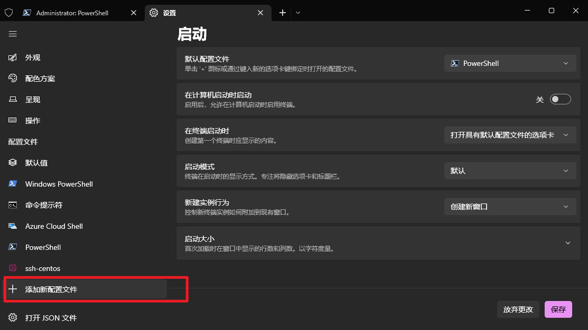
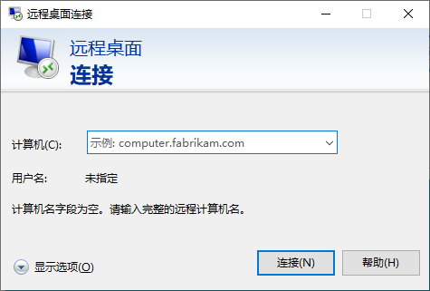
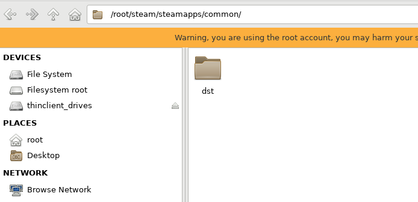
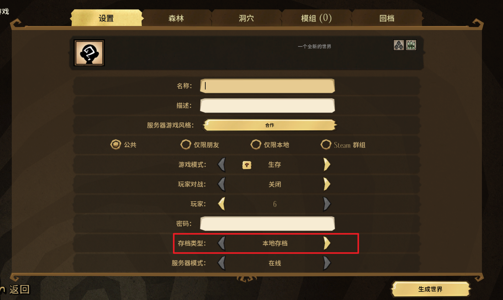
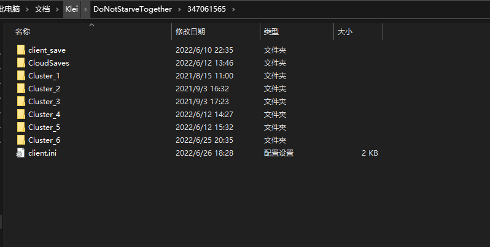
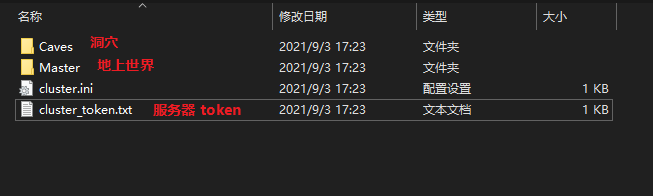
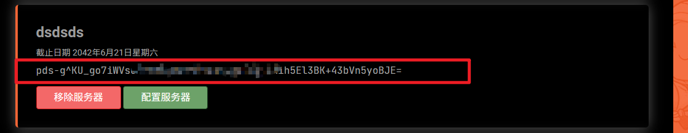
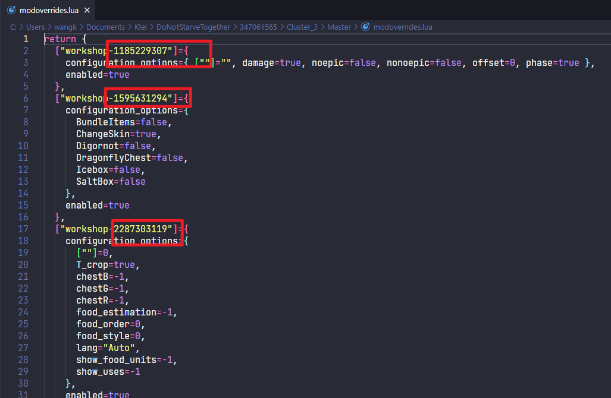

# 背景

​		玩饥荒的小伙伴都知道，饥荒这个游戏在创建多人房间的时候，会将房主的电脑作为本地服务器来中转数据，然后就经常遇到卡顿的问题。这篇文章尝试使用腾讯云轻量服务器来搭建饥荒的云服务器。

<!--truncate-->

# 配置

镜像系统：

- CentOS7.6-Docker20

实例规格

- CPU: 2核 内存: 4GB

系统盘

- 60GB SSD云硬盘管理快照

流量包

- 1000GB/月（带宽：6Mbps）

# SSH 远程连接

## 什么是 SSH

SSH 全程`Secure Shell`，是一种加密的网络传输协议，比较常用于远程登录系统，例如传输命令行界面或者执行服务端命令等。

SSH 采用非对称加密方式来保护数据传输，这种加密方式也是 web 应用协议 HTTPS 的加密手段。这种加密方式需要两个密钥：公钥和私钥。在实际运用的时候，假如有通信双方 A 和 B，A 先使用密钥算法计算产生一个公钥 Pkey 和私钥 Skey，并将其告知 B，后续 B 在发送数据的时候先使用公钥 Pkey 加密然后传输，经过公钥 Pkey 加密的数据，只能通过 A 保留的 Skey 来解密，以此来保证数据的安全性。

SSH 身份验证有多种途径，其中一种方法是使用自动生成的公钥-私钥对来简单地加密网络连接，随后**使用密码认证**进行登录；另一种方法是人工生成一对公钥和私钥，公钥需要放在待访问的电脑之中，然后就可**通过生成的密钥**进行认证，这样就可以在不输入密码的情况下登录。

## powershell 连接

windows10 2018 年秋季更新（也就是 1809 版本）后内置 OpenSSH，可以直接通过 powershell 或者 cmd 执行 SSH 连接。

```shell
ssh root@<ip>

// 然后提示输入密码
```

```shell
// 断开连接
logout
```

以往的 powershell 等也可以通过 [Get started with OpenSSH | Microsoft Docs](https://docs.microsoft.com/en-us/windows-server/administration/openssh/openssh_install_firstuse) 这篇文档一步一步往下配置 openssh，然后通过`ssh`命令连接云服务器，不过需要注意两点：

- 新购买的云服务器需要先通过重置密码操作来配置 SSH 远程登录密码；
- powershell 需要以管理员身份运行。

## windows terminal

windows terminal 本身支持 SSH 连接，通过生成密钥对，并添加新配置的方式来完成自动登录和认证的过程，以此来提高效率。

windows terminal 支持可视化配置，只需要注意命令行这里为：

```shell
ssh <username>@<ip> -p 22 -i ~/.ssh/id_rsa
```




# 更新系统

```shell
yum -y update
```

# 安装远程桌面

我个人对 linux 命令一窍不通，所以这里通过安装远程桌面的方式来安排！

```shell
yum -y install epel-release && yum groupinstall Xfce

yum -y install xrdp

systemctl start xrdp

echo "xfce4-session" > ~/.Xclients

chmod +x .Xclients
```

然后通过 windows 的远程桌面客户端就可以连接服务器了



# 安装steamcmd

## 安装运行环境

```shell
yum -y install glibc.i686 libstdc++.i686 screen libcurl.i686
```

## 安装 steamcmd

先创建`steam/steamcmd`目录，然后在该目录下执行安装`steamcmd`的命令并解压

```shell
curl -sqL "https://steamcdn-a.akamaihd.net/client/installer/steamcmd_osx.tar.gz" | tar zxvf -
```

# 安装饥荒服务器程序

安装完`steamcmd`后，就可以使用`steamcmd`安装饥荒服务器程序`Don’t Starve Together Dedicated Server`

```shell
# 运行 steamcmd
./steamcmd.sh
```

```shell
# 匿名身份登录
login anonymous
```

```shell
# 安装 Don’t Starve Together Dedicated Server
app_update 343050 validate +quit
```

安装完`Don’t Starve Together Dedicated Server`以后，就可以在`steam/steamapps/common`下找到该程序，为了方便以后命令操作，将该文件夹名称修改为`dst`



# 初次运行 server

还是刚才的`dst`目录下，找到`bin`目录，里面有个`dontstarve_dedicated_server_nullrenderer`程序，使用命令行运行它

```shell
cd steam/steamcmd/common/dst/bin

./dontstarve_dedicated_server_nullrenderer
```

可能会报`error while loading shared libraries: libcurl-gnutls.so.4: cannot open shared object file`的错误，运行以下命令解决，注意将末尾的目录替换成你安装的 server 的路径。

```shell
ln -s /usr/lib/libcurl.so.4 ~/steam/steamcmd/common/dst/bin/lib32/libcurl-gnutls.so.4
```

然后看到`your server will not start`就表示可以成功执行。

# 配置饥荒世界

## 生成地图配置

配置饥荒服务器这里最简单的方式是借助饥荒客户端来解决，也就是首先我们在本地运行饥荒服务器创建一个多人房间，把森林、洞穴以及`mod`什么的都配置好，并选择**本地存档**，然后生成世界。



然后我们到电脑的本地存档目录，一般在电脑文档目录下，例如我这里在`Documents\Klei\DoNotStarveTogether\347061565`下，然后就可以看到多个生成的存档的目录，找到最近时间创建的就是刚才生成的世界。



世界存档包含以下文件和目录：



## 生成并替换 token

然后登录到`Klei`官网 —— [Login](https://accounts.klei.com/account/info)（支持 steam 登录），然后找到饥荒游戏服务器并进入。


然后输入名称选择添加新服务器


然后新添加的服务器会显示在当前页面上方列表里，找到它并把下方的一串`token`复制下来



然后回到刚才本地电脑创建的世界的存档目录，打开`cluster_token.txt`文件，将复制的服务器`token`替换进去即可。

## 配置 mod

打开刚才饥荒世界的`Master`或者`Caves`目录，找到`modoverrides.lua`文件，使用文件编辑器打开，可以看到创建世界时配置启用的所有`mod`的 id。



回到服务器上饥荒服务器的`dst/mods`目录，找到`dedicated_server_mods_setup.lua`文件，该文件是服务器创建世界时安装`mod`的配置文件。

将`modoverrides.lua`内部的`mod`的`id`复制下来，并用`ServerModSetup("xxxx")`包裹，写入`dedicated_server_mods_setup.lua`文件，这就完成`mod`安装配置了。

# 上传饥荒世界配置文件

配置完饥荒世界和`mod`以后，我们把刚才本地电脑文件目录下的存档目录直接上传到服务器的`.klei/DoNotStarveTogether`目录下，这里我使用了 ftp 客户端`FileZilla`来上传文件，很方便很快！

# 运行地上和洞穴服务

上传完饥荒世界的配置文件以后，就可以再次使用`dontstarve_dedicated_server_nullrenderer`运行地上和洞穴服务了。

这里需要开两个`shell`窗口来运行两个命令。

```shell
# 启动地上世界
./dontstarve_dedicated_server_nullrenderer -console -cluster MyDediServer -shard Caves
```

```shell
# 启动洞穴
./dontstarve_dedicated_server_nullrenderer -console -cluster MyDediServer -shard Master
```

