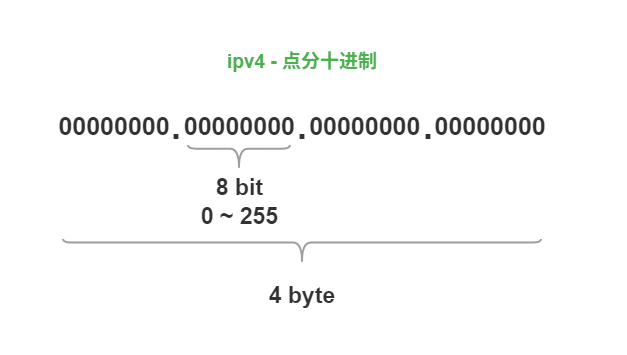
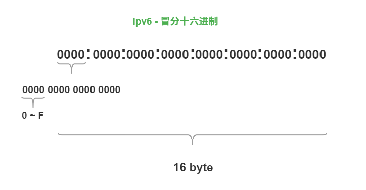
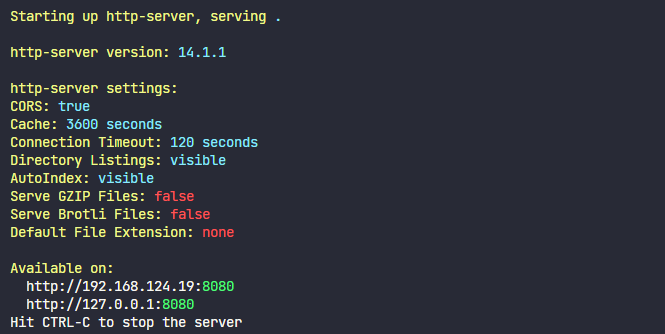
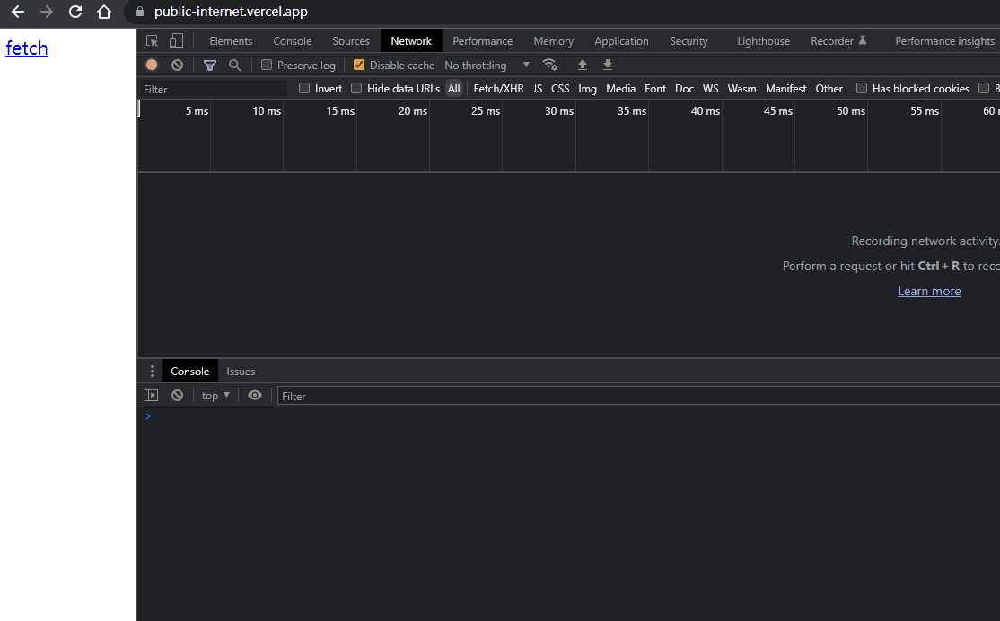
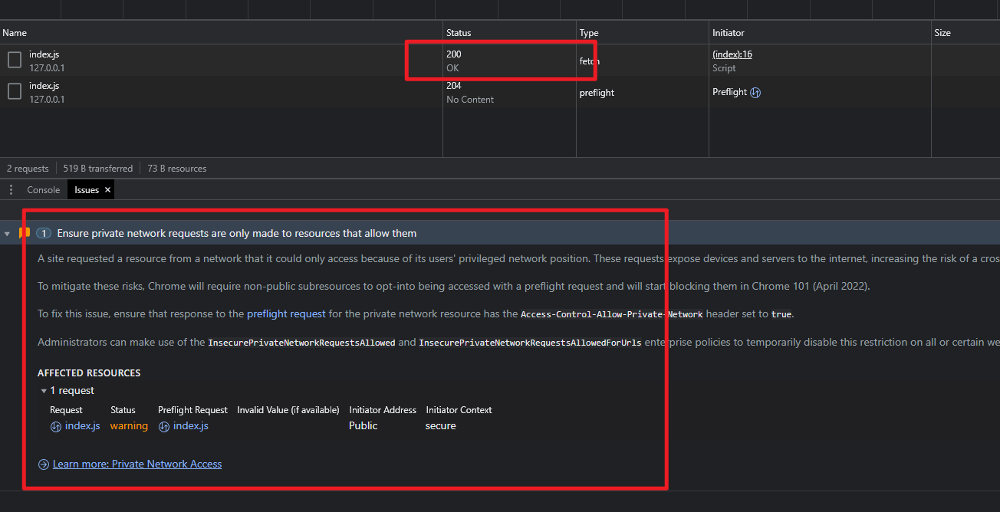
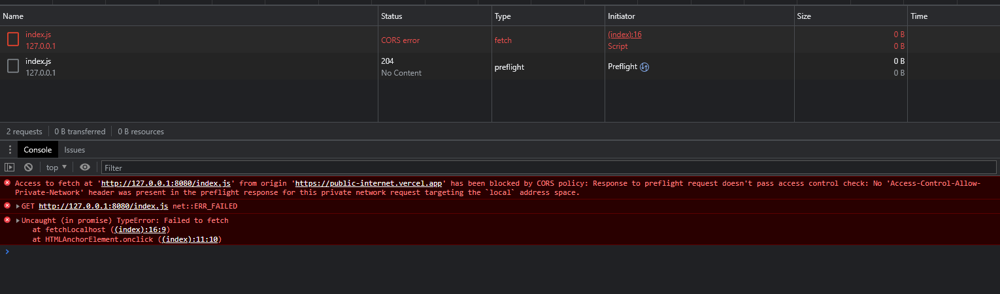

## 背景

上一篇 blog 提到了跨域访问图像资源引起的 canvas 污染的问题，其实当时我在查看跨域请求到的图像资源时，还无意中发现了一个新的 HTTP 响应头`Access-Control-Allow-Private-Network`，这篇文章就来简单探讨一下这个非常新的跨域请求的特性。

<!--truncate-->

## Access-Control-Allow-Private-Network

`Access-Control-Allow-Private-Network`是 W3C 社区草案 [Private Network Access 草案](https://wicg.github.io/private-network-access/)（以下简称`PNA`）制定的新的 HTTP 响应头字段，要求浏览器在判定从公共网络请求私有网络或者本地网络的跨域请求场景时，必须先发送预检请求，同时携带`Access-Control-Request-Private-Network: true`请求头，只有当服务端携带了`Access-Control-Allow-Private-Network: true`响应头字段时，才能继续发送原始请求，否则提示跨域错误。

## 什么是私有网络请求

`PNA`草案将域名`ip`分为以下三种类型，从`public ip`请求`private ip`或者`localhost`；以及从`private ip`请求`localhost`这两种情况都属于私有网络请求的范围，浏览器还可以拓展这个`ip`的限定范围。

- `local`：本地`ip`
- `private`：私有`ip`
- `public`：公共`ip`

### 私有地址段

一般来说`private ip`和`local ip`也就是以下这些，包括了一些`ipv6`的地址段。

| ip               | ip 类型   |
| ---------------- | --------- |
| `127.0.0.0/8`    | `local`   |
| `10.0.0.0/8`     | `private` |
| `172.16.0.0/12`  | `private` |
| `192.168.0.0/16` | `private` |
| `169.254.0.0/16` | `private` |
| `::1/128`        | `local`   |
| `fc00::/7`       | `private` |
| `fe80::/10`      | `private` |

:::info

ipv4 采用点分十进制表示，使用`.`分为 4 段，每段都由 1 个字节 8 位二进制数组成，转换成 10 进制表示范围就是 0~255



ipv6 采用冒分十六进制表示，使用`:`分为 8 段，每段由 2 个字节 16 位二进制数组成，但是表示的时候采用 16 进制的形式取四合一得到 4 个 16 进制的数；如果一个段内都是`0`，那么该段可以简写成一个`0`表示；同时如果连续两段以上都是`0`，可以简写成`::`来表示所有为`0`的段。



:::

## chrome 进展

从 [Chrome 规划的时间线](https://developer.chrome.com/blog/private-network-access-update/#timeline)来看:

- Chrome 94 推出测试版，开始在控制台对私有网络请求显示警告提示；
- Chrome 102 版本测试结束，需要手动开启试验特性；
- Chrome 105 版本正式推出

## 测试效果

默认情况下，Chrome 102 稳定版后默认不会支持`PNA`，我们先来看下不开启的效果。

我这里使用了 Chrome 103 稳定版测试了`PNA`特性，测试步骤如下：

1. 在 GitHub 新建一个只包含以下网页的仓库，也就是点击`fetch`就会请求本地网络的`index.html`文件，然后通过 vercel 发布到公共网络；

```html
<!DOCTYPE html>
<html lang="en">
  <head>
    <title>Home</title>
    <meta charset="UTF-8" />
    <meta name="viewport" content="width=device-width" />
  </head>
  <body>
    <div>
      <a href="javascript:;" onclick="fetchLocalhost()" aria-current="page"
        >fetch</a
      >
    </div>
    <script>
      function fetchLocalhost() {
        fetch('http://127.0.0.1:8080/index.js').then(async (res) => 				{
          console.log(await res.text());
        });
      }
    </script>
  </body>
</html>
```

2. 在本地电脑另建一个新的文件夹，添加`index.js`文件，通过`http-server`启动一个本地服务器，并开启`CORS`，这样`index.html`就会暴露在`127.0.0.1:8080`下，并且允许跨域访问；



3. 然后打开 vercel 部署的公共网页，点击 fetch 发起请求，可以看到这里公共网络的请求顺利拿到了本地服务的`index.js`文件



### 开启 PNA

现在我通过`chrome://flags`手动开启下面的试验特性，可观察到以下结果：

-  [private-network-access-send-preflights](chrome://flags/#private-network-access-send-preflights)：发送预检请求，并在响应头不包含`Access-Control-Allow-Private-Network: true`时只在控制台显示警告，而不阻止后续请求的发送和结果的获取；



- [private-network-access-respect-preflight-results](chrome://flags/#private-network-access-respect-preflight-results)：仅在预检请求获取的响应包含`Access-Control-Allow-Private-Network: true`时才会发送后续请求，即使本地服务开启了`CORS`响应头`Access-Control-Allow-Origin:*`等也无济于事。



## 总结

总体来说，`PNA`这个跨域请求限制对于开发者来说非常安全，前端开发场景经常需要在本地启动开发环境的本地服务代理本地资源，如果开发期间不小心点了某个网页，其具有对本地服务攻击性的请求，那么数据泄露将是毁灭性的。其实这也是 CSRF 攻击的一种，具体的 CSRF 攻击探讨下篇继续。


