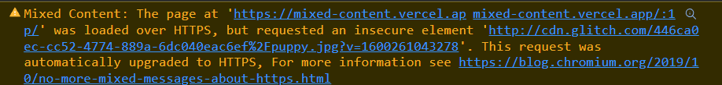
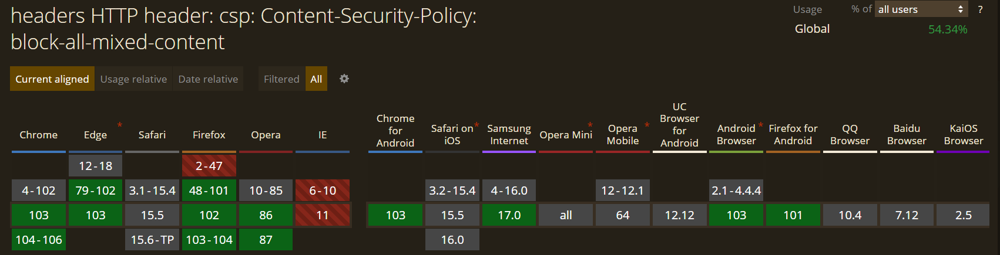
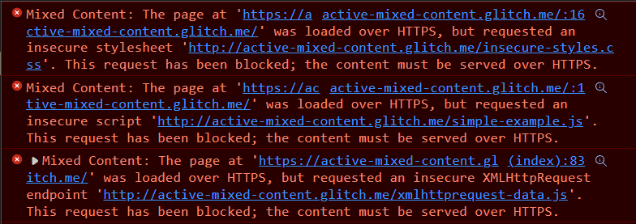

## 背景

这两天又遇到一个图片问题，具体就是在 HTTPS 协议网页请求完的 HTTP 图片会被限制下载，这...，web 静态资源的问题还挺多坑。

<!--truncate-->

## 什么是混合内容

Mixed Content 来自于 W3C 规范的定义 —— [混合内容 (以下简称规范)](https://w3c.github.io/webappsec-mixed-content/)，简单来说，当使用 HTTPS 请求的网页中包含其他通过 HTTP 请求的资源时，这些通过 HTTP 请求的内容就属于 Mixed Content。

W3C 的这篇规范不建议浏览器一律阻止所有混合内容的请求，视情况而定，将混合内容分为两种：

- 可升级的混合内容请求，一般也被称为被动/显示混合内容
- 无法升级的混合内容请求，一般也被称为主动型混合内容

### 被动型混合内容

被动混合内容主要是`img`，`video`，`audio`这些元素通过`src`属性指定的 URL 发起的请求，其本身既不受同源策略的限制，也不会受到这里混合内容的访问限制，并且浏览器还会自动帮助完成 HTTPS 访问的升级，然后在浏览器控制台给出一条如下提示内容，具体的可以移步这个网页观察细节 —— [mixed content example (mixed-content.vercel.app)](https://mixed-content.vercel.app/)



如果资源本身无法通过 HTTPS 访问，那么资源不会被加载并且报错。

W3C 也有个响应头来限制所有 HTTPS 站点内的 HTTP 请求 —— `Content-Security-Policy: block-all-mixed-content`，可以通过`meta`标签指定，不过这个请求头支持的浏览器比较少，目前这个属性值是被弃用了。

```html
<meta
  http-equiv="Content-Security-Policy" 
  content="block-all-mixed-content"
>
```



### 主动型混合内容

主动性混合内容是指可以直接获取并修改页面数据的请求，也就是`XMLHttpRequest`和`fetch`发起的 HTTP 请求，这些请求会被浏览器直接拦截，并不会发起跨域请求，然后在控制台提示报错信息。



:::caution

主动型混合内容无法通过前端解决，只能后端统一升级 HTTPS，或者对于页面能够通过 HTTPS 请求的内容，手动修改请求 URL 的协议。

:::

