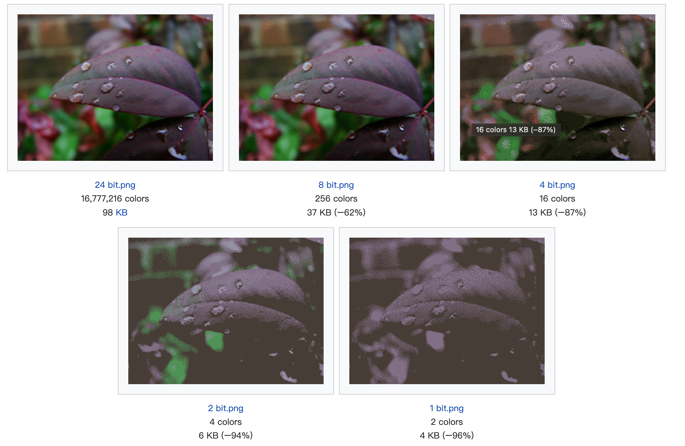
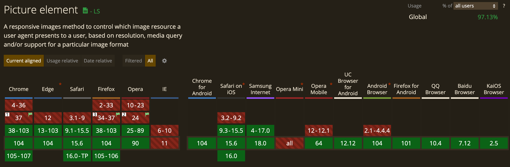

## 背景

根据 [httpachive 的统计数据](https://httparchive.org/reports/page-weight#reqImg)，在统计的 5,431,533 个 PC 页面中:

- 图像流量平均占页面的 44.5%（1032.0 KB -> 2317.8 KB）

- 请求数量平均占页面的 33%（25 -> 76）

所以图像数据在网站内容部分占比巨大，使用合适的图像格式能有效降低网站的流量带宽，同时降低网络传输延时，提升用户体验。

<!--truncate-->

## 数字图像分类

### 原始图

Raw Image，原始文件，一般是通过单反相机拍摄得到的原始文件，保留大量图像细节，但是所需的文件存储空间非常大，可以通过 ps 等图像编辑软件处理，并且转换压缩后得到光栅图，然后才能在其他图像查看软件正常显示。

常见的原始文件格式一般有 BMP，adobe 的 DNG，佳能相机的 CR2 等。

### 光栅图

Raster Image，光栅图，或者叫位图，由像素组成。

#### 像素

pixel，像素，每个像素都是原始图像的一个采样样本，也是图像的最小可编辑单元。在计算机显示设备上，每个像素的颜色有三个分量，也就是三原色（RGB-红绿蓝）。

通过改变 RGB 每个分量的权重来达到组合成其他颜色的目的，这就需要提到色深的概念。

#### 色深

色深是编码单个像素点所使用的 bit 数，使用 bpp(bit per pixel)单位。色深主要用来表示单个像素所能展示的颜色数量，呈 2 的指数级关系：

- 1 bpp，2^1 = 2 种颜色，也就是黑色和白色

- 2 bpp，2^2 = 4 种颜色

- 8 bpp，2^8 = 256 种颜色

- 24 bpp，2^24 = 16777216 种颜色，能达到人眼识别的颜色范围

- 32 bpp，在 24 位色深的基础上增加 8 bit 单独的 alpha 分量，然后通过每个颜色分量和  alpha 分量叠加运算改变其透明度；支持 alpha 分量的图像可以单独显示出图像内部透明区域，例如实现透明背景



### 矢量图

Vector Image，矢量图，基于笛卡尔坐标系内的点组成的几何图形，常见的也就是 SVG 格式的图像。

### 位图和矢量图的对比

1. 矢量图的呈现不会受到图像尺寸的影响，这是相对于位图的优势；
2. 矢量图支持编程化动态修改其图像本身的尺寸，颜色等细节；
3. 位图比矢量图具有更丰富的颜色细节，更适合表现真实世界的物品和艺术创作，而矢量图往往应用于工程制图方面；
4. 从位图到矢量图的转换叫图像追踪或光栅矢量化，相反，从矢量图转换成位图叫光栅化。

## 图像压缩概念

### 为什么需要压缩

从色深和图像的像素数可以计算出一张原始图像所需的存储空间大小：
$$
width * height * n (bpp) / 8 = [size] byte
$$
例如一张 1920 * 1080 像素宽高的 24 bpp 图像，所需约 7.91 MB，那么对于标称 500G 的硬盘，完全占用的情况只能存储 63254 张该图像；不仅如此，考虑到图像需要在不同设备或网络上传输，这个体积也是无法接受的，所以就需要图像压缩算法来减小图像数据的体积，节约在计算机设备上存储成本以及网络传输的带宽成本。

图像压缩分为有损压缩和无损压缩：

- 无损压缩指的是计算机根据逆向的解压缩算法能完全恢复原始图像，
- 有损压缩则无法从解压缩算法恢复得到原始图像，所以有损压缩后的图像显示效果可能在人眼观察上有所降低。

经过图像压缩算法得到的数据还需要指定文件编码格式，以便于图像数据在计算机系统上存储、读取和共享，文件格式通常和文件名后缀是对应的，但是具体的文件格式还是要根据文件编码的开头数据来确定。

### 压缩比率

压缩软件一般都会提供压缩比选择范围，压缩比是 **原始数据/压缩后数据** 计算得到的比率，同时，也会提供图像质量参数供选择，开发者需要权衡质量和图像体积选择的权重。
$$
compression ratio = uncompressed size / compressed size
$$

### 解析模式

图像编解码算法有两种解析模式，基线解析和渐进式解析：

- 基线解析：如果是从 web 加载，需要完全下载图像后从上往下解析图像并显示；

- 渐进式解析：渐进式相比基线编码式采用更复杂的隔行扫描式编码方式，同时解码也是隔行扫描解码，所以相比基线解码从上往下解析逐渐得到整张图像的方式，隔行扫描会更快看到整张图像的大致影像；应用于 web 方面，浏览器在下载到图像的部分数据后就能解析呈现整张图像的模糊缩影，后续继续下载数据再慢慢绘制整张完整的图像，从而优化慢速网络环境下的用户体验。

参见基线编码模式下的 JPEG 和渐进式编码模式的 JPEG 解析对比：https://nerds.sh/snippets/baseline-vs-progressive.html

## 图像兼容性处理

如果网站在使用一些较新的图像压缩格式（`avif`，`webp`等）时，可能在不同的浏览器上会出现兼容性问题，这时候可以通过 HTML5 的[`picture`元素](https://developer.mozilla.org/en-US/docs/Web/HTML/Element/picture)来解决。

`picture`元素内部可以包含多个`source`元素和一个`img`元素，浏览器会首先根据`source`的`media`或`type`等属性来检测是否支持加载改图像，如果不匹配或者浏览器本身不支持`picture`元素，则直接采用`img`指定的图像。

```html
<picture>
  <source srcset="photo.avif" type="image/avif">
  <source srcset="photo.webp" type="image/webp">
  
</picture>
```

### source 元素

`source`元素包含以下属性：

- `media`：指定媒体查询条件
- `type`：指定 [MIME type](https://developer.mozilla.org/en-US/docs/Web/HTTP/Basics_of_HTTP/MIME_types)，浏览器不支持就会跳过
- `srcset`：指定一个或多个图像的 URL，多个图像的 URL 使用逗号分隔

```html
<source srcset="mdn-logo-wide.avif" media="(min-width: 600px)" type="image/avif">
```

### picture 元素的兼容性

除了 IE 都支持（IE 于 2022-05-26 停止维护）

