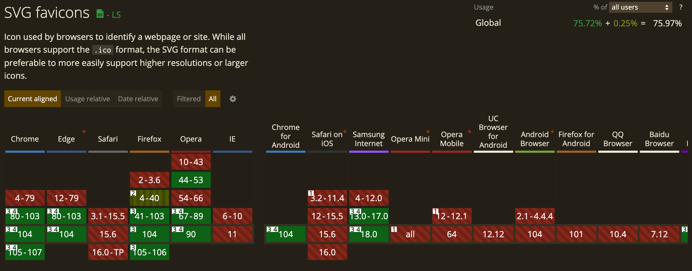

## 有损压缩

有损压缩目前使用最广泛的是 JPEG 压缩算法和文件格式，下面来整理一下三种有损压缩格式。

<!--truncate-->

### JPEG

JPEG 是 **Joint Photographic Experts Group(联合图像专家组)** 的首字母缩写，其前身是 **——** **Joint Bi-level Image Experts Group(联合二进制图像专家组)**，JBIG 负责制定二进制图像（二进制图像的每个像素只能使用一个 bit 表示黑色或者白色，也就是黑白图像）的压缩编码格式，例如 JBIG1 和 JBIG2；联合图像专家组负责维护 JBIG 标准以及制定彩色图像压缩新的算法标准。

实际上，联合图像专家组于 1992 年发布 JPEG 标准后还制定了一系列其他压缩标准，以下是 JPEG 家族的图像压缩标准：

|                     | JPEG                                                         | <div style={{width: 290}}>JPEG 2000</div>                    | <div style={{width: 290}}>JPEG LS（lossless）</div>          | JPEG XR（extended range）                                    | JPEG XT（extended tone still image）     | <div style={{width: 290}}>JPEG XS（extended extra small）</div> | <div style={{width: 290}}>JPEG XL（extended longterm）</div> |
| ------------------- | ------------------------------------------------------------ | ------------------------------------------------------------ | ------------------------------------------------------------ | ------------------------------------------------------------ | ---------------------------------------- | ------------------------------------------------------------ | ------------------------------------------------------------ |
| 发布时间            | 1992                                                         | 1997                                                         | 1998                                                         | 2011                                                         | 2015                                     | 2019                                                         | 2022                                                         |
| 文件格式            | JFIF，Exif，TIFF                                             | JP2，JPX                                                     |                                                              | JXR                                                          | JFIF                                     | JXS                                                          | JXL                                                          |
| 文件后缀名          | `.jpeg`，`.jpg`，`.jfif`，`.jif`，`.jpe`，`.tif`             | `jp2`, `.j2k`, `.jpf`, `.jpm`, `.jpg2`, `.j2c`, `.jpc`, `.jpx`, `.mj2` | `.jls`                                                       | `.jxr`，`.hdp`，`.wdp `                                      | `.jpeg`，`.jpg`，`.jfif`，`.jif`，`.jpe` | `.jxs`                                                       | `.jxl`                                                       |
| 有损/无损           | 有损，也支持无损但不常用                                     | 有损，也支持无损但不常用                                     | 无损                                                         | 有损/无损                                                    | 无损                                     | 有损                                                         | 有损/无损                                                    |
| 最大图像分辨率      | (2^16 - 1) * (2^16 - 1)                                      | (2^32 - 1) * (2^32 - 1)                                      |                                                              |                                                              |                                          |                                                              | (2^30 - 1) * (2^30 - 1)                                      |
| 色深                | 8 bpp                                                        | 32 bpp                                                       |                                                              | 16 bpp                                                       | 8 bpp                                    | 16 bpp                                                       | 24 bpp，32 bpp                                               |
| 是否支持 alpha 通道 | 不支持                                                       | 支持                                                         |                                                              | 支持                                                         | 支持                                     | 支持                                                         | 支持                                                         |
| MIME type           | `image/jpeg`                                                 | `image/jp2`, `image/jpx`, `image/jpm`,                       |                                                              | `image/jxr`，`image/vnd.ms-photo`                            | `image/jpeg`                             | `image/jxsc`, `video/jxsv`                                   | `image/jxl`                                                  |
| 兼容性              | 全平台                                                       | 只有 safari 支持                                             | 已知 Chrome 有查看医学成像的插件 —— [medical-image](https://chrome.google.com/webstore/detail/dicom-medical-image-reade/phakdkeobphiapdoggpcdilgmjbepnfg?hl=ro)，其他平台未知 | 只有 IE 支持                                                 | 暂无平台使用                             | 暂无平台使用                                                 | 暂无平台支持，但是 chrome 和 firefox 从 90 版本进入测试阶段，可以开启实验性特性 |
| 对比                |                                                              | 相比 JPEG 标准，JPEG-2000 着重提升码流的灵活性组织，使得图片传输可以渐进式加载：也就是用户在收到整个文件的一小部分后，查看者可以看到最终图片的质量较低的版本，然后通过从源下载更多数据位，质量会逐渐提高。 | JPEG LS 主要优化了 JPEG 无损压缩部分的算法，可以实现 2:1 的压缩比，并且提高了编解码速度，主要应用于医学成像领域，例如 X 光片。 | 与 JPEG 相比，JPEG XR 文件格式支持更高的压缩比，以对具有同等质量的图像进行编码。 |                                          | JPEG XS 被称为视觉无损低延迟轻量级图像，主要适用于网络码流传输场景下的图像压缩，因为其具有超高速的编解码压缩算法和高达 10:1 的压缩比，同时其编码器可以根据带宽动态调整压缩比来完美匹配可用带宽，从而减少图像传输延迟时间。 | 目前被图像专家组纳入标准，旨在替代当前的 JPEG 压缩标准，有损压缩相比目前的 JPEG 可以减小约 60% 的体积，同时优化了高压缩比下的图像质量，无损压缩相比 PNG 减少 35% 的体积。 |
| 开源库              | [libjpeg](https://github.com/thorfdbg/libjpeg)：官方于 1992 发布的编解码 jpeg 库<br />[libjpeg-turbo](https://github.com/libjpeg-turbo/libjpeg-turbo)：社区基于 libjpeg 实现的增强版本，于 2010 发布，相比  libjpeg ，编码速度提升 2~6 倍，因此使用更广泛，例如 [chromium](https://chromium.googlesource.com/chromium/deps/libjpeg_turbo/)<br />[mozjpeg](https://github.com/mozilla/mozjpeg)：mozilla 开发者于 2014 推出的版本，基于 libjpeg-turbo，相比 libjpeg-turbo 压缩的文件体积减小 10% 左右<br />[Guetzli](https://github.com/google/guetzli)：google 于 2016 年推出的基于 libjpeg 实现的版本，相比 libjpeg 压缩得到的文件体积减小 20~30% |                                                              |                                                              |                                                              |                                          |                                                              |                                                              |
| 备注                | TIFF（Tag Image File Format），标记图像文件格式，可以存储一张或者多张位图，可以不压缩，或者无损压缩、有损压缩； 但是通常文件体积都比较大，因此很少用于 web，浏览器也只有 Safari 支持读取这种文件格式。<br />Exif（Exchange Image File Format） 是拓展于 TIFF 的一种文件格式，可用于编码压缩后的 JFIF 文件， 同时也可以用于音频文件的编码。 |                                                              |                                                              |                                                              |                                          |                                                              |                                                              |

### ICO

ICO，icon，最初由微软公司开发用于 windows 系统应用程序显示在桌面、任务栏以及文件管理器内部的图标，在 web 上可以用于 favicon（favorite icon）。

| 属性       | 解释                                                   |
| ---------- | ------------------------------------------------------ |
| 发布时间   | 1999，2010 年通过 html5 规范支持`link`的`rel=icon`属性 |
| MIME       | `image/vnd.microsoft.icon`，`image/x-icon`             |
| 文件名后缀 | `.ico`                                                 |
| 色深       | 8 bpp，24 bpp，32 bpp                                  |
| 最大尺寸   | 256×256                                                |
| 兼容性     | 全平台                                                 |

favicon 通常用于显示在浏览器标签页 title、收藏夹等位置的图标，通过 HTML 规范定义的`link`标签和`rel=icon`或者`rel=apple-touch-icon`来嵌入到页面代码中，并且可以通过`sizes`属性来提供跨浏览器支持。

浏览器默认支持的尺寸要求如下：

- Chrome desktop：32×32（大部分浏览器都默认支持 32×32）

- Safari desktop：32×32

- IOS Safari：180×180

- Android Chrome：196×196

- IE：16×16, 32×32, 48×48

```HTML
<link rel="icon" sizes="32x32" href="icon.png">
<link rel="icon" sizes="180x180" href="icon-180x180.png">

<link rel="apple-touch-icon" sizes="180x180" href="icon.png">

<link rel="icon" href="/favicon.svg" type="image/svg+xml">
```

目前 favicon 使用 PNG 的更多，但是未来的趋势是用 SVG 格式，因为 SVG 没有尺寸限制，不受设备分辨率影响且通常体积小于 PNG，而且支持运行时动态修改其样式，不足点是 svg favicon 的兼容性非常不好，目前仅在使用 chromium 内核的浏览器支持。



### Webp

Webp（读作weppy），webp 支持有损压缩，但是有损压缩效果在某些时候要弱于 JPEG，这里不多赘述，见后面文章无损压缩的分析。