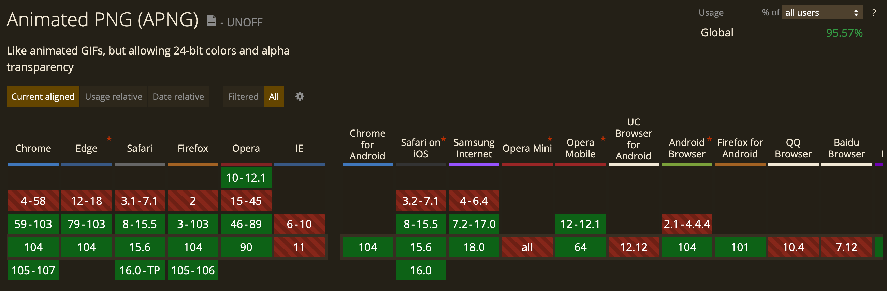
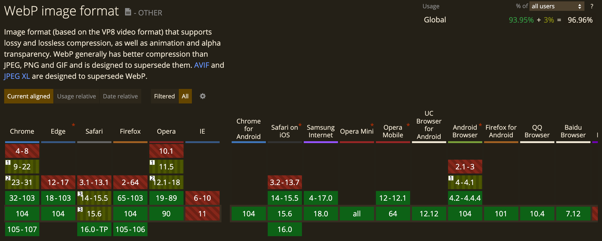
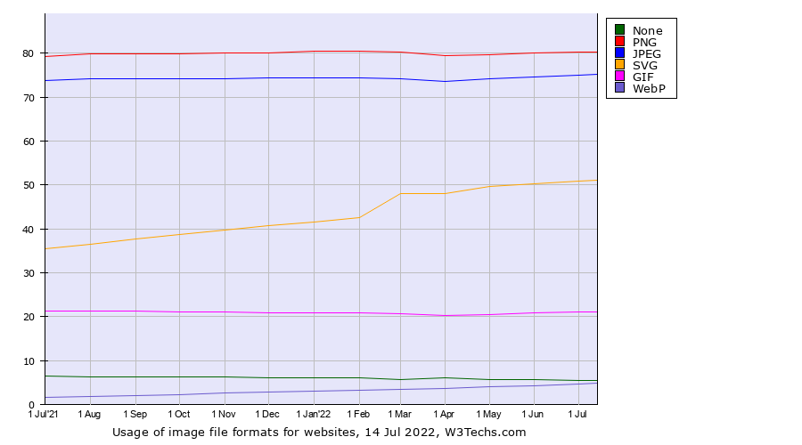
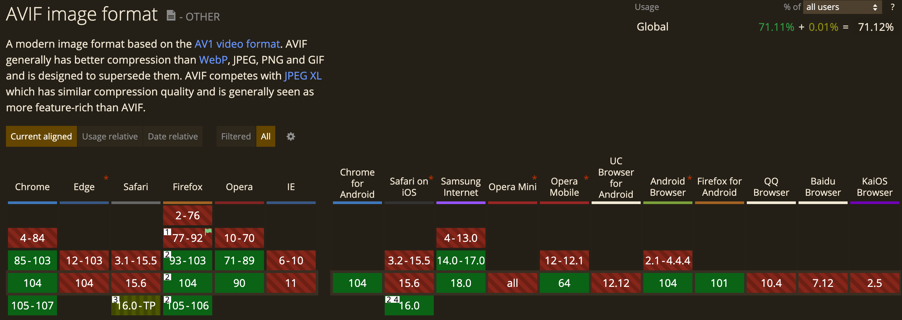
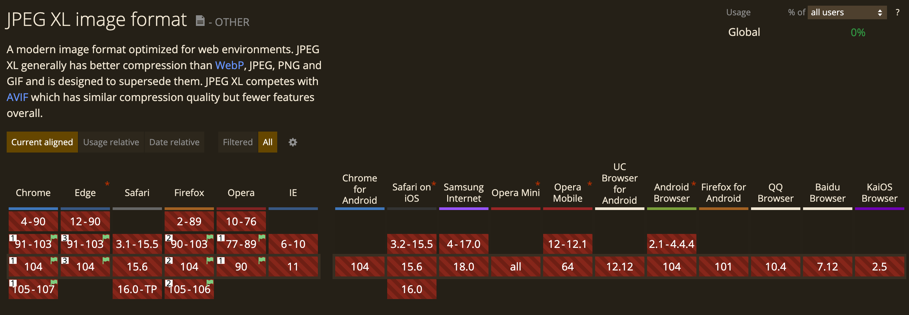

## 无损压缩

无损压缩目前使用最广泛的图像格式是 PNG，但是近几年也出现了许多新的压缩算法标准，以期望替代 PNG，提供更好的图像压缩效果。

<!--truncate-->

## BMP

BMP，BMP 是编码原始图像的一种文件格式，一般采取不压缩的方式存储图像数据，因此文件体积非常大，不推荐在 web 使用。

| 文件格式     | 开发商                                             |
| ------------ | -------------------------------------------------- |
| BMP          | 微软                                               |
| 开发商       | 微软                                               |
| 发布时间     | 1987 年跟随 Windows2 发布                          |
| 文件名后缀   | `.bmp`，`.dib`                                     |
| MIME         | `image/bmp``image/x-bmp`                           |
| 色深         | 最高支持 32 bpp，使用压缩算法后只支持 4bpp 或 8bpp |
| 最大图像尺寸 | 2 ^ 31 - 1                                         |
| 兼容性       | 全平台                                             |

## GIF

GIF，Graphics Interchange Format，图形交换格式，使用 LZW 无损压缩算法来压缩图像数据，可以将多个图像存储在一个文件中，因此可以用 GIF 来制作动画帧。

### GIF 的历史

GIF 最初版本为 87a，由美国 [CompuServe](https://en.wikipedia.org/wiki/CompuServe) 公司在 1987 年发布，由于其支持彩色图像和使用高速的编解码算法，所以很快流行起来，但是此时的 GIF 还不支持动画。理论上，GIF 是最早在互联网流行的图像格式，比 JPEG 还早了三四年。

1989 年，CompuServe 公司又发布了一个增强版本 89a，此版本为 GIF 增加了图形控制拓展，允许 GIF 文件中的每一幅图像可以在等待一定的时间延迟后进行绘制，从第一幅图像开始绘制到最后一幅结束，不支持循环。

为了让 GIF 能够自动循环播放图像，Netscape 公司开发者在 1995 年在 GIF 动画帧序列前添加了一个表示帧播放次数的数据块，指定帧应该被播放的次数，从 0~ 65535 次，0 就表示永远循环，从此便有了强大的动画表情包。后续 Netscape 也将对 GIF 的支持添加到了浏览器中，后续随着网络发展，各大浏览器也都支持了，直到今天仍然使用的是 1989 年发布的 89a 标准。

| 开发者              | 美国 CompuServe 公司                                         |
| ------------------- | ------------------------------------------------------------ |
| 发布时间            | 1987                                                         |
| 色深                | 8 bpp                                                        |
| 是否支持 alpha 通道 | 不支持，但是 GIF 支持为每个颜色分量指定一个索引位作为透明背景颜色 |
| 支持动画            | 支持                                                         |
| 支持隔行扫描        | 支持，允许部分下载渐进式解析                                 |
| 文件格式            | GIF                                                          |
| 文件名后缀          | `.gif`                                                       |
| MIME                | `image/gif`                                                  |
| 最大图像尺寸        | 65536×65536                                                  |
| 兼容性              | 全平台                                                       |
| 缺陷                | GIF 的缺陷主要由以下方面：GIF 无损压缩图像的压缩比不如视频压缩，导致多帧画面编码得到的文件体积过大；目前，越来越多的图像压缩标准支持动画，例如 webp，apng，heif 等，它们都具有更高压缩比和更出色的显示效果，谷歌开发者也推荐将 GIF 转换成 webm, mp4 等视频格式来减小体积；GIF 最多支持 256 种颜色，制作不了全彩图像，无法满足设计群体的要求GIF 更多的还是应用于 1MiB 下的动画图像，其余场景都有更好的图像格式选择。 |
| 开源工具            | [imagemin-gifsicle](https://github.com/imagemin/imagemin-gifsicle)：nodejs 使用 gifsicle 优化 GIF 图像 [gif2webp](https://developers.google.com/speed/webp/docs/gif2webp)：将 GIF 转换成 webp[ezgif](https://ezgif.com/gif-to-apng)：图像格式转换网站 |

## PNG/APNG

PNG，Portable Network Graphics，便携式网络图形，最初由一群计算机图形开发专家（PNG Development Group）组织开发，初衷是应对 GIF 使用的压缩算法 LZW 的专利争端。

PNG 提供的文件格式本身只支持编码单个图像，直到 2001 年，开发者发布了 MNG（多图像网络图形） 图像格式，让 PNG 也能像 GIF 那样支持动画，但是 MNG 格式并未得到主流浏览器的支持，早期只是 mozilla 和 netscape 支持，IE，chrome，safari 这些浏览器则从未支持 MNG。

此后，mozilla 开发者基于 PNG 开发出了 APNG（动画便捷式网络图形）格式并于 2008 年发布，兼容 PNG 格式的同时，支持动画显示，比 GIF 支持更高色深和更高的压缩比，动图质量更高且体积更小。但是 PNG 开发小组一直拒绝将 APNG 作为拓展纳入自己的标准，也就 mozilla 在背后推广，这就导致 APNG 一直没普及使用，再加上 mozilla 近年来相比 chrome 越来越势弱，APNG 的未来前景渺茫。

|                     | PNG                                                          | APNG                                                         |
| ------------------- | ------------------------------------------------------------ | ------------------------------------------------------------ |
| 开发者              | PNG Development Group（PNG开发小组）                         | mozilla                                                      |
| 发布时间            | 1996，2003 年纳入[ w3c 标准](https://www.w3.org/TR/PNG/)     | 2008                                                         |
| 色深                | 32 bpp                                                       | 32bpp                                                        |
| 是否支持 alpha 通道 | 支持                                                         | 支持                                                         |
| 支持动画            | 不支持                                                       | 支持                                                         |
| 支持隔行扫描        | 支持，允许部分下载渐进式解析，但会增加图像体积               | 支持                                                         |
| 文件格式            | PNG，                                                        | APNG                                                         |
| 文件名后缀          | `.png`                                                       | `.png`                                                       |
| MIME                | `image/png`                                                  | `image/png`，`image/apng`                                    |
| 最大图像尺寸        | 2 ^ 31 - 1                                                   | 2 ^ 31 - 1                                                   |
| 兼容性              | PNG 全平台兼容                                               | APNG 只有 IE 不支持  |
| 开源库              | [libpng](http://www.libpng.org/pub/png/libpng.html)：编解码 png | [libpng-apng](https://sourceforge.net/projects/libpng-apng/)：编辑码 APNG [gif2apng](http://gif2apng.sourceforge.net/)：使用 c++ 开发转换 gif 到 apng |
| 性能                |                                                              | 相比 GIF 可以减少 20% 的体积，同时可编码的颜色更多，图像质量更高。 |
| 使用率              | PNG 本身基本没有缺陷，在 web 上的使用率也一直是最高的        | 普及率不高，使用者较少                                       |
| 示例                |                                                              |           |

## Webp

webp 实际本身主打的是无损压缩静态图像的格式，其无损压缩格式比 PNG 可以减少 26% 的体积。

| 开发者       | google                                                       |
| ------------ | ------------------------------------------------------------ |
| 发布时间     | 2010                                                         |
| 文件格式     | RIFF，RIFF 是微软和 IBM 于 1991 推出的一种容器格式，可用来编码位图，音频，视频等数据形式，在此文件格式基础上还衍生出了 AVI，WAV 等文件格式。 |
| 文件名后缀   | `.webp`                                                      |
| MIME         | `image/webp`                                                 |
| 色深         | 32 bpp                                                       |
| Alpha 通道   | 支持 8 bit                                                   |
| 最大图像尺寸 | 16383 x 16383                                                |
| 支持动画     | 支持                                                         |
| 兼容性       | 除了 IE 基本都支持  |
| 开源库       | [libwebp](https://storage.googleapis.com/downloads.webmproject.org/releases/webp/index.html)：包含在 JPEG、PNG 和 webp 之间互相转换的 CLI 工具，[cwebp](https://developers.google.com/speed/webp/docs/cwebp) 可以将  PNG、JPEG 转换成 Webp，dwebp 可以将 webp 转换成 PNG [img2webp](https://developers.google.com/speed/webp/docs/img2webp)：从一系列输入图像创建动画 WebP 文件的 CLI 工具 [gif2webp](https://developers.google.com/speed/webp/docs/gif2webp)： 将 GIF 图像转换为 WebP 的 CLI 工具 [libwebp2](https://chromium.googlesource.com/codecs/libwebp2/)：第二版 libwebp [imagemin-webp](https://github.com/imagemin/imagemin-webp)：nodejs 工具，转换 JPEG/PNG 到 webp 格式 [sharp](https://sharp.pixelplumbing.com/api-output#webp)：nodejs 工具，转换其他图像格式到 webp |
| 普及率       | 就目前来看，使用 webp 网站还是相对较低，75% <-> 4.8%，有趣的是，google 目前自己也很少使用 webp，之前在 webstore 用过一段时间后又替换回了 jpeg 和 png  |

## HEIC

HEIC（High Efficiency Image Container，高效图像容器格式），是编码经过 HEVC（H.265，High Efficiency Video Coding）压缩过的图像的文件格式，是 IOS 11+ 系统内部默认图像格式，目前仅在 IOS 和 macOS 内部默认支持。

| HEIC             | High Efficiency Image Container                              |
| ---------------- | ------------------------------------------------------------ |
| 开发者           | MPEG（Moving Pictures Experts Group）                        |
| 发布时间         | 2013                                                         |
| 文件格式         | HEIF（High Efficiency Image File Format），由 MPEG 开发并于 2015 年推出的一种容器格式，支持以不同的文件编码格式存储单个或多个图像，例如用来编码 HEVC 压缩过的图像使用 HEIC 文件格式，编码 AV1 压缩过的图像使用 AVIF 文件格式。 |
| 文件名后缀       | `.heic`，`.heics`                                            |
| MIME             | `image/heic`，`image/heic-sequence`                          |
| 最大色深         | 16 bpp                                                       |
| 最大图像尺寸     | 8192×4352（8k）                                              |
| 是否支持透明     | 支持 alpha 分量                                              |
| 是否支持动画     | 支持                                                         |
| 是否支持隔行扫描 | 不支持                                                       |
| 兼容性           | .png)               |
| 开源库           | [libheif](https://github.com/strukturag/libheif)：支持编解码 HEIF 和 HEIC 的 c++ 库 [sharp](https://sharp.pixelplumbing.com/api-output#heif)：nodejs 转换图像格式的工具，支持 HEIC |

## AVIF

AVIF（AOMedia Video Image Format，AOM视频图像格式），是编码经过 AV1（AOMedia Video 1）算法压缩过的图像的文件格式，由 [AOMedia（开放媒体联盟）](https://aomedia.org/)开发维护，最初规范 [1.0.0 ](https://github.com/AOMediaCodec/av1-avif/releases)于 2019 年 2 月发布，现今仍然沿用这个版本的规范。

AOMedia 由目前一些最具影响力的互联网公司组成，例如亚马逊、谷歌、苹果，Netflix，国内的有腾讯、阿里等等，这些公司通过共享其各自掌握的专利技术开发出了免版税的视频流数据压缩算法 AV1，以替代由 MPEG 推出的视频压缩算法 HEVC，避免向 HEVC 背后的专利持有者支付日益高昂的专利费。

| AVIF             | AOMedia Video Image Format                                   |
| ---------------- | ------------------------------------------------------------ |
| 开发者           | AOMedia                                                      |
| 发布时间         | 2019                                                         |
| 文件格式         | HEIF（High Efficiency Image File Format），由 MPEG 开发并于 2015 年推出的一种容器格式，支持以不同的文件编码格式存储单个或多个图像，例如用来编码 HEVC 压缩过的图像使用 HEIC 文件格式，编码 AV1 压缩过的图像使用 AVIF 文件格式。 |
| 文件名后缀       | `.avif`                                                      |
| MIME             | `image/avif`                                                 |
| 最大色深         | 12 bpp                                                       |
| 最大图像尺寸     | 8192×4352（8k）                                              |
| 是否支持透明     | 支持 alpha 分量                                              |
| 是否支持动画     | 支持                                                         |
| 是否支持隔行扫描 | 不支持渐进式解析，必须完整下载图片才开始解析                 |
| 兼容性           | Edge 虽然用了 chromium 内核，但是不支持 avif  |
| 开源库           | [libavif](https://github.com/AOMediaCodec/libavif)：官方使用 C 编写的编解码 avif 的库 [avif.js](https://github.com/Kagami/avif.js)：avif polyfill，为不支持 avif 的浏览器提供支持 [sharp](https://sharp.pixelplumbing.com/api-output#avif)：nodejs 转换图像格式的工具，支持 avif [avif.io](https://avif.io/)：支持转换其他图像格式到 avif 的网站 |

## JPEG XL

JPEG XL 是 JPEG（联合图像专家组）开发的新一代图像压缩算法和文件格式，建立在 google 开发的 [PIK](https://github.com/google/pik) 和 cloudinary 开发的 [FUIF（Free Universal Image Format）](https://github.com/cloudinary/fuif)基础上，其中 FUIF 又是建立在 [FLIF（Free Lossless Image Format）](https://github.com/FLIF-hub/FLIF) 项目基础上，目前 PIK、FLIF、FUIF 都被废弃了，这些项目的开发者都已经转头全力支持 JPEG XL 编解码库 [libjxl](https://github.com/libjxl/libjxl) 的开发。

JPEG XL 旨在替代当前的 JPEG 标准，其支持无损/有损压缩，也支持动画，并且免版税，其标准化的编码算法在 2022 年 5 月份才发布，标准号 ISO/IEC 18181。

| JPEG XL          | JPEG extended longterm                                       |
| ---------------- | ------------------------------------------------------------ |
| 开发者           | JPEG                                                         |
| 发布时间         | 2022                                                         |
| 文件名后缀       | `.jxl`                                                       |
| MIME             | `image/jxl`                                                  |
| 最大色深         | 32 bpp                                                       |
| 最大图像尺寸     | (2^30 - 1) * (2^30 - 1)                                      |
| 是否支持透明     | 支持 alpha 分量                                              |
| 是否支持动画     | 支持                                                         |
| 是否支持隔行扫描 | 支持，可以渐进式解析                                         |
| 兼容性           | 暂无平台支持，但是 chrome 和 firefox 从 90 版本进入测试阶段，可以通过 flags 开启，例如 chrome://flags#enable-jxl  |
| 开源库           | [libjxl](https://github.com/libjxl/libjxl)：使用 c++ 实现的编解码 JPEG XL 库 [squoosh](https://squoosh.app/)：在线转换图像格式，支持 JPEG XL [libSquoosh](https://github.com/GoogleChromeLabs/squoosh/tree/dev/libsquoosh)：nodejs 转换图像格式的工具，支持 JPEG XL |