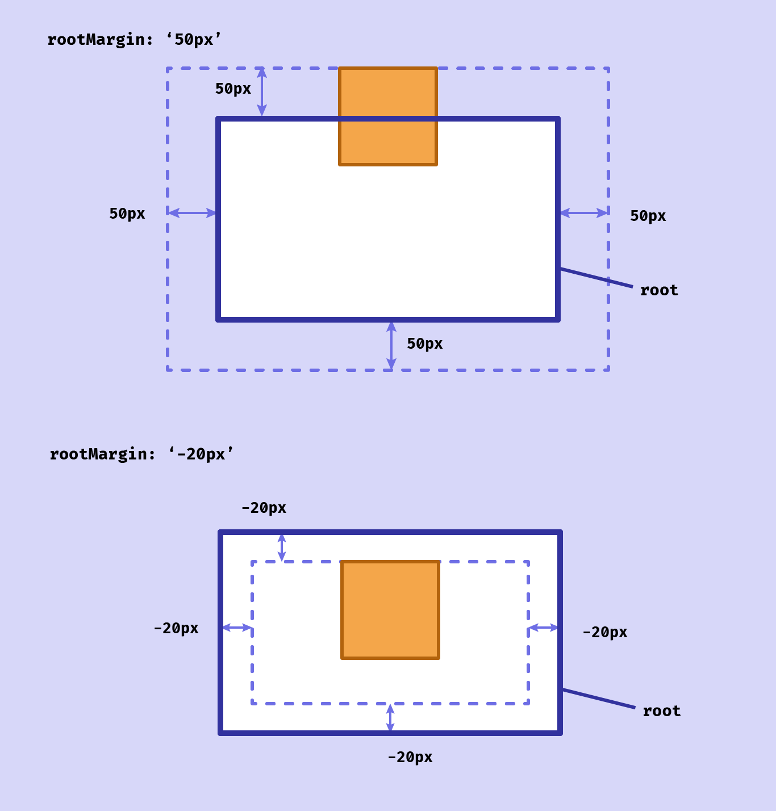

当我们说到图片懒加载、页面数据的滚动加载这些体验设计时，一般能够想到基于[`scroll`](https://developer.mozilla.org/en-US/docs/Web/API/Document/scroll_event)事件，通过`getBoundingClientRect`方法获取元素相对于视口偏移量`top`，来判断元素是否可见，demo 如下

[](https://codesandbox.io/s/jovial-snowflake-e42869?fontsize=14&hidenavigation=1&theme=dark)

这种实现方式较为繁琐，但是现在我们有了`IntersectionObserver` API，可以大大简化这些通过计算元素偏移量来判断可视性的逻辑。

<!--truncate-->

# IntersectionObserver 介绍

W3C 在 [2017-09-14](https://www.w3.org/standards/history/intersection-observer) 正式发布了`IntersectionObserver` API 草案，其功能上提供了检测目标元素在祖先元素或 [viewport](https://developer.mozilla.org/zh-CN/docs/Glossary/Viewport) 内可视情况变化的方式，这种观测是异步的，保证了开发上的便捷和性能上的高效。

## IntersectionObserver类型定义

`IntersectionObserver`本身是一个构造函数，需要通过`new`来初始化调用，基本使用方式如下：

```javascript
// 获取目标元素 DOM 对象
const observeTarget = document.querySelector("#targetId");

// 初始化IntersectionObserver实例
let observer = new IntersectionObserver((entries) => {
  entries.forEach(e => {
    // e.isIntersecting 为 true，则目标元素变得可见
		if (e.isIntersecting) {
      
    }
  })
}, {
  threshold: [0, 1]
});

// 开始监测目标元素
observer.observe(observeTarget);

// 取消监测
observer.unobserve(observeTarget);
observer.disconnect();
```

下面是详细的 TypeScript 类型定义：

```typescript
/*
 * 构造函数
 */
declare var IntersectionObserver: {
    prototype: IntersectionObserver;
    new(callback: IntersectionObserverCallback, options?: IntersectionObserverInit): IntersectionObserver;
};

/*
 * 构造函数初始参数1：回调函数
 */
interface IntersectionObserverCallback {
    (entries: IntersectionObserverEntry[], observer: IntersectionObserver): void;
}

/*
 * 构造函数初始参数2：回调函数执行条件设定
 */
interface IntersectionObserverInit {
    /*
     * 目标元素的包含元素，如果不指定则默认为 viewport
     */
    root?: Element | Document | null;
    /*
     * 目标元素相对于 viewport 或者包含元素的偏移量
     * 注意：负值表示目标元素在包含元素内部偏右或者偏下的位置
     */
    rootMargin?: string;
    /*
     * 目标元素触发回调函数的
     */
    threshold?: number | number[];
}

/*
 * IntersectionObserver对象属性和方法
 */
interface IntersectionObserver {
    readonly root: Element | Document | null;
    readonly rootMargin: string;
    readonly thresholds: ReadonlyArray<number>;
    /*
     * 停止监测所有元素
     */
    disconnect(): void;
    /*
     * 开始监测目标元素
     */
    observe(target: Element): void;
    /*
     * 获取所有目标元素的监测对象
     */
    takeRecords(): IntersectionObserverEntry[];
    /*
     * 停止监测目标元素
     */
    unobserve(target: Element): void;
}

/*
 * 回调函数获取的目标元素的监测变量
 */
interface IntersectionObserverEntry {
    /*
     * 目标元素在 viewport 内部的坐标
     */
    readonly boundingClientRect: DOMRectReadOnly;
    /*
     * 目标元素可见比例
     */
    readonly intersectionRatio: number;
    /*
     * 目标元素可见区域在 viewport 内部的坐标
     */
    readonly intersectionRect: DOMRectReadOnly;
    /*
     * 目标元素是否可见
     */
    readonly isIntersecting: boolean;
    /*
     * 目标元素的root元素可见区域的坐标
     */
    readonly rootBounds: DOMRectReadOnly | null;
  	/*
     * 目标元素 DOM 对象
     */
    readonly target: Element;
    /*
     * 相对于创建文档的时间，当元素可见性发生改变的时间对象
     */
    readonly time: DOMHighResTimeStamp;
}
```

在初始化`IntersectionObserver`对象的时候，需要重点理解`root`和`threshold`的概念。

### root

`root`可以在初始化`IntersectionObserver`时指定，表示目标元素相对的容器元素，如果未指定则为`html`根元素。

`root`和目标元素都被看成是矩形盒子，而`rootMargin`则是目标元素相对于`root`的位置偏移量，因为`root`内部还可能排布的有其他元素或者`root`本身具有不为`0`的`margin`属性。

- 当`rootMargin`取正值时，元素在`viewport`或者祖先元素内部向上或者向左偏移

- 当`rootMargin`取负值时，元素在`viewport`或者祖先元素内部向下或者向右偏移

（下图引自[Building A Dynamic Header With Intersection Observer — Smashing Magazine](https://www.smashingmagazine.com/2021/07/dynamic-header-intersection-observer/)）



### threshold

`threshold`用于指定一个或者多个在`0 ~ 1`范围内的数字，数字代表的是一个比例，表示元素在`root`内部可见面积相对于`root`的百分比。

当目标元素可见面积比例发生改变且在指定的阈值时，就会触发`IntersectionObserver`初始化时的回调函数，如果不指定，则默认为`0`，即元素在完全不可见和可见时触发回调函数。

:::caution

`threshold`并不能保证回调函数一定在这些指定的阈值到达时执行。

:::

## 判断元素是否可见

通过`IntersectionObserver`我们可以判断元素是否可见的两种情况：

1. 在`document`的`viewport`内部是否可见，此时元素相对于浏览器窗口或者`iframe`定位

<iframe src="https://codesandbox.io/embed/ancient-sound-l3vbju?fontsize=14&hidenavigation=1&theme=dark"
     width="100%"
     height="500"
     title="ancient-sound-l3vbju"
     allow="accelerometer; ambient-light-sensor; camera; encrypted-media; geolocation; gyroscope; hid; microphone; midi; payment; usb; vr; xr-spatial-tracking"
     sandbox="allow-forms allow-modals allow-popups allow-presentation allow-same-origin allow-scripts"
     loading="lazy"
   ></iframe>


2. 在祖先元素内部是否可见

<iframe src="https://codesandbox.io/embed/nervous-tristan-k630cf?fontsize=14&hidenavigation=1&theme=dark"
     width="100%"
     height="500"
     title="nervous-tristan-k630cf"
     allow="accelerometer; ambient-light-sensor; camera; encrypted-media; geolocation; gyroscope; hid; microphone; midi; payment; usb; vr; xr-spatial-tracking"
     sandbox="allow-forms allow-modals allow-popups allow-presentation allow-same-origin allow-scripts"
     loading="lazy"
   ></iframe>
## IntersectionObserver用例

### Image Lazyload

<iframe src="https://codesandbox.io/embed/hopeful-poincare-uuhiob?fontsize=14&hidenavigation=1&theme=dark"
          width="100%"
     height="500"
     title="hopeful-poincare-uuhiob"
     allow="accelerometer; ambient-light-sensor; camera; encrypted-media; geolocation; gyroscope; hid; microphone; midi; payment; usb; vr; xr-spatial-tracking"
     sandbox="allow-forms allow-modals allow-popups allow-presentation allow-same-origin allow-scripts"
     loading="lazy"
   ></iframe>
### Sticky Header BoxShadow

<iframe src="https://codesandbox.io/embed/angry-taussig-e07ysx?fontsize=14&hidenavigation=1&theme=dark"
          width="100%"
     height="500"
     title="angry-taussig-e07ysx"
     allow="accelerometer; ambient-light-sensor; camera; encrypted-media; geolocation; gyroscope; hid; microphone; midi; payment; usb; vr; xr-spatial-tracking"
     sandbox="allow-forms allow-modals allow-popups allow-presentation allow-same-origin allow-scripts"
     loading="lazy"
   ></iframe>
### Infinite Scroll

<iframe src="https://codesandbox.io/embed/intelligent-albattani-yrujgn?fontsize=14&hidenavigation=1&theme=dark"
          width="100%"
     height="500"
     title="intelligent-albattani-yrujgn"
     allow="accelerometer; ambient-light-sensor; camera; encrypted-media; geolocation; gyroscope; hid; microphone; midi; payment; usb; vr; xr-spatial-tracking"
     sandbox="allow-forms allow-modals allow-popups allow-presentation allow-same-origin allow-scripts"
     loading="lazy"
   ></iframe>
