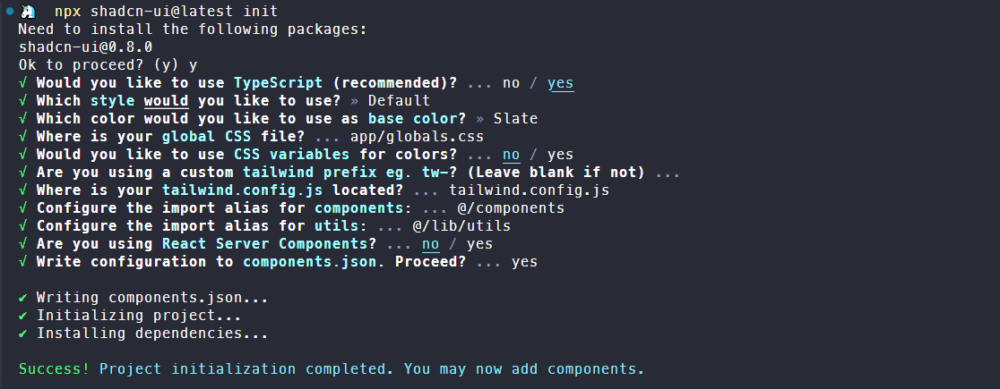
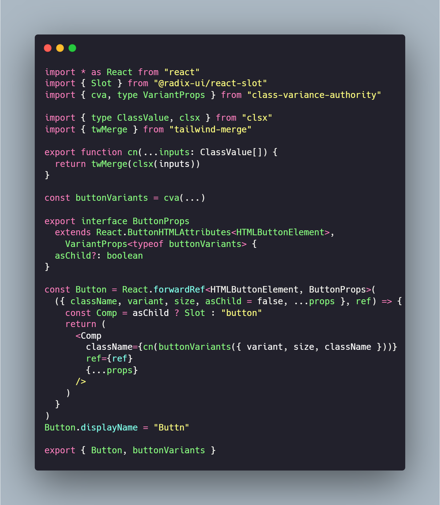
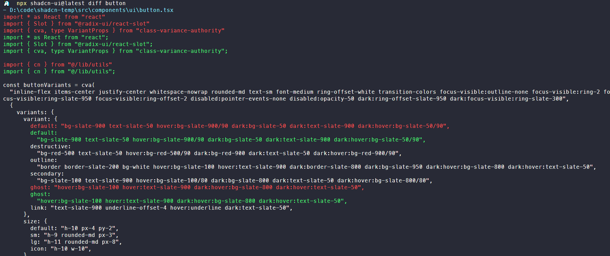

Shadcn ui 是最近比较火的一个 React 组件库，官方介绍其并非组件库，因为它并非基于 npm package 的形式来维护，而是通过 nodejs 命令支持将组件源码直接复制到你的项目中。

本篇文章从使用到分析 shadcn cli 命令源码的实现，来深入了解这个组件库内部的一些原理。

<!--truncate-->

## 使用

### 初始化

shadcn ui 依赖于 tailwindcss，所以使用 shadcn ui 的组件需要安装和配置 tailwindcss，这里就不细说了。

tailwindcss 安装完就可以使用 shadcn ui 提供的 cli 工具来初始化一些配置了：

```shell
npx shadcn-ui@latest init
```

执行`init`命令会询问下面一堆问题，然后可以看到项目内部多了`components`目录（如果已存在则不变），还有一个`components.json`文件。



```json
// components.json
{
  "$schema": "https://ui.shadcn.com/schema.json",
  // 组件样式
  "style": "default",
  // 是否 rsc 组件
  "rsc": false,
  // 是否使用 typescript
  "tsx": true,
  // tailwind 的一些配置
  "tailwind": {
    "config": "tailwind.config.js",
    "css": "app/globals.css",
    "baseColor": "slate",
    "cssVariables": false,
    "prefix": ""
  },
  // shadcn 组件使用到的 utils 函数的引用路径，以及相互之间引用的相对路径
  "aliases": {
    "components": "@/components",
    "utils": "@/lib/utils"
  }
}
```

### 添加组件

使用 cli 命令添加 shadcn ui 具有的组件，比如添加一个`button`组件

```shell
npx shadcn-ui@latest add button
```

执行完上面这行命令，就会往`components`目录下写入`button`组件代码，这个组件实现比较简单，源码就是下面这样。可以看到其内部还依赖了一个组件库`@radix-ui/react-slot`，（这不是套娃吗:sweat_smile:）



### 更新组件

shadcn 的 cli 还有一个`diff`命令用于显示组件更新，执行`diff button`可以看到其会在终端显示远端和本地存在不同的代码行，通过蓝绿色区分开，说实话，这功能感觉比较鸡肋。



## monorepo 支持

shadcn ui提供的三个 cli 命令都支持通过`--cwd`来指定项目的根目录，也算是支持`monorepo`吧。

## cli解析

shadcn 的 cli 代码基于 pnpm workspace 的结构，虽然是 monorepo 项目，但 workspace 下只有一个 cli 项目，代码目录结构还是很简洁清晰的。

`src/commands`下对应三个命令的执行文件，在`index.ts`内部引用，并通过[`Command`](https://github.com/tj/commander.js)注册。

```shell
src
 ┣ commands
 ┃ ┣ add.ts
 ┃ ┣ diff.ts
 ┃ ┗ init.ts
 ┣ utils
 ┗ index.ts
```

```typescript
import { add } from "@/src/commands/add"
import { diff } from "@/src/commands/diff"
import { init } from "@/src/commands/init"
import { Command } from "commander"

import { getPackageInfo } from "./utils/get-package-info"

process.on("SIGINT", () => process.exit(0))
process.on("SIGTERM", () => process.exit(0))

async function main() {
  const packageInfo = await getPackageInfo()

  const program = new Command()
    .name("shadcn-ui")
    .description("add components and dependencies to your project")
    .version(
      packageInfo.version || "1.0.0",
      "-v, --version",
      "display the version number"
    )

  program.addCommand(init).addCommand(add).addCommand(diff)

  program.parse()
}

main()
```

### init

`init`方法如下，正如`init`命令定义的描述那样`initialize your project and install dependencies`，其主要工作其实就两步：

1. 使用`promptForConfig`方法，通过命令行交互获取用户输入的配置信息
2. 使用`runInit`方法生成配置文件`components.json`和存放`utils`，`components`的目录

```typescript
import { z } from "zod"

const initOptionsSchema = z.object({
  cwd: z.string(),
  yes: z.boolean(),
  defaults: z.boolean(),
})

export const init = new Command()
  .action(async (opts) => {
    try {
      // 使用 zod 校验并获取命令行输入
      const options = initOptionsSchema.parse(opts)
      const cwd = path.resolve(options.cwd)
			
      // 检测是否具有 tailwind 配置文件 tailwind.config.(js|ts)，没有则报错
      preFlight(cwd)

      // 获取目录下components.json配置文件内容
      const projectConfig = await getProjectConfig(cwd)
      if (projectConfig) {
        // 如果是 nextjs+typescript 项目且存在 tailwind base 配置和 tsconfig paths 配置，则执行简单化问题交互
        const config = await promptForMinimalConfig(
          cwd,
          projectConfig,
          opts.defaults
        )
        // 执行生成文件步骤
        await runInit(cwd, config)
      } else {
        const existingConfig = await getConfig(cwd)
        // 使用 prompts 询问全部问题
        const config = await promptForConfig(cwd, existingConfig, options.yes)
        await runInit(cwd, config)
      }

      logger.info("")
      logger.info(
        `${chalk.green(
          "Success!"
        )} Project initialization completed. You may now add components.`
      )
      logger.info("")
    } catch (error) {
      handleError(error)
    }
  })
```

#### promptForConfig

`promptForConfig`方法源码如下，其主要工作就是三步：

1. 从远端加载 shadcn 支持的主题和基础色配置信息，这部分信息需要在命令行交互内使用，提示用户选择
2. 使用命令行交互获取用户偏好配置；
3. 生成 components.json 配置文件；
4. 最后返回解析配置的结果

```typescript
export async function promptForConfig(
  cwd: string,
  defaultConfig: Config | null = null,
  skip = false
) {
  // 获取远端主题配置，https://ui.shadcn.com/registry/styles/index.json
  const styles = await getRegistryStyles()
  // 获取组件基础色配置
  const baseColors = await getRegistryBaseColors()

  // 命令行输入交互
  const options = await prompts([...])

  // 校验输入
  const config = rawConfigSchema.parse({...})

  // 生成 components.json 配置文件
  logger.info("")
  const spinner = ora(`Writing components.json...`).start()
  const targetPath = path.resolve(cwd, "components.json")
  await fs.writeFile(targetPath, JSON.stringify(config, null, 2), "utf8")
  spinner.succeed()

  // 返会配置解析信息，包括解析得到的 components 存放目录绝对路径等信息
  return await resolveConfigPaths(cwd, config)
}

// 从远端获取主题配置文件
export async function getRegistryStyles() {
  try {
    const [result] = await fetchRegistry(["styles/index.json"])

    return stylesSchema.parse(result)
  } catch (error) {
    throw new Error(`Failed to fetch styles from registry.`)
  }
}

// 获取主题色配置
export async function getRegistryBaseColors() {
  return [
    {
      name: "slate",
      label: "Slate",
    },
    {
      name: "gray",
      label: "Gray",
    },
    {
      name: "zinc",
      label: "Zinc",
    },
    {
      name: "neutral",
      label: "Neutral",
    },
    {
      name: "stone",
      label: "Stone",
    },
  ]
}
```

#### fetchRegistry

`promptForConfig`内部使用的`fetchRegistry`方法，默认从`https://ui.shadcn.com`域名拉取配置，这个域名也就是shadcn ui 官方文档的域名地址。`https://ui.shadcn.com/registry/styles/index.json`获取一份主题配置，对应`components.json`的`style`

```typescript
const baseUrl = process.env.COMPONENTS_REGISTRY_URL ?? "https://ui.shadcn.com"

async function fetchRegistry(paths: string[]) {
  try {
    const results = await Promise.all(
      paths.map(async (path) => {
        const response = await fetch(`${baseUrl}/registry/${path}`, {
          agent,
        })
        return await response.json()
      })
    )

    return results
  } catch (error) {
    console.log(error)
    throw new Error(`Failed to fetch registry from ${baseUrl}.`)
  }
}
```

#### resolveConfigPaths

`resolveConfigPaths`内部使用`tsconfig-paths`的`createMatchPath`方法来对`tconfig.json`中定义的`paths`字段进行解析，可以得到一个绝对路径。

```typescript
import { loadConfig, createMatchPath, type ConfigLoaderSuccessResult } from "tsconfig-paths"

export async function resolveConfigPaths(cwd: string, config: RawConfig) {
  // 读取项目的tsconfig.json文件
  const tsConfig = await loadConfig(cwd)

  return configSchema.parse({
    ...config,
    resolvedPaths: {
      ...,
      // 解析相对路径得到绝对路径
      utils: await resolveImport(config.aliases["utils"], tsConfig),
      components: await resolveImport(config.aliases["components"], tsConfig),
      ui: config.aliases["ui"]
        ? await resolveImport(config.aliases["ui"], tsConfig)
        : await resolveImport(config.aliases["components"], tsConfig),
    },
  })
}

// 从 components.json 中定义的 aliases.utils，aliases.components 相对路径解析得到绝对路径
export async function resolveImport(
  importPath: string,
  config: Pick<ConfigLoaderSuccessResult, "absoluteBaseUrl" | "paths">
) {
  return createMatchPath(config.absoluteBaseUrl, config.paths)(
    importPath,
    undefined,
    () => true,
    [".ts", ".tsx"]
  )
}
```

`createMatchPath`一般配合`loadConfig`使用，首先使用`loadConfig`读取项目的`tsconfig.json`文件，其返回项目根目录的绝对路径`absoluteBaseUrl`。`loadConfig`函数签名如下：

```typescript
export interface ConfigLoaderSuccessResult {
    resultType: "success";
    // tsconfig.json 的绝对路径
    configFileAbsolutePath: string;
    // tsconfig.json 定义的 baseUrl
    baseUrl?: string;
    // 基于 baseUrl 的项目绝对路径
    absoluteBaseUrl: string;
    // tsconfig.json 定义的 paths
    paths: {
        [key: string]: Array<string>;
    };
    mainFields?: (string | string[])[];
    addMatchAll?: boolean;
}
export interface ConfigLoaderFailResult {
    resultType: "failed";
    message: string;
}
export declare type ConfigLoaderResult = ConfigLoaderSuccessResult | ConfigLoaderFailResult;
export declare function loadConfig(cwd?: string): ConfigLoaderResult;
```

例如对于下面一个项目结构返回的`absoluteBaseUrl`如下，注意`absoluteBaseUrl`会根据`baseUrl`变化，一般是项目根目录后面串接`baseUrl`部分路径，所以不推荐项目使用`baseUrl`，影响的范围不可控。

```shell
tsconfig-path-test
├─ src
│  └─ index.ts
├─ package.json
└─ tsconfig.json
```

```json
{
  resultType: 'success',
  configFileAbsolutePath: 'D:\\code\\tsconfig-path-test\\tsconfig.json',
  baseUrl: undefined,
  absoluteBaseUrl: 'D:\\code\\tsconfig-path-test',
  paths: { '@/*': [ './src/*' ] },
  addMatchAll: false
}
```

从`loadConfig`获取到项目根目录的绝对路径以后，就可以传入`createMatchPath`方法，`createMatchPath`函数签名如下：

```typescript
/**
 * 匹配路径的方法
 */
export interface MatchPath {
    (requestedModule: string, readJson?: Filesystem.ReadJsonSync, fileExists?: (name: string) => boolean, extensions?: ReadonlyArray<string>): string | undefined;
}
/**
 * 创建一个解析 tsconfig.json 中 paths 配置的路径的函数
 *
 * @param absoluteBaseUrl 根据 baseUrl 定义的项目根目录
 * @param paths tsconfig.json 定义的 paths
 * @param mainFields A list of package.json field names to try when resolving module files. Select a nested field using an array of field names.
 * @param addMatchAll Add a match-all "*" rule if none is present
 */
export declare function createMatchPath(absoluteBaseUrl: string, paths: {
    [key: string]: Array<string>;
}, mainFields?: (string | string[])[], addMatchAll?: boolean): MatchPath;
```

所以上面的`resolveImport`方法对`@/components`，`@/lib/utils`这样的相对路径，解析可以得到其绝对路径如`D:\code\tsconfig-path-test\src\components`。

#### runInit

`runInit`方法负责生成`components`，`utils`等目录，以及替换`tailwind.config.ts`配置，并安装 shadcn ui 需要的第三方组件库依赖`tailwindcss-animate`，`class-variance-authority`，`clsx`等。

```typescript
export async function runInit(cwd: string, config: Config) {
  // 生成 components，utils 目录
  for (const [key, resolvedPath] of Object.entries(config.resolvedPaths)) {
    let dirname = path.extname(resolvedPath)
      ? path.dirname(resolvedPath)
      : resolvedPath

    if (!existsSync(dirname)) {
      await fs.mkdir(dirname, { recursive: true })
    }
  }

  const extension = config.tsx ? "ts" : "js"

  const tailwindConfigExtension = path.extname(
    config.resolvedPaths.tailwindConfig
  )

  let tailwindConfigTemplate: string
  if (tailwindConfigExtension === ".ts") {
    tailwindConfigTemplate = config.tailwind.cssVariables
      ? templates.TAILWIND_CONFIG_TS_WITH_VARIABLES
      : templates.TAILWIND_CONFIG_TS
  } else {
    tailwindConfigTemplate = config.tailwind.cssVariables
      ? templates.TAILWIND_CONFIG_WITH_VARIABLES
      : templates.TAILWIND_CONFIG
  }

  // 使用lodash的template方法往tailwind.config里写入一些配置项
  await fs.writeFile(
    config.resolvedPaths.tailwindConfig,
    template(tailwindConfigTemplate)({
      extension,
      prefix: config.tailwind.prefix,
    }),
    "utf8"
  )

  // 从https://ui.shadcn.com/registry/colors/[baseColor].json获取主题色配置文件，写入到tailwind 全局 css 文件里
  const baseColor = await getRegistryBaseColor(config.tailwind.baseColor)
  if (baseColor) {
    await fs.writeFile(
      config.resolvedPaths.tailwindCss,
      config.tailwind.cssVariables
        ? config.tailwind.prefix
          ? applyPrefixesCss(baseColor.cssVarsTemplate, config.tailwind.prefix)
          : baseColor.cssVarsTemplate
        : baseColor.inlineColorsTemplate,
      "utf8"
    )
  }

  // 生成 utils.cn 文件
  await fs.writeFile(
    `${config.resolvedPaths.utils}.${extension}`,
    extension === "ts" ? templates.UTILS : templates.UTILS_JS,
    "utf8"
  )

  // 安装依赖
  const dependenciesSpinner = ora(`Installing dependencies...`)?.start()
  const packageManager = await getPackageManager(cwd)
  const deps = [
    ...[
      "tailwindcss-animate",
      "class-variance-authority",
      "clsx",
      "tailwind-merge"
    ],
    config.style === "new-york" ? "@radix-ui/react-icons" : "lucide-react",
  ]

  await execa(
    packageManager,
    [packageManager === "npm" ? "install" : "add", ...deps],
    {
      cwd,
    }
  )
  dependenciesSpinner?.succeed()
}
```

#### getPackageManager

`getPackageManager`方法获取项目使用的依赖管理工具，这个方法非常实用，万能！

```typescript
import { execa } from "execa";
import { detect } from "@antfu/ni"

const packageManager = await getPackageManager(cwd);

// 执行 install 安装依赖
await execa(
  packageManager,
  [packageManager === "npm" ? "install" : "add", ...[
    "tailwindcss-animate",
    "class-variance-authority",
    "clsx",
    "tailwind-merge",
    config.style === "new-york" ? "@radix-ui/react-icons" : "lucide-react",
  ]],
  {
    cwd,
  }
)

// 检测当前使用的 npm package 管理工具
export async function getPackageManager(
  targetDir: string
): Promise<"yarn" | "pnpm" | "bun" | "npm"> {
  const packageManager = await detect({ programmatic: true, cwd: targetDir })

  if (packageManager === "yarn@berry") return "yarn"
  if (packageManager === "pnpm@6") return "pnpm"
  if (packageManager === "bun") return "bun"

  return packageManager ?? "npm"
}
```

### add

`add`命令的实现也比较简单，其主要实现部分的源码如下，可拆解为以下四步：

1. 使用`getRegistryIndex`获取 shadcn 注册支持的所有组件及其依赖；
2. 使用`resolveTree`解析用户添加的组件，及其依赖的其他内部组件；
3. 通过`fetchTree`拉取组件源码；
4. 使用`transform`转换组件源码并生成文件

```typescript
const add = new Command()
  .name("add")
  .argument("[components...]", "the components to add")
  .option("-y, --yes", "skip confirmation prompt.", true)
  .option("-o, --overwrite", "overwrite existing files.", false)
  .option(
    "-c, --cwd <cwd>",
    "the working directory. defaults to the current directory.",
    process.cwd()
  )
  .option("-a, --all", "add all available components", false)
  .option("-p, --path <path>", "the path to add the component to.")
  .action(async (components, opts) => {
    try {
      // 校验命令行参数
      const options = addOptionsSchema.parse({
        components,
        ...opts,
      })

      // 获取项目根目录绝对路径
      const cwd = path.resolve(options.cwd)
			
      // 读取项目根目录的配置文件 components.json
      const config = await getConfig(cwd)
			
      // 默认从 https://ui.shadcn.com/registry/index.json 获取注册组件列表
      const registryIndex = await getRegistryIndex()

      let selectedComponents = options.all
        ? registryIndex.map((entry) => entry.name)
        : options.components

      // 获取所有要添加的组件信息
      const tree = await resolveTree(registryIndex, selectedComponents)
      // 获取组件源码
      const payload = await fetchTree(config.style, tree)
      const baseColor = await getRegistryBaseColor(config.tailwind.baseColor)

      // 生成组件代码文件
      const spinner = ora(`Installing components...`).start()
      for (const item of payload) {
        const targetDir = await getItemTargetPath(
          config,
          item,
          options.path ? path.resolve(cwd, options.path) : undefined
        )
        
        for (const file of item.files) {
          let filePath = path.resolve(targetDir, file.name)

          // 对组件源码内部 import 路径等进行AST解析并替换
          const content = await transform({
            filename: file.name,
            raw: file.content,
            config,
            baseColor,
          })

          await fs.writeFile(filePath, content)
        }

        // 安装组件依赖
        const packageManager = await getPackageManager(cwd)

        // 安装依赖
        if (item.dependencies?.length) {
          await execa(
            packageManager,
            [
              packageManager === "npm" ? "install" : "add",
              ...item.dependencies,
            ],
            {
              cwd,
            }
          )
        }
      }
      spinner.succeed(`Done.`)
    } catch (error) {
      handleError(error)
    }
  })
```

#### getRegistryIndex

`getRegistryIndex`会默认从一个远端地址——[index.json](https://ui.shadcn.com/registry/index.json)加载一个组件`json`，这个`json`包含了 shadcn ui 所有支持的组件信息。

```typescript
const registryIndex = await getRegistryIndex()

export async function getRegistryIndex() {
  try {
    const [result] = await fetchRegistry(["index.json"])

    return registryIndexSchema.parse(result)
  } catch (error) {
    throw new Error(`Failed to fetch components from registry.`)
  }
}
```

例如我们添加的`button`组件的信息如下：

```json
[
  {
      "name": "button",
      "dependencies": [
          "@radix-ui/react-slot"
      ],
      "files": [
          "ui/button.tsx"
      ],
      "type": "components:ui"
  }
]
```

`json`的`schema`描述如下，从代码的 TODO 注释可以看出 shadcn 的维护者有意将该部分注册组件的 schema 共享出去，应该是为了更方便组件库的维护者使用。

```typescript
// TODO: 提取为一个 package
export const registryItemSchema = z.object({
  name: z.string(),  // 组件名称
  dependencies: z.array(z.string()).optional(),  // 组件依赖的第三方 package
  devDependencies: z.array(z.string()).optional(),  // 组件开发依赖
  registryDependencies: z.array(z.string()).optional(), // 组件依赖的其他 shadcn ui 内部的组件
  files: z.array(z.string()),  // 组件包含的文件列表，相对路径
  type: z.enum(["components:ui", "components:component", "components:example"]), // 组件类型
})

export const registryIndexSchema = z.array(registryItemSchema)
```

#### resolveTree

在获取到远端注册的所有 shadcn ui 内部组件的信息后，`resolveTree`会对用户选择添加的组件进行依赖解析，得到所有需要添加到项目内部的组件信息。

```typescript
const tree = await resolveTree(registryIndex, selectedComponents)

/**
 * 解析组件依赖关系，得到所有需要添加到项目内部的组件信息
 * @param index 所有注册的组件信息
 * @param names 用户选择添加的组件
 */
export async function resolveTree(
  index: z.infer<typeof registryIndexSchema>,
  names: string[]
) {
  const tree: z.infer<typeof registryIndexSchema> = []

  for (const name of names) {
    const entry = index.find((entry) => entry.name === name)

    if (!entry) {
      continue
    }
    
    // 用户添加的组件本身
    tree.push(entry)

    // 添加的组件所依赖的 shadcn ui 内部的组件也需要被添加
    if (entry.registryDependencies) {
      const dependencies = await resolveTree(index, entry.registryDependencies)
      tree.push(...dependencies)
    }
  }

  // 过滤不同组件之间依赖的相同的组件
  return tree.filter(
    (component, index, self) =>
      self.findIndex((c) => c.name === component.name) === index
  )
}
```

#### fetchTree

在获取所有要添加的组件后，使用`fetchTree`从远端加载其源码。

```typescript
const payload = await fetchTree(config.style, tree)

/**
 * 加载组件源码
 * @param style components.json 指定的 style
 * @param tree 用户选择添加的组件
 */
export async function fetchTree(
  style: string,
  tree: z.infer<typeof registryIndexSchema>
) {
  try {
    const paths = tree.map((item) => `styles/${style}/${item.name}.json`)
    const result = await fetchRegistry(paths)

    return registryWithContentSchema.parse(result)
  } catch (error) {
    throw new Error(`Failed to fetch tree from registry.`)
  }
}
```

例如`button`组件，从`https://ui.shadcn.com/registry/styles/default/button.json`获取到其源码信息为：

```json
{
    "name": "button",
    "dependencies": [
        "@radix-ui/react-slot"
    ],
    "files": [
        {
            "name": "button.tsx",
            "content": "import * as React from \"react\"\nimport { Slot } from \"@radix-ui/react-slot\"\nimport { cva, type VariantProps } from \"class-variance-authority\"\n\nimport { cn } from \"@/lib/utils\"\n\nconst buttonVariants = cva(\n  \"inline-flex items-center justify-center whitespace-nowrap rounded-md text-sm font-medium ring-offset-background transition-colors focus-visible:outline-none focus-visible:ring-2 focus-visible:ring-ring focus-visible:ring-offset-2 disabled:pointer-events-none disabled:opacity-50\",\n  {\n    variants: {\n      variant: {\n        default: \"bg-primary text-primary-foreground hover:bg-primary/90\",\n        destructive:\n          \"bg-destructive text-destructive-foreground hover:bg-destructive/90\",\n        outline:\n          \"border border-input bg-background hover:bg-accent hover:text-accent-foreground\",\n        secondary:\n          \"bg-secondary text-secondary-foreground hover:bg-secondary/80\",\n        ghost: \"hover:bg-accent hover:text-accent-foreground\",\n        link: \"text-primary underline-offset-4 hover:underline\",\n      },\n      size: {\n        default: \"h-10 px-4 py-2\",\n        sm: \"h-9 rounded-md px-3\",\n        lg: \"h-11 rounded-md px-8\",\n        icon: \"h-10 w-10\",\n      },\n    },\n    defaultVariants: {\n      variant: \"default\",\n      size: \"default\",\n    },\n  }\n)\n\nexport interface ButtonProps\n  extends React.ButtonHTMLAttributes<HTMLButtonElement>,\n    VariantProps<typeof buttonVariants> {\n  asChild?: boolean\n}\n\nconst Button = React.forwardRef<HTMLButtonElement, ButtonProps>(\n  ({ className, variant, size, asChild = false, ...props }, ref) => {\n    const Comp = asChild ? Slot : \"button\"\n    return (\n      <Comp\n        className={cn(buttonVariants({ variant, size, className }))}\n        ref={ref}\n        {...props}\n      />\n    )\n  }\n)\nButton.displayName = \"Button\"\n\nexport { Button, buttonVariants }\n"
        }
    ],
    "type": "components:ui"
}
```

#### transform

在得到组件源码以后，从`components.json`中解析配置项`aliases.components`，得到项目存放组件的目录路径，然后使用`transform`方法对组件源码进行解析，并最终生成组件文件。

```typescript
for (const item of payload) {
  for (const file of item.files) {
    let filePath = path.resolve(targetDir, file.name)

    // Run transformers.
    const content = await transform({
      filename: file.name,
      raw: file.content,
      config,
      baseColor,
    })

    if (!config.tsx) {
      filePath = filePath.replace(/\.tsx$/, ".jsx")
      filePath = filePath.replace(/\.ts$/, ".js")
    }

    await fs.writeFile(filePath, content)
  }
}
```

`transform`方法内部使用了`ts-morph`对组件源码进行AST解析，并根据`components`指定的配置对组件源码中`import`路径，CSS 变量，tailwind prefix 进行替换，以匹配当前项目。

```typescript
import { promises as fs } from "fs"
import { tmpdir } from "os"
import { Project, ScriptKind, type SourceFile } from "ts-morph"

// 创建 project 实例
const project = new Project({
  compilerOptions: {},
})

// 使用 ts-morph 定义的 AST 转换方法
const transformers: Transformer[] = [
  transformImport,
  transformRsc,
  transformCssVars,
  transformTwPrefixes,
]

// 创建临时文件
async function createTempSourceFile(filename: string) {
  // tmpdir 使用系统的临时文件目录
  const dir = await fs.mkdtemp(path.join(tmpdir(), "shadcn-"))
  return path.join(dir, filename)
}

export async function transform(opts: TransformOpts) {
  const tempFile = await createTempSourceFile(opts.filename)
  // 使用 project.createSourceFile 根据源码创建 tsx 文件
  const sourceFile = project.createSourceFile(tempFile, opts.raw, {
    scriptKind: ScriptKind.TSX,
  })

  // 对import路径，CSS 变量，tailwind prefix
  for (const transformer of transformers) {
    transformer({ sourceFile, ...opts })
  }

  return await transformJsx({
    sourceFile,
    ...opts,
  })
}
```

### diff

`diff`命令内部主要使用了[`diff`](https://github.com/kpdecker/jsdiff)对项目的组件代码和远端组件代码进行对比，然后输出到 shell 内，具体实现就不细说了，比较简单。

## 组件的注册

最后讲一下 shadcn ui 组件的注册方法，在上文对`add`和`init`命令的解析中，可以看到经常使用`fetchRegistry`这个方法获取远端`json`文件，而其默认地址就是 shadcn ui 官网的地址`https://ui.shadcn.com/`，所以这里就可以得出一个结论，组件注册的`index.json`，以及主题信息`style.json`等信息维护在网站目录下，也就是 shadcn 项目 monorepo 内部的`apps\www`目录。

在`apps/www`目录下的`package.json`中可以找到以下命令：

```json
"scripts": {
  "build": "contentlayer build && pnpm build:registry && next build",
  "build:registry": "tsx --tsconfig ./tsconfig.scripts.json ./scripts/build-registry.mts && prettier --loglevel silent --write \"registry/**/*.{ts,tsx,mdx}\" --cache",
},
```

其中`build:registry`会使用[`tsx`](https://github.com/privatenumber/tsx)执行`./scripts/build-registry.mts`这个文件，其内部执行以下这段代码：

```typescript
import { blocks } from "@/registry/blocks"
import { examples } from "@/registry/examples"
import { Registry } from "@/registry/schema"
import { ui } from "@/registry/ui"

const registry: Registry = [...ui, ...examples, ...blocks]

try {
  // safeParse 方法相比 parse 方法在验证失败时不会抛出错误，其返回值是一个对象，它包含两个属性：success 和 data 或 error
  const result = registrySchema.safeParse(registry)

  if (!result.success) {
    console.error(result.error)
    process.exit(1)
  }

  await buildRegistry(result.data)
  await buildStyles(result.data)
  await buildThemes()

  console.log("✅ Done!")
} catch (error) {
  console.error(error)
  process.exit(1)
}
```

其中`@/registry/ui`维护的就是所有组件的信息：

```typescript
import { Registry } from "@/registry/schema"

export const ui: Registry = [
  {
    name: "accordion",
    type: "components:ui",
    dependencies: ["@radix-ui/react-accordion"],
    files: ["ui/accordion.tsx"],
  },
  ...
]
```

执行`buildRegistry`会根据`@/registry/ui`生成`registry/index.json`文件。

```typescript
const REGISTRY_PATH = path.join(process.cwd(), "public/registry")

async function buildRegistry(registry: Registry) {
  const project = new Project({
    compilerOptions: {},
  })

  async function createTempSourceFile(filename: string) {
    const dir = await fs.mkdtemp(path.join(tmpdir(), "shadcn-"))
    return path.join(dir, filename)
  }

  // ----------------------------------------------------------------------------
  // Build registry/index.json.
  // ----------------------------------------------------------------------------
  const names = registry.filter((item) => item.type === "components:ui")
  const registryJson = JSON.stringify(names, null, 2)
  rimraf.sync(path.join(REGISTRY_PATH, "index.json"))
  await fs.writeFile(
    path.join(REGISTRY_PATH, "index.json"),
    registryJson,
    "utf8"
  )
}
```

执行`buildStyles`会生成包含组件源码的`registry/styles/[style]/[name].json`文件，这些生成的 json 文件放在`public`目录下，在网站部署的时候`public`目录的文件都会拷贝到网站部署的根目录下，所以后续就能通过`域名+[json文件路径]`的地址加载这些 json 文件。

```typescript
// ----------------------------------------------------------------------------
// Build registry/styles/[style]/[name].json.
// ----------------------------------------------------------------------------
async function buildStyles(registry: Registry) {
  for (const style of styles) {
    const targetPath = path.join(REGISTRY_PATH, "styles", style.name)

    for (const item of registry) {
      if (item.type !== "components:ui") {
        continue
      }

      const files = item.files?.map((file) => {
        // // 对应 apps\www\registry 下组件代码路径
        const content = readFileSync(
          path.join(process.cwd(), "registry", style.name, file),
          "utf8"
        )

        return {
          name: basename(file),
          content,
        }
      })

      const payload = {
        ...item,
        files,
      }

      await fs.writeFile(
        path.join(targetPath, `${item.name}.json`),
        JSON.stringify(payload, null, 2),
        "utf8"
      )
    }
  }
}
```

## shadcn 用到的一些 nodejs 工具

### commander

注册 nodejs cli 命令以及 cli 参数，以及获取 cli 输入，执行操作等。

### prompts

cli 输入交互

### zod

`zod` 是一个用于 TypeScript 和 JavaScript 的数据验证库。它允许开发者定义一个模式（schema），这个模式描述了数据应该如何结构化，以及每个字段的类型是什么。可以在 node 和 web 环境下使用。

### cosmiconfig

查找或读取`json`，`yml`等配置文件

### tsconfig-paths

解析`tsconfig.json`中定义的`paths`的模块路径。

### chalk

cli 打印颜色文字

### ora

cli loading 交互效果

### node-fetch

nodejs 中使用 fetch

### tsx

支持直接在 node 命令行中执行 typescript 文件。