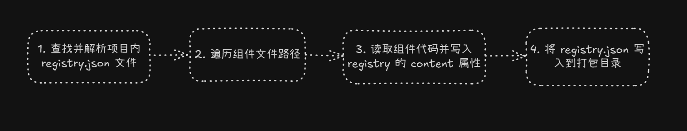
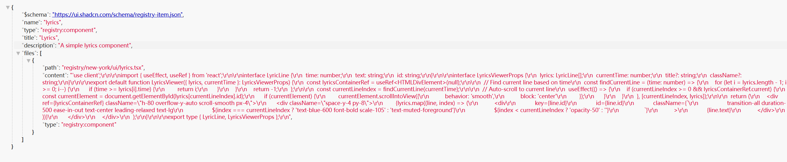

距离上一篇介绍`shadcn`文章已过去一年之久啦😅。在这一年多的时间内，随着`AI Generate Web`技术的快速发展，`shadcn`凭借其 AI 友好的组件开发模式，生态发展得极为庞大。`shadcn`本身也经过了一些架构调整，新增了一些特性，比如`add`命令支持第三方`registry`以及支持`build`命名等。本篇在解析`shadcn` CLI 的基础上详细介绍一下如何加入`shadcn`组件生态。

<!--truncate-->

## shadcn add

上一篇讲到`shadcn add`命令会默认从`shadcn`文档同域的地址获取`registry.json`文件，以解析`shadcn`组件库的组件目录结构和组件代码。当时`shadcn add`命令只支持通过定义`process.env.COMPONENTS_REGISTRY_URL`来自定义`registry.json`的域，这种方式最大的局限性就是在使用的时候只能指定一个第三方域的地址，当你要使用`shadcn add`添加不同域的组件时，就要不断修改`process.env.COMPONENTS_REGISTRY_URL`。

所以`shadcn add`命令最大的改进就是支持通过`components`参数来指定要添加的组件的地址，这样第三方组件就能通过本地编写`registry.json`自由地将自己的某个单一的组件或者整个组件库分享出去。

支持这一特性的代码也很简单，如下所示，在`add`命令执行的第一步([源码](https://github.com/shadcn-ui/ui/blob/97a8de1c1b2ae590cc9dbe17970a882990c35a59/packages/shadcn/src/commands/add.ts#L90))会判断`components`是否为一个`URL`，如果是则请求该`json`内容。

```typescript
const options = addOptionsSchema.parse({
  components,
  cwd: path.resolve(opts.cwd),
  ...opts,
})

let itemType: z.infer<typeof registryItemTypeSchema> | undefined
let registryItem: any = null

if (
  components.length > 0 &&
  // 判断 add 命令的第一个参数是否为 url
  (isUrl(components[0]) || isLocalFile(components[0]))
) {
  registryItem = await getRegistryItem(components[0], "")
  itemType = registryItem?.type
}
```

`isUrl`判断是否为远端地址

```typescript
function isUrl(path: string) {
  try {
    new URL(path)
    return true
  } catch (error) {
    return false
  }
}
```

如果是远端地址，则`fetch`请求`json`，获取`json`内容定义的组件源码等内容，后面就跟上一篇的介绍的流程大体一致，就不多赘述了。

```typescript
function getRegistryItem(name: string, style: string) {
  try {
    ...
    
    // Handle URLs and component names
    const [result] = await fetchRegistry([
      isUrl(name) ? name : `styles/${style}/${name}.json`,
    ])

    return registryItemSchema.parse(result)
  } catch (error) {
    logger.break()
    handleError(error)
    return null
  }
}
```

## shadcn build

`shadcn build`是`shadcn`在[`2.3.0`](https://github.com/shadcn-ui/ui/commit/cb742e98252fe8aa5cad3377d06e1d8a884953db)中新增的命名，用来构建`registry.json`文件，也就是让你的组件库支持使用`shadcn add`命令添加到其他项目内部。

`shadcn build`命令的逻辑非常简单（[源码位置](https://github.com/shadcn-ui/ui/blob/19d7fbb73175ab1ec7db9f8454572625dff3f79f/packages/shadcn/src/commands/build.ts#L18)）总结来说就分为 4 步：



### 查找并解析 registry.json

该命令默认会从项目根目录获取`registry.json`文件，也可以通过`registry`和`cwd`参数来指定`registry.json`文件的路径（一般用于`monorepo`项目）。

```typescript
const options = buildOptionsSchema.parse({
  cwd: path.resolve(opts.cwd),
  registryFile: registry,
  outputDir: opts.output,
})

// 检查指定的目录是否存在，并返回解析后的本地 registry.json 和输出文件目录绝对路径
const { resolvePaths } = await preFlightBuild(options)
// 读取 registry.json
const content = await fs.readFile(resolvePaths.registryFile, "utf-8")

// 使用 zod 校验 registry.json 的结构是否符合 registry schema 结构
// https://ui.shadcn.com/schema/registry-item.json
const result = registrySchema.safeParse(JSON.parse(content))

if (!result.success) {
  logger.error(
    `Invalid registry file found at ${highlighter.info(
      resolvePaths.registryFile
    )}.`
  )
  process.exit(1)
}
```

该命名使用`zod`进行`registry.json`结构的校验，判断其是否符合`shadcn`约束的定义结构。`shadcn`官方对于`registry.json`的约束，可以在`shadcn`的文档中查看——[`registry.json`](https://ui.shadcn.com/docs/registry/registry-json)，这里就不一一介绍了。

### 遍历文件路径

根据`registry.json`中注册的`items`字段，可以找到定义项目内部组件的文件路径字段`files`，这些在`shadcn`的文档中都有详细介绍，参考这里[`registry-item.json`](https://ui.shadcn.com/docs/registry/registry-item-json)

```typescript
for (const registryItem of registry.items) {
  ...
}
```

### 读取组件代码并写入到`registry.json`中

`shadcn build`这个命令主要就是为了将组件源码写入到`registry.json`中，从而使得第三方开发者在为自己的组件库编写`registry.json`时无需将组件源码写入`registry.json`，避免繁琐的流程。

```typescript
for (const registryItem of result.data.items) {
  if (!registryItem.files) {
    continue
  }

  for (const file of registryItem.files) {
    file["content"] = await fs.readFile(
      path.resolve(resolvePaths.cwd, file.path),
      "utf-8"
    )
  }
}
```

### 将registry.json写入输出目录

`build`命令最后默认将`registry.json`内容写入到项目根目录的`public`目录下，这样做的目的主要是因为现在大部分的组件开发框架都会将`public`目录做为默认的静态不编译文件目录，在项目打包的时候支持拷贝目录内部的文件到打包目录下。如果一个组件库会发布文档网站，那么`registry.json`就可以直接在文档网站的域内访问到，也不用为`registry.json`再单独折叠其他域名地址了。

当然`build`命令也支持使用`output`参数修改`registry.json`写入的目录路径。

```typescript
await fs.writeFile(
  path.resolve(resolvePaths.outputDir, `${registry.name}.json`),
  JSON.stringify(result.data, null, 2)
)
```

## 加入shadcn生态

如果你想编写一个组件或者组件库，让其支持`shadcn`的生态，能够使用`shadcn add`命令在各个项目之间共享，最简单的方式是基于`shadcn`提供的[`nextjs`模板项目](https://github.com/shadcn-ui/registry-template-v4)直接开发。

你可以直接在 GitHub 上基于这个模板项目创建仓库并克隆到本地直接开始开发你的组件，这个项目的结构如下所示：

```shell
├── 📄 README.md
└── 📂 app/                          // nextjs 的路由文件，用来编写组件开发文档
│  ├── 📄 favicon.ico
│  ├── 📄 globals.css
│  ├── 📄 layout.tsx
│  ├── 📄 page.tsx
└── 📂 components/                   // 第三方通用组件，使用 shadcn add 添加其他第三方组件辅助开发
├── 📄 components.json
│  ├── 📄 open-in-v0-button.tsx
└── 📂 lib/
│  ├── 📄 utils.ts
└── 📂 public/                        // 输出组件注册的 registry.json 文件，构建文档的时候会直接拷贝
│  └── 📂 r/
│    ├── 📄 hello-world.json
└── 📂 registry/                      // 组件存放目录
│  └── 📂 new-york/
│    └── 📂 blocks/                   // 块级复杂组件
│      └── 📂 hello-world/
│        ├── 📄 hello-world.tsx
│    └── 📂 ui/                       // 单个组件
│      ├── 📄 button.tsx
└── 📄 tsconfig.json
├── 📄 registry.json                   // 注册组件，必须自己编写
```

当你在编写完组件`push`到 GitHub 后，可以直接在 Vercel 上绑定你的仓库并构建发布。

然后别人就能通过 Vercel 给你分配的域名地址或者你自定义的域名地址访问到你开发的组件的`registry.json`，并且使用`shadcn add`命令添加你开发的组件到本地。

基于`shadcn`这套流程最大的便捷之处就是你无需去选择工具打包你的组件库，你只需要编写好组件的`registry.json`即可。

## 参考项目

[歌词组件仓库](https://github.com/wood3n/shadcn-lyrics)

使用 Vercel 导入项目并一键部署，现在就可以使用访问[我的歌词组件的`registry.json`文件](https://shadcn-lyrics.vercel.app/r/lyrics.json)了，并且支持在项目中使用`shadcn add https://shadcn-lyrics.vercel.app/r/lyrics.json`来添加组件。


