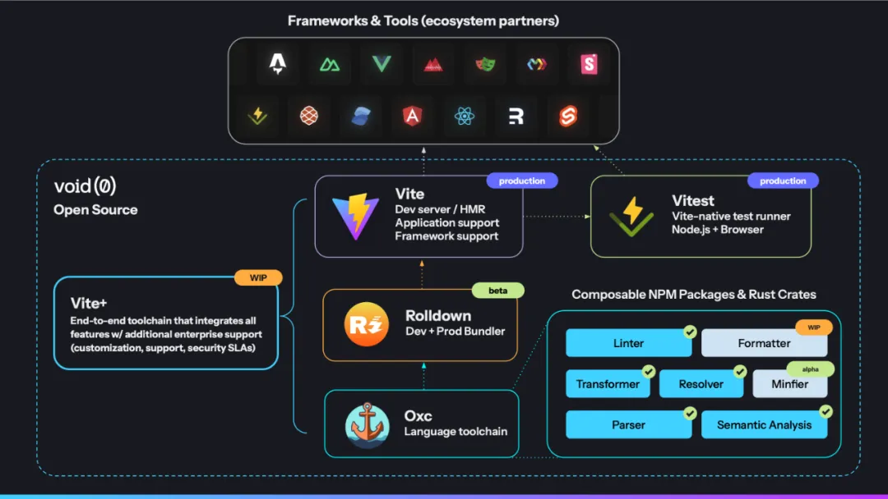
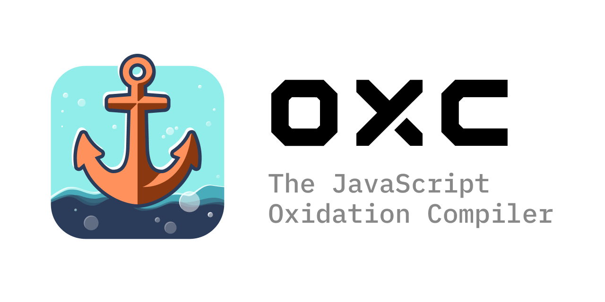
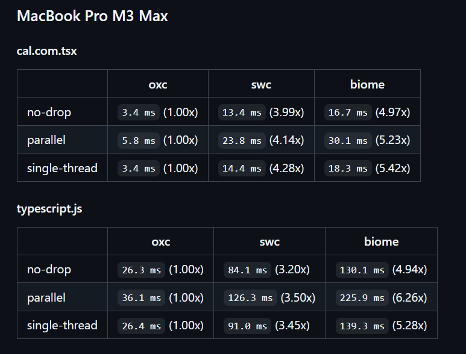
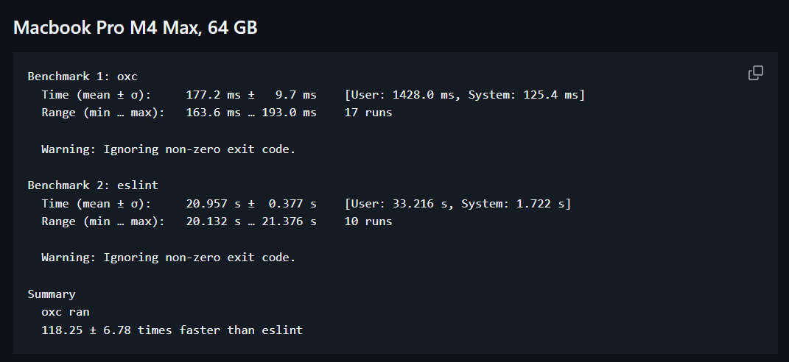
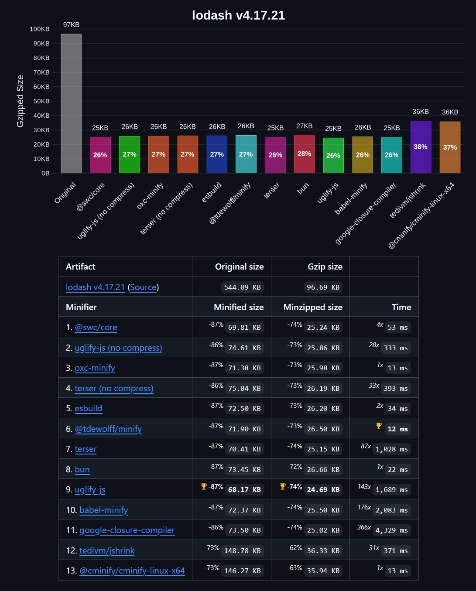
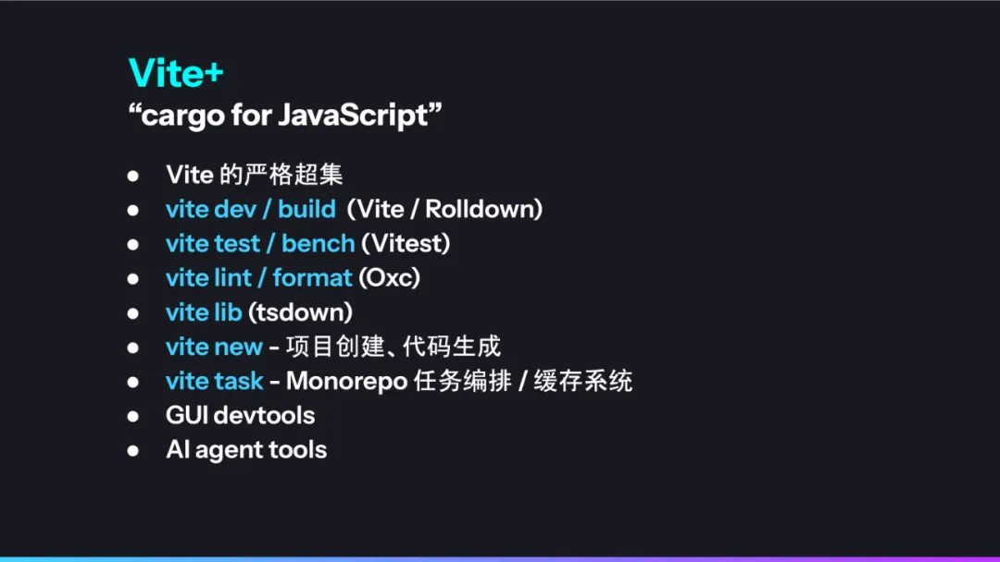
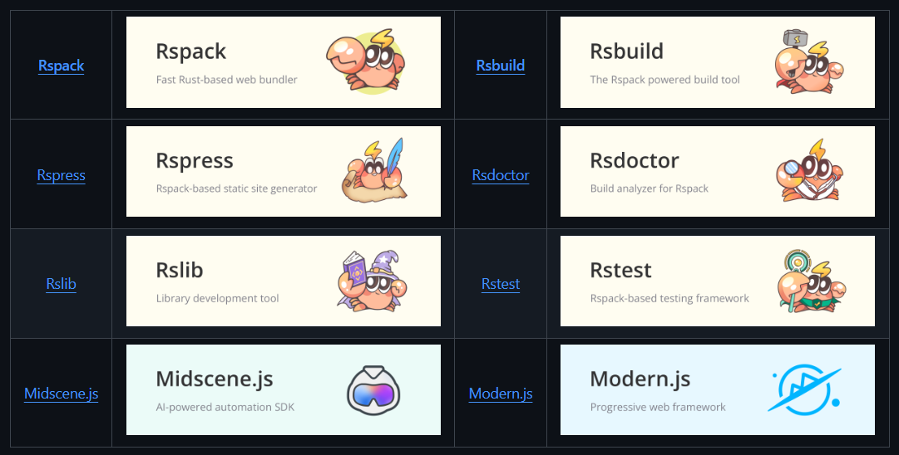
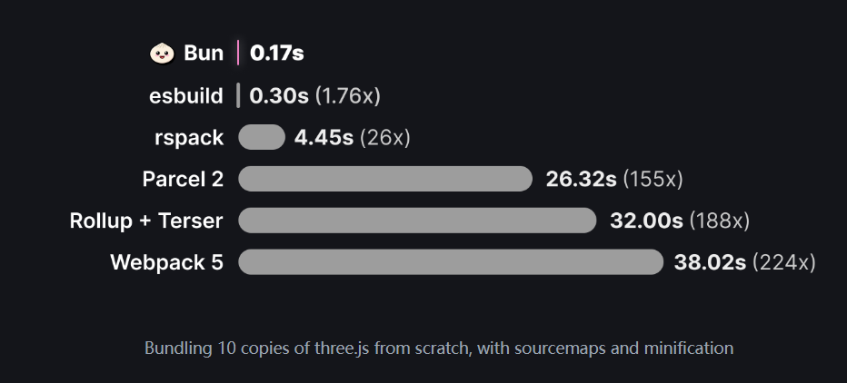

在目前火热的 AI Coding 概念的背后，前端工具链生态也在蓬勃发展。目前新一代工具如`Vite`、`Bun`、 `Rspack`等已经不局限于只做`Webpack`那样的打包工具，而是围绕性能、开发体验和可扩展性构建完整的前端工具解决方案，各自形成了独特的技术路线与社区氛围。在这篇文章中，我将浅显得对比 Rspack、Vite 与 Bun 的生态布局，并在后续持续关注并更新这篇文章的内容。

<!--truncate-->

## Vite 生态

Vite 于 2020 年发布，当时主要是为了解决 Webpack 在大型项目中启动和热更新慢的问题。Vite 过去 5 年发展迅速，到现在已经攀升为了 No.1 的前端构建工具。


Vite 目前主要是由 [VoidZero](https://voidzero.dev/) 公司成员维护，这家公司是尤雨溪在 2024 年创立，目前主要工作就是维护`Vite`、`Vitest`、`Rolldown`、`OXC`这些项目。VoidZero 的愿景是使用 Rust 开发语言重塑前端工具链。下面总结一下 VoidZero 基于 Rust 的生态工具以及目前的进展。



### OXC

[OXC](https://oxc.rs/docs/guide/introduction.html)，全称 JavaScript Oxidation Compiler，它是一个使用 Rust 语言开发的 JS 工具集合，包含 `Parser`（JS 代码解析）, `Linter`（代码检查工具）, `Formatter`（格式化工具）, `Transpiler`（转译器）, `Minifier`（代码压缩）等。

OXC 的工具全部使用 Rust 语言编写，旨在替代 Babel，Acorn 这一类传统的 JS 代码解析工具，极大地提升了解析和编译 JS 代码的速度。此类工具还有目前相对更加成熟的 [SWC](https://swc.nodejs.cn/) 。



#### oxc-parser

[oxc-parser](https://www.npmjs.com/package/oxc-parser)是一个代码解析器，它能够将`.js`、`.jsx`代码解析成符合[`estree`](https://github.com/estree/estree)规范的 AST，或者将`.ts`、`.tsx`代码解析成符合[`typescript-estree`](https://typescript-eslint.io/packages/typescript-estree/)规范的 AST，可以在该官方提供的[Playground](https://playground.oxc.rs/#eNo9j02OwzAIRu/COouZkWaT9ajbqdoTEIdUlhyIAPdHVe9e3ChZGSx47+MJCXqADgT6J2jl9tiDHe/Qu1bqoGT2rbYkC+3NYx6kbJ0rsk2iM/QTFqNXBwuqkTYiliK3E3lV/q9ueaRD5eRZwreuL0oxe6UjKrGtv4Fo8g8i6t2wMh31QpEMyH6+vn/jhmxS0Gn8o1RQseGDtKVJMtKFPgcS41DoLFUTzbjstjlznvLmS8KuUg4RvS1dSQexuH4FtkAhR3N4vQFbSnP4)中测试生成的 AST。

在`oxc-parser`提供的 benchmark 测试中显示出了卓越的性能，**速度为目前使用更多的`swc`的 3 倍以上**，具体请查看该仓库:[bench-javascript-parser-written-in-rust](https://github.com/oxc-project/bench-javascript-parser-written-in-rust).



#### oxc-walker

[`oxc-walker`](https://www.npmjs.com/package/oxc-walker)可以解析代码，并提供了一些方法用来遍历 AST 节点，节点类型可以从[`@oxc-project/types`](https://github.com/oxc-project/oxc/blob/main/npm/oxc-types/types.d.ts)获取。如果你需要对 AST 进行遍历然后修改节点，可以使用这个工具。

```typescript
import { parseAndWalk } from 'oxc-walker'

const nodes = []
parseAndWalk('console.log("hello world")', 'test.js', {
  enter(node) {
    nodes.push(node)
  },
})

console.log(nodes)
```

#### oxc-transform

[`oxc-transform`](https://oxc.rs/docs/guide/usage/transformer.html)类似于`@babel/core`的`transform`方法，将`.jsx`，`.ts`以及`.tsx`代码转换为标准的 JS 代码，或者将最新 ECMAScript 语法（如 ES2024）编写的代码转换成旧版本（如 ES6），目前最低支持转换成 ES6 的版本。同时，`oxc-transform`还支持生成 TS 代码的`.d.ts`定义文件。

```typescript
import { transform } from 'oxc-transform';

const result = transform('test.ts', 'const foo: any = a ?? b;', {
  target: 'es2018',
});

console.log(result);
```

#### oxlint

[`oxlint`](https://oxc.rs/docs/guide/usage/linter.html)是一个代码格式检查工具，旨在替换性能堪忧的 ESLint。

根据`oxlint`的 [benchmark](https://github.com/oxc-project/bench-javascript-linter) 显示，`oxlint`的速度是 ESLint 的 50~100 倍。



`oxlint`于 2025-06-10 发布了第一个稳定版本 `1.0`，目前可以在中小型项目中完全替换 ESLint，像 Shopify、Airbnb 等一些企业项目已经着手接入了。如果你想替换 ESLint，可以使用 `@oxlint/migrate` 这个工具来快速迁移。

`oxlint` 使用 `.oxlintrc.json` 文件配置，其 API 基本和 ESLint v9 的配置一致，例如`ignorePatterns`、`globals`、`settings`、`plugins`以及`rules`等。对于常见的 `typescript`、`react`、`import` 等插件也在开发支持中，具体进度可以查看 [oxlint plan](https://github.com/oxc-project/oxc/issues/481).

:::info[最新进展]

`oxlint` 于 2025/8/17 日宣布支持已集成 typed linting 功能。

:::

使用 Rust 重写 Lint 工具的一大挑战就是，基于 TS 类型信息来进行更复杂的代码检查—— [typed-linting](https://typescript-eslint.io/troubleshooting/typed-linting)，例如 `typescript-eslint` 中具有的以下规则：

- [`@typescript-eslint/await-thenable`](https://typescript-eslint.io/rules/await-thenable)：不允许对非`Thenable`函数使用`await`；
- `@typescript-eslint/no-floating-promises`：安全处理`Promise`的错误等；
- `@typescript-eslint/no-for-in-array`：不允许使用`for...in`循环迭代数组；

`oxlint` 在 `typescript-eslint` 开发的 `tsgolint` 基础上 fork 并维护 `oxlint` 版本的类型检查工具 `oxlint-tsgolint`（`tsgolint` 后续可能会不再维护了）。

`oxlint-tsgolint` 目前在大型 monorepo 上仍然存在性能瓶颈，OXC 团队正着手解决。

#### oxc formatter

Formatter 方面进展相对缓慢，目前 OXC 仅实现了一个 Prettier 插件：[`@prettier/plugin-oxc`](https://github.com/prettier/prettier/tree/main/packages/plugin-oxc)，其内部使用了 `oxc-parser` 提升格式化代码的速度。未来 OXC 目标是完全移植 Prettier 这样的工具，来进一步提升性能。

#### oxc-minify

[`oxc-minify`](https://oxc.rs/docs/contribute/minifier.html) 是一个代码压缩工具，旨在替换 Terser，目前能够和 esbuild 相媲美。

根据 [benchmark](https://github.com/privatenumber/minification-benchmarks) 显示 `oxc-minify` 与性能排名第一的 `@swc/core` 只在某些显示库（`d3`，`echarts`等）的压缩表现中存在非常微小的差距，具体请查看 benchmark 仓库中详细的对比。



#### oxc-resolver

[oxc-resolver](https://github.com/oxc-project/oxc-resolver) 是一个模块路径解析工具，旨在替换 Webpack 使用的 `enhanced-resolve`。

根据 [benchmark](https://github.com/oxc-project/bench-resolver) 显示其速度为 `enhanced-resolve` 的 17 倍以上。

并且 `oxc-resolver` 内置 `tsconfig-paths-webpack-plugin`，能够自动对 `tsconfig` 中配置的 `paths` 进行解析。

### Rolldown

[`Rolldown`](https://rolldown.rs/guide/)，基于 OXC 项目，用于打包前端应用或者库，对标 Rollup。

Vite 目前使用 esbuild 进行依赖预打包，使用 Rollup 进行生产构建。Rolldown 的目标是将这两个过程统一到一个高性能的打包工具中，以降低复杂性。

Rolldown 提供了与 Rollup 高度兼容的 API（尤其是插件接口），并且具有类似的 treeshaking 功能以优化 bundle 大小。但是，Rolldown 的功能范围与 esbuild 更相似，并内置了以下[附加功能：](https://rolldown.rs/guide/features)

- Platform presets
- `ts`、`.tsx`代码转换
- Node.js 兼容模块解析
- ESM / CJS 模块互操作
- `define`
- `inject`
- CSS 打包（实验性）
- 代码压缩（开发中）

Rolldown 还有一些在 esbuild 中有相近概念但在 Rollup 中不存在的功能：

- [模块类型](https://rolldown.rs/guide/features#module-types)（实验）
- [插件钩子过滤器](https://rolldown.rs/guide/plugin-development#plugin-hook-filters)

最后，Rolldown 提供了一些 esbuild 和 Rollup 没有实现的功能：

- [Chunk Splitting](https://rolldown.rs/guide/features#advanced-chunks)（实验）
- 支持 HMR（开发中）
- Module Federation，模块联邦（计划中）

### tsdown

[`tsdown`](https://tsdown.dev/zh-CN/guide/) 是基于 Rolldown 开发的一个 library 打包工具，旨在替换 [`tsup`](https://github.com/egoist/tsup)。`tsup` 目前已不再积极维护，其仓库页面介绍也推荐迁移到 `tsdown`。

`tsdown` 在 Rolldown 基础上简化了一些配置，专用于打包库。例如其支持：

1. 支持生成`.d.ts`定义文件；
2. 支持生成库的多种格式，`esm`、`cjs`，`iife`以及`umd`等；
3. 支持处理非代码资产，如 `.json` 或 `.wasm` 文件等；
4. 支持 [`unbundle mode`](https://tsdown.dev/options/unbundle)，也就是 `bundleless`，仅转换模块的代码而不打包；
5. 支持 `tsconfig` 的 `isolatedDeclarations` 属性，为每个 TS 文件独立地生成 `.d.ts` 文件。

### Vitest

Vitest 是基于 Vite 的代码测试工具，旨在替换 Jest。相信大多数人在使用 Jest 测试 TS+React 项目时都会遇到各种各样复杂的坑，尤其是`Jest`在处理 ES Module 以及 TypeScript 模块时让人头疼的配置。Vitest 可能就是你的迁移选择。

Vitest 相比 Jest 存在以下优势：

1. Vite 项目能直接使用，测试环境能重用同一套解析/插件规则等，不需要再折腾配置测试工具；
2. 速度更快吗，基于 Vite 的按需编译与缓存，`watch` 模式下改一行代码看到测试结果的等待更短；
3. 内置 ES Module 和 TS、TSX 的支持，无需像 Jest 那样频繁折腾 Babel 或 SWC 配置来让 TS 测试顺利跑起来；
4. 多进程/worker 并行执行测试，执行测试更快。

从使用量来看，Vitest 正稳步增长，快速追赶 Jest。


### VitePress

[VitePress](https://vitepress.dev/zh/guide/what-is-vitepress) 是基于 Vite 的文档开发工具，使用 VUE 作为渲染框架。

### Vite+

Vite+ 是以 Vite 为核心的一系列生态工具，目的是解决 JS 工具散落冗余的问题。也就是你在开发项目的时候，使用 Vite 不需要再去关心如何选择构建工具，测试工具，Linter，Formatter等问题。



## Rstack

Rstack 是由 Bytedance Web Infra 团队维护的围绕`Rspack`打造的 JS 统一工具链。`Rstack`生态的工具品牌风格比较统一，一般使用英文字母`rs`前缀命名，图标都是一个卡通的小螃蟹拿着不同的工具。



### SWC

Rstack 生态的基石就是 [SWC](https://swc.rs/docs/getting-started)。SWC 和 OXC 类似，是基于 Rust 语言开发的一个编译器项目，包含一系列编译和转换 JS 代码的工具。

#### @swc/core

[`@swc/core`](https://swc.rs/docs/usage/core)提供 Parser、Tranformer 以及代码压缩 Minifier 的功能，支持 JS 和 TS 以及 TSX 代码。

1. 支持同步或者异步解析 JS 代码生成 AST；
2. 支持同步或者异步转换高版本的 JS 代码到最低 ES3 版本；
3. 支持同步或者异步压缩 JS 代码。

#### @swc/wasm-web

`@swc/wasm-web`使用 WebAssembly 在浏览器内同步转换代码。

#### @swc/html

`@swc/html`负责对 HTML 代码进行压缩。

### Rspack

[Rspack](https://rspack.rs/zh/guide/start/quick-start) 基于 Rust 语言开发，底层使用 [SWC](https://swc.rs/) 来转换和压缩 JS 代码，API 基本对齐 Webpack，目标就是无缝替换 Webpack，提升在大型项目上的构建打包速度。

Rspack 于 2024/8/28 就发布了第一个稳定版本`1.0`，到目前差不多正好一年的时间。相比 Webpack，Rspack 提供 CLI 命令（例如`pnpm create rspack@latest`）用于直接创建项目，开箱即用，非常方便。

#### module解析

相比 Webpack，Rspack 内置了对`.js`、`.css`、`.json`、以及静态资源（图片、视频、字体）等模块类型的支持，对于`jsx`、`less`等其他模块类型可以自行配置。

#### plugins

Rspack 目前支持了大部分常用的 Webpack 插件，具体查看[Rspack-plugins的描述](https://rspack.rs/zh/plugins/)。

#### 其他功能

对于 Webpack 的一些特性，例如 Module Federation、Lazy compilation、Chunk Splitting 以及 Tree shaking 等也都已经支持。

### Rsbuild

[Rsbuild](https://rsbuild.rs/zh/guide/start/) 是基于 Rspack 开发，专门构建 Web 应用的工具。Rsbuild 根据不同的 UI 框架（React、VUE等）预设了部分 Rspack 的配置项，通过使用 Rsbuild CLI 能一行命令创建项目并开箱即用，省去了配置构建工具的繁琐步骤，这点和 Vite 一样。

### Rslib

[Rslib](https://rslib.rs/zh/guide/start/) 是基于 Rspack 的库构建工具。提供以下特性：

1. CLI 命令直接创建库项目，开箱即用；
2. 内置对几乎所有模块类型的支持，常见的`jsx`，`css`，`less`以及图片，视频，字体等全都默认支持；
3. 支持生成库的多种格式，`esm`、`cjs`，`iife`以及`umd`等；
4. 支持`bundleless`模式；
5. 支持`isolatedDeclarations`；
6. 支持模块联邦开发，也就是打包成一个独立的模块；
7. 支持 Storybook。

### Rspress

[Rspress](https://rspress.rs/zh/guide/start/introduction#%E4%B8%BA%E4%BB%80%E4%B9%88%E9%80%89%E6%8B%A9-rspress) 是一个基于 Rsbuild 的静态站点生成器，基于 React 框架进行渲染，内置了一套默认的文档主题。

相比 React 生态的 Docusaurus 来说，Rspress 使用了基于 Rust 开发了 Markdown 编译器`mdx-rs`，编译文档的速度更快。

Rspress 还提供以下特性：

1. 根据文档目录自动生成布局；
2. 多版本文档展示；
3. 内置对全部文档内容的搜索；
4. 提供组件的预览和 Playground 功能，并且支持移动端组件的预览。

### Rstest

[Rstest](https://rstest.rs/zh/guide/start/) 是一个基于 Rspack 的测试框架，提供兼容 Jest 的 API，内置对 TypeScript、ESM 的支持，目前处于开发阶段，暂未发布稳定版本。

### Rsdoctor

`Rsdoctor`是一个项目构建分析工具，对编译、构建过程以及依赖等信息提供可视化的图表和信息展示，具体功能请查看 [Rsdoctor 的文档](https://rsdoctor.rs/zh/guide/usage/project-overall)。

## Bun

[Bun](https://bun.com/) 使用 Zig 语言开发的 JS 运行时，类似于 Nodejs，但是它本身内置了一套开发、测试、运行和打包 JS、TS 项目的工具。Bun 兼容 Nodejs 生态，**旨在取代 Node.js、NPM、Webpack 等多个工具，成为一个完整、高效的 JavaScript 运行时**。

Bun 目前具有以下优势：

1. 启动速度快，Bun 使用 JavaScriptCore 引擎，官方文档显示启动速度目前[比 Node.js 快 4 倍](https://twitter.com/jarredsumner/status/1499225725492076544)；
2. 安装包的速度快，Bun 的包管理器是原生实现的，提供类似于 NPM 一样的依赖管理命令，如 `bun add`、`bun install` 等，但是其速度远远超过 NPM、PNPM 这些包管理工具， `bun install` 的速度为 `npm install` 的 **25** 倍以上；
3. Bun 实现了标准的 Web API，例如`fetch`、`WebSocket`和`ReadableStream`，并且致力于完全兼容内置的 Node.js 全局变量（`process`、`Buffer`）和模块（`path`、`fs`、`http`等）；
4. Bun 内置对大量模块类型的解析，如 ES Module，JSX，TS，HTML，CSS，WASM 等；
5. Bun 内置打包器，使用`bun build`命令能直接构建打包项目，官方文档显示其性能非常优秀：



6. Bun 内置测试工具，使用`bun test`能直接测试 JSX，TS 等模块代码，同时还支持快照测试，DOM 测试以及 Watch 模式等，非常方便。Bun 的目的是兼容 Jest，但是目前仍有一些功能尚未实现。

总而言之，Bun 将多个工具整合到了它的运行时中，使用 Bun 则不需要单独安装和配置不同的构建、测试工具。

