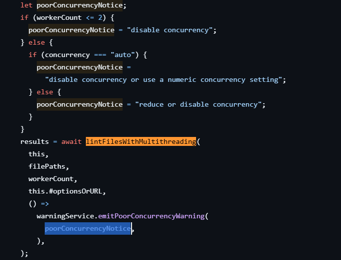

ESLint 于 2025/08/15 日合并了一个 PR：[feat: multithread linting](https://github.com/eslint/eslint/pull/19794)，这个 PR 解决了一个[长达十年之久的 issue](https://github.com/eslint/eslint/issues/3565)，是一个非常大的优化项。下面一起来看下这个 PR 改动了什么。

<!--truncate-->

## PR 改动

在 [feat: multithread linting](https://github.com/eslint/eslint/pull/19794) 这个 PR 改动的文件中，主要改动如下：

1. [ESLint nodejs api](https://eslint.org/docs/latest/integrate/nodejs-api) 新增 `concurrency` 属性；
2. [ESLint CLI](https://eslint.org/docs/latest/use/command-line-interface) 新增 `concurrency` 参数；
3. `concurrency` 可以设置为 `off`、`auto` 和一个数字；默认值为 `off`，也就是默认不启动多线程。

根据这个 PR 开发者的描述，启动多线程可以让 ESLint 在大型项目多个文件的速度表现上提升 30% 以上，虽然比不上用 Rust 或者 Go 编写的下一代 Lint 工具，但是相较于 ESLint 本身是非常大的提升了。

## 何时可用

截止到这篇文章的时间，ESLint 目前最新的版本 `9.33.0` 尚未包含这个 PR 改动的内容，我估计等下个版本 ESLint 就会包含这项改动了，也就是 `9.34.0` 版本。

## ESLint 是如何计算 worker 线程数的

根据 PR 改动的代码细节，找到了 `lib/eslint/eslint.js` 这个文件中根据设置的 `concurrency` 对 worker 线程计算的方法，[在 287 行](https://github.com/eslint/eslint/blob/676f4acaaed6e4f6ffe0c2e21272d4702b311a7b/lib/eslint/eslint.js#L287)。

1. 当配置 `concurrency: auto` 时，会使用 Node 的 `os.availableParallelism()` 方法获取进程真正可用的最大并行度，会考虑**容器限制**（Docker、K8s 限制 CPU quota 的情况）；
2. 当配置 `concurrency` 为一个数字时，会对比 `concurrency` 和 lint 文件数量，去最小值；
3. 当计算出使用多少个 worker 时，就会使用 `node:worker_threads` 模块的 `Worker` 创建多个 `worker` 实例。

```typescript
/**
 * 计算使用多少个 worker
 * @param {number | "auto" | "off"} concurrency The normalized concurrency setting.
 * @param {number} fileCount The number of files to be linted.
 * @param {{ availableParallelism: () => number }} [os] Node.js `os` module, or a mock for testing.
 * @returns {number} The effective number of worker threads to be started. A value of zero disables multithread linting.
 */
function calculateWorkerCount(
	concurrency,
	fileCount,
	{ availableParallelism } = os,
) {
	let workerCount;
	switch (concurrency) {
		case "off":
			return 0;
		case "auto": {
			workerCount = Math.min(
				availableParallelism() >> 1,
				Math.ceil(fileCount / AUTO_FILES_PER_WORKER),
			);
			break;
		}
		default:
			workerCount = Math.min(concurrency, fileCount);
			break;
	}
	return workerCount > 1 ? workerCount : 0;
}

/**
 * The smallest net linting ratio that doesn't trigger a poor concurrency warning.
 * The net linting ratio is defined as the net linting duration divided by the thread's total runtime,
 * where the net linting duration is the total linting time minus the time spent on I/O-intensive operations:
 * **Net Linting Ratio** = (**Linting Time** – **I/O Time**) / **Thread Runtime**.
 * - **Linting Time**: Total time spent linting files
 * - **I/O Time**: Portion of linting time spent loading configs and reading files
 * - **Thread Runtime**: End-to-end execution time of the thread
 *
 * This value is a heuristic estimation that can be adjusted if required.
 */
const LOW_NET_LINTING_RATIO = 0.7;

/**
 * 根据计算的 workerCount 创建多个 Worker 实例来实现多线程 Lint
 */
async function runWorkers(
	filePaths,
	workerCount,
	eslintOptionsOrURL,
	warnOnLowNetLintingRatio,
) {
	const fileCount = filePaths.length;
	const results = Array(fileCount);
	const workerURL = pathToFileURL(path.join(__dirname, "./worker.js"));
	const filePathIndexArray = new Uint32Array(
		new SharedArrayBuffer(Uint32Array.BYTES_PER_ELEMENT),
	);
	const abortController = new AbortController();
	const abortSignal = abortController.signal;
	const workerOptions = {
		env: SHARE_ENV,
		workerData: {
			eslintOptionsOrURL,
			filePathIndexArray,
			filePaths,
		},
	};

	const hrtimeBigint = process.hrtime.bigint;
	let worstNetLintingRatio = 1;

	/**
	 * A promise executor function that starts a worker thread on each invocation.
	 * @param {() => void} resolve_ Called when the worker thread terminates successfully.
	 * @param {(error: Error) => void} reject Called when the worker thread terminates with an error.
	 * @returns {void}
	 */
	function workerExecutor(resolve_, reject) {
		const workerStartTime = hrtimeBigint();
		const worker = new Worker(workerURL, workerOptions);
		worker.once(
			"message",
			(/** @type {WorkerLintResults} */ indexedResults) => {
				const workerDuration = hrtimeBigint() - workerStartTime;

				// The net linting ratio provides an approximate measure of worker thread efficiency, defined as the net linting duration divided by the thread's total runtime.
				const netLintingRatio =
					Number(indexedResults.netLintingDuration) /
					Number(workerDuration);

				worstNetLintingRatio = Math.min(
					worstNetLintingRatio,
					netLintingRatio,
				);
				for (const result of indexedResults) {
					const { index } = result;
					delete result.index;
					results[index] = result;
				}
				resolve_();
			},
		);
		worker.once("error", error => {
			abortController.abort(error);
			reject(error);
		});
		abortSignal.addEventListener("abort", () => worker.terminate());
	}

  // 使用 workerCount 创建 worker
	const promises = Array(workerCount);
	for (let index = 0; index < workerCount; ++index) {
		promises[index] = new Promise(workerExecutor);
	}
	await Promise.all(promises);

	if (worstNetLintingRatio < LOW_NET_LINTING_RATIO) {
		warnOnLowNetLintingRatio();
	}

	return results;
}
```

## 是否无脑开启多线程

`concurrency` 默认关闭，也就是你不应该无脑开启多线程，因为多线程的开销（创建/销毁 worker + 进程间通信）等也会增加 Lint 时长。

在上面创建 worker 中我们也可以看到 ESLint 会定义一个叫 `netLintingRatio` 的数值，用来计算 worker 的执行效率：
$$
Net Linting Ratio = (Linting Time – I/O Time) / Thread Runtime.
$$
当 `netLintingRatio` 小于 `LOW_NET_LINTING_RATIO: 0.7`，则表示当前多线程执行效率不高，会输出警告提示信息，提示应该禁用或者降低`concurrency` 的值。

