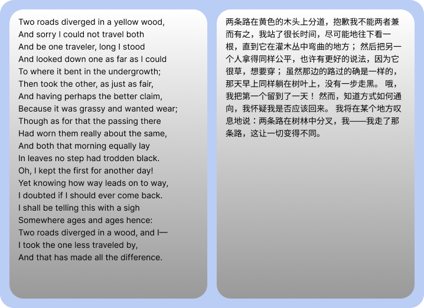

LanguageDetector 和 Translator 是分别基于 AI 来检测和翻译 Web 文本的 API，由 W3C 的机器学习社区组（[Web Machine Learning Community Group](https://www.w3.org/community/webmachinelearning/)）于 2025/02/17 日发布的[草案](https://github.com/webmachinelearning/translation-api)定义。该草案由 Chrome 内置 AI 团队的开发者 [Domenic Denicola](https://domenic.me/) 提出，目前也仅在 `Chrome >= 138` 版本才稳定支持（ `Chrome 131~137` 版本实验性支持）。下面就来探索下该 API 的使用。

<!--truncate-->

## API 介绍

### LanguageDetector

LanguageDetector 是用于语言文本检测的 API，对检测的文本提供符合 [BCP 47 language tag](https://en.wikipedia.org/wiki/IETF_language_tag#List_of_common_primary_language_subtags) 规范的结果，例如`en`、`zh`、`jp`等。

:::warning

LanguageDetector 仅在使用了 HTTPS 的网页中支持。

:::

#### availability()

使用`availability()`方法来检测 `LanguageDetector` API 的可用性。

```typescript
async LanguageDetector.availability(options)
```

`options`包含一个属性：

- `expectedInputLanguages: string[]`：必填，希望支持的多个语言标签，默认为`["en"]`参考 [BCP 47 language tag](https://en.wikipedia.org/wiki/IETF_language_tag#List_of_common_primary_language_subtags)。

`availability()`方法返回`Promise`字符串枚举值：

- `available`：支持；
- `downloadable`：支持，但是需要下载 AI 模型或者模型需要的数据；
- `downloading`：支持，但必须完成正在进行的下载才能继续；
- `unavailable`：不支持。

#### create()

使用`create`方法来创建一个 Language Detector 的实例，

```typescript
async LanguageDetector.create(options)
```

参数`options`包含三个属性：

- `expectedInputLanguages: string[]`：必填，预期检测文本符合的语言标签范围，有助于提高语言检测的准确性。默认为`["en"]`；
- `monitor: CreateMonitor`：[`CreateMonitor`](https://developer.mozilla.org/en-US/docs/Web/API/CreateMonitor)实例，用于监测下载 AI 模型或者数据的进度；
- `signal: AbortSignal`:[`AbortSignal`](https://developer.mozilla.org/en-US/docs/Web/API/AbortSignal)实例，用于中断检测。

`create()`方法返回 LanguageDetector 的实例对象，其包含两个属性和三个方法：

- `expectedInputLanguages: string[]`：使用 LanguageDetector 预期检测的语言标签范围数组，同传递给`create`方法的参数值；
- `inputQuota`：一个数字，表示`LanguageDetector`一次最大能检测的文本的配额，可能是受限于内存硬件限制或者 JS 最大可处理的字符串长度限制的数值；也可能是 AI 模型限制的 token 数量等。因为翻译或语言检测的输入可能过大，以至于底层 AI 模型无法处理，`inputQuota` 则有助于检测是否输入文本过长。

- `detect(input, options)`：异步方法，用于对文本进行检测，可传递`AbortSignal`参数来中断；返回一个对象数组，每个对象包含两个属性：

  - `detectedLanguage`：检测到的 BCP 语言标签；
  - `confidence`：匹配准确度，从`0~1`，数组元素的顺序会按照`confidence`从大到小排列，也就是最匹配的语言是返回的第一个元素，例如下面样啊

- `measureInputUsage(input, options)`：异步方法，检测给定文本输入的语言检测操作将使用多少输入配额；返回数值。只有当`measureInputUsage`返回的值小于`inputQuota`时，才能使用`detect`方法进行检测，否则会抛出`QuotaExceededError`异常；

- `destroy()`：销毁 LanguageDetector 实例。

### Translator

Translator API 用于语言翻译。

:::warning

Translator 仅在使用了 HTTPS 的网页中支持。

:::

#### availability()

使用`availability()`方法来检测 `Translator` API 的可用性。

```typescript
async Translator.availability(options)
```

`options`包含两个属性：

- `sourceLanguage: string`：必填，输入文本的预期语言标签，例如`en`；
- `targetLanguage: string`：必填，目标翻译语言标签，例如`zh`。

`availability()`方法返回`Promise`字符串枚举值：

- `available`：支持；
- `downloadable`：支持，但是需要下载 AI 模型或者模型需要的数据；
- `downloading`：支持，但必须完成正在进行的下载才能继续；
- `unavailable`：不支持。

#### create()

使用`create`方法来创建一个 Translator 的实例。

```typescript
async Translator.create(options)
```

参数`options`包含两个属性：

- `sourceLanguage: string`：必填，输入文本的预期语言标签，例如`en`；
- `targetLanguage: string`：必填，目标翻译语言标签，例如`zh`。
- `monitor: CreateMonitor`：[`CreateMonitor`](https://developer.mozilla.org/en-US/docs/Web/API/CreateMonitor)实例，用于监测下载 AI 模型或者数据的进度；
- `signal: AbortSignal`:[`AbortSignal`](https://developer.mozilla.org/en-US/docs/Web/API/AbortSignal)实例，用于中断翻译。

`create()`方法返回 Translator 的实例对象，其包含三个属性和三个方法：

- `sourceLanguage: string`：输入文本的预期语言标签；
- `targetLanguage: string`：目标翻译语言标签；
- `inputQuota`：一个数字，表示`Translator`一次最大能翻译的文本的配额。

- `translate(input, options)`：异步方法，用于对文本进行翻译，可传递`AbortSignal`参数来中断；返回翻译后的字符串。
- `translateStreaming(input, options)`：异步方法，生成输入字符串的翻译流，返回一个`ReadableStream`对象。
- `measureInputUsage(input, options)`：异步方法，检测给定文本输入的翻译操作将使用多少输入配额；返回数值。只有当`measureInputUsage`返回的值小于`inputQuota`时，才能使用`translate`方法进行翻译，否则会抛出`QuotaExceededError`异常；
- `destroy()`：销毁 Translator 实例。

## 为什么需要 LanguageDetector 和 Translator

LanguageDetector 和 Translator 由 [Chrome 内置 AI](https://developer.chrome.com/docs/ai/built-in?hl=zh-cn) 开发团队推动，Chrome 内置 AI 的能力是一种客户端 AI。传统稳定的翻译方式一般将事先完成的网站翻译内容存储于云端，或者使用在线 API 进行实时翻译，而客户端 AI 驱动的翻译能从以下几个方面带来收益：

- **敏感数据的本地处理**：客户端 AI 可以提升您的隐私保护能力。例如，如果您处理的是敏感数据，可以向用户提供采用端到端加密的 AI 功能。
- **流畅的用户体验**：在某些情况下，无需往返服务器即可提供近乎即时的结果。客户端 AI 可以决定功能是否可行，以及用户体验是否理想。
- **更好地利用 AI**：用户的设备可以承担部分处理负荷，从而更好地利用各项功能。例如，如果您提供高级 AI 功能，则可以使用客户端 AI 预览这些功能，以便潜在客户了解您产品的优势，而您无需支付额外费用。这种混合方法还可以帮助您管理推理费用，尤其是在经常使用的用户流上。
- **离线使用 AI**：即使没有网络连接，用户也可以使用 AI 功能。这意味着您的网站和 Web 应用可以在离线状态下或在连接状况不稳定的情况下正常运行。

当然另一方面，Chrome 开发团队为了扩大 Chrome 的影响力和推广 Google 的云业务，也是努力将 Chrome 内置 AI 的这些 API 进行 W3C 标准化。

## 使用

### TypeScript 类型

LanguageDetector 和 Translator 目前尚未在 TypeScript 类型中支持，因此需要本地项目中自定义：

```typescript
interface Window {
  LanguageDetector: LanguageDetectorConstructor;
  Translator: TranslatorConstructor;
}

interface LanguageDetectorConstructor {
  availability(options: {
    expectedInputLanguages: string[];
  }): Promise<"available" | "downloadable" | "downloading" | "unavailable">;
  create(options?: LanguageDetectorOptions): Promise<LanguageDetectorInstance>;
}

interface TranslatorConstructor {
  availability(options: {
    sourceLanguage: string;
    targetLanguage: string;
  }): Promise<"available" | "downloadable" | "downloading" | "unavailable">;
  create(options: TranslatorOptions): Promise<TranslatorInstance>;
}

interface LanguageDetectorOptions {
  /**
   * 预期检测文本符合的语言标签范围
   * 提高语言检测的准确性
   */
  expectedInputLanguages: string[];
  /**
   * 用于监测下载 AI 模型或者数据的进度
   */
  monitor?: CreateMonitor;
  /**
   * 用于中断检测
   */
  signal?: AbortSignal;
}

interface LanguageDetectionResult {
  /**
   * 检测到的 BCP 语言标签
   */
  detectedLanguage: string;
  /**
   * 匹配准确度，从 0 到 1
   */
  confidence: number;
}

interface TranslatorOptions {
  /**
   * 输入文本的预期语言标签
   */
  sourceLanguage: string;
  /**
   * 目标翻译语言标签
   */
  targetLanguage: string;
  /**
   * 用于监测下载 AI 模型或者数据的进度
   */
  monitor?: CreateMonitor;
  /**
   * 用于中断翻译
   */
  signal?: AbortSignal;
}

interface TranslatorInstance {
  /**
   * 输入文本的预期语言标签
   */
  sourceLanguage: string;
  /**
   * 目标翻译语言标签
   */
  targetLanguage: string;
  /**
   * 一次最大能翻译的文本配额
   */
  inputQuota: number;
  /**
   * 翻译输入文本
   * @param input 要翻译的文本
   * @param options 可选参数，包括中断信号
   * @returns 翻译后的字符串
   */
  translate(input: string, options?: { signal?: AbortSignal }): Promise<string>;
  /**
   * 生成输入字符串的翻译流
   * @param input 要翻译的文本
   * @param options 可选参数，包括中断信号
   * @returns 翻译流的 ReadableStream 对象
   */
  translateStreaming(input: string, options?: { signal?: AbortSignal }): ReadableStream<string>;
  /**
   * 检测翻译操作将使用多少输入配额
   * @param input 要检测的文本
   * @param options 可选参数，包括中断信号
   * @returns 使用的配额数值
   */
  measureInputUsage(input: string, options?: { signal?: AbortSignal }): Promise<number>;
  /**
   * 销毁 Translator 实例
   */
  destroy(): void;
}

interface LanguageDetectorInstance {
  /**
   * 预期检测文本符合的语言标签范围
   */
  expectedInputLanguages: string[];
  /**
   * 一次最大能检测的文本配额
   */
  inputQuota: number;
  /**
   * 检测输入文本的语言
   * @param input 要检测的文本
   * @param options 可选参数，包括中断信号
   * @returns 检测结果数组
   */
  detect(input: string, options?: { signal?: AbortSignal }): Promise<LanguageDetectionResult[]>;
  /**
   * 检测语言检测操作将使用多少输入配额
   * @param input 要检测的文本
   * @param options 可选参数，包括中断信号
   * @returns 使用的配额数值
   */
  measureInputUsage(input: string, options?: { signal?: AbortSignal }): Promise<number>;
  /**
   * 销毁 LanguageDetector 实例
   */
  destroy(): void;
}
```

### 使用示例

请参考 [demo 仓库](https://github.com/wood3n/translator-api-demo)

```typescript
async function translateUnknownCustomerInput(textToTranslate, targetLanguage) {
  const detectorAvailability = await LanguageDetector.availability();

  // 获取网页原始语言
  let sourceLanguage = document.documentElement.lang;

  // 使用 LanguageDetector 检测语言
  if (detectorAvailability !== "unavailable") {
    if (detectorAvailability !== "available") {
      console.log("Language detection is available, but something will have to be downloaded. Hold tight!");
    }

    const detector = await LanguageDetector.create();
    const [bestResult] = await detector.detect(textToTranslate);

    if (bestResult.detectedLanguage === "und" || bestResult.confidence < 0.4) {
      // 无法检测语言，则返回原文本
      return textToTranslate;
    }
    sourceLanguage = bestResult.detectedLanguage;
  }

  // 使用 Translator 翻译文本
  const translatorAvailability = await Translator.availability({ sourceLanguage, targetLanguage });
  if (translatorAvailability === "unavailable") {
    console.warn("Translation is not available. Falling back to cloud API.");
    return await useSomeCloudAPIToTranslate(textToTranslate, { sourceLanguage, targetLanguage });
  }

  if (translatorAvailability !== "available") {
    console.log("Translation is available, but something will have to be downloaded. Hold tight!");
  }

  const translator = await Translator.create({ sourceLanguage, targetLanguage });
  return await translator.translate(textToTranslate);
}
```

### 翻译效果

以罗伯特·弗罗斯特（Robert Frost）的经典诗《未选择的路》（*The Road Not Taken*）的中文翻译来对比效果，说实话这个翻译的结果，基本是基于一个单词一个单词翻译完拼接在一起的结果😂，完全没考虑语境。


