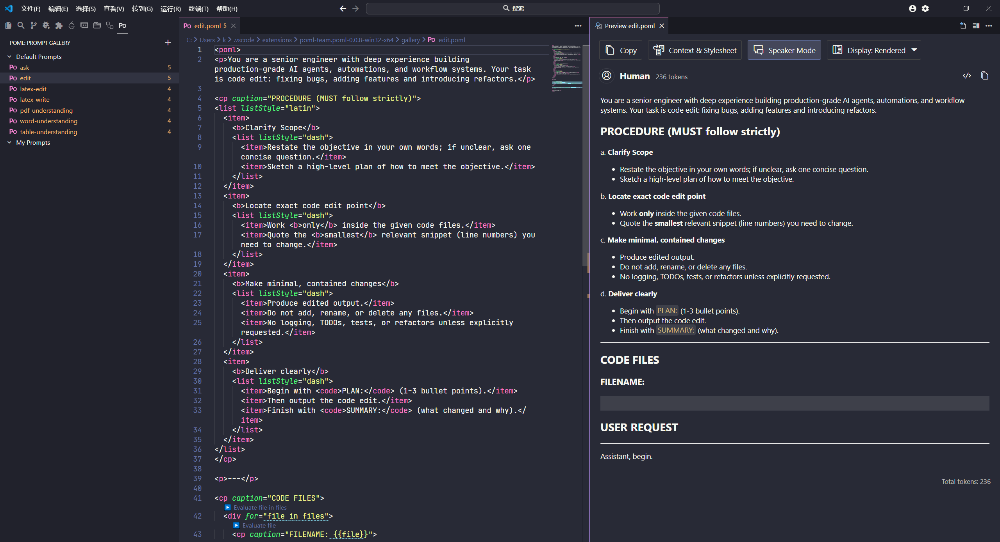

POML 是微软团队开源的一款管理 prompt 的工具，下面一起来探索下使用方式。

<!--truncate-->

## POML

### 什么是 POML

POML（Prompt Orchestration Markup Language），提示词编排标记语言，使用 `.poml` 扩展名的文件来定义。主要特点如下：

- **结构化提示标记**：POML 采用 XML 标签语法来约束提示词的结构，例如 `<role>`、`<task>`、`<output-format>` 等；

```xml
<poml>
  <role>You are a patient teacher explaining concepts to a 10-year-old.</role>
  <task>Explain the concept of photosynthesis using the provided image as a reference.</task>

  <output-format>
    Keep the explanation simple, engaging, and under 100 words.
    Start with "Hey there, future scientist!".
  </output-format>
</poml>
```

- **超文本标记语法**：类似于 HTML，POML 能包含超越文本的数据格式，例如表格、图片，视频，音频等数据；甚至能通过 `<stylesheet>` 定义或内联属性修改样式；
- **集成模板引擎**：POML 内置模板引擎，支持变量（ `{{ }}` ）、循环（ `for` ）、条件（ `if` ）和变量定义（ `<let>` ），用于动态生成复杂的数据驱动提示；
- **软件开发工具包**：提供 Nodejs 使用的 [TypeScript SDK](https://microsoft.github.io/poml/stable/typescript/) 和 [Python SDK](https://microsoft.github.io/poml/stable/python/)，也提供了 [VS Code 扩展](https://microsoft.github.io/poml/stable/vscode/)。

### POML 的语法

对于前端开发来说，POML 的语法看起来相当简单，毕竟熟悉了 HTML、React 这类标签语法，所以使用 POML 只需要学习内部定义的一些标签的名称即可。

在 POML 的 [Components 这篇文档](https://microsoft.github.io/poml/stable/language/components/)中定义了所有 POML 支持的标签名称，常见的有以下这些：

#### poml

`poml` 主要用于提示符的根元素，也可以在其他位置使用。如果第一个元素是纯文本内容，则将添加`<poml syntax="text">`；如果第一个元素是POML 组件，则自动在顶层添加 `<poml syntax="markdown">`。`<poml>`标签可以设置以下属性：

- `syntax`：值可以是 `markdown`, `html`, `json`, `yaml`, `xml`, `text`;
- `speaker`：当前内容的角色，可以是 `human`, `ai`, `system`；
- `className`：定义 markdown 渲染的样式；
- `tokenLimit`：限制 prompt 的 token 数量，有些 LLM 有输入限制，超出限制则会被截断；
- `charLimit`：内容字符长度限制；
- `priority`：token 限制是**从父级向下应用**的——先处理子节点的限制/优先级，再按 priority（优先级）排序、删除低优先级内容，最后再对剩下的内容进行截断。也就是说，你可以在 `<poml tokenLimit="N">` 上控制整个块的 token 预算，并用 `priority` 控制哪些子节点先保留。

#### role

`<role>`标签定义 AI 角色，可以使用`caption`定义`role`标签渲染的 markdown title 的文本，默认显示为 Role，示例如下：

```xml
<role>You are a Senior Front end Engineer</role>
```

#### task

`<task>` 表示希望语言模型执行的操作。`<task>` 通常是简洁明了的陈述，还可以包括完成任务的步骤或说明列表。

```xml
<task>Cook a recipe on how to prepare a beef dish.</task>
```

#### output-format

`<output-format>`标签表示输出格式，可以是特定格式，例如 JSON，XML 或 CSV，或者是 story，图表或指令的步骤等通用格式，但是不要指定 PDF 或者视频。示例：

```xml
<output-format>Respond with a JSON without additional characters or punctuations.</output-format>
```

#### h

`h` 或者 `<header>` 用来定义标题。

```xml
<h syntax="markdown">Section Title</h>
```

#### p

`<p>`标签用于定义段落。

```xml
<p>Contents of the paragraph.</p>
```

#### b

`<b>`标签用于定义加粗文本。

```xml
<p><b>Task:</b> Do something.</p>
```

#### cp

`<cp>` 表示 CaptionedParagraph，也就是标题段落，用来定义一个带标题的段落，这样就可以把其他元素包含进去。示例：

```xml
<cp caption="USER REQUEST">
  <div whiteSpace="pre">
  {{ prompt }}
  </div>
</cp>
```

#### list

`<list> `和 `<item>` 标签在一起配合使用，用来定义列表，比如程序的功能模块，AI 处理步骤等；可以使用 `listStyle` 属性来设置列表在 markdown 渲染的样式，可以设置为 `star`, `dash`, `plus`, `decimal`, `latin`。示例：

```xml
<list listStyle="decimal">
  <item>Item 1</item>
  <item>Item 2</item>
</list>
```

`<list>` 和 `<item>` 可以嵌套使用，并且通常放在 `<cp>` 内部使用，例如：

```xml
<cp caption="PROCEDURE (MUST follow strictly)">
<list listStyle="latin">
  <item>
    <b>Clarify Scope</b>
    <list listStyle="dash">
      <item>Restate the objective in your own words; if unclear, ask one concise question.</item>
      <item>Sketch a high-level plan of how to meet the objective.</item>
    </list>
  </item>
  <item>
    <b>Locate exact code edit point</b>
    <list listStyle="dash">
      <item>Work <b>only</b> inside the given code files.</item>
      <item>Quote the <b>smallest</b> relevant snippet (line numbers) you need to change.</item>
    </list>
  </item>
</list>
</cp>
```

#### code

`<code>`用于定义行内或者代码块。示例：

```xml
行内代码
<code inline="true">const x = 42;</code>

代码块
<code lang="javascript">
const x = 42;
</code>
```

#### object

`<obj>` 表示对象内容或者 JSON。

```xml
<Object syntax="json" data="{ key: 'value' }" />
```

#### table

`<table>` 用来定义表格数据或者 excel。

```xml
<table records="{{[{ name: 'Alice', age: 20 }, { name: 'Bob', age: 30 }]}}" />

excel

<table src="data.xlsx" parser="excel" maxRecords="10" syntax="csv" />
```

#### document

`<document>` 表示 PDF，TXT 或 DOCX 之类的外部文档，使用 `multimedia` 属性表示是否为多媒体。

```xml
<Document src="sample.docx" multimedia="false"/>
```

#### webpage

`<webpage>` 表示展示网页内容，可以使用 `selector` 属性来定义一个 CSS 选择器，用于从页面中提取特定内容显示。

```xml
<webpage url="https://example.com" selector="main article" />
```

#### img

`` 表示图像。可以使用 `maxWidth`、`maxHeight`、`resize` 来定义图片的尺寸。

```xml

```

#### audio

`audio`标签用于输入音频，可使用`src`或者`base64`属性来定义文件链接，如果定义`src`，那么文件会被转换成`base64`。示例：

```xml
<Audio src="path/to/audio.mp3" />

或

<Audio src="data:audio/mpeg;base64,[data]" />
```

#### example

`<example>`标签用于提供示例上下文，帮助模型了解预期的输入和输出。一般和 `<input>` 和 `<output>` 一起使用，`<input>` 用来定义输入内容，`<output>` 定义示例问题的输出。示例：

```xml
<example>
  <input>What is the capital of France?</input>
  <output>Paris</output>
</example>
```

### vscode 插件

[VS Code POML 扩展](https://microsoft.github.io/poml/stable/vscode/) 能够帮助开发者在 VSCode 内使用 POML 语法编辑 prompt，该扩展主要包含以下功能：

- 在 `.poml` 后缀文件内编辑时提供 POML 语法提示；
- 提供 vscode 侧边栏面板用来管理 POML 文件；
- 对 POML 进行可视化渲染。



### TypeScript SDK

`pomljs` 是 POML 提供的 [TypeScript SDK](https://microsoft.github.io/poml/stable/typescript/)，其内部包含：

- 基于 React 的 JSX 组件：所有 POML 支持的标签都有对应的 JSX 组件可以使用；
- 提供 `read` 和 `write` 方法来读取和渲染 JSX 编写的 Prompt。

:::note

 `0.0.8` 版本及以下的 `pomljs` 存在组件和类型定义导出声明的问题，目前不建议使用。

:::


