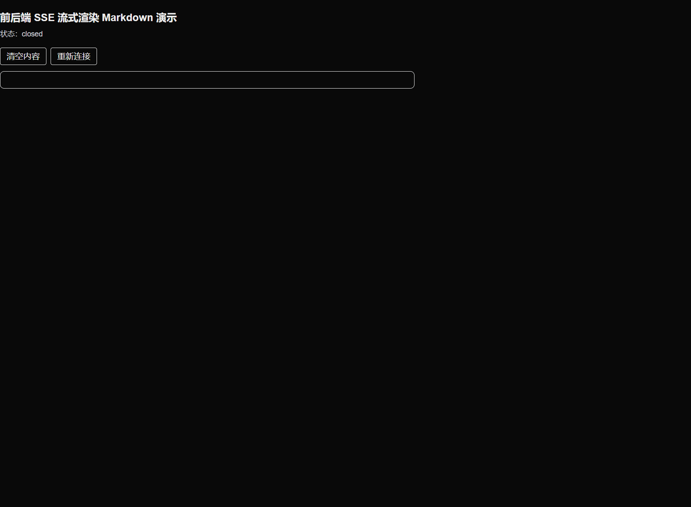

从 SSE 原理到生产可用的流式 Markdown 渲染方案，结合 Vercel 的 Streamdown 组件，提供服务端与前端完整代码、调试技巧、性能优化与示例项目结构。

<!--truncate-->

## 1. 技术背景介绍

- SSE 原理与优势：

  - SSE（Server-Sent Events）基于持久化的 HTTP 连接，服务端以 `text/event-stream` 连续推送事件，客户端通过 `EventSource` 被动接收，无需轮询。
  - 单向、轻量、天然跨浏览器支持良好（Chrome、Firefox、Safari 等），适合日志、状态、增量文本等实时场景。
  - 连接语义清晰：重试、心跳、事件名、数据体等均有规范；服务端易实现，客户端简单。

- Markdown 流式传输的应用场景：

  - AI 生成内容的渐进式输出（思维链、长答案、代码块）可边生成边渲染，提高交互体验。
  - 长文档编排与协作写作中，减少等待时间；支持分块解析，避免“大块未闭合”导致的整体阻塞。
  - 实时文档、增量日志、直播笔记、滚动公告等。

- Streamdown 组件与核心特性：
  - 来自 Vercel，专为“未完成 Markdown”与“AI 流式内容”设计的 React 组件，API 与 `react-markdown` 类似，支持增量块解析。
  - 关键能力：
    - `parseIncompleteMarkdown`：容忍未闭合代码块、列表、表格，边输入边渲染。
    - `components`：自定义渲染标签（如代码、链接、图片）与安全前缀限制。
    - `remarkPlugins` / `rehypePlugins`：扩展 Markdown 语法与 HTML 处理。
    - `shikiTheme`：Shiki 语法高亮主题；支持 `math`（KaTeX）与 `mermaid` 图表。
    - `controls` 与 `isAnimating`：渲染控制、结尾动画、滚动粘连等体验优化。

> 提示：本文所有示例均使用原生 `EventSource` 与 React（Streamdown），也可替换为其他框架，只要能消费 SSE 文本即可。

## 2. Node.js 服务端实现

目标：从 Markdown 文件或数据源流式读取并按块通过 SSE 推送到浏览器，保证连接生命周期管理、心跳与错误处理完整。

### 2.1 最小可运行示例（Express）

```ts title="server/index.ts" showLineNumbers
import express from "express";
import fs from "fs";
import path from "path";

const app = express();
const PORT = Number(process.env.PORT || 8787);

// SSE 路由：客户端通过 /sse 订阅增量 Markdown
app.get("/sse", (req, res) => {
  // 1) 基础响应头：保持连接与禁止缓存
  res.setHeader("Content-Type", "text/event-stream; charset=utf-8");
  res.setHeader("Cache-Control", "no-cache, no-transform");
  res.setHeader("Connection", "keep-alive");
  // 若需要跨域：res.setHeader('Access-Control-Allow-Origin', '*');

  // 2) 立即发送一个注释提高兼容性（某些代理需首字节刷新）
  res.write(": ok\n\n");

  // 3) 心跳：每 15s 发送一次注释，防止中间设备断开
  const heartBeat = setInterval(() => {
    res.write(": heartbeat\n\n");
  }, 15000);

  // 4) 将 Markdown 文件按行/块读取并逐块发送
  const mdPath = path.join(__dirname, "content.md");
  const stream = fs.createReadStream(mdPath, { encoding: "utf-8" });

  stream.on("data", (chunk) => {
    // 规范事件格式：event + data + 空行
    // 这里使用事件名 "message"；你也可以使用自定义事件
    res.write(`event: message\n`);
    // 为避免多行破碎，可将 chunk 按行安全封装到 data
    const safe = chunk.replace(/\r?\n/g, "\\n");
    res.write(`data: ${safe}\n\n`);
  });

  stream.on("end", () => {
    // 发送结束信号（可选）：客户端据此停止拼接
    res.write(`event: end\n`);
    res.write(`data: [DONE]\n\n`);
    // 延迟关闭以确保客户端收到尾包
    setTimeout(() => res.end(), 500);
    clearInterval(heartBeat);
  });

  stream.on("error", (err) => {
    res.write(`event: error\n`);
    res.write(`data: ${JSON.stringify({ message: err.message })}\n\n`);
    clearInterval(heartBeat);
    res.end();
  });

  // 5) 连接关闭处理（客户端主动关闭或网络中断）
  req.on("close", () => {
    clearInterval(heartBeat);
    stream.destroy();
  });
});

app.listen(PORT, () => {
  console.log(`SSE server at http://localhost:${PORT}/sse`);
});
```

### 2.2 响应头与代理注意事项

- `Content-Type: text/event-stream` 必须，且编码设为 `utf-8`。
- 禁止压缩：许多代理会对长连接压缩，可能导致帧边界破坏；可通过 `Cache-Control: no-transform` 与关闭中间层压缩。
- 反向代理（Nginx/Cloudflare）需开启传输刷写与禁用缓冲；例如 Nginx 可使用 `proxy_buffering off;`。

### 2.3 心跳与断线重试

- SSE 允许客户端在网络异常时自动重试。服务端应周期性发送注释（以 `:` 开头）维持连接活性。
- 如果需要定制重试间隔，可发送 `retry: <ms>` 字段，如 `retry: 3000` 表示 3s 重试。

### 2.4 分块策略与数据格式

- 尽量保证每个 `data:` 对应一个语义片段（行、句、代码块的一部分），使前端更好地增量渲染与滚动。
- 如需多事件类型，可使用不同 `event:` 名称（如 `meta`、`message`、`end`）。

## 3. 前端实现

目标：通过 `EventSource` 建立 SSE 连接，增量拼接 Markdown 文本，并使用 Streamdown 容忍未完成块进行渲染，同时处理错误与重连。

### 3.1 React + Streamdown 基本用法

```tsx title="client/App.tsx" showLineNumbers
import { useEffect, useRef, useState } from "react";
import Streamdown from "streamdown";

export default function App() {
  const [md, setMd] = useState<string>("");
  const esRef = useRef<EventSource | null>(null);
  const [connected, setConnected] = useState(false);

  useEffect(() => {
    // 连接到后端接口地址，类似 http 接口
    const es = new EventSource("http://localhost:8787/sse");
    esRef.current = es;

    es.onopen = () => setConnected(true);
    es.onerror = (e) => {
      console.warn("SSE error", e);
      setConnected(false);
      // 由浏览器自动重试；也可在此关闭并手动重连
    };
    es.addEventListener("message", (ev) => {
      try {
        // 这里服务端直接推送原始文本；如果是 JSON，需解析后取字段
        const text = String(ev.data);
        // 增量拼接：避免频繁渲染，可批量缓冲
        setMd((prev) => prev + text);
      } catch (err) {
        console.error(err);
      }
    });
    es.addEventListener("end", () => {
      // 收到结束事件，可做滚动、动画或解锁 UI
      console.info("stream end");
      es.close();
      setConnected(false);
    });

    return () => {
      es.close();
      setConnected(false);
    };
  }, []);

  return (
    <div style={{ padding: 16 }}>
      <h3>SSE + Streamdown Markdown Streaming</h3>
      <p>连接状态：{connected ? "已连接" : "未连接"}</p>
      <Streamdown
        // 核心：容忍未完成 Markdown，边到边渲染
        parseIncompleteMarkdown
        shikiTheme="github-dark"
        // 安全前缀：限制链接与图片前缀，避免 XSS
        components={{
          a: {
            allowedPrefix: ["https://", "http://"],
          },
          img: {
            allowedPrefix: ["https://", "http://"],
          },
        }}
      >
        {md}
      </Streamdown>
    </div>
  );
}
```

### 3.2 流式拼接与渲染优化

- 批量缓冲：在 `message` 事件中将增量文本先写入缓冲区，每 50–100ms 合并一次，减少 React 重渲染频次。
- 大块代码：若服务端能识别代码块边界（如以 ```），可在边界处再触发一次强制渲染，提升用户感知。
- 滚动粘连：当内容增长时保持视窗跟随底部；Streamdown 的 `controls` 与 `isAnimating` 可用于结尾动画与滚动体验优化。
- 错误处理：网络断连时提示用户并自动重试；如需手动重连，可通过按钮触发重新建立 `EventSource`。

### 3.3 简易重连机制（可选）

```tsx title="client/useSSE.ts" showLineNumbers
import { useEffect, useRef, useState } from "react";

export function useSSE(url: string, onMessage: (data: string) => void) {
  const [connected, setConnected] = useState(false);
  const esRef = useRef<EventSource | null>(null);
  const retryRef = useRef<number>(2000); // 初始重试间隔

  useEffect(() => {
    function connect() {
      const es = new EventSource(url);
      esRef.current = es;
      es.onopen = () => {
        setConnected(true);
        retryRef.current = 2000; // 连接成功，重置重试间隔
      };
      es.onerror = () => {
        setConnected(false);
        es.close();
        // 指数退避重试，最多 20s
        retryRef.current = Math.min(retryRef.current * 2, 20000);
        setTimeout(connect, retryRef.current);
      };
      es.addEventListener("message", (ev) => onMessage(String(ev.data)));
    }
    connect();
    return () => esRef.current?.close();
  }, [url, onMessage]);

  return { connected };
}
```

## 4. 示例代码

参考 **[stream-markdown-demo](https://github.com/wood3n/stream-markdown-demo)**

## 5. 总结

- 优点：

  - SSE 简洁稳定，浏览器原生支持，无需双向通道即可实现“服务端推送”。
  - Streamdown 适配未完成 Markdown，显著提升 AI/长文场景的渲染质量与体验。
  - 端到端实现成本低，利于快速落地与迭代。

- 局限：

  - SSE 为单向推送；如需双向交互可结合 WebSocket 或使用双通道（SSE 下行 + Fetch/POST 上行）。
  - 中间代理与缓冲需谨慎配置，否则可能造成延迟与断流。
  - 对于复杂内容块，例如视频，图片，代码块等自定义渲染模块，非常依赖 Markdown 组件自身的能力；如果在项目技术选型阶段需要格外注意这一点，避免后续随着业务复杂性的增加，导致代码无法继续维护开发。

- 改进方向：
  - 更细粒度的分块与服务端增量语义（代码块、列表边界识别）。
  - 引入内容安全策略（CSP）与资源前缀白名单，更好抵御 XSS。
  - 增加离线缓存与断点续传，提升弱网体验。

## 参考与进一步学习

- MDN：SSE 与 EventSource
  - https://developer.mozilla.org/zh-CN/docs/Web/API/Server-sent_events
  - https://developer.mozilla.org/zh-CN/docs/Web/API/EventSource
- WHATWG HTML 规范：Server-Sent Events
  - https://html.spec.whatwg.org/multipage/server-sent-events.html
- Vercel Streamdown（组件文档与示例）
  - https://www.npmjs.com/package/streamdown
  - https://github.com/vercel-labs/streamdown
- Shiki（代码高亮）
  - https://github.com/shikijs/shiki
- KaTeX（数学公式）
  - https://katex.org/
- Mermaid（流程图与时序图）
  - https://mermaid.js.org/
