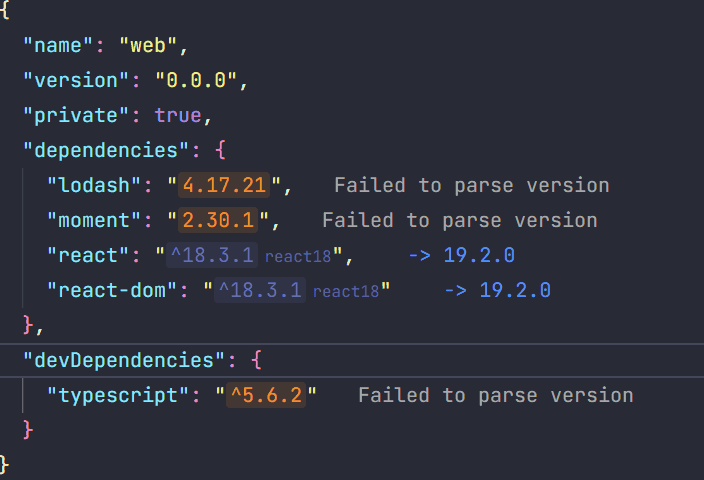

pnpm 在 v9.5 加入了 catalogs 功能，用于对 monorepo 依赖进行分类管理。这将大大降低 monorepo 内部对于多个项目之间依赖版本统一管理的难度。为了清楚地认识到 catalogs 功能对于 monorepo 依赖管理的便捷性，下面我们从 monorepo 的介绍以及 catalogs 的使用两方面来探讨。

<!--truncate-->

## 什么是 monorepo

monorepo 中 mono 表示单个，repo 表示 repository，monorepo 也就是单一仓库的意思。monorepo 最初跟随着**分布式版本控制系统** Git 兴起（2005年）而被 Google 使用。后来随着前端开源社区的发展，Lerna 在 2015 年发布，成为了**第一个在 JavaScript 社区普及 Monorepo 概念的标志性工具**。Lerna 解决了两个核心问题：

1. **引导 (Bootstrap)**: 自动将 monorepo 内的包相互链接 (symlink)，让你可以在本地像使用已发布的包一样引用它们。
2. **发布 (Publish)**: 自动化管理所有包的版本号、生成 changelog，并将更新过的包一键发布到 npm。

后来又有了 Meta 开源的 yarn workspace（2017），以及后来更完善的 pnpm Workspace（2020）。

## 为什么用 monorepo

首先我个人认为，对于业务领域内**子项目 < 5 个**，**维护人数 < 5** 的前端项目应该使用 monorepo，可以获得以下好处：

1. 统一工具链和代码规范。前端各种构建工具，Lint 等配置相当繁琐，使用 monorepo 可以在创建项目初期就完成这些约束，后续项目只需要专注自身的构建和业务逻辑即可。
2. 统一依赖管理，减少项目整合和迁移的成本。如果你用 React18，其他组用 React19，那么在遇到业务整合场景时就可能遇到很高的迁移成本。
3. 代码共享和复用方便快捷。前端开发必会有通用的 `components` 和 `utils`，如果走传统的多仓库发包更新，流程冗长，非常不利于团队内部共享使用；并且如果大家各自都开发一份，又会增加时间和人力成本。

使用 monorepo 的优势明显，但是缺陷也存在：

1. monorepo 架构复杂，需要开发者对 Lint，Turborepo 等相关管理工具，以及CI、CD 等非常熟悉才能减少踩坑。
2. monorepo 依赖管理复杂。monorepo 不光需要统一多个项目之间的第三方库依赖版本，同时还需要为后期升级做准备。举个例子，如果某个项目因为第三方库的兼容性需要升级 React 版本，如果早期用 `overrides` 强行锁定 monorepo 内 React 的版本就会出问题。所以，monorepo 内部的项目应该定期对稳定的基础库做升级，大型稳定库例如 React 都是向下兼容，这种升级成本不会太高但是远期收益很高。
3. monorepo 随着多个项目业务复杂性的增强，Lint 速度，Git 操作，依赖安装会变得越来越慢。不过现在有很多第三方工具在努力解决这些问题，例如 Turborepo 通过智能缓存和任务编排解决项目依赖安装问题，Oxlint 等解决 Eslint 速度慢的问题。最麻烦的其实还是 Git 操作，比如多个需求并行时，需要切换 Git 分支，如果不同分支的依赖存在不同，每次切换都需要重新安装依赖，非常繁琐。

## npm vs yarn vs pnpm

### npm

首先 npm v7（Nodejs v15）开始支持 workspaces 功能，使用步骤如下：

1. 在**项目根目录的 package.json** 中添加一个 workspaces 字段

```json
{
  "name": "my-monorepo",
  "workspaces": [
    "packages/*", // 匹配 packages 文件夹下的所有子项目
    "apps/*"      // 匹配 apps 文件夹下的所有子项目
  ]
}
```

2. 使用 npm 提供的 `-w` (或 --workspace) 和 `--ws ` (或 --workspaces) 标志来筛选执行脚本的目录，参考[npm-workspace-demo](https://github.com/wood3n/npm-workspace-demo) 仓库示例

```shell
# 在 my-app 子项目中运行 dev 脚本
npm run dev -w my-app

# 在所有子项目中运行 test 脚本
npm run test --ws
```

npm 会将多个项目的依赖统一安装到项目根目录的 node_modules 目录下，即使是单个项目自己用到的依赖也是如此，而针对项目间相同依赖不同版本则安装到项目内部 node_modules。所以会 npm workspace 会带来幽灵依赖以及占用磁盘空间的问题（现在的存储价格可是寸土寸金）。

### lerna

lerna 的缺陷在于它只是一个项目管理工具，没有和 npm、yarn 结合。

使用 lerna 需要自己管理依赖关系，也就是使用 npm 或者 yarn 安装依赖，然后使用 `lerna bootstrap` 来在 monorepo 内部的包之间创建符号链接。由于 lerna 依赖 npm，所以会暴露和 npm 一样的幽灵依赖等问题。

### yarn

yarn v1 虽然将 monorepo 的项目管理和 yarn cli 命令结合在了一起，但是依然存在依赖提升，性能和磁盘空间占用的问题。

而 yarn v2 以后增加了 pnp 模式，不创建 node_modules，所有包直接从一个 `.pnp.cjs` 索引文件中获取，优点是极速解析、无重复依赖。但是生态兼容性问题严重，IDE、ESLint、ts-node、Webpack 等工具需特殊配置。参考 [yarn-workspace-demo](https://github.com/wood3n/yarn-workspace-demo)

### pnpm

pnpm workspace 主要解决了以下问题：

1. 在磁盘内存在 `.pnpm-store` 全局缓存，所有本地使用的包只会安装一次，后续使用硬链接绑定。不仅减少后续安装时间，而且大大减少 monorepo 仓库体积；
1. pnpm 使用独特的**符号链接 (Symlinks) node_modules 结构**，在任何一个子项目的 node_modules 目录里，你只能直接看到**你在该项目 package.json 中明确声明的依赖**，避免了幽灵依赖的问题。

## 为什么要统一依赖管理

为什么 monorepo 内部要保证依赖版本的统一性呢？

1. 避免单例实例问题，例如 React。举个例子，你的 components 库是用 React17 开发的，而你的主应用使用的是 React18。当主应用使用一个components 的组件时，这个组件内部的 React Hooks 是由 React17 的实例调用的，但它所在的环境却是 React18 的，这就会导致抛出**"Invalid hook call"** 错误。
2. 避免重复构建打包。如上所说，如果存在两个版本的 React，那么 components 和主应用内部在构建后会存在两个版本的 React，明显增大项目体积。
3. 保证类型提示统一。不同版本的第三方库的 api 可能存在属性等类型的不同，保证版本统一可以在多个项目间使用时无缝切换，不需要感知这些 api 的变化。

## 使用 pnpm catalogs

### catalog

pnpm 支持在 `pnpm-workspace.yaml` 中使用 `catalog` 定义一个名为 `default` 的目录。这些版本范围可以通过 `catalog:default` 引用。仅有默认目录时，也可以使用特殊的 `catalog:` 简写。 将 `catalog:` 视为可扩展为 `catalog:default` 的简写。

```yaml
packages:
  - packages/*

catalog:
  react: ^18.2.0
  react-dom: ^18.2.0
```

在 monorepo 内的项目可以在 `package.json` 中通过 `catalog:default` 引用默认依赖。仅有默认目录时，也可以使用特殊的 `catalog:` 简写。

```json
{
  "name": "@example/app",
  "dependencies": {
    "react": "catalog:",
    "react-dom": "catalog:"
  }
}
```

### catalogs

也可以使用 `catalogs` 自定义多个名称的 catalog：

```yaml
catalogs:
  # 可以通过 "catalog:react17" 引用
  react17:
    react: ^17.0.2
    react-dom: ^17.0.2

  # 可以通过 "catalog:react18" 引用
  react18:
    react: ^18.2.0
    react-dom: ^18.2.0
```

然后项目内部的 `package.json` 使用 `catalog:<name>` 来表示依赖版本。

```json
{
  "name": "@example/components",
  "dependencies": {
    "react": "catalog:react18",
  }
}
```

对于需要发布的包，pnpm 也会在发布的时候替换到 `catalog:`

### CLI 支持

pnpm 在 v10.12.1 版本对 `pnpm add` 命令支持了 `--save-catalog` 和 `--save-catalog-name` 两个选项。这两个选项主要有两个作用：

1. 将安装的依赖写入 `catalog` 或者指定名称的 `catalogs`，并且使用 `catalog:[name]` 作为目标项目依赖的版本写入 `package.json`；

```shell
# 将 lodash 添加到 utils 并添加到默认 catalog
pnpm add lodash --filter utils --save-catalog

# 将 lodash 添加到 components 并添加到目录 app-utils
pnpm add lodash --filter components --save-catalog-name app-utils 
```

2. 对于已经在默认目录 `catalog` 中定义的依赖，如果没有指定依赖的版本，使用 `pnpm add` 命令时会直接使用 `catalog:` 作为版本写入项目的 `package.json`；如果带上 `--save-catalog-name` 选项，则会从指定 catalog 读取并作为要安装的依赖版本，没有则添加到指定名称的 catalog 下。

## catalog 的便捷性

在没有 catalog 的时候，如果要保证多个项目安装同一依赖的版本唯一性，大概有以下几种方式：

1. 使用 `overrides` 强制约定**整个依赖树** (包括直接和**间接/传递**依赖)的版本唯一。这会导致限制的依赖版本低时无法使用一些使用高版本 `peerDependencies` 的库，比如很多 React 库只会兼容最新的 React 版本。
2. 对每个项目的依赖锁版本，同时在安装第三方依赖时自行查看其他项目的依赖并固定安装版本，比较繁琐，一不小心漏查了就容易导致多个项目之间相同的库版本不统一；
3. 使用 `pnpmfile.cjs` 的 hook，自行编写脚本，在安装依赖的时候扫描所有其他项目依赖版本，保证安装版本的统一；
4. 将第三方库安装到单一项目内做进一步封装使用，这在 utils 或者 components 子项目中很实用，既能保证多个项目版本的统一，也能为不同项目自定义第三方库中相同的业务逻辑。

在有了 catalogs 之后，monorepo 内部统一版本依赖只需要在使用 `pnpm add` 时带上 `--save-catalog` 和 `--save-catalog-name` 两个选项即可，很轻松地就共享了项目依赖的版本，同时在 `pnpm-workspace.yaml` 也能很明显地查看到项目依赖的情况。

对于 catalog 分类，我个人倾向于不是那么实用，只要项目能够共享的依赖版本，大可以直接使用 `--save-catalog` 保存到默认目录下即可，后续使用 `pnpm add` 也能快速在其他项目内部安装。

## catalog 的缺陷

catalog 的唯一缺点就是在项目的 `package.json` 中定义时无法直接显示依赖版本，这里就推荐一个 antfu 的 vscode 插件 —— [Catalog Lens](https://marketplace.visualstudio.com/items?itemName=antfu.pnpm-catalog-lens). 能够在 vscode 中将 `package.json` 中使用 `catalog:` 的版本替换成具体对应的版本号。



