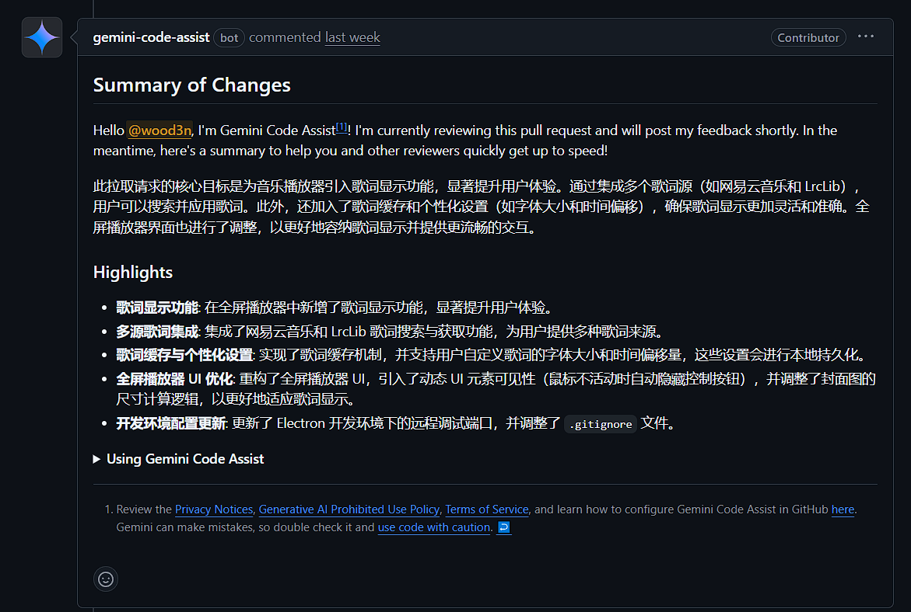
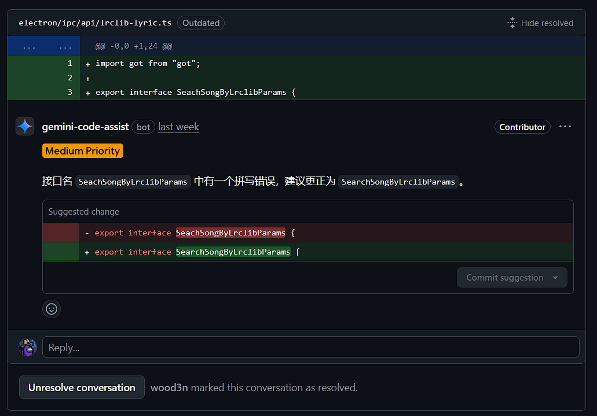
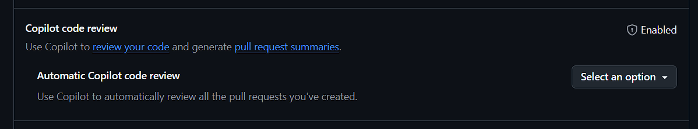
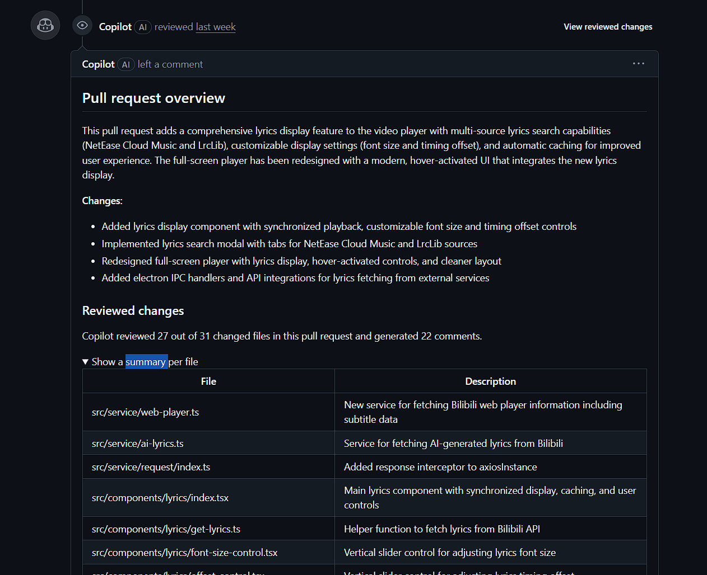
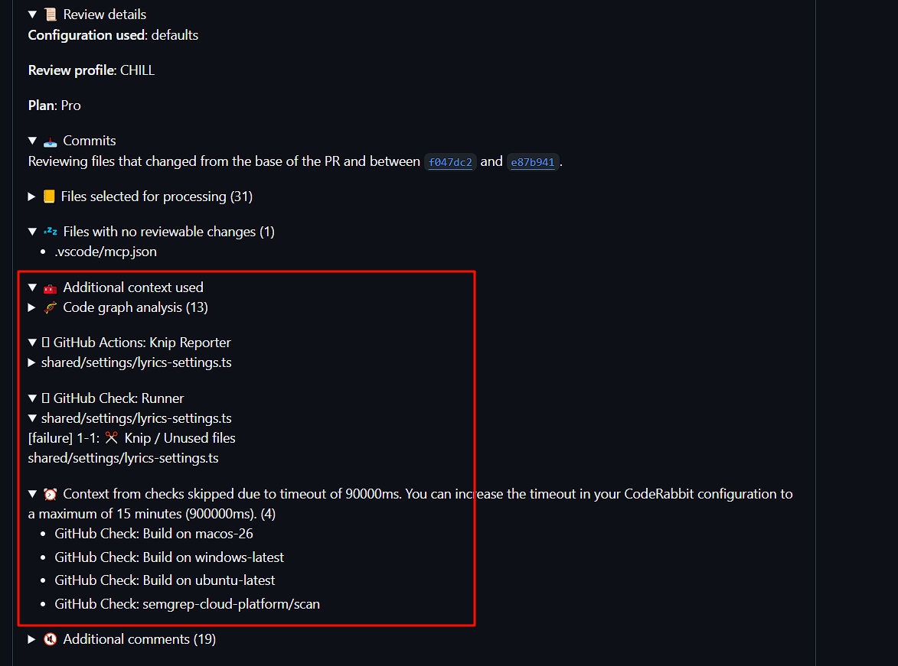
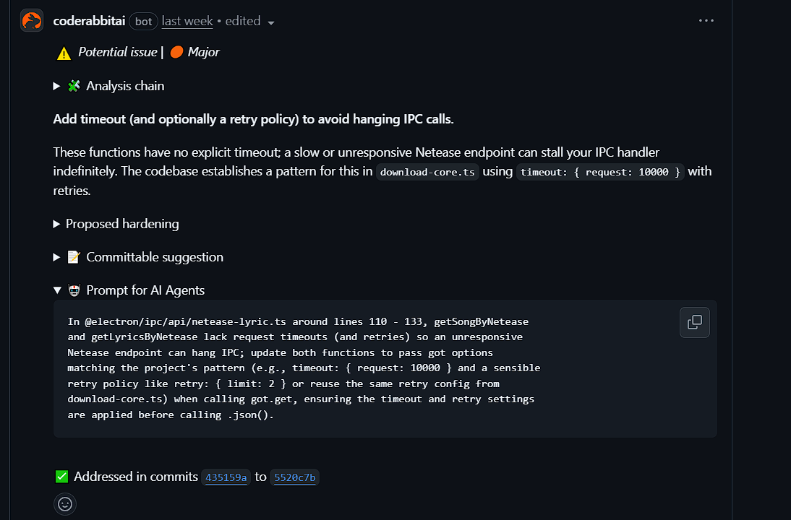

本文介绍几款在 GitHub 中可以免费使用的 AI Review 工具，结合我[个人项目的 PR](https://github.com/wood3n/biu/pull/204) 来总结对比。

<!--truncate-->

## Gemini Code Assist

首先是 [Gemini Code Assist](https://github.com/apps/gemini-code-assist)，我使用的是免费版，对比企业付费版基本就是额度的差异。企业版价格参考[Gemini for Google Cloud 价格](https://cloud.google.com/products/gemini/pricing?hl=zh-cn)，基础订阅每月得 $20，高级得 54.

在 GitHub 中安装并启用 [Gemini Code Assist App](https://github.com/marketplace/gemini-code-assist)，选择指定仓库，然后仓库提交 PR 以后会自动运行 review.

Gemini Code Assist 提供的能力如下：

1. 总结 PR 内容（支持多种语言），总结的内容看起来还是很详细的。

2. 找出问题并提供修改建议，包括 review 出来的问题以及修改的实例代码，对于拼写错误，console，重复的 TypeScript 类型定义这些比较低级的代码问题，都能轻松发现。可以直接点击 commit suggestion 来提交建议代码。

没了，Gemini 提供的就是基本的 review pr 的能力，相比个人开发者来说确实能发现一些问题，提高代码质量，减少 review 代码的工作量。至于 Gemini 的不足，放后面对比其他工具的时候一起说。

## GitHub Copilot

GitHub Copilot 只面向订阅用户，一个月基础 $10。订阅 Copilot Pro 以后还需要在 GitHub 的个人设置页面 - copilot/features 中开启自动 review，不然每次提交 PR 需要手动拉 Copilot。

和 Gemini 一样，Copilot 同样提供总结 PR 和修改建议的能力。不过使用的语言都是英语。Copilot 比 Gemini 详细一点的是在总结 PR 部分会列出每个文件的改动点。

## CodeRabbit

[CodeRabbit](https://docs.coderabbit.ai/platforms/github-com) 应该是目前使用最流行的 review 工具，以精准发现各种 BUG 出名，我自己使用免费版确实看起来很厉害，就是有时候发现的问题太多，改完提交又得再改，很烦😂

使用 CodeRabbit 请参考[官方文档](https://docs.coderabbit.ai/platforms/github-com)，在官网使用 GitHub 登录，选择指定仓库集成 bot 就行，后续提交 PR 就会触发自动 review。针对个人仓库使用免费，Pro 订阅 $24，提供 dashboards 和 reports 面板查看，对于个人项目来说免费的就行了。

CodeRabbit 同样提供总结 PR 的能力，只有英语。CodeRabbit 在 review 的时候会结合仓库配置的 actions，例如你配置的 PR 构建，eslint 等流程

CodeRabbit 在发现问题后不仅提供问题描述和修改建议，它还提供 Prompt for AI Agents，也就是修改某段问题代码的详细 prompt，帮助你在本地利用 AI 直接定位和修改问题代码。

不仅如此，CodeRabbit 会增量 review，在修改代码重新提交到 PR 后，CodeRabbit 会根据最新提交的代码自动关闭刚才的评论问题，或者提出新的代码问题，这是 Gemini 和 Copilot 都不具备的。如果是 Gemini，你需要在 PR 下方输入 `/gemini review` 它才会触发新的 review，它也不会自动关闭已经解决的代码问题评论。

## 总结对比

| 工具               | 价格/可用性                | 总结 PR | 修改建议 | 语言   | 增量 review              | 额外能力                                |
| ------------------ | -------------------------- | ------- | -------- | ------ | ------------------------ | --------------------------------------- |
| Gemini Code Assist | 免费版可用，企业版按月付费 | 支持    | 支持     | 多语言 | 不支持，需要手动触发     | 基础 review 能力                        |
| GitHub Copilot     | 订阅付费                   | 支持    | 支持     | 仅英语 | 未提及                   | 总结包含每文件改动点                    |
| CodeRabbit         | 个人免费，Pro 订阅 $24     | 支持    | 支持     | 仅英语 | 支持，自动关闭已解决评论 | 提供 Prompt for AI Agents，结合 Actions |
