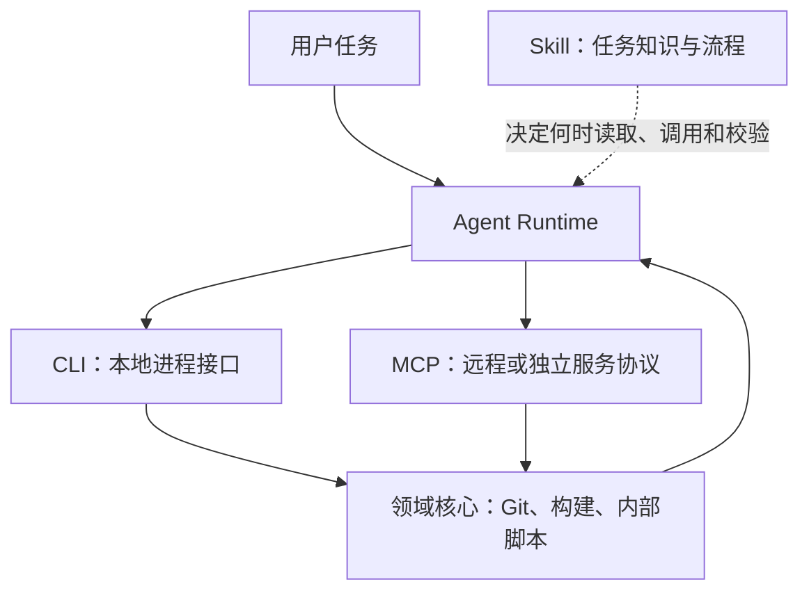

把 MCP、CLI 和 Skill 放在同一张“工具接入方案”表里比较，容易得出错误结论：似乎选了 Skill 就不需要 MCP，或者把现有 CLI 包一层 MCP 才算接入 Agent。更准确的划分是：MCP 定义跨进程或跨网络的能力协议，CLI 提供本地进程接口，Skill 则提供任务知识与执行流程。它们解决的是不同层的问题。

本文的结论很简单：先把业务能力做成可独立验证的核心逻辑；需要让多个 Agent 以统一的 schema、认证和生命周期访问时使用 MCP；已有本地自动化能力时保留 CLI；把选择工具、校验结果和异常分支写进 Skill。不要用某一种形式承担全部职责。

<!--truncate-->

## 先分清三层

| 层 | MCP | CLI | Skill |
| --- | --- | --- | --- |
| 解决的问题 | Agent 如何发现并调用外部能力 | Runtime 如何启动本地程序 | Agent 在何时、以何步骤完成任务 |
| 主要载体 | Client、Server、JSON-RPC 消息 | 可执行文件、参数、stdin/stdout | `SKILL.md`、脚本、参考资料 |
| 典型产物 | `tools/list`、`tools/call`、输入输出 schema | `report export --format json` | 任务触发条件、前置检查、重试与验收规则 |
| 不能替代什么 | 业务实现与用户授权 | 工具发现、远程授权模型 | 真实执行权限与错误处理 |

这不是严格的分层架构：MCP Server 可以启动本地程序，Skill 也可以附带脚本。但在设计时分开考虑，能避免把提示词、协议适配和业务逻辑搅在一起。



图中的关键点是：Skill 影响 Agent 的决策上下文，CLI 与 MCP 是 Runtime 发起副作用的入口，领域核心不应依赖其中任何一个。

## MCP 管理能力边界

MCP 不是“把函数暴露给模型”的同义词。它规定了 Host、Client 与 Server 之间的连接生命周期：初始化时协商协议版本与能力，运行期间只能使用已协商能力，关闭时由底层传输结束会话。[MCP Lifecycle（2025-11-25）](https://modelcontextprotocol.io/specification/2025-11-25/basic/lifecycle)

### 工具先被发现

支持工具的 MCP Server 要声明 `tools` capability。Client 通过 `tools/list` 获取工具名、描述和 JSON Schema，再通过 `tools/call` 传入参数；工具还可声明输出 schema，使 Client 能验证结构化结果。[MCP Tools（2025-11-25）](https://modelcontextprotocol.io/specification/2025-11-25/server/tools)

```json
{
  "name": "deploy.preview",
  "description": "Create a preview deployment for one revision.",
  "inputSchema": {
    "type": "object",
    "properties": {
      "revision": { "type": "string" }
    },
    "required": ["revision"],
    "additionalProperties": false
  }
}
```

这种显式 schema 的价值不在于让模型“更聪明”，而在于把参数校验、生成 UI、审计与跨客户端复用放在一个稳定接口上。对于 GitHub、工单系统、数据库、发布平台等远程服务，这通常比让 Agent 拼接 HTTP 请求更合适。

### MCP 有额外责任

协议带来的不只是格式。MCP 工具调用还涉及版本协商、能力变更通知、超时、认证和用户确认。规范要求 Server 校验输入、实施访问控制和限流；Client 则应在敏感操作前确认、向用户展示输入、校验结果并保留审计记录。[MCP Tools 的安全要求](https://modelcontextprotocol.io/specification/2025-11-25/server/tools)

因此，不要因为一个功能“只有一个命令”就草率做成 MCP，也不要因为它已有 CLI 就省略授权边界。判断标准是：该能力是否需要跨 Agent、跨环境、跨用户稳定复用，以及是否需要一个可治理的远程访问面。

## CLI 提供进程接口

CLI 的优势是直接、可组合，也容易脱离 Agent 单独调试。Agent Runtime 启动进程后，需要处理参数、工作目录、环境变量、标准输入输出、退出码与超时；Shell 返回最后一个命令的退出状态，诊断信息应进入标准错误流。[POSIX Shell](https://pubs.opengroup.org/onlinepubs/009604599/utilities/sh.html)

### 先为程序而写

面向 Agent 的 CLI 不应只打印给人看的表格。对稳定自动化路径，提供显式的机器输出和失败语义：

```bash
acme-report export \
  --project web \
  --format json \
  --output /tmp/report.json
```

```json
{
  "report": "/tmp/report.json",
  "warnings": [],
  "revision": "a1b2c3d"
}
```

这比让模型从彩色终端文本猜测成功与否可靠。`stdout` 只输出结果数据，`stderr` 输出诊断，非零退出码表示可分类的失败；涉及删除、发布或付费资源时，仍需要 `--dry-run`、确认参数或 Runtime 侧审批。

### CLI 不是低配 MCP

CLI 不提供工具目录、参数 schema 协商或跨客户端的授权模型，但它没有这些能力也不构成缺陷。本地构建、格式化、代码生成、批量转换等场景往往已经以 CLI 为事实接口。此时重复实现一个只调用 `exec()` 的 MCP Server，通常只增加部署与调试成本。

反过来，若命令需要长期运行、保留会话状态、代理多租户凭据，或让桌面端、云端 Agent 和 CI 使用同一接口，CLI 的 flag 约定就不够了。可以保留 CLI 给人和 CI 使用，同时增加薄的 MCP adapter；不要把核心业务规则复制两遍。

## Skill 固化工作方法

Agent Skill 是可按需加载的任务包。开放规范将其定义为至少含 `SKILL.md` 的目录，可选附带 `scripts/`、`references/` 与 `assets/`；`SKILL.md` 的 front matter 中 `name` 和 `description` 是必填字段。[Agent Skills Specification](https://agentskills.io/specification)

### Skill 不等于权限

Skill 可以说“先读取变更，再运行测试，最后创建预览”，但能否读取文件、执行 shell 或调用 MCP，仍取决于 Agent Runtime 实际暴露的工具与权限。规范里的 `allowed-tools` 目前是实验性字段，客户端支持情况可能不同，不能把它当作通用的安全控制面。[Agent Skills Specification](https://agentskills.io/specification)

```md
---
name: preview-release
description: Create and verify a preview release for a web project.
---

1. Read the release diff and reject uncommitted secrets.
2. Run `acme-report export --format json`.
3. Call `deploy.preview` only after the user approves the target revision.
4. Verify the returned URL and record the revision.
```

这个例子中，前两步可由本地 CLI 完成，第三步可通过 MCP 调用部署服务；Skill 负责把它们排成可复用、可检查的工作流。它的价值是减少每次重新解释流程的上下文成本，而不是替代执行层。

### 控制上下文体积

Skill 的 description 用于发现，正文在激活后加载，脚本与参考资料则按需读取。规范建议把细节拆到引用文件，避免把 API 手册、故障排查和模板全部塞进 `SKILL.md`。[Agent Skills 的渐进加载](https://agentskills.io/specification)

实践中，保持一份短的主流程、把可执行逻辑放进可测试脚本、把长文档放进 `references/`，比写一份数千行“万能提示词”更稳定。需要更新的事实也应在执行时从受信来源获取，而不是硬编码在 Skill 中。

## 用核心逻辑承接两端

把同一业务能力同时开放给 CLI 与 MCP 时，最容易出错的是两套实现各自演进。更稳妥的结构是让两端都调用纯业务函数：

```ts
type PreviewInput = { revision: string };
type PreviewResult = { url: string; revision: string };

export async function createPreview(
  input: PreviewInput,
): Promise<PreviewResult> {
  // 参数校验、权限检查和领域逻辑在此处完成。
  return { url: "https://preview.example/rev/a1b2c3d", revision: input.revision };
}

// CLI adapter：解析 flag，调用 createPreview，序列化 JSON。
// MCP adapter：校验 inputSchema，调用 createPreview，返回结构化内容。
```

这样，CLI 的退出码与 JSON、MCP 的 schema 与工具结果、Skill 的步骤说明都只是边界适配。单元测试覆盖 `createPreview`，契约测试覆盖 CLI 输出和 MCP schema，权限测试覆盖实际副作用。

## 按约束做选择

| 约束 | 首选 | 原因 |
| --- | --- | --- |
| 已有本地脚本，主要由开发者和 CI 使用 | CLI + Skill | 成本低，保留现有可调试接口 |
| 远程 SaaS、数据库或组织内服务 | MCP + Skill | 统一发现、schema、认证和审计边界 |
| 同一能力同时服务人、CI 与多个 Agent | CLI + MCP adapter + Skill | 核心逻辑复用，调用面各自适配 |
| 高风险写操作 | 任一执行入口 + Runtime 审批 | 入口形式不能替代最小权限、确认和审计 |

可以用以下顺序落地：先写能在 CI 中可靠运行的核心逻辑与 CLI；为参数、输出和失败码补测试；当跨客户端、远程授权或工具发现成为真实需求时增加 MCP adapter；最后以 Skill 固化触发条件、审批点、验证命令和恢复路径。这个顺序适合从本地自动化成长为 Agent 平台，也避免过早为协议和提示词建立无法验证的抽象。
