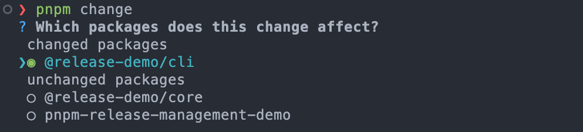
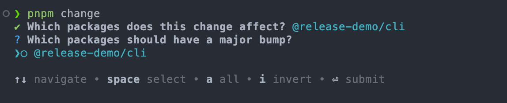
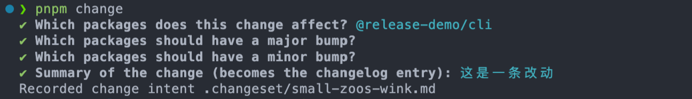
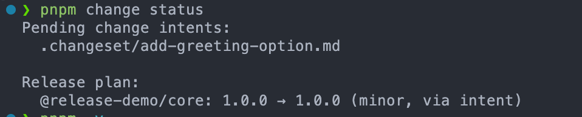
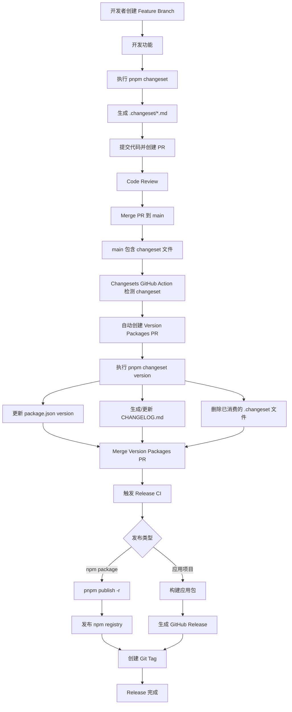

pnpm 在 v11.13.0 引入对 monorepo 的发版管理机制，无需依赖 Changesets CLI，参考 [pnpm Release management](https://pnpm.io/zh/versioning) [pnpm@11.13.0 registry metadata](https://registry.npmjs.org/pnpm/11.13.0)

<!--truncate-->

## 新的发版命令

简单来说命令分为三种：`change` 写入 changelog，`version` 消费 changelog，`publish` 发版。

### `pnpm change`

`pnpm change`只用于带有`pnpm-workspace.yaml`的 monorepo 发版。

不带参数时，`pnpm change` 进入交互模式，它会自动检测哪些包有改动，并且执行时不需要工作区保持干净：

1. 选择受影响的包，如图会自动选择有改动的包，而且这里面默认还会包含整个 monorepo 的根目录，如果你要忽略根目录，可以在`pnpm-workspace.yaml`中配置[`versioning:ignore`](https://pnpm.io/settings/versioning#versioningignore)来忽略根目录；



2. 为每个包选择升级级别：patch、minor，major，也就对应[语义化版本](https://semver.org/lang/zh-CN/)。这里可以通过回车键跳过某个版本；



3. 填写 changelog



pnpm 会在 `.changeset/` 生成一个 Markdown 文件，记录指定包版本变动和你填写的 changelog。这点就跟使用`changesets` CLI 一样：

```markdown
---
"@release-demo/cli": patch
---

这是一条改动
```

`pnpm change`命令只支持两个选项：`--bump <type>` 和 `--summary <text>`。

- `--bump <type>`：`type`的值可以是 `none`、`patch`、`minor`、`major`：
  - `none`：不发版
  - `patch`、`minor`、`major` 这些就对应要更新的版本格式，参考语义化版本的介绍

- `--summary <text>`：指定 changelog

当它们与一个或多个包名同时出现时，命令不再询问交互问题，直接生成 intent，适合脚本或 CI：

```bash
pnpm change --bump patch --summary "修复空输入异常" @example/core
```

:::warning

`pnpm change` 没有 `-r` 或 `--filter`：要指定哪些包，直接把包名放在最后传入，例如：

```shell
pnpm change --bump patch --summary "Fixed a crash on empty input" @example/core
```

:::

### `pnpm change status`

`status` 是 `change` 的子命令，用来显示所有未消费的 `.changeset/*.md`，以及预期的版本变更。它不创建或消费 change intent，只读取当前状态，因此适合在提交代码前检查发版计划。

```bash
pnpm change status
```



### `pnpm version`

#### monorepo更新版本

`pnpm version`支持单包升版本和 monorepo 发版，两种模式的核心区别是是否带 `-r`。这里重点介绍 monorepo 的使用。

在 monorepo 中使用`pnpm version`必须带上`-r`，且必须保证工作区干净。

```bash
pnpm version -r
```

不传版本参数的 `pnpm version -r` 干以下活：

1. 消费 `.changeset/*.md`，推导版本号，升级受影响包及其 `workspace:` 依赖方；
2. 记录 `.changeset/ledger.yaml`
3. 生成`CHANGELOG.md`

可以通过`pnpm-workspace.yaml`中的`versioning.changelog.storage`来控制生成`CHANGELOG.md`的行为，该参数默认值为`registry`，changelog 不会写入仓库的 `CHANGELOG.md`，而是在 `pnpm publish -r` 时写进发布到 registry 的包里；如果设置为`repository`，会在每个发版包的目录下写入或更新 `CHANGELOG.md.`

```bash
pnpm version -r major|minor|patch
```

如果`pnpm version -r` 命令后面指定版本，例如`major|minor|patch`等，会跳过 `.changeset/`里指定的版本变更，直接更新到指定的版本。

其他常用参数如下：

- `--dry-run`：在不进行任何更改的情况下预览变更
- `--filter <pattern>`：指定发版的包名
- `--json`：输出已升级包的 JSON 列表
- `--no-git-checks`：跳过工作区干净检查，但不会让递归模式创建 tag

:::info

`pnpm version -r` 涉及多个包的版本更新，所以默认不会暂存和 commit，也不会创建 git tag，执行后需要自行检查并提交改动。

:::

#### 单包升级

`pnpm version`也支持非 monorepo 的单个包更新版本，此时行为就和`npm version`基本一致。

```bash
pnpm version <major|minor|patch|premajor|preminor|prepatch|prerelease|from-git>
```

版本参数有三类：

- `patch`、`minor`、`major`：按语义化版本升级
- `premajor`、`preminor`、`prepatch`、`prerelease`：生成预发布版本；配合 `--preid beta` 可得到 `1.0.1-beta.0` 这类版本
- `<samantic version>`，例如 `2.0.0`；
- `from-git` 读取创建的 Git tag 中的最新版本，如果最新版本的 git tag 版本和项目版本一致，则不会更新版本并报错。

默认情况下，单包 `pnpm version patch` 会改版本号 → 提交 → 打版本标签，不会生成`CHANGELOG.md`。也可通过以下参数改变这个过程：

- `--message <message>`：设置 commit message；其中 `%s` 会替换成新版本，例如 `--message "chore: release v%s"` 生成 `chore: release v1.0.1`
- `--tag-version-prefix <prefix>`：设置 tag 前缀。默认是 `v`；可以设为空字符串，也就不带`v`字母。
- `--no-git-tag-version`：不打 tag，也不提交
- `--no-commit-hooks`：提交时传递 `--no-verify`，跳过 Git hooks
- `--sign-git-tag`：以 `git tag -s` 生成 GPG 签名 tag；需要本机已有可用 GPG 配置
- `--no-git-checks`：跳过工作区干净检查。实测工作区有未提交文件时，默认命令失败；加上该参数后仍会执行版本修改

`--allow-same-version` 控制相同版本的处理。没有它时，`pnpm version 1.0.0 --no-git-tag-version` 以 `ERR_PNPM_VERSION_NOT_CHANGED` 退出；加上它后命令成功，但版本仍是 `1.0.0`。`--json` 不改变版本行为，只把结果改为 JSON，例如输出包名、旧版本、新版本和路径。

### `pnpm publish`

`pnpm publish` 可以发布当前目录的包，也可以用位置参数指定一个目录或 tarball：

```bash
pnpm publish
pnpm publish ./dist/example-1.0.0.tgz
```

默认发布使用 `latest` dist-tag。`--tag <tag>` 可设置其他 tag，例如 `next`；`--access public` 或 `--access restricted` 设置 registry 中的访问级别。对于启用双因素认证的 registry，使用 `--otp <code>` 传入一次性密码。

#### 发布前检查与 dry-run

默认情况下，publish 会检查当前分支是否允许发布、工作区是否干净、以及是否与远端同步。`--publish-branch <branch>` 可以指定允许发布 latest 的主分支；`--no-git-checks` 跳过这三类检查。单包 demo 中没有远端发布分支，默认 dry-run 因 Git 检查失败；加入 `--no-git-checks` 后才完成打包预演。

```bash
pnpm publish --dry-run --no-git-checks
pnpm publish --dry-run --no-git-checks --tag next --access public
```

`--dry-run` 不会把包上传到 registry，但仍会执行打包和 lifecycle。实测会依次运行 `prepublishOnly`、`prepublish`、`prepack`、`prepare`、`postpack`、`publish`、`postpublish`。如果需要只检查打包结果而不运行这些脚本，加入 `--ignore-scripts`：

```bash
pnpm publish --dry-run --no-git-checks --ignore-scripts
```

`--json` 会把 dry-run 的打包结果输出为 JSON，其中包含包名、版本、tarball 文件名、大小、integrity 和打包文件列表。`--report-summary` 在真实发布后将已发布包写入 `pnpm-publish-summary.json`；在本地 11.18.0 dry-run 中不会创建该文件。

`--force` 会在 registry 中已有当前版本时仍尝试发布，主要用于 `prepublishOnly` 会改变版本的流程。`--skip-manifest-obfuscation` 保留发布包 manifest 中的 `packageManager` 与 lifecycle scripts；pnpm 专用的 `pnpm` 字段仍会省略。

#### 递归发布

`-r` 是 `--recursive` 的简写。它将发布范围从“当前包”改为“workspace 中 registry 尚不存在当前版本的包”：

```bash
pnpm publish -r --dry-run
pnpm publish -r --filter @example/core --tag next
```

`--dry-run` 会执行发布会做的工作，但不向 registry 发包，适合在真实发布前检查会被打包的内容与发布范围。`--filter <pattern>` 将递归发布限制到匹配的 workspace 包。实测 `--filter @release-demo/core` 只选择了 core；不带 filter 时选择两个 demo 包。`--no-git-checks` 不改变 `-r` 的递归范围。

`--batch` 只用于递归发布。它要求 registry 支持 pnpm 的 batch publish endpoint，并将所选包作为一个全成或全败的请求发送；在 demo 的 dry-run 中，pnpm 将两个选中的包汇总为一次跳过的批处理预演。

:::note

`--otp`、`--access`、`--force`、`--publish-branch`、`--skip-manifest-obfuscation` 和真实的 `--batch` 成功提交都依赖实际 registry、身份认证或 Git/GPG 环境。本文仅在本地验证了命令接受这些参数；请在组织的测试 registry 或 CI 中完成端到端发布验证。

:::

## 版本要求

最低要求 pnpm v11.13.0，支持 node.js 22、24、26，而不支持 node.js 18、20。若使用常规的 npm 或 Corepack 安装方式，建议项目根目录使用`package.json`的`engines`字段限制项目 node 和 pnpm 版本：

```json
{
    "engines": {
        "node": ">=22",
        "pnpm": ">=11.13.0"
    }
}
```

## 如何与CI集成

类似于 changesets 的发布流程如下：



### github actions 配置

当与 github actions 集成时需要两个配置：

1. 主分支检测到 PR 合并时，执行`pnpm version -r`消费 changeset，更新版本，生成 changelog，然后自动创建版本更新的 PR

```yaml
name: Create version PR

on:
  push:
    branches: [main]

permissions:
  contents: write
  pull-requests: write

concurrency:
  group: pnpm-version-pr
  cancel-in-progress: false

jobs:
  version:
    runs-on: ubuntu-24.04

    steps:
      - uses: actions/checkout@v6
        with:
          fetch-depth: 0

      - uses: pnpm/action-setup@8912a9102ac27614460f54aedde9e1e7f9aec20d # v6.0.5
        with:
          version: 11.18.0

      - uses: actions/setup-node@v6
        with:
          node-version: 24
          cache: pnpm

      - run: pnpm install --frozen-lockfile

      - name: Create or update version PR
        env:
          GH_TOKEN: ${{ github.token }}
          RELEASE_BRANCH: release/pnpm-version
        run: |
          if ! find .changeset -maxdepth 1 -type f -name '*.md' ! -name 'README.md' -print -quit | grep -q .; then
            echo "No pending change intents."
            exit 0
          fi

          pnpm change status
          pnpm version -r

          if git diff --quiet; then
            echo "No version changes were produced."
            exit 0
          fi

          git config user.name "github-actions[bot]"
          git config user.email "41898282+github-actions[bot]@users.noreply.github.com"

          git switch -C "$RELEASE_BRANCH"
          git add -A
          git commit -m "chore: version packages"
          git push --force origin "$RELEASE_BRANCH"

          if [ "$(gh pr list --head "$RELEASE_BRANCH" --base main --state open --json number --jq 'length')" = "0" ]; then
            gh pr create \
              --base main \
              --head "$RELEASE_BRANCH" \
              --title "chore: version packages" \
              --body "由 pnpm 原生 release management 自动生成。"
          fi
```

2. 审阅版本更新的 PR，一般你需要看版本更新，CHANGELOG 是否符合预期，如果符合预期则手动合并 PR，触发主分支该 action 来打 tag，完成发包：

```yaml
name: Publish version PR

on:
  pull_request:
    branches: [main]
    types: [closed]

permissions:
  contents: write
  id-token: write

jobs:
  publish:
    if: >
      github.event.pull_request.merged == true &&
      github.event.pull_request.head.ref == 'release/pnpm-version'
    runs-on: ubuntu-24.04

    steps:
      - uses: actions/checkout@v6
        with:
          ref: main
          fetch-depth: 0

      - uses: pnpm/action-setup@8912a9102ac27614460f54aedde9e1e7f9aec20d # v6.0.5
        with:
          version: 11.18.0

      - uses: actions/setup-node@v6
        with:
          node-version: 24
          cache: pnpm
          registry-url: https://registry.npmjs.org

      - run: pnpm install --frozen-lockfile

      - name: Publish packages
        run: pnpm publish -r --report-summary
        env:
          NODE_AUTH_TOKEN: ${{ secrets.NPM_TOKEN }}

      - name: Create package tags
        run: |
          git config user.name "github-actions[bot]"
          git config user.email "41898282+github-actions[bot]@users.noreply.github.com"

          node <<'NODE'
          const fs = require('node:fs')
          const { execFileSync } = require('node:child_process')

          const { publishedPackages = [] } = JSON.parse(
            fs.readFileSync('pnpm-publish-summary.json', 'utf8')
          )

          for (const { name, version } of publishedPackages) {
            const tag = `${name}@${version}`
            try {
              execFileSync('git', ['rev-parse', '-q', '--verify', `refs/tags/${tag}`], { stdio: 'ignore' })
            } catch {
              execFileSync('git', ['tag', '-a', tag, '-m', `Release ${tag}`])
            }
          }
          NODE

          git push origin --tags
```

## 与 Changesets 的区别

pnpm 原生工作流支持读写 Changesets 格式的 `.changeset/*.md`，因此已有 Changesets 仓库不需要迁移。初次之外最大的区别是 pnpm 本身还没有像 [changesets/action](https://github.com/changesets/action) 这样的 CI 集成工具，全用 pnpm 的命令就得靠 AI 写 actions 配置。

| 维度 | pnpm 原生发版管理 | Changesets CLI |
| --- | --- | --- |
| 安装 | 无需额外的 release 工具 | 需要在 workspace 根目录安装 `@changesets/cli` 并执行初始化 |
| changelog | `pnpm change` | `pnpm changeset` 或 `changeset add` |
| 变更版本 | `pnpm version -r` | `pnpm changeset version` |
| 发布 | `pnpm publish -r` | Changesets 通用 CLI 提供 `changeset publish`；pnpm 的 Changesets 集成文档则使用 `pnpm publish -r` |
| 配置方式 | `pnpm-workspace.yaml` 的 `versioning` | `.changeset/config.json` |


