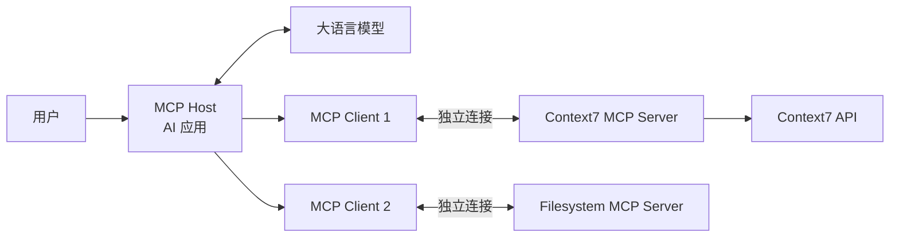
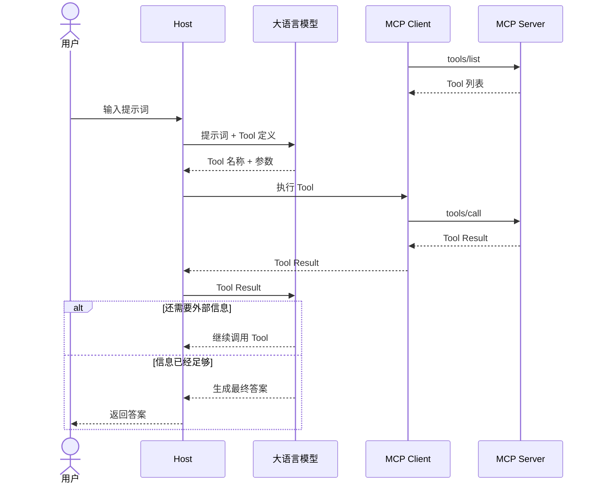

## MCP 是什么

MCP 的全称是 [Model Context Protocol](https://www.anthropic.com/news/model-context-protocol)，中文通常译为“模型上下文协议”。它是一套开放协议，用来连接 AI 应用与外部工具、数据和工作流。

Anthropic 在 2024 年 11 月 25 日开源了 MCP，目标是用一套通用协议，代替不同 AI 应用各自开发的工具接入方式。

可以从 Context7 查询技术文档的场景来理解 MCP：

1. 用户对 AI 说：“Next.js 的 Cache Components 怎么用？”
2. 模型判断需要查询最新的 Next.js 文档。
3. AI 应用通过 MCP 调用 Context7 提供的 Tool。
4. Context7 返回匹配的文档和代码示例。
5. 模型根据这些内容回答用户。

MCP 规定了第 3 步和第 4 步如何通信。它不负责模型推理，也不规定 Context7 如何建立文档索引。

## 为什么需要 MCP

如果不使用 MCP，每个 AI 应用都要单独适配外部系统。换一个 AI 客户端，工具定义、通信方式和错误处理可能都要重写。

MCP 把这些重复工作变成了统一协议：

| 对比项   | 单独开发             | 使用 MCP                 |
| -------- | -------------------- | ------------------------ |
| 获取工具 | 在代码中手动配置     | 通过标准方法获取列表     |
| 调用工具 | 每个应用使用不同格式 | 使用统一的 JSON-RPC 消息 |
| 本地连接 | 自己设计进程通信     | 使用标准 `stdio` 传输    |
| 远程连接 | 自己设计 HTTP 接口   | 使用 Streamable HTTP     |
| 复用工具 | 针对某个应用开发     | 可以接入多个兼容的 Host  |

MCP 的价值不在于少写一次 HTTP 请求，而在于降低 AI 应用与工具之间的耦合。Server 可以独立更新业务能力，Host 也可以独立更换模型。

不过，使用 MCP 不代表所有客户端的表现完全相同。不同 Client 支持的协议版本、功能和授权方式仍然可能不同。

## MCP 架构

MCP 包含三个核心角色：Host、Client 和 Server。

Host 是用户直接使用的 AI 应用；Client 是 Host 内部的协议组件；Server 则向 AI 应用提供外部能力。一个 Host 可以连接多个 Server，但会为每个 Server 创建独立的 Client。MCP 只规定 Client 与 Server 如何通信，不规定 Host 如何调用模型或管理对话。[MCP 架构说明](https://modelcontextprotocol.io/docs/2026-07-28/learn/architecture)



MCP 的 Client 与 Server 又分为两层：数据层使用 JSON-RPC 2.0 定义版本与能力发现、Tool、Resource、Prompt 和通知；传输层负责连接、消息分帧和授权，标准传输包括 `stdio` 与 Streamable HTTP。同一套数据层消息可以运行在不同传输上。

| 角色 | 核心职责 | 开发场景 |
| --- | --- | --- |
| Host | 管理用户交互、模型和多个 Client | 开发 AI 应用或 Agent 平台 |
| Client | 连接一个 Server，并执行 MCP 请求 | 为 Host 增加 MCP 接入能力 |
| Server | 通过 MCP 暴露工具、数据和提示模板 | 把现有系统接入兼容 MCP 的 AI 应用 |

如果只是把现有 API、数据库或本地程序提供给 AI 使用，通常开发 Server；如果在开发完整的 AI 应用，则还要实现 Host，并在 Host 内集成 Client。

## MCP Host

**Host 是用户直接使用的 AI 应用**，例如 AI 编程工具、桌面客户端或企业内部的 Agent。它管理用户交互、模型调用和多个 MCP Client，并决定哪些外部能力可以进入当前任务。

### Host 的结构

一个可用的 Host 通常包含以下模块：

| 模块 | 作用 |
| --- | --- |
| 交互层 | 接收提示词，展示 Tool 调用、授权请求和结果 |
| 对话与模型层 | 管理消息历史，调用模型，并解析模型返回的 Tool Call |
| Client 管理器 | 按 Server 创建、保存和关闭 Client，处理连接失败 |
| 能力目录 | 汇总各 Server 的 Tool、Resource 和 Prompt，并记录它们来自哪个 Server |
| 调度器 | 把模型的 Tool Call 路由到正确的 Client，再把结果交回模型 |
| 安全层 | 过滤可用能力，校验参数与权限，对高风险操作请求用户确认 |

Host 与模型之间没有 MCP 消息。模型 API、上下文裁剪、重试策略和 UI 都由 Host 自己实现；MCP SDK 只帮助它完成 Client 与 Server 之间的通信。

### 如何开发 MCP Host

实现 Host 时，可以沿着一次 Tool 调用的主线逐层搭建：

1. **管理 Server 配置**：保存本地 Server 的启动命令，或远程 Server 的 URL 与授权配置。凭证由 Host 安全保存，不能放进模型上下文。
2. **创建 Client**：每个 Server 对应一个 Client。Host 启动时按需连接，退出时关闭 Client；单个连接失败不应影响其他 Server。
3. **建立能力目录**：通过 Client 获取 Tool、Resource 和 Prompt。内部标识要同时包含 Server 与能力名称，避免两个 Server 提供同名 Tool 时路由错误。
4. **筛选模型可见能力**：根据当前任务、用户权限和 Token 预算，只把相关 Tool 交给模型。Resource 和 Prompt 是否进入上下文，也由 Host 决定。
5. **运行模型循环**：模型返回 Tool Call 后，Host 校验来源、参数和权限，通过对应 Client 执行；再把 Tool Result 加入模型输入，直到模型生成最终答案。
6. **处理用户参与**：删除、付款和对外发送等操作应先展示目标与参数并请求确认。Server 返回 `input_required` 时，Host 还要收集用户输入，再由 Client 重试原请求。

最小控制流程可以写成下面的伪代码。`model.generate()` 代表具体模型厂商的 API，不属于 MCP：

```typescript
let response = await model.generate({ messages, tools: registry.visibleTools() });

while (response.toolCalls.length > 0) {
  for (const call of response.toolCalls) {
    const target = registry.resolve(call.name);
    await permissions.check(target, call.arguments);
    const result = await target.client.callTool({
      name: target.toolName,
      arguments: call.arguments,
    });
    messages.push(toModelToolResult(call, result));
  }

  response = await model.generate({ messages, tools: registry.visibleTools() });
}
```

Host 必须把 Server 返回的文本视为不可信输入。Tool Result 可以给模型提供信息，但不能绕过 Host 的权限规则，也不能自行批准下一次高风险调用。官方的 [Client 最佳实践](https://modelcontextprotocol.io/docs/develop/clients/client-best-practices) 对工具筛选、用户控制和安全边界有更完整的说明。

## MCP Client

**Client 是 Host 内部的协议组件**。它与一个 MCP Server 直接通信，为 Host 提供发现和调用能力。Host 接入 Context7 与文件系统时，会创建两个 Client；同一个远程 Server 也可以同时服务来自不同 Host 的多个 Client。[MCP Client 说明](https://modelcontextprotocol.io/docs/2026-07-28/learn/client-concepts)

### Client 的结构

| 组成 | 作用 |
| --- | --- |
| Client 信息与能力 | 声明 Client 的名称、版本，以及它能处理的协议功能 |
| 传输层 | 使用 `stdio` 连接本地子进程，或使用 Streamable HTTP 连接远程端点 |
| 协议层 | 编解码 JSON-RPC，处理版本协商、请求 ID、错误、通知和请求元数据 |
| 功能 API | 提供 `listTools()`、`callTool()`、`listResources()`、`readResource()`、`listPrompts()` 等方法 |
| 生命周期 | 建立连接、处理超时或断开，并在结束时释放传输与子进程 |

Client 不负责模型推理，也不实现 Tool 的业务逻辑。它只把 Host 的操作转换成 MCP 请求，再把 Server 响应还原成 Host 可以处理的结构。

### 如何开发 MCP Client

不使用 SDK 时，需要自行实现 JSON-RPC、传输、版本协商、分页、通知和错误处理。实际项目通常直接使用官方 SDK。TypeScript SDK v2 将 Client 单独发布为 `@modelcontextprotocol/client`：[TypeScript SDK](https://github.com/modelcontextprotocol/typescript-sdk)

```shell
npm install @modelcontextprotocol/client
```

下面的 Client 启动一个本地 Server，通过 `stdio` 获取 Tool 列表并调用其中一个 Tool：

```typescript
import { Client } from "@modelcontextprotocol/client";
import { StdioClientTransport } from "@modelcontextprotocol/client/stdio";

const client = new Client(
  { name: "documentation-host", version: "1.0.0" },
  { versionNegotiation: { mode: "auto" } },
);

const transport = new StdioClientTransport({
  command: "node",
  args: ["./dist/server.js"],
});

try {
  await client.connect(transport);

  const { tools } = await client.listTools();
  console.log(tools.map((tool) => tool.name));

  const result = await client.callTool({
    name: "query-docs",
    arguments: {
      libraryId: "/vercel/next.js",
      query: "Cache Components 的基本用法",
    },
  });

  console.log(result.content);
} finally {
  await client.close();
}
```

`Client` 加一个 Transport 就构成了最小 Client。`StdioClientTransport` 会启动并管理本地 Server 子进程；远程 Server 则改用 `StreamableHTTPClientTransport`。`versionNegotiation: { mode: "auto" }` 会优先探测 `2026-07-28`，并在连接旧 Server 时回退到 2025 版握手；如果只允许新版，可以把 `mode` 设为 `{ pin: "2026-07-28" }`。[协议版本支持](https://ts.sdk.modelcontextprotocol.io/v2/protocol-versions)

生产实现还要补上以下处理：

- 遍历 `nextCursor`，不能假设一次 `listTools()` 就能返回全部结果
- 为远程连接实现 OAuth 或其他适用的授权流程，并安全保存凭证
- 区分 Tool 业务失败与 JSON-RPC 协议错误，决定是交给模型修正还是终止调用
- 响应列表变化通知，及时更新 Host 的能力目录
- 为超时、断开和进程退出记录可定位的错误，并在适合时重连

## MCP Server

**Server 是向 Client 提供外部能力的程序**。它可以运行在用户电脑上，也可以部署成远程服务；“Server”描述的是协议角色，不代表它一定是独立机器或 HTTP 服务。

### Server 的结构

一个 MCP Server 通常可以分成四层：

| 层次     | 作用                                                      |
| -------- | --------------------------------------------------------- |
| 传输入口 | 从 `stdio` 或 Streamable HTTP 接收和发送 MCP 消息         |
| 协议层   | 处理 JSON-RPC、版本与能力发现、参数校验、错误和通知       |
| 能力层   | 注册 Tool、Resource 和 Prompt，并把请求分发给对应 handler |
| 业务层   | 读取文件、查询数据库或调用业务 API，返回实际结果          |

MCP SDK 可以处理前三层的大部分通用工作，开发者仍要实现业务逻辑、身份认证、数据权限、限流和审计。不要把数据库连接、业务规则或第三方 API 调用直接写进协议分发代码；让 handler 调用独立的业务服务，更容易测试和复用。

Server 通过三类核心能力向 Client 提供上下文和操作：Tool、Resource 与 Prompt。[MCP Server Features](https://modelcontextprotocol.io/specification/2026-07-28/server)

| 类型     | 作用       | 适合做什么                    | 主要使用者    |
| -------- | ---------- | ----------------------------- | ------------- |
| Tool     | 可执行操作 | 查询库 ID、发送消息、创建记录 | 模型请求调用  |
| Resource | 可读取数据 | 文件内容、表结构、知识库条目  | Host 选择读取 |
| Prompt   | 可复用模板 | 代码审查、会议总结、故障排查  | 用户选择使用  |

#### Tool

Tool 是一个可以执行的**函数**。每个 Tool 都有名称、功能说明和参数 Schema；还可以声明结构化输出 Schema。

Client 通过 `tools/list` 获取 Tool 列表，再通过 `tools/call` 调用其中一个 Tool。Tool 既可以读取数据，也可以修改数据。因此，涉及付款、删除和对外发送的 Tool 必须在 Server 端检查身份与权限，Host 也应在执行前请求用户确认。

#### Resource

Resource 表示可以读取的**数据**，例如文件内容、数据库表结构或 API 文档。

每个 Resource 都有 URI。固定内容可以使用直接 URI，需要参数的内容可以使用 Resource Template。Host 可以先查看资源列表，再读取当前任务需要的内容。Resource 更适合提供上下文，不适合执行修改操作。

#### Prompt

Prompt 是一段可重复使用的**提示模板**。例如，团队可以提供固定的代码审查模板，让用户每次审查代码时直接使用。

Prompt 可以包含参数，也可以嵌入 Resource 内容或返回 Resource 链接。它还可以通过文字说明模型应该如何使用 Tool。它的主要作用是复用工作方法，而不是隐藏系统指令。[2026-07-28 Prompts](https://modelcontextprotocol.io/specification/2026-07-28/server/prompts)

### 如何开发 MCP Server

不使用 SDK 时，需要自己实现 JSON-RPC 2.0 消息解析、MCP 方法、返回结构和传输层。而`@modelcontextprotocol/server` 是官方 TypeScript Server SDK。当前 v2 稳定版实现了 `2026-07-28` 规范，也可以通过兼容层服务旧版 Client。相比按照规范手写 Server，它封装了协议解析、能力注册和传输适配。

主要 API 如下：

| API                                     | 作用                                                   |
| --------------------------------------- | ------------------------------------------------------ |
| `McpServer`                             | 创建高层 Server，管理能力、处理函数和协议分发          |
| `registerTool()`                        | 注册 Tool 的配置、Schema 和 handler                    |
| `registerResource()`                    | 注册固定 URI 或 `ResourceTemplate` 及读取回调          |
| `ResourceTemplate`                      | 定义带变量的 Resource URI，并可提供实例列表            |
| `registerPrompt()`                      | 注册 Prompt 的参数 Schema 和消息生成回调               |
| `completable()`                         | 为 Prompt 参数或 Resource Template 变量提供自动补全    |
| `fromJsonSchema()`                      | 把原始 JSON Schema 包装成 SDK 可校验的 Standard Schema |
| `inputRequired()`                       | 从 handler 返回 MRTR 的 `input_required` 结果          |
| `acceptedContent()` / `inputResponse()` | 在重试时读取并校验 Client 返回的输入                   |
| `createRequestStateCodec()`             | 为跨轮次的 `requestState` 签名并设置有效期             |
| `createMcpHandler()`                    | 把 Server 工厂包装成无状态的 Web Standard HTTP handler |
| `ProtocolError`                         | 从 Resource、Prompt 等回调返回协议错误                 |
| `ResourceNotFoundError`                 | 返回符合规范的 Resource 不存在错误                     |
| `Server` / `setRequestHandler()`        | 底层 API，用于手动处理协议方法或自定义扩展             |

`serveStdio()` 位于 `@modelcontextprotocol/server/stdio` 子路径，用来启动本地 Server。[SDK Server 文档](https://github.com/modelcontextprotocol/typescript-sdk/tree/main/docs/servers)

使用 `@modelcontextprotocol/server` 时，先创建一个 Server 工厂函数，并在其中完成以下步骤：

1. 调用 `new McpServer({ name, version })` 创建实例
2. 根据要公开的能力，选择性调用 `registerTool()`、`registerResource()` 或 `registerPrompt()`，并实现对应回调
3. 返回 `McpServer` 实例

最后使用 `serveStdio()` 或 `createMcpHandler()` 包装函数；关闭服务时再调用 `server.close()` 或 `handler.close()`。

注册回调必须满足以下返回约定：

| 注册 API                     | 回调返回值                                                  |
| ---------------------------- | ----------------------------------------------------------- |
| `registerTool()`             | `{ content: ContentBlock[], structuredContent?, isError? }` |
| `registerResource()`         | `{ contents: ResourceContent[] }`                           |
| `registerPrompt()`           | `{ messages: PromptMessage[] }`                             |
| `ResourceTemplate` 的 `list` | `{ resources: Resource[] }`；无法枚举时传 `list: undefined` |

Tool 和 Prompt 的 Schema 应使用 `z.object(...)` 等 Standard Schema。SDK 会在回调执行前校验输入。没有参数的 Tool 可以省略 `inputSchema`；此时回调的第一个参数是请求上下文 `ctx`，不是空参数对象。需要空参数对象时显式使用 `z.object({})`。

下面创建一个本地文档查询 Server。它借用 Context7 `query-docs` 的输入形式演示 SDK，不是 Context7 的源码：

```shell
npm install @modelcontextprotocol/server zod
npm install --save-dev typescript @types/node
```

```typescript
import { McpServer } from "@modelcontextprotocol/server";
import { serveStdio } from "@modelcontextprotocol/server/stdio";
import * as z from "zod/v4";
import { queryDocumentation } from "./documentation-service.js";

function createServer(): McpServer {
  const server = new McpServer({
    name: "documentation-server",
    version: "1.0.0",
  });

  server.registerTool("query-docs", {
    description: "根据 Library ID 和问题查询相关文档",
    inputSchema: z.object({
      libraryId: z.string().startsWith("/"),
      query: z.string().min(1),
    }),
  }, async ({ libraryId, query }) => ({
    content: [{
      type: "text",
      text: await queryDocumentation({ libraryId, query }),
    }],
  }));

  return server;
}

void serveStdio(createServer);
```

`queryDocumentation` 是开发者自己实现的业务函数。SDK 负责 Schema 校验和 MCP 通信，不负责文档检索。

远程 Server 使用同一个 `createServer` 工厂，只需要更换传输入口：

```typescript
import { createMcpHandler } from "@modelcontextprotocol/server";

const handler = createMcpHandler(createServer);
```

`createMcpHandler()` 返回 Web Standard handler。工厂会在每个 HTTP 请求中创建新的 `McpServer`，因此注册操作必须放在工厂内部；数据库连接池和缓存可以在模块级复用。[HTTP Serving](https://github.com/modelcontextprotocol/typescript-sdk/blob/main/docs/serving/http.md)

## MCP 的执行流程

用户只输入一句提示词，但 Agent 可能要在大模型和 MCP Server 之间往返多次。这里要先区分两类交互：Host 与模型之间的交互由 AI 应用自己实现；Client 与 Server 之间的交互才由 MCP 规定。

MCP 官方文档给出的 Tool 调用主线是：Client 获取 Tool 列表，模型选择 Tool，Client 调用 Tool，Server 返回结果，模型再处理结果。[MCP Tools](https://modelcontextprotocol.io/specification/2026-07-28/server/tools)



整个过程分为以下步骤。

1. **Client 确认 Server 能力**

   在 `2026-07-28` 中，Client 可以先发送 `server/discover`，获取 Server 支持的协议版本和能力，也可以直接发送后续请求。如果版本不兼容，Server 返回自己支持的版本，Client 选择双方都支持的版本后重试。[Server Discovery](https://modelcontextprotocol.io/specification/2026-07-28/server/discover)

2. **Client 获取 Tool 列表**

   Client 发送 JSON-RPC 请求，`method` 是 `tools/list`。Server 返回每个 Tool 的名称、说明和 `inputSchema`。Host 从中选择要提供给模型的 Tool。

   `2026-07-28` 要求每个请求的 `params._meta` 都携带协议版本和 Client 能力，通常也会携带 Client 名称与版本。`tools/list` 的响应包含 `resultType: "complete"` 和 Tool 列表。

3. **Host 把提示词和 Tool 交给模型**

   用户输入提示词后，Host 将提示词与 Tool 定义一起发给模型。模型返回要调用的 Tool 名称和参数；如果不需要外部信息，也可以直接回答。

   这一步不是 MCP 消息。不同模型 API 如何表示 Tool 定义和 Tool Call，由 Host 与模型 API 决定。

4. **Client 调用 Tool**

   Host 检查模型生成的 Tool 名称、参数和操作权限，然后让 Client 发送 `tools/call`。标准 JSON-RPC 结构如下：

   ```json
   {
     "jsonrpc": "2.0",
     "id": 2,
     "method": "tools/call",
     "params": {
       "name": "tool-name",
       "arguments": {},
       "_meta": {
         "io.modelcontextprotocol/protocolVersion": "2026-07-28",
         "io.modelcontextprotocol/clientCapabilities": {}
       }
     }
   }
   ```

   这份 JSON-RPC 消息可以通过两种标准传输发送：

   - 本地 Server 通常使用 `stdio`。Host 启动 Server 子进程，双方通过标准输入和标准输出逐行交换 JSON-RPC 消息
   - 远程 Server 通常使用 Streamable HTTP。Client 向 MCP 端点发送 `POST`，Server 返回 JSON 或本次请求对应的 SSE 流

   通过 Streamable HTTP 调用时，还要发送 `MCP-Protocol-Version`、`Mcp-Method`，以及调用具体 Tool 时的 `Mcp-Name` Header。Header 的值必须与 JSON-RPC 正文一致。[MCP 传输规范](https://modelcontextprotocol.io/specification/2026-07-28/basic/transports) [Streamable HTTP](https://modelcontextprotocol.io/specification/2026-07-28/basic/transports/streamable-http)

5. **Server 返回 Tool Result**

   Server 校验参数、执行 Tool，再用相同的 JSON-RPC `id` 返回结果：

   ```json
   {
     "jsonrpc": "2.0",
     "id": 2,
     "result": {
       "resultType": "complete",
       "content": [
         {
           "type": "text",
           "text": "Tool 返回的内容"
         }
       ]
     }
   }
   ```

   `resultType: "complete"` 表示本次调用已经完成。如果返回 `input_required`，Host 需要收集用户或 Client 的补充输入，Client 再用新的 JSON-RPC `id` 重试原请求，这就是 Multi Round-Trip Requests（MRTR）。

6. **模型继续判断**

   Host 把 Tool Result 交给模型。模型可能继续调用另一个 Tool，也可能认为信息已经足够并生成最终答案。这个循环由 Host 调度；MCP 只负责每一次 Client 与 Server 之间的请求和响应。

### Context7 调用实例

下面以 Context7 MCP 为例讲解这个过程。

先明确各个参与者在这个例子中代表什么：

| 参与者 | Context7 示例中的含义 |
| --- | --- |
| 用户 | 向 AI 编程工具询问 Next.js 用法的开发者 |
| Host | 用户正在使用的 AI 应用，负责对话、调用模型和管理 MCP |
| 大语言模型 | Host 使用的模型，负责理解问题、选择 Tool 和组织答案 |
| Client | Host 内部专门连接 Context7 MCP Server 的协议模块 |
| Server | Context7 提供的 MCP Server，可以作为本地进程运行，也可以通过远程端点访问 |

Context7 MCP Server 公开了两个核心 Tool：

| Tool | 输入 | 返回内容 |
| --- | --- | --- |
| `resolve-library-id` | `libraryName`：库名；`query`：用户要解决的问题 | 候选库及其 ID、说明、代码片段数量、来源可信度、评分，以及可用时的版本 |
| `query-docs` | `libraryId`：准确的 Library ID；`query`：要查询的单一问题 | 与问题相关的文档和代码示例 |

通常先调用 `resolve-library-id`，再调用 `query-docs`。如果用户已经提供 `/org/project` 或 `/org/project/version` 格式的 Library ID，可以跳过第一次调用。

> **版本说明：**截至 2026 年 8 月 5 日，Context7 公开的 MCP 包版本为 `3.2.5`，仍依赖 `@modelcontextprotocol/sdk 1.29.0`，HTTP 实现也仍然管理 `Mcp-Session-Id`。所以下面的业务步骤来自 Context7 真实源码，但线上传输使用哪一版 MCP，要以 Client 与 Server 实际协商的版本为准，不能据此认定 Context7 已经使用 `2026-07-28`。[Context7 package.json](https://github.com/upstash/context7/blob/master/packages/mcp/package.json)

假设用户输入：“Next.js 的 Cache Components 怎么用？”从输入到答案会经历以下步骤。

1. **Host 准备 Context7 Tool**

   在用户提问前或首次使用时，Host 中的 Context7 Client 向 Context7 Server 发送 `tools/list`。Server 返回 `resolve-library-id` 和 `query-docs` 的名称、说明与参数 Schema。Host 保存这些定义，准备交给模型。

   Context7 可以通过本地 `stdio` 或远程 HTTP 接入。选择哪种传输只影响 JSON-RPC 消息如何到达 Server，不改变 Tool 的名称和参数。

2. **用户输入提示词**

   Host 收到字符串“Next.js 的 Cache Components 怎么用？”，再把这句话和两个 Context7 Tool 的定义一起发送给大语言模型。这是 Host 与模型之间的数据传递，不经过 MCP。

3. **模型选择 `resolve-library-id`**

   模型判断需要先确认 Next.js 在 Context7 中的准确 Library ID，于是向 Host 返回一个结构化 Tool Call：

   ```json
   {
     "name": "resolve-library-id",
     "arguments": {
       "libraryName": "Next.js",
       "query": "Next.js 的 Cache Components 怎么用？"
     }
   }
   ```

   这仍然是模型 API 的输出，不是 MCP 消息。Host 检查 Tool 名称和参数后，才交给 Context7 Client。

4. **Client 发送第一次 MCP 调用**

   Client 把上面的名称和参数放进 `tools/call` JSON-RPC 请求。如果使用 `stdio`，消息写入 Context7 Server 进程的标准输入；如果使用 HTTP，消息放在发往 MCP 端点的 `POST` 正文中。

   Context7 源码收到请求后调用 `searchLibraries(query, libraryName, ...)`。公开源码只表明它通过 Context7 API 查找候选库，本文不推测 API 内部如何建立索引和排序。

5. **Context7 返回候选库**

   Context7 Server 将候选库格式化为文本 Tool Result。每个候选项可以包含 Library ID、说明、代码片段数量、来源可信度、评分和可用版本。Client 把这个 MCP 响应交给 Host，Host 再把文本结果交给模型。

   `/vercel/next.js` 是 Context7 官方 README 使用的 Library ID 示例。实际调用时应从本次结果中选择，不能让模型凭空拼接 ID。

6. **模型选择 `query-docs`**

   模型阅读候选库后，选择匹配的 Library ID，并向 Host 返回第二个 Tool Call：

   ```json
   {
     "name": "query-docs",
     "arguments": {
       "libraryId": "/vercel/next.js",
       "query": "Next.js Cache Components 的启用方式和基本用法"
     }
   }
   ```

   Context7 要求 `query` 聚焦一个具体问题。第一次调用的结果已经进入模型上下文，所以模型能够把选中的 `libraryId` 明确放进第二次调用，而不需要 Server 记住上一次选择。

7. **Client 查询文档**

   Host 检查参数后，Client 再发送一次 `tools/call`。Context7 Server 校验 `libraryId` 和 `query`，然后调用源码中的 `fetchLibraryContext({ query, libraryId }, ...)`。Context7 API 返回的文档文本被放进 Tool Result 的 `content` 中，再按 Server → Client → Host 的顺序返回。

   这两次调用都是各自完成的 Tool 调用：第一次找库，第二次查文档。它们是模型根据上一次结果作出的连续决策，不是 `input_required` 和 MRTR。

8. **模型生成最终答案**

   Host 将 Context7 返回的文档和代码示例加入模型输入。模型结合用户最初的问题生成答案，Host 再把答案显示给用户。Context7 的工作到返回 Tool Result 为止；如何组织最终答案由模型和 Host 决定。

### 无状态改了什么

`2026-07-28` 把 MCP 改成了无状态协议。这里的“状态”特指 Client 与 Server 之间由 MCP 维护的协议会话，不是 Agent 的聊天记录，也不是 Context7 保存的文档数据。

旧版先建立会话，再在这个会话中发送请求。新版则让每个请求都带上处理它所需的协议元数据，Server 不需要记住上一次请求。

| 对比项 | `2025-11-25` | `2026-07-28` |
| --- | --- | --- |
| 开始通信 | 先执行 `initialize` 和 `initialized` 握手 | 删除初始化握手，可以直接发送请求 |
| 版本与能力 | 在初始化时交换，后续请求依赖会话中的信息 | 每个请求都在 `_meta` 中携带协议版本和 Client 能力，通常也携带 Client 信息 |
| Server 信息 | 从初始化结果中获得 | 可通过 `server/discover` 主动查询 |
| HTTP 会话 | Server 可以分配 `Mcp-Session-Id` | 删除协议层会话 ID |
| 持续通知 | 可以使用独立的 `GET` SSE 流和 `Last-Event-ID` 续传 | 改用 `subscriptions/listen`，流不再支持断点续传 |
| 中途补充信息 | Server 可以通过已有连接向 Client 发起请求 | 返回 `input_required`，Client 收集输入后重试原请求 |
| 成功结果 | 没有统一的完成状态字段 | 必须通过 `resultType` 表明完成或等待输入 |

Client 可以先调用 `server/discover` 查询 Server 支持的版本和能力，也可以直接发送业务请求。如果版本不兼容，Server 返回 `UnsupportedProtocolVersionError` 和自己支持的版本，Client 选择双方都支持的版本后重试。[Server Discovery](https://modelcontextprotocol.io/specification/2026-07-28/server/discover) [版本协商](https://modelcontextprotocol.io/specification/2026-07-28/basic/versioning)

如果 Client 还要连接旧版 Server，可以先尝试 `server/discover`，失败后再回退到旧版 `initialize`。只支持 `2026-07-28` 的 Server 会忽略旧版的 `Mcp-Session-Id` 和 `Last-Event-ID`，并对 MCP 端点的 `GET` 和 `DELETE` 请求返回 `405 Method Not Allowed`。[2026-07-28 变更说明](https://modelcontextprotocol.io/specification/2026-07-28/changelog)

### 无状态的影响

| 对象 | 带来的变化 |
| --- | --- |
| 用户 | 仍然输入提示词并接收答案，使用方式基本不变 |
| Agent / Client | 每个请求都要带完整元数据；兼容旧 Server 时需要保留旧版连接流程 |
| MCP Server | 不再保存协议初始化和会话信息，但要校验每个请求的版本和能力 |
| 部署系统 | 任意 Server 实例都能处理请求，不再依赖粘性会话或共享的协议会话存储 |

无状态更适合远程服务扩容和故障切换，代价是每个请求会多携带一些元数据，Client 和 Server 也要适配新的消息格式。

Agent 和业务仍然可以保存状态，只是不能依赖 MCP 的隐式会话。在 Context7 的例子中，第一次调用返回 Library ID，第二次调用会明确传入 `libraryId: "/vercel/next.js"`。在无状态规范下，Server 只看第二次请求也知道要查询哪个库，不需要记住第一次调用。Agent 的对话历史和第一次调用结果仍由 Host 管理。

## MCP 的 Token 消耗

MCP Server 运行时不会直接消耗模型 Token。只有进入模型输入和输出的内容，才会产生 Token 消耗。

### 哪些内容消耗 Token

与 MCP 有关的 Token 主要来自以下内容：

- **工具定义**：工具名称、说明和参数结构可能会发送给模型
- **调用参数**：模型生成的工具名称和参数属于输出内容
- **工具结果**：Server 返回的文本或 JSON 可能会加入下一轮模型输入
- **多轮调用**：每增加一轮调用，都可能重复携带之前的上下文
- **资源和模板**：Resource 和 Prompt 被加入模型输入后才会消耗 Token

Client 调用 `tools/list` 本身不消耗模型 Token。只有 Host 把工具定义发送给模型后，这部分内容才会进入上下文。

### 如何测量

应从模型 API 的实际用量中测量 Token：

1. 记录不启用 MCP 时的 Token，作为基线
2. 启用 MCP，记录 Host 最终发送给模型的工具定义
3. 分别记录每轮调用参数和工具结果
4. 对比模型 API 返回的输入、输出和缓存 Token
5. 分别测试正常调用、错误重试和多轮调用

不同模型使用不同的分词器（tokenizer）和计费规则。某个模型上的测量结果不能直接套用到其他模型。

### 如何减少消耗

减少 Token 的关键，是少给模型无关信息：

- 缩短工具说明，但保留用途、使用条件和副作用
- 删除重复参数，为字段设置明确的类型和取值范围
- 列表结果使用分页，不要一次返回全部数据
- 只返回模型下一步需要的字段
- 不要把完整日志、HTML 和原始 API 响应交给模型
- 根据当前任务，只启用相关的 Server 和 Tool
- 工具较多时，先搜索候选工具，再加载完整定义
- 用普通程序处理固定步骤，减少中间结果

官方 Client 最佳实践也建议使用渐进式工具发现，避免一次加载全部工具。[Client Best Practices](https://modelcontextprotocol.io/docs/develop/clients/client-best-practices)

## MCP 的限制

MCP 只统一了连接方式。它不能消除模型错误，也不能代替业务系统本身的安全设计。

### 客户端能力不同

不同 Client 支持的协议版本和功能可能不同。有些 Client 支持 Tool，但不一定完整支持 Resource、Prompt 或远程授权。开发完成后，需要在目标 Client 中分别测试。

### 工具过多

Tool 越多，模型需要阅读的定义越多，也越容易选错。Host 应根据任务和权限只提供相关 Tool。工具数量继续增加时，可以加入工具搜索功能。

### 调用会增加延迟

每次 Tool 调用都包含模型推理、MCP 通信和业务处理。一个任务连续调用多个 Tool 时，等待时间会逐步增加。

### 模型可能选错

Schema 只能检查参数格式，不能保证模型选对 Tool 或理解正确的业务含义。高风险操作仍然需要服务端规则和用户确认。

### MCP 不负责权限

MCP 不会自动提供用户身份、租户隔离和数据权限。Server 不能因为请求来自可信 Host，就跳过业务系统的权限检查。

### MCP 不替代业务 API

网页、移动应用和服务之间的固定调用，仍然适合使用 REST、GraphQL、gRPC 或消息队列。MCP 更适合连接 AI 应用，不适合代替系统中的全部通信方式。
