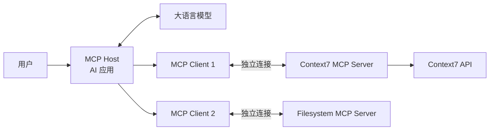
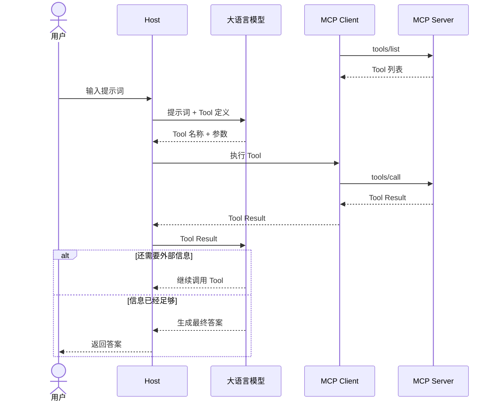

> 本文内容以 MCP -  [2026-07-28](https://modelcontextprotocol.io/specification/2026-07-28) 版本为基础。

## MCP 是什么

MCP 的全称 [Model Context Protocol](https://www.anthropic.com/news/model-context-protocol)，中文通常译为“模型上下文协议”，是 Anthropic 在 2024 年 11 月 25 日开源的是一套开放**协议**，用来连接 AI 应用与外部工具、数据和工作流。


### 角色

在 MCP 协议中，参与者分为三层：Host、Client 和 Server。

|        | 角色                        | 核心职责                                   | 开发场景                          |
| ------ | --------------------------- | ------------------------------------------ | --------------------------------- |
| Host   | 用户端 AI 应用              | 管理用户交互、模型和多个 Client            | 开发 AI 应用或 Agent 平台         |
| Client | Host 内部连接 Server 的组件 | 连接 Server，并执行 MCP 请求               | 为 Host 增加 MCP 接入能力         |
| Server | 服务端                      | 接入 Client 请求，暴露工具、数据和提示模板 | 把现有系统接入兼容 MCP 的 AI 应用 |

**一个 Host 可以创建多个 Client 实例，每一个 Client 实例连接一个 Server**，关系如下：



### 数据格式

> https://modelcontextprotocol.io/specification/2026-07-28/basic/index#meta

MCP 的核心部分是定义 Client 和 Server 之间的数据格式和通信方式。

首先，数据格式 [JSON-RPC 2.0 规范](https://www.jsonrpc.org/specification#overview)约束，JSON-RPC 2.0 是建立在 JSON 数据格式之上的远程调用协议，规定请求、响应、通知和错误必须采用什么数据结构。

MCP 基于 JSON-ROC 2.0 的规范要求请求数据格式如下：

```typescript
{
  jsonrpc: "2.0";          // JSON-RPC版本，只能是 "2.0"
  id: string | number;     // 由客户端建立的消息唯一标识符，必须使用字符串、数字
  method: string;          // 一个包含要调用的方法名称的字符串
  params?: {               //  一个结构化值，用于存储在方法调用期间要使用的参数值，没有的话可以省略
    [key: string]: unknown;
  }
}
```

响应结构如下：

```typescript
{
  jsonrpc: "2.0";          
  id: string | number;     // 结果响应必须包含与其对应的请求的相同 ID
  result: {                // 响应成功的结果，响应出错时不能携带
    resultType: string;    // 必须包含结果类型
    [key: string]: unknown;
  };
  error: {                 // 响应错误时必须使用
    code: number;          // 错误表示，必须是整数
    message: string;       // 错误信息
    data?: unknown;        // 额外错误数据，可以不包含
  }
}
```

- `resultType` 为 `"complete"` 表示请求成功完成，结果包含最终内容。
- `resultType` 为 `"input_required"` 表示请求不完整，需要更多信息来处理请求。

由于 MCP 是无状态协议，因此每个请求都必须在`params`中使用`_meta` 字段指定 MCP 协议的版本和客户端功能，客户端还应在其中包含其身份，例如：

```json
{
  "jsonrpc": "2.0",
  "id": 1,
  "method": "server/discover",
  "params": {
    "_meta": {
      // 客户端在此请求中使用的版本
      "io.modelcontextprotocol/protocolVersion": "2026-07-28",
      // 客户端信息，用于调试和兼容性的身份和版本信息
      "io.modelcontextprotocol/clientInfo": {
        "name": "example-client",
        "version": "1.0.0"
      },
      // 客户端能力
      "io.modelcontextprotocol/clientCapabilities": {
        "elicitation": {}
      }
    }
  }
}
```

而响应中也需要使用`_meta` 字段指定服务器软件的名称和版本：

```json
"_meta": {
  "io.modelcontextprotocol/serverInfo": {
    "name": "ExampleServer",
    "version": "1.0.0"
  }
}
```

### 数据传输方式

MCP 支持两种数据传输方式，其实主要就是 Server 部署方式的区别：

#### stdio 传输

stdio 传输也就是通过操作系统进程管道传输，Client 和 Server 只在本地进行通信，无远程建立连接的延迟消耗。

它的特点是：

- 不启动 HTTP 服务；
- 不需要占用端口；
- 通常只能在同一台机器上使用；
- Server 的生命周期由 Client 管理；
- Client 关闭输入流后，Server 通常随之退出；
- 每个 Server 进程通常只服务一个 Client；
- `stdout` 只能传输 MCP 消息，日志必须写入 `stderr`。

#### 流式 HTTP 传输

 Client 需要连接远程部署的 Server，使用 HTTP POST 进行客户端到服务器的消息传递，并可选使用服务器发送事件（Server-Sent Events）以实现流式传输功能。

远程 Server 的特点是：

- 可以部署在远程服务器；
- 多个 Client 可以共用一个服务；
- 可以使用 HTTPS、OAuth、Token；
- 可以接入负载均衡、网关、限流和监控；
- 适合 GitHub、Sentry、数据库平台等托管型 MCP 服务；
- Server 不随某个 Client 断开而退出。

| 对比项          | stdio                               | Streamable HTTP                 |
| --------------- | ----------------------------------- | ------------------------------- |
| 使用场景        | 本地 MCP Server                     | 远程、云端 MCP Server           |
| Server 启动方式 | Client 启动 Server 子进程           | Server 作为独立服务长期运行     |
| 通信通道        | `stdin` / `stdout` 管道             | HTTP POST，可配合 SSE 返回流    |
| 地址            | 不需要 URL 和端口                   | 需要 MCP HTTP Endpoint          |
| 客户端数量      | 通常一个 Server 进程服务一个 Client | 一个 Server 可服务多个 Client   |
| 进程生命周期    | 通常由 Client 管理                  | 由部署平台或 Server 自己管理    |
| 身份认证        | 通常依赖本机权限                    | 一般需要 OAuth、Token 等认证    |
| 网络基础设施    | 不需要                              | 可接入网关、负载均衡、WAF、监控 |
| 适合部署        | npm CLI、Python 脚本、本地程序      | SaaS、企业服务、远程 API        |

## 为什么需要 MCP

如果不使用 MCP，每个 AI 应用都要单独适配外部系统。换一个 AI 客户端，工具定义、通信方式和错误处理可能都要重写。

MCP 把这些重复工作变成了统一协议：

| 对比项   | 单独开发             | 使用 MCP                 |
| -------- | -------------------- | ------------------------ |
| 获取工具 | 在代码中手动配置     | 通过标准方法获取列表     |
| 调用工具 | 每个应用使用不同格式 | 使用统一的 JSON-RPC 消息 |
| 本地连接 | 自己设计进程通信     | 使用标准 `stdio` 传输    |
| 远程连接 | 自己设计 HTTP 接口   | 使用 Streamable HTTP     |
| 复用工具 | 针对某个应用开发     | 可以接入多个兼容的 Host  |

## 开发SDK

MCP 官方提供了许多编程语言的 SDK 来帮助实现 MCP 的 Client - Server 架构：

| SDK                                                   | Repository                                                   |
| :---------------------------------------------------- | :----------------------------------------------------------- |
| [TypeScript](https://ts.sdk.modelcontextprotocol.io/) | [modelcontextprotocol/typescript-sdk](https://github.com/modelcontextprotocol/typescript-sdk) |
| [Python](https://py.sdk.modelcontextprotocol.io/)     | [modelcontextprotocol/python-sdk](https://github.com/modelcontextprotocol/python-sdk) |
| [C#](https://csharp.sdk.modelcontextprotocol.io/)     | [modelcontextprotocol/csharp-sdk](https://github.com/modelcontextprotocol/csharp-sdk) |
| [Go](https://go.sdk.modelcontextprotocol.io/)         | [modelcontextprotocol/go-sdk](https://github.com/modelcontextprotocol/go-sdk) |
| [Java](https://java.sdk.modelcontextprotocol.io/)     | [modelcontextprotocol/java-sdk](https://github.com/modelcontextprotocol/java-sdk) |
| [Rust](https://rust.sdk.modelcontextprotocol.io/)     | [modelcontextprotocol/rust-sdk](https://github.com/modelcontextprotocol/rust-sdk) |
| [Ruby](https://ruby.sdk.modelcontextprotocol.io/)     | [modelcontextprotocol/ruby-sdk](https://github.com/modelcontextprotocol/ruby-sdk) |
| Swift                                                 | [modelcontextprotocol/swift-sdk](https://github.com/modelcontextprotocol/swift-sdk) |
| [PHP](https://php.sdk.modelcontextprotocol.io/)       | [modelcontextprotocol/php-sdk](https://github.com/modelcontextprotocol/php-sdk) |
| [Kotlin](https://kotlin.sdk.modelcontextprotocol.io/) | [modelcontextprotocol/kotlin-sdk](https://github.com/modelcontextprotocol/kotlin-sdk) |

大多数 MCP 会选择使用 Python 实现，有前端开发基础可以选择 [TypeScript SDK V2](https://ts.sdk.modelcontextprotocol.io/v2/)，其主要提供两个包：

- **`@modelcontextprotocol/server`**：搭建 MCP Server；
- **`@modelcontextprotocol/client`**：搭建 Client 组件，连接 Server

除此之外，还有以下辅助包：

| 包                              | 适配目标          | 主要作用                                                     |
| ------------------------------- | ----------------- | ------------------------------------------------------------ |
| `@modelcontextprotocol/node`    | Node.js 原生 HTTP | 在 Node `IncomingMessage/ServerResponse` 与 Web `Request/Response` 之间转换 |
| `@modelcontextprotocol/express` | Express           | 创建预配置的 Express MCP 应用、解析 JSON、添加安全校验       |
| `@modelcontextprotocol/hono`    | Hono              | 创建预配置的 Hono MCP 应用，适合 Workers、Deno、Bun 等       |
| `@modelcontextprotocol/fastify` | Fastify           | 创建预配置的 Fastify MCP 应用和安全钩子                      |

## MCP Host

**Host 是用户直接使用的 AI 应用**，例如 AI 编程工具、桌面客户端或企业内部的 Agent。它管理用户交互、模型调用和多个 MCP Client，并决定哪些外部能力可以进入当前任务。

### Host 的结构

一个可用的 Host 通常包含以下模块：

| 模块 | 作用 |
| --- | --- |
| 交互层 | 接收提示词，展示 Tool 调用、授权请求和结果 |
| 对话与模型层 | 管理消息历史，调用模型，并解析模型返回的 Tool Call |
| Client 管理器 | **按 Server 创建、保存和关闭 Client，处理连接失败** |
| 能力目录 | 汇总各 Server 的 Tool、Resource 和 Prompt，并记录它们来自哪个 Server |
| 调度器 | 把模型的 Tool Call 路由到正确的 Client，再把结果交回模型 |
| 安全层 | 过滤可用能力，校验参数与权限，对高风险操作请求用户确认 |

Host 与模型之间没有 MCP 消息。模型 API、上下文裁剪、重试策略和 UI 都由 Host 自己实现；MCP SDK 只帮助它完成 Client 与 Server 之间的通信。

### 如何开发 MCP Host

实现 Host 时，可以沿着一次 Tool 调用的主线逐层搭建：

1. **管理 Server 配置**：保存本地 Server 的启动命令，或远程 Server 的 URL 与授权配置。凭证由 Host 安全保存，不能放进模型上下文。
2. **创建 Client**：每个 Server 对应一个 Client。Host 启动时按需连接，退出时关闭 Client；单个连接失败不应影响其他 Server。
3. **建立能力目录**：通过 Client 获取 Tool、Resource 和 Prompt。内部标识要同时包含 Server 与能力名称，避免两个 Server 提供同名 Tool 时路由错误。
4. **筛选模型可见能力**：根据当前任务、用户权限和 Token 预算，只把相关 Tool 交给模型。Resource 和 Prompt 是否进入上下文，也由 Host 决定。
5. **运行模型循环**：模型返回 Tool Call 后，Host 校验来源、参数和权限，通过对应 Client 执行；再把 Tool Result 加入模型输入，直到模型生成最终答案。
6. **处理用户参与**：删除、付款和对外发送等操作应先展示目标与参数并请求确认。Server 返回 `input_required` 时，Host 还要收集用户输入，再由 Client 重试原请求。

最小控制流程可以用下面的伪代码表示，其中`model.generate()` 代表具体模型厂商的 API，不属于 MCP：

```typescript
let response = await model.generate({ messages, tools: registry.visibleTools() });

while (response.toolCalls.length > 0) {
  for (const call of response.toolCalls) {
    const target = registry.resolve(call.name);
    await permissions.check(target, call.arguments);
    const result = await target.client.callTool({
      name: target.toolName,
      arguments: call.arguments,
    });
    messages.push(toModelToolResult(call, result));
  }

  response = await model.generate({ messages, tools: registry.visibleTools() });
}
```

Host 必须把 Server 返回的文本视为不可信输入。Tool Result 可以给模型提供信息，但不能绕过 Host 的权限规则，也不能自行批准下一次高风险调用。官方的 [Client 最佳实践](https://modelcontextprotocol.io/docs/develop/clients/client-best-practices) 对工具筛选、用户控制和安全边界有更完整的说明。

## MCP Client

> [Client 核心概念](https://modelcontextprotocol.io/docs/2026-07-28/learn/client-concepts)

**Client 是 Host 内部的协议组件**。它与一个 MCP Server 直接通信，为 Host 提供发现和调用能力。

### Client 的能力

#### 1. 连接并维护与 Server 的通信

一个 Client 对应一个 Server；一个 Host 可以创建多个 Client，Client 负责：

- 连接特定的 MCP Server
- 选择和使用 stdio、Streamable HTTP 等 Transport
- 发送、接收 JSON-RPC 消息
- 处理协议版本、能力信息、错误、取消和进度
- 关闭连接及管理本地 Server 进程生命周期

#### 2. 使用 Server 提供的能力

这是 Client 最核心、最常用的能力：

| Server 能力   | Client 的操作                          | TS SDK API                         |
| ------------- | -------------------------------------- | ---------------------------------- |
| Tools         | 获取 Server 的工具列表、调用工具       | listTools()、callTool(...)         |
| Resources     | 获取 Server 的资源列表、读取或订阅资源 | listResources()、readResource(...) |
| Prompts       | 获取 Server 的提示词列表、读取提示词   | listPrompts()、getPrompt(...)      |
| Completion    | 请求参数或提示词补全                   |                                    |
| Notifications | 接收工具、资源等发生变化的通知         |                                    |

#### 3. 处理 Server 的引导

允许服务器在交互过程中向用户请求特定信息（Elicitation），为服务器按需收集信息。

### 如何开发 MCP Client

Client 的主要能力就是管理连接 MCP Server 的能力，且一个 Client 只能连接一个 Server。以 `@modelcontextprotocol/client` 为例，开发 Client 主要有以下几步：

```typescript
import { Client } from "@modelcontextprotocol/client";
import { StdioClientTransport } from "@modelcontextprotocol/client/stdio";

// 1. 创建 Client 实例
const client = new Client(
  { name: "documentation-host", version: "1.0.0" },
  { versionNegotiation: { mode: "auto" } },
);

// 2. 创建本地连接实例
const transport = new StdioClientTransport({
  command: "node",
  args: ["./dist/server.js"],
});

try {
  // 3. 建立连接
  await client.connect(transport);

  // 4. 获取服务端工具
  const { tools } = await client.listTools();
  console.log(tools.map((tool) => tool.name));

  // 5. 调用某个工具
  const result = await client.callTool({
    name: "query-docs",
    arguments: {
      libraryId: "/vercel/next.js",
      query: "Cache Components 的基本用法",
    },
  });

  console.log(result.content);
} finally {
  // 关闭连接
  await client.close();
}
```

`Client` 加一个 Transport 就构成了最小 Client。`StdioClientTransport` 会启动并管理本地 Server 子进程；远程 Server 则改用 `StreamableHTTPClientTransport`。`versionNegotiation: { mode: "auto" }` 会优先探测 `2026-07-28`，并在连接旧 Server 时回退到 2025 版握手；如果只允许新版，可以把 `mode` 设为 `{ pin: "2026-07-28" }`。

Client 的其他能力在 TS SDK 中都有提供对应 API，可参考 [API Reference](https://ts.sdk.modelcontextprotocol.io/v2/api/@modelcontextprotocol/client/)

## MCP Server

**Server 是向 Client 提供外部能力的程序**。它可以运行在用户电脑上，也可以部署成远程服务.

### Server 的能力

> [Server Feature](https://modelcontextprotocol.io/specification/2026-07-28/server)

#### Discovery

首先，Server 必须实现 Discovery 能力，也就是`server/discover`方法，该方法允许 Client 在发送任何其他请求之前查询服务器支持的协议版本、功能和身份。

Client 在请求获取服务器信息时除了标准的 `_meta` 之外不携带任何其他请求体参数，方法为`server/discover`

```json
{
  "jsonrpc": "2.0",
  "id": "discover-1",
  "method": "server/discover",
  "params": {
    "_meta": {
      "io.modelcontextprotocol/protocolVersion": "2026-07-28",
      "io.modelcontextprotocol/clientInfo": {
        "name": "ExampleClient",
        "version": "1.0.0"
      },
      "io.modelcontextprotocol/clientCapabilities": {}
    }
  }
}
```

Server 在收到`server/discover`请求时，返回支持的协议版本、功能和身份：

- `supportedVersions` : 服务器支持的协议版本。客户端应在后续请求中选择其中之一
- `capabilities` : 服务器支持的功能（工具、资源、提示等）
- `instructions` : 可选的自然语言指导，用于指导大型语言模型如何有效使用此服务器

```json
{
  "jsonrpc": "2.0",
  "id": "discover-1",
  "result": {
    "_meta": {
      "io.modelcontextprotocol/serverInfo": {
        "name": "ExampleServer",
        "version": "1.0.0"
      }
    },
    "resultType": "complete",
    "supportedVersions": ["2026-07-28"], 
    "capabilities": {
      "tools": {},
      "resources": {}
    },
    "instructions": "This server provides weather and resource utilities.",
    "ttlMs": 3600000,
    "cacheScope": "public"
  }
}
```

其次，Server 通过三类核心能力向 Client 提供上下文和操作：Tool、Resource 与 Prompt。

| Server 能力   | 作用                                                | 协议方法                           |
| ------------- | --------------------------------------------------- | ---------------------------------- |
| **Tools**     | 提供可执行操作，例如查询数据库、调用 API 或执行计算 | `tools/list`、`tools/call`         |
| **Resources** | 提供可读取的数据和上下文                            | `resources/list`、`resources/read` |
| **Prompts**   | 提供可复用的提示词或工作流模板                      | `prompts/list`、`prompts/get`      |

#### Tools

Tools 使 AI 模型能够执行操作。每个 Tool 定义了一个特定的操作，具有输入和输出类型。模型根据上下文请求 Tools 执行。

| 方法         | 用途         | 返回值                     |
| :----------- | :----------- | :------------------------- |
| `tools/list` | 发现可用工具 | 包含工具定义和模式的工具集 |
| `tools/call` | 执行特定工具 | 工具执行结果               |

Tool 的数据结构定义有严格的约束：

- `name` : 工具的唯一标识符，应在 Server 内保持唯一，长度应在 1 到 128 个字符之间，只能使用大写和小写 ASCII 字母（A-Z，a-z）、数字（0-9）、下划线（_）、连字符（-）和点（.），且区分大小写
- `title` : 用于显示的可选的人类可读工具名称。
- `description` : 功能的易读性描述
- `icons` : 可选的图标数组，用于在用户界面中显示
- `inputSchema` : 定义预期参数的 JSON Schema
  - 遵循 JSON Schema 使用指南
  - 默认为 2020-12，如果没有 `$schema` 字段
  - 必须是有效的 JSON Schema 对象（不是 `null` ）
  - 对于没有参数的工具，使用以下有效方法之一：
    - `{"type":"object","additionalProperties":false}` - 推荐：显式仅接受空对象
    - `{"type":"object"}` - 接受任何对象（包括具有属性的）
  - 属性可以包含 `x-mcp-header` 注释以将参数值暴露为 HTTP 头部
- `outputSchema` : 可选的 JSON Schema，定义预期输出结构
  - 遵循 JSON Schema 使用指南
  - 默认为 2020-12，如果没有 `$schema` 字段
- `annotations` : 描述工具行为的可选属性

import Tabs from '@theme/Tabs';

import TabItem from '@theme/TabItem';


<Tabs>

 <TabItem label="tools/list 请求" value="request" default>

```json
{
  "jsonrpc": "2.0",
  "id": 1,
  "method": "tools/list",
  "params": {
    "cursor": "optional-cursor-value"
  }
}
```

</TabItem>

<TabItem label="响应" value="response">

```json
{
  "jsonrpc": "2.0",
  "id": 1,
  "result": {
    "resultType": "complete",
    "tools": [
      {
        "name": "get_weather",
        "title": "Weather Information Provider",
        "description": "Get current weather information for a location",
        "inputSchema": {
          "type": "object",
          "properties": {
            "location": {
              "type": "string",
              "description": "City name or zip code"
            }
          },
          "required": ["location"]
        },
        "icons": [
          {
            "src": "https://example.com/weather-icon.png",
            "mimeType": "image/png",
            "sizes": ["48x48"]
          }
        ]
      }
    ],
    "nextCursor": "next-page-cursor",
    "ttlMs": 300000,
    "cacheScope": "public"
  }
}
```

</TabItem>

</Tabs>


<Tabs>

 <TabItem label="tools/call 请求" value="request" default>

```json
{
  "jsonrpc": "2.0",
  "id": 2,
  "method": "tools/call",
  "params": {
    "name": "get_weather",
    "arguments": {
      "location": "New York"
    }
  }
}
```

</TabItem>

<TabItem label="响应" value="response">

```json
{
  "jsonrpc": "2.0",
  "id": 2,
  "result": {
    "resultType": "complete",
    "content": [
      {
        "type": "text",
        "text": "Current weather in New York:\nTemperature: 72°F\nConditions: Partly cloudy"
      }
    ],
    "isError": false
  }
}
```

</TabItem>

</Tabs>

#### Resources

Resource 表示可以读取的**数据**，例如文件内容、数据库表结构或 API 文档。

| 方法                       | 用途               | 返回值             |
| :------------------------- | :----------------- | :----------------- |
| `resources/list`           | 列出可用的直接资源 | 资源描述符数组     |
| `resources/templates/list` | 发现资源模板       | 资源模板定义数组   |
| `resources/read`           | 检索资源内容       | 带元数据的资源数据 |
| `subscriptions/listen`     | 监控资源变化       | 更新通知流         |

资源的数据结构如下：

- `uri` ：资源的唯一标识符，可以使用 https://，file://，git://，也可以自定义但必须符合 RFC3986
- `name` ：资源的名称。
- `title` ：资源可选的人类可读名称，用于显示目的。
- `description` : 可选描述
- `icons` : 可选的图标数组，用于在用户界面中显示
- `mimeType` : 可选 MIME 类型
- `size` : 可选字节数大小

<Tabs>

 <TabItem label="resources/list 请求" value="request" default>

```json
{
  "jsonrpc": "2.0",
  "id": 1,
  "method": "resources/list",
  "params": {
    "cursor": "optional-cursor-value"
  }
}
```

</TabItem>

<TabItem label="响应" value="response">

```json
{
  "jsonrpc": "2.0",
  "id": 1,
  "result": {
    "resultType": "complete",
    "resources": [
      {
        "uri": "file:///project/src/main.rs",
        "name": "main.rs",
        "title": "Rust Software Application Main File",
        "description": "Primary application entry point",
        "mimeType": "text/x-rust",
        "icons": [
          {
            "src": "https://example.com/rust-file-icon.png",
            "mimeType": "image/png",
            "sizes": ["48x48"]
          }
        ]
      }
    ],
    "nextCursor": "next-page-cursor",
    "ttlMs": 300000,
    "cacheScope": "public"
  }
}
```

</TabItem>

</Tabs>

<Tabs>

 <TabItem label="resources/read 请求" value="request" default>

```json
{
  "jsonrpc": "2.0",
  "id": 2,
  "method": "resources/read",
  "params": {
    "uri": "file:///project/src/main.rs"
  }
}
```

</TabItem>

<TabItem label="响应" value="response">

读取资源内容时，可以获取资源的文本或二进制数据（使用 base64 编码）

```json
{
  "jsonrpc": "2.0",
  "id": 2,
  "result": {
    "resultType": "complete",
    "contents": [
      {
        "uri": "file:///project/src/main.rs",
        "mimeType": "text/x-rust",
        "text": "fn main() {\n    println!(\"Hello world!\");\n}"  // 文本
      },
      {
        "uri": "file:///example.png",
        "mimeType": "image/png",
        "blob": "base64-encoded-data"                              // base64编码
      }
    ],
    "ttlMs": 60000,
    "cacheScope": "private"
  }
}
```

</TabItem>

</Tabs>

#### Prompts

Prompt 是一段可重复使用的**提示模板**。Prompts 是结构化的模板，定义了预期的输入和交互模式。它们由用户控制，需要显式调用而不是自动触发。

| 方法           | 用途         | 返回值               |
| :------------- | :----------- | :------------------- |
| `prompts/list` | 发现可用提示 | 提示描述符数组       |
| `prompts/get`  | 检索提示详情 | 带参数的完整提示定义 |

Prompt 的数据结构如下：

- `name` : 提示的唯一标识符
- `title` : 可选的用于显示目的的提示人类可读名称。
- `description` : 可选的提示人类可读描述
- `icons` : 可选的图标数组，用于在用户界面中显示
- `arguments` : 可选的自定义参数列表

<Tabs>

 <TabItem label="prompts/list 请求" value="request" default>

```json
{
  "jsonrpc": "2.0",
  "id": 1,
  "method": "prompts/list",
  "params": {
    "cursor": "optional-cursor-value"
  }
}
```

</TabItem>

<TabItem label="响应" value="response">

```json
{
  "jsonrpc": "2.0",
  "id": 1,
  "result": {
    "resultType": "complete",
    "prompts": [
      {
        "name": "code_review",
        "title": "Request Code Review",
        "description": "Asks the LLM to analyze code quality and suggest improvements",
        "arguments": [
          {
            "name": "code",
            "description": "The code to review",
            "required": true
          }
        ],
        "icons": [
          {
            "src": "https://example.com/review-icon.svg",
            "mimeType": "image/svg+xml",
            "sizes": ["any"]
          }
        ]
      }
    ],
    "nextCursor": "next-page-cursor",
    "ttlMs": 600000,
    "cacheScope": "public"
  }
}
```

</TabItem>

</Tabs>

<Tabs>

 <TabItem label="prompts/get 请求" value="request" default>

```json
{
  "jsonrpc": "2.0",
  "id": 2,
  "method": "prompts/get",
  "params": {
    "name": "code_review",
    "arguments": {
      "code": "def hello():\n    print('world')"
    }
  }
}
```

</TabItem>

<TabItem label="响应" value="response">

```json
{
  "jsonrpc": "2.0",
  "id": 2,
  "result": {
    "resultType": "complete",
    "description": "Code review prompt",
    "messages": [
      {
        "role": "user",
        "content": {
          "type": "text",
          "text": "Please review this Python code:\ndef hello():\n    print('world')"
        }
      }
    ]
  }
}
```

</TabItem>

</Tabs>

当获取某个 Prompt 内容时，可以返回不同类型的资源

- `role` : 要指示说话者的“user”或“assistant”
- `content` : 可以是文本，图像，音频，资源链接；图片，音频必须使用 base64 编码

<Tabs>

 <TabItem label="文本" value="text" default>

```json
{
  "type": "text",
  "text": "The text content of the message"
}
```

</TabItem>

<TabItem label="图像" value="image">

图像数据必须使用 base64 编码，并包含有效的 MIME 类型。

```json
{
  "type": "image",
  "data": "base64-encoded-image-data",
  "mimeType": "image/png"
}
```

</TabItem>

<TabItem label="音频" value="audio">

音频数据必须使用 base64 编码，并包含有效的 MIME 类型。

```json
{
  "type": "audio",
  "data": "base64-encoded-audio-data",
  "mimeType": "audio/wav"
}
```

</TabItem>

<TabItem label="资源链接" value="resource_link">

```json
{
  "type": "resource_link",
  "uri": "file:///project/src/main.rs",
  "name": "main.rs",
  "description": "Primary application entry point",
  "mimeType": "text/x-rust"
}
```

</TabItem>

<TabItem label="嵌入式资源" value="embed_link">

```json
{
  "type": "resource",
  "resource": {
    "uri": "resource://example",
    "mimeType": "text/plain",
    "text": "Resource content"
  }
}
```

</TabItem>

</Tabs>

### 如何开发 MCP Server

使用 `@modelcontextprotocol/server` 时，先创建一个 Server 工厂函数，并在其中完成以下步骤：

1. 调用 `new McpServer({ name, version })` 创建实例
2. 根据要公开的能力，选择性调用 `registerTool()`、`registerResource()` 或 `registerPrompt()`，并实现对应回调
3. 返回 `McpServer` 实例

最后使用 `serveStdio()` 或 `createMcpHandler()` 包装工厂函数，如果是本地启动 Server 则使用`serveStdio()`，需要在服务器部署的 Server 则使用`createMcpHandler()` 。

下面创建一个本地文档查询 Server。它借用 Context7 `query-docs` 的输入形式演示 SDK：

```typescript
import { McpServer } from "@modelcontextprotocol/server";
import { serveStdio } from "@modelcontextprotocol/server/stdio";
import * as z from "zod/v4";

// 业务查询 api 方法
import { queryDocumentation } from "./documentation-service.js";

function createServer(): McpServer {
  const server = new McpServer({
    name: "documentation-server",
    version: "1.0.0",
  });

  server.registerTool("query-docs", {
    description: "根据 Library ID 和问题查询相关文档",
    inputSchema: z.object({
      libraryId: z.string().startsWith("/"),
      query: z.string().min(1),
    }),
  }, async ({ libraryId, query }) => ({
    content: [{
      type: "text",
      text: await queryDocumentation({ libraryId, query }),
    }],
  }));

  return server;
}

void serveStdio(createServer);
```

## MCP 的执行流程

用户只输入一句提示词，但 Agent 可能要在大模型和 MCP Server 之间往返多次。这里要先区分两类交互：Host 与模型之间的交互由 AI 应用自己实现；Client 与 Server 之间的交互才由 MCP 规定。

MCP 官方文档给出的 Tool 调用主线是：Client 获取 Tool 列表，模型选择 Tool，Client 调用 Tool，Server 返回结果，模型再处理结果。[MCP Tools](https://modelcontextprotocol.io/specification/2026-07-28/server/tools)



整个过程分为以下步骤。

1. **Client 确认 Server 能力**

   Client 可以先发送 `server/discover`，获取 Server 支持的协议版本和能力，也可以直接发送后续请求。如果版本不兼容，Server 返回自己支持的版本，Client 选择双方都支持的版本后重试。

2. **Client 获取 Tool 列表**

   Client 发送 JSON-RPC 请求，`method` 是 `tools/list`。Server 返回每个 Tool 的名称、说明和 `inputSchema`。Host 从中选择要提供给模型的 Tool。

3. **Host 把提示词和 Tool 交给模型**

   用户输入提示词后，Host 将提示词与 Tool 定义一起发给模型。模型返回要调用的 Tool 名称和参数；如果不需要外部信息，也可以直接回答。

   这一步不是 MCP 消息。不同模型 API 如何表示 Tool 定义和 Tool Call，由 Host 与模型 API 决定。

4. **Client 调用 Tool**

   Host 检查模型生成的 Tool 名称、参数和操作权限，然后让 Client 请求方法 `tools/call`，例如：

   ```json
   {
     "jsonrpc": "2.0",
     "id": 2,
     "method": "tools/call",
     "params": {
       "name": "tool-name",
       "arguments": {},
       "_meta": {
         "io.modelcontextprotocol/protocolVersion": "2026-07-28",
         "io.modelcontextprotocol/clientCapabilities": {}
       }
     }
   }
   ```

5. **Server 返回 Tool Result**

   Server 校验参数、执行 Tool，再用相同的 JSON-RPC `id` 返回结果：

   ```json
   {
     "jsonrpc": "2.0",
     "id": 2,
     "result": {
       "resultType": "complete",
       "content": [
         {
           "type": "text",
           "text": "Tool 返回的内容"
         }
       ]
     }
   }
   ```

   `resultType: "complete"` 表示本次调用已经完成。如果返回 `input_required`，Host 需要收集用户或 Client 的补充输入，Client 再用新的 JSON-RPC `id` 重试原请求，这就是 Multi Round-Trip Requests（MRTR）。

6. **模型继续判断**

   Host 把 Tool Result 交给模型。模型可能继续调用另一个 Tool，也可能认为信息已经足够并生成最终答案。这个循环由 Host 调度；MCP 只负责每一次 Client 与 Server 之间的请求和响应。

### Context7 调用实例

下面以 Context7 MCP 为例讲解这个过程。

先明确各个参与者在这个例子中代表什么：

| 参与者 | Context7 示例中的含义 |
| --- | --- |
| 用户 | 向 AI 编程工具询问 Next.js 用法的开发者 |
| Host | 用户正在使用的 AI 应用，负责对话、调用模型和管理 MCP |
| 大语言模型 | Host 使用的模型，负责理解问题、选择 Tool 和组织答案 |
| Client | Host 内部专门连接 Context7 MCP Server 的协议模块 |
| Server | Context7 提供的 MCP Server，可以作为本地进程运行，也可以通过远程端点访问 |

Context7 MCP Server 有两个核心 Tool：

| Tool | 输入 | 返回内容 |
| --- | --- | --- |
| `resolve-library-id` | `libraryName`：库名；`query`：用户要解决的问题 | 候选库及其 ID、说明、代码片段数量、来源可信度、评分，以及可用时的版本 |
| `query-docs` | `libraryId`：准确的 Library ID；`query`：要查询的单一问题 | 与问题相关的文档和代码示例 |

通常先调用 `resolve-library-id`，再调用 `query-docs`。如果用户已经提供 `/org/project` 或 `/org/project/version` 格式的 Library ID，可以跳过第一次调用。

假设用户输入：“Next.js 的 Cache Components 怎么用？”从输入到答案会经历以下步骤。

1. **Host 准备 Context7 Tool**

   在用户提问前或首次使用时，Host 中的 Context7 Client 向 Context7 Server 发送 `tools/list`。Server 返回 `resolve-library-id` 和 `query-docs` 的名称、说明与参数 Schema。Host 保存这些定义，准备交给模型。

   Context7 可以通过本地 `stdio` 或远程 HTTP 接入。选择哪种传输只影响 JSON-RPC 消息如何到达 Server，不改变 Tool 的名称和参数。

2. **用户输入提示词**

   Host 收到字符串“Next.js 的 Cache Components 怎么用？”，再把这句话和两个 Context7 Tool 的定义一起发送给大语言模型。这是 Host 与模型之间的数据传递，不经过 MCP。

3. **模型选择 `resolve-library-id`**

   模型判断需要先确认 Next.js 在 Context7 中的准确 Library ID，于是向 Host 返回一个结构化 Tool Call：

   ```json
   {
     "name": "resolve-library-id",
     "arguments": {
       "libraryName": "Next.js",
       "query": "Next.js 的 Cache Components 怎么用？"
     }
   }
   ```

   这仍然是模型 API 的输出，不是 MCP 消息。Host 检查 Tool 名称和参数后，才交给 Context7 Client。

4. **Client 发送第一次 MCP 调用**

   Client 把上面的名称和参数放进 `tools/call` JSON-RPC 请求。如果使用 `stdio`，消息写入 Context7 Server 进程的标准输入；如果使用 HTTP，消息放在发往 MCP 端点的 `POST` 正文中。

   Context7 源码收到请求后调用 `searchLibraries(query, libraryName, ...)`。公开源码只表明它通过 Context7 API 查找候选库，本文不推测 API 内部如何建立索引和排序。

5. **Context7 返回候选库**

   Context7 Server 将候选库格式化为文本 Tool Result。每个候选项可以包含 Library ID、说明、代码片段数量、来源可信度、评分和可用版本。Client 把这个 MCP 响应交给 Host，Host 再把文本结果交给模型。

   `/vercel/next.js` 是 Context7 官方 README 使用的 Library ID 示例。实际调用时应从本次结果中选择，不能让模型凭空拼接 ID。

6. **模型选择 `query-docs`**

   模型阅读候选库后，选择匹配的 Library ID，并向 Host 返回第二个 Tool Call：

   ```json
   {
     "name": "query-docs",
     "arguments": {
       "libraryId": "/vercel/next.js",
       "query": "Next.js Cache Components 的启用方式和基本用法"
     }
   }
   ```

   Context7 要求 `query` 聚焦一个具体问题。第一次调用的结果已经进入模型上下文，所以模型能够把选中的 `libraryId` 明确放进第二次调用，而不需要 Server 记住上一次选择。

7. **Client 查询文档**

   Host 检查参数后，Client 再发送一次 `tools/call`。Context7 Server 校验 `libraryId` 和 `query`，然后调用源码中的 `fetchLibraryContext({ query, libraryId }, ...)`。Context7 API 返回的文档文本被放进 Tool Result 的 `content` 中，再按 Server → Client → Host 的顺序返回。

   这两次调用都是各自完成的 Tool 调用：第一次找库，第二次查文档。它们是模型根据上一次结果作出的连续决策，不是 `input_required` 和 MRTR。

8. **模型生成最终答案**

   Host 将 Context7 返回的文档和代码示例加入模型输入。模型结合用户最初的问题生成答案，Host 再把答案显示给用户。Context7 的工作到返回 Tool Result 为止；如何组织最终答案由模型和 Host 决定。

### 无状态流程的改变

`2026-07-28` 把 MCP 改成了无状态协议。这里的“状态”特指 Client 与 Server 之间由 MCP 维护的协议会话，不是 Agent 的聊天记录，也不是 Context7 保存的文档数据。

旧版先建立会话，再在这个会话中发送请求。新版则让每个请求都带上处理它所需的协议元数据，Server 不需要记住上一次请求。

| 对比项 | `2025-11-25` | `2026-07-28` |
| --- | --- | --- |
| 开始通信 | 先执行 `initialize` 和 `initialized` 握手 | 删除初始化握手，可以直接发送请求 |
| 版本与能力 | 在初始化时交换，后续请求依赖会话中的信息 | 每个请求都在 `_meta` 中携带协议版本和 Client 能力，通常也携带 Client 信息 |
| Server 信息 | 从初始化结果中获得 | 可通过 `server/discover` 主动查询 |
| HTTP 会话 | Server 可以分配 `Mcp-Session-Id` | 删除协议层会话 ID |
| 持续通知 | 可以使用独立的 `GET` SSE 流和 `Last-Event-ID` 续传 | 改用 `subscriptions/listen`，流不再支持断点续传 |
| 中途补充信息 | Server 可以通过已有连接向 Client 发起请求 | 返回 `input_required`，Client 收集输入后重试原请求 |
| 成功结果 | 没有统一的完成状态字段 | 必须通过 `resultType` 表明完成或等待输入 |

为了兼容旧版本，在开发时 Client 可以先调用 `server/discover` 查询 Server 支持的版本和能力，也可以直接发送业务请求。如果版本不兼容，Server 返回 `UnsupportedProtocolVersionError` 和自己支持的版本，Client 选择双方都支持的版本后重试。

## MCP 的 Token 消耗

MCP Server 运行时不会直接消耗模型 Token。只有进入模型输入和输出的内容，才会产生 Token 消耗。

### 哪些内容消耗 Token

与 MCP 有关的 Token 主要来自以下内容：

- **工具定义**：工具名称、说明和参数结构可能会发送给模型
- **调用参数**：模型生成的工具名称和参数属于输出内容
- **工具结果**：Server 返回的文本或 JSON 可能会加入下一轮模型输入
- **多轮调用**：每增加一轮调用，都可能重复携带之前的上下文
- **资源和模板**：Resource 和 Prompt 被加入模型输入后才会消耗 Token

Client 调用 `tools/list` 本身不消耗模型 Token。只有 Host 把工具定义发送给模型后，这部分内容才会进入上下文。

### 如何测量

应从模型 API 的实际用量中测量 Token：

1. 记录不启用 MCP 时的 Token，作为基线
2. 启用 MCP，记录 Host 最终发送给模型的工具定义
3. 分别记录每轮调用参数和工具结果
4. 对比模型 API 返回的输入、输出和缓存 Token
5. 分别测试正常调用、错误重试和多轮调用

不同模型使用不同的分词器（tokenizer）和计费规则。某个模型上的测量结果不能直接套用到其他模型。

### 如何减少消耗

减少 Token 的关键，是少给模型无关信息：

- 缩短工具说明，但保留用途、使用条件和副作用
- 删除重复参数，为字段设置明确的类型和取值范围
- 列表结果使用分页，不要一次返回全部数据
- 只返回模型下一步需要的字段
- 不要把完整日志、HTML 和原始 API 响应交给模型
- 根据当前任务，只启用相关的 Server 和 Tool
- 工具较多时，先搜索候选工具，再加载完整定义
- 用普通程序处理固定步骤，减少中间结果

官方 Client 最佳实践也建议使用渐进式工具发现，避免一次加载全部工具。[Client Best Practices](https://modelcontextprotocol.io/docs/develop/clients/client-best-practices)

## MCP 的限制

MCP 只统一了连接方式。它不能消除模型错误，也不能代替业务系统本身的安全设计。

### 客户端能力不同

不同 Client 支持的协议版本和功能可能不同。有些 Client 支持 Tool，但不一定完整支持 Resource、Prompt 或远程授权。开发完成后，需要在目标 Client 中分别测试。

### 工具过多

Tool 越多，模型需要阅读的定义越多，也越容易选错。Host 应根据任务和权限只提供相关 Tool。工具数量继续增加时，可以加入工具搜索功能。

### 调用会增加延迟

每次 Tool 调用都包含模型推理、MCP 通信和业务处理。一个任务连续调用多个 Tool 时，等待时间会逐步增加。

### 模型可能选错

Schema 只能检查参数格式，不能保证模型选对 Tool 或理解正确的业务含义。高风险操作仍然需要服务端规则和用户确认。

### MCP 不负责权限

MCP 不会自动提供用户身份、租户隔离和数据权限。Server 不能因为请求来自可信 Host，就跳过业务系统的权限检查。

### MCP 不替代业务 API

网页、移动应用和服务之间的固定调用，仍然适合使用 REST、GraphQL、gRPC 或消息队列。MCP 更适合连接 AI 应用，不适合代替系统中的全部通信方式。
