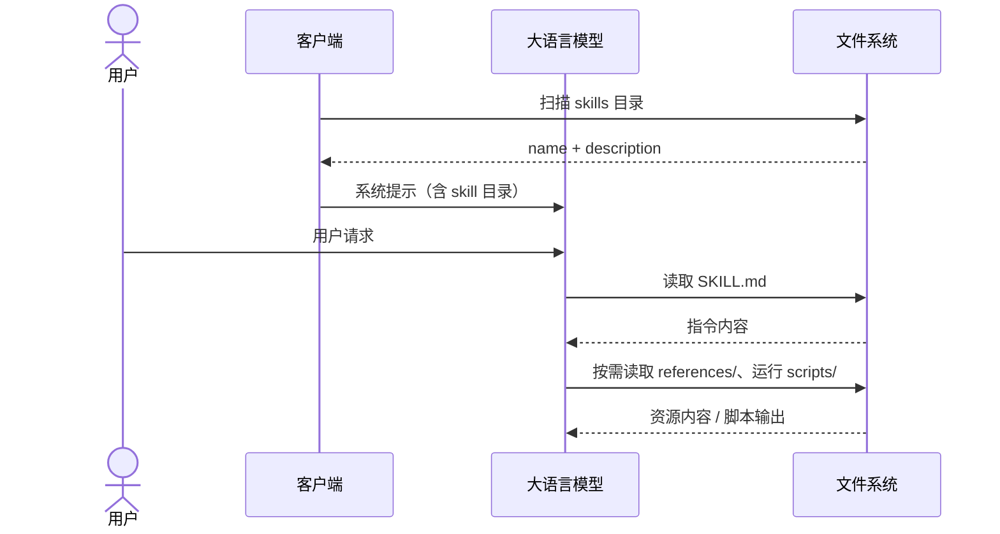

> 本文内容以 [Agent Skills 规范](https://agentskills.io/specification)（2025-12-18 发布为开放标准）与 [Claude Agent Skills 官方文档](https://platform.claude.com/docs/en/agents-and-tools/agent-skills/overview) 为基础，资料整理于 2026 年 8 月。

## skills 是什么

Agent Skills（下文直接叫 skills）是 Anthropic 在 2025 年 10 月推出的能力包规范。一个 skill 就是一个目录，目录里至少有一个 `SKILL.md` 文件，装着完成某类任务需要的指令，也可以附带脚本、参考文档和模板。agent 平时不读这些内容，遇到相关任务才按需加载。

[Claude 官方文档](https://platform.claude.com/docs/en/agents-and-tools/agent-skills/overview) 对它的定位是可复用的文件系统资源：把领域流程、上下文和最佳实践打包，让通用 agent 变成特定领域的专家。Anthropic 官方预置了 PPT、Excel、Word、PDF 四个文档处理 skill，这个格式不是停留在纸面上的概念。

2025 年 12 月 18 日，Anthropic 把 Agent Skills 发布为开放标准，规范托管在 [agentskills.io](https://agentskills.io)。[支持列表](https://agentskills.io/clients.md)里有 Claude Code、OpenAI Codex、Gemini CLI、GitHub Copilot、Cursor、VS Code、Trae 等客户端。按规范写的 skill 目录可以在不同客户端之间直接搬，不用改格式。

skills 解决的是重复劳动：过去要把"怎么做某类事"写进每个 prompt，现在沉淀成文件，agent 自动发现、按需加载、跨工具复用。prompt 是一次性会话指令，skill 是持久的文件资源，这是两者最根本的区别。

## skill 的结构

一个 skill 目录由以下固定结构组成，文件引用统一用相对 skill 目录根的相对路径，建议只引一层，避免深嵌套。

```text
skill-name/
├── SKILL.md        # 必需：元数据 + 指令
├── scripts/        # 可选：可执行代码
├── references/     # 可选：参考文档
├── assets/         # 可选：模板、图片、数据
└── ...
```

### SKILL.md

`SKILL.md` 由 YAML frontmatter 和 Markdown 正文组成。frontmatter 字段如下：

| 字段            | 必填 | 约束                                                                            |
| --------------- | ---- | ------------------------------------------------------------------------------- |
| `name`          | 是   | 1-64 字符，只能用小写字母、数字和连字符，不能以连字符开头或结尾，必须与目录同名 |
| `description`   | 是   | 1-1024 字符，说明 skill 做什么、什么时候用                                      |
| `license`       | 否   | 许可证名称，或对仓库内 LICENSE 文件的引用                                       |
| `compatibility` | 否   | 1-500 字符，环境要求，如依赖的包或网络                                          |
| `metadata`      | 否   | 任意键值对，客户端可存放扩展属性                                                |
| `allowed-tools` | 否   | 预批准工具列表，实验性功能                                                      |

官方提供了校验工具，用来检查 frontmatter 是否合法、命名是否符合规范。

```bash
skills-ref validate ./my-skill
```

正文是纯 Markdown 指令，规范建议包含步骤式说明、输入输出示例和常见边界情况，没有强制格式。规范建议 `SKILL.md` 保持在 500 行、5000 token 以内。内容更多时，把细节拆到 `references/`，让 agent 按需读。

示例：

```markdown
---
name: pre-commit-check
description: 检查当前代码改动是否适合提交。用户要求提交代码、检查改动、生成提交信息时使用。
---

# 提交前检查

按以下步骤执行：

1. 运行 `git status --short`，列出当前改动。
2. 运行 `git diff --check`，检查空白字符错误。
3. 查看 `git diff`，总结改动内容。
4. 根据项目的 `package.json`，运行与本次改动相关的 lint、类型检查或测试命令。
5. 输出结果：
   - 是否建议提交；
   - 已发现的问题；
   - 推荐的 Conventional Commit 提交信息。

不要执行 `git add`、`git commit` 或 `git push`，除非用户明确要求。
```

### 可选目录

三个目录都可选，共同点是按需加载：agent 用到才读，没用到就不消耗上下文。

#### scripts

放给 agent 跑的代码。代码本身不进上下文，只有运行结果会，所以脚本比让模型现场写代码省 token。简单的现成命令（`uvx ruff@0.8.0`、`npx eslint@9`）直接写进 `SKILL.md` 就行，记得锁版本；发现 agent 每次都在重新写同一段逻辑时，才打包成脚本。

脚本要自包含，依赖写进文件头，`uv run` 直接跑：

```python
# /// script
# dependencies = ["beautifulsoup4"]
# ///
from bs4 import BeautifulSoup
print(BeautifulSoup("<p class='info'>测试</p>", "html.parser").select_one("p.info").get_text())
```

agent 通过 stdout 和 stderr 使用脚本，接口有几条硬规矩：不能有交互式输入（agent 的 shell 是非交互的，遇到 TTY 提示会一直挂住）；提供 `--help`；错误信息要能指导下一步；stdout 放结构化数据、stderr 放诊断；操作要幂等，破坏性操作给 `--dry-run`。引用时路径相对 skill 根目录。

#### references

放按需读取的文档，让 `SKILL.md` 保持精简：每次都要用的步骤留正文，偶尔用到的细节（API 参考、表单说明、领域规范）挪到这里，读了才花 token。

引用方式关键在写清读取条件。"API 返回 4xx 时读 `references/api-errors.md`" 比 "详见 references/ 目录" 有用得多，后者 agent 不知道该不该读、该读哪个。路径相对 skill 根目录，建议只引一层；`SKILL.md` 超过 500 行或 5000 token 时拆分是底线。

#### assets

放模板、图片、查表等静态资源，是 agent 要使用或输出的东西，和 references（给 agent 读的文档）区分开。长模板、只在特定场景用的模板放这里，短模板直接内联更省事。引用方式和 references 一样，agent 只在指令提到时才读。

也有部分客户端会拓展其他目录，比如`agents`目录，存放一些自家模型需要的数据等。

## 如何使用 skills

### 获取途径

skills 没有强制统一的中央仓库，规范只约束格式，分发靠仓库和工具各自承担，这也是 skills 的缺陷之一。最常见的载体是 GitHub 仓库，一些知名团队的仓库如下：

- Anthropic：[anthropics/skills](https://github.com/anthropics/skills)
- OpenAI：[openai/skills](https://github.com/openai/skills)
- Vercel：[vercel-labs/agent-skills](https://github.com/vercel-labs/agent-skills)
- Figma：[figma/mcp-server-guide](https://github.com/figma/mcp-server-guide/tree/main/skills)

除了 GitHub 仓库，还有一些聚合网站提供 skills 的搜索和安装服务，例如 [skills.sh](https://skills.sh/)、[Officialskills.sh](https://officialskills.sh/) 和 [AwesomeSkills.dev](https://www.awesomeskills.dev/zh-CN#skills)；这里相对易用的是 [skills.sh](https://skills.sh/)，不仅提供 skills 搜索服务，还提供 skills 安装 CLI。

本站的[常用 Skills](/docs/ai/skills) 页按用途整理了一批，包括官方仓库、聚合站和管理工具。

### 安装方式

三种方式，从手动到自动：

| 方式       | 操作                                                       | 适用                   |
| ---------- | ---------------------------------------------------------- | ---------------------- |
| 手动复制   | 把目录复制进上一节的扫描目录                               | 单个 skill、临时试用   |
| 通用 CLI   | `npx skills add <仓库>`；`gh skill install <仓库> <skill>` | 批量安装、跨客户端同步 |
| 客户端内置 | Claude Code、Codex 插件市场（`/plugin marketplace add`）等 | 跟随客户端生态         |

这里推荐使用 Vercel 的 [skills CLI](https://github.com/vercel-labs/skills) 来安装 skills，也支持后续的更新维护。

```bash
# Vercel skills CLI：装整个仓库，或只装其中的一个 skill
npx skills add vercel-labs/agent-skills
npx skills add https://github.com/anthropics/skills --skill skill-creator
npx skills update
```

装完要重启会话，新 skill 的元数据才会进目录。

### 安装位置

skills 通常安装在项目内，Claude Code、OpenAI Codex、Cursor 等客户端在项目内使用各自独立的目录管理 skills，例如：

- `.claude/skills`
- `.codex/skills`
- `.cursor/skills`

目前各大客户端也在兼容 `.agents/skills/` 目录，`.agents/skills/` 是跨客户端互操作的关键，一个客户端装好的 skill，另一个遵循同样约定的客户端也能发现，这样避免在切换不同的开发工具或者模型时需要重复安装 skills.

skills 也可以安装在操作系统的用户根目录下，所以整体分为以下两种：

| 范围   | 路径                                                 |
| ------ | ---------------------------------------------------- |
| 项目级 | `<项目>/.agents/skills/`、`<项目>/.<客户端>/skills/` |
| 用户级 | `~/.agents/skills/`、`~/.<客户端>/skills/`           |

在优先级上，项目级优先于用户级。客户端会同时扫描两个范围，把两边的 skill 合并进目录；同一个名字在项目级和用户级都存在时，按各客户端实现的通用约定，项目级覆盖用户级。同范围内出现重名时，取先发现还是后发现的规则由客户端自定，一般会记录一条警告。

## skills 工作流程

### 模型上下文

要了解 skills 是如何起作用的，首先要了解模型上下文，模型上下文简单来说就是：**模型这一次回答时，实际能“看到”的全部内容**。

它通常包括：

- 系统指令：模型身份、权限、安全规则
- 当前问题与聊天历史
- 项目规则：如 `AGENTS.md`、`CLAUDE.md`
- 模型思考过程，思考结论等
- 触发的 Skills
- 工具调用结果，模型思考过程可能调用工具，例如搜索网页，抓取网页的内容等
- 当前打开的文件、选中的代码、Git diff

模型不是永久记住这些内容；每次请求都会把一部分相关信息拼进输入里，并受到**上下文窗口**大小限制。

### 上下文窗口

上下文窗口（Context Window）指的是模型在生成下一个 Token 时，单次能够接收并有效处理的最大 Token 数量上限，就像硬件设备的运行内存一样，而 Token 是大模型处理文本的基本单位，他既不是词也不是字，目前来说没有什么确切的中文翻译能形容这一概念。分词器（Tokenizer）会将输入的文本切分成 Token：

- **英文**：1 Token ≈ 0.75 个单词 ≈ 4 个字符
- **中文**：1 Token ≈ 0.6∼0.8 个汉字（主流模型如 DeepSeek、Qwen 优化了中文词表，压缩率更高）。
- **代码**：1 Token≈3∼4 个代码字符（含缩进与符号），即 $0.15 \sim 0.25\text{ 行代码}$。

空格也占用上下文长度哦。

| **上下文规格** | **约合中文 Markdown** | **约合代码量** | **典型场景**                                 |
| -------------- | --------------------- | -------------- | -------------------------------------------- |
| 128K           | 8∼10 万字             | 2∼3 万行       | 单篇论文、中篇小说、中小模块代码分析         |
| 1M             | 65∼80 万字            | 15∼25 万行     | 《三国演义》全书、整套技术文档、单体应用源码 |

:::warning

上下文总窗口长度不等于模型生成内容的长度；模型**单次生成**的最大上限通常远小于输入长度，一般为 4K∼64K Token。

:::

### 渐进式披露

**Skill 是一种按需注入上下文的机制**，也叫渐进式披露，或按需加载。

| 层级   | 内容                                 | 加载时机                        |
| ------ | ------------------------------------ | ------------------------------- |
| 元数据 | `name` + `description`               | 会话开始，所有已装 skill 都加载 |
| 指令   | `SKILL.md` 正文                      | skill 被触发时                  |
| 资源   | `scripts/`、`references/`、`assets/` | 指令里引用时才读取              |

一次完整的加载过程：

1. 会话启动，客户端扫描目录，把每个 skill 的元数据放进系统提示；
2. 用户请求与某个 description 匹配，模型用文件读取工具把 `SKILL.md` 读进上下文；
3. 遇到正文引用 `references/` 里的文件时，模型再读对应文件；
4. 遇到正文提到 `scripts/` 里的脚本时，直接运行脚本，只有输出进入上下文。



第 3、4 步不是每次都发生。模型读了指令才知道需要哪些资源，所以资源加载天然是延迟的。

### 上下文压缩的影响

由于上下文窗口的限制，当上下文快接近模型上限时，客户端需要把较早的大量对话和工具结果总结成一份更短的任务摘要，再用摘要替换原始内容，这个过程中模型已经记住的`SKILL.md`的内容会受影响，具体参考下表：

| 内容               | 压缩后的情况                 |
| ------------------ | ---------------------------- |
| Skill 文件本身     | 不受影响，仍在磁盘上         |
| Skill 的名称和描述 | 通常会重新提供给模型         |
| 完整 `SKILL.md`    | 可能被概括，必要时应重新调用 |
| 已读取的参考文档   | 可能只剩摘要                 |
| 脚本文件           | 不受影响，可以重新执行       |
| 脚本执行结果       | 可能被压缩或丢弃             |
| 任务进度和中间决策 | 可能失真，是长任务的主要风险 |

例如长时间写博客后发生压缩，模型可能还记得：

```
正在按照 writing Skill 编写中文技术文章
```

但可能忘记其中某条细则如：

```
所有涉及版本变化的 API 都必须查询官方英文文档
```

为了避免上下文压缩导致的 skills 丢失，可以重新输入提示来引导模型直接使用 skills，例如：

```shell
继续使用 writing Skill 检查并完成文章
```

### token 消耗

skills 的 token 开销和加载时机直接对应：

| 阶段   | 开销                                         | 说明             |
| ------ | -------------------------------------------- | ---------------- |
| 元数据 | 每个 skill 约 50-100 token                   | 会话期间一直占用 |
| 指令   | `SKILL.md` 正文，建议 5000 token，500 行以内 | 触发后才进上下文 |
| 资源   | 按实际读取的内容计                           | 脚本只有输出计费 |

然而 skills 的渐进式披露设计既可能在设计得当时显著降低整体消耗，也可能增加成本。

常见增加场景：

- 大量 Skill 的元数据累积，description 描述内容太多，50 个 description 平均 200 tokens 的 Skill 启动就可能烧掉约 1 万 tokens
- 正文臃肿：大量背景、示例、非可操作内容
- 参考文件盲目注入：单个 Skill 可注入数万 tokens
- 某实验中，启用 30 个 Skill 后平均 Token 消耗上升约 48%，耗时上升约 19%。多媒体生成、复杂结构化输出类 Skill 尤其明显。

可降低消耗的场景：

- 清晰的流程 + 明确边界 → 模型少做无效探索、少重试，整体 Token 反而下降（部分 Skill 实测倍率小于 1.0）。
- 用脚本替代纯文字描述确定性操作（脚本只消耗执行结果，而非整段生成代码）。
- 避免把所有工具/MCP 定义常驻上下文。
- 好的 Skill 能减少多轮纠错，从而节省更多（一次重试在大上下文下代价极高）。

想量化一个 skill 的真实开销，官方建议同一批任务跑两遍，带 skill 和不带 skill 对比 token 和耗时，差异就是它的成本。

## 为什么需要 skills

skills 要解决的问题很直接：模型通用知识不够用，而每次手动粘贴指导不可持续。

- 复用。创建一次，以后自动触发，同样的流程不用在每个 prompt 里重复写；
- 专业化。领域流程、团队规范、API 用法打包成文件，模型在对应任务上更稳定；
- 确定性。需要精确执行的部分写成脚本，由代码保证，不靠模型每次现场发挥；
- 可移植。开放标准加 `.agents/skills/` 约定，换客户端不用重写；
- 可控。渐进式披露让装了很多 skill 和上下文很小同时成立。

和 prompt 放在一起看更清楚：

|          | prompt       | skills           |
| -------- | ------------ | ---------------- |
| 生命周期 | 一次会话有效 | 持久文件         |
| 复用方式 | 手动复制     | 自动触发         |
| 加载方式 | 全部进上下文 | 渐进式           |
| 附带内容 | 纯文本       | 指令、脚本、文档 |

也要知道边界：不是所有任务都该用 skill。官方触发优化文档指出，agent 通常只在任务需要超出基础能力之外的知识时才会查 skill，一步就能做好的事（比如"读这个 PDF"）即使 description 写得再准也可能不触发。反过来，如果模型不带 skill 已经把任务做得很好，这个 skill 就没有存在价值，测试的目的之一就是发现这种"有和没有一样"的情况。

## 如何创建 skills

### 创建符合规范的 skill

从最小结构开始：一个目录、一个 `SKILL.md`。文件内容如下：

````markdown
---
name: pdf-processing
description: 提取 PDF 文本和表格、填写表单、合并文档。处理 PDF 文档或用户提到 PDF、表单时使用。
---

## 提取文本

用 pdfplumber：

```python
import pdfplumber

with pdfplumber.open("file.pdf") as pdf:
    text = pdf.pages[0].extract_text()
```

复杂表单处理见 [FORMS.md](references/FORMS.md)。
````

写完跑一遍校验：

```bash
skills-ref validate ./pdf-processing
```

目录里要是有 scripts 和 references，它们的相对路径都相对 skill 根目录。规范建议引用只保持一层深，`references/REFERENCE.md` 可以，`references/nested/deep.md` 尽量拆平，否则模型找文件时容易绕晕。

### 优化 description

编写 description 的原则：

- 命令式措辞："Use this skill when..."，而不是"This skill does..."；
- 写用户意图，不写实现；
- 明确列出适用场景，包括用户没提关键词的情况；
- 简洁，上限 1024 字符，description 常驻上下文，越长越贵。

官方示例：

```yaml
# 改前
description: Process CSV files.

# 改后
description: 分析 CSV 和表格数据文件，计算汇总统计、添加派生列、生成图表、清洗脏数据。
  用户有 CSV、TSV 或 Excel 文件并想探索、转换或可视化数据时使用，
  即使他们没有明确提到"CSV"或"分析"。
```

### 最佳实践

[官方最佳实践](https://agentskills.io/skill-creation/best-practices) 的核心就几条：

1. **从真实经验出发。** 让模型凭空生成 skill，得到的是"处理错误要恰当"这类废话。写"扫描件用 pdf2image + pytesseract 回退"，不写"PDF 是一种常见文件格式"。素材来自真实任务走通的步骤、你做过的纠正、项目里的特殊约定。
2. **写了就跑，跑完再改。** 用真实任务执行几遍，看哪些指令没被遵守、哪些不适用，回填进 skill。agent 浪费步骤，通常是指令太模糊或选项太多没有默认值。
3. **只写 agent 不知道的。** 对每句内容问"不写这句，agent 会不会做错？"不会就删。范围像函数一样讲究单一职责，太窄要加载好几个 skill，太宽则触发不精确。
4. **指令强度跟着任务脆弱度走。** 可以自由发挥的部分给原则并说明为什么；必须严格按顺序的部分（如数据库迁移）写成固定命令，不许改。给默认方案，不要给并列菜单。
5. **教流程，不教答案。** 写"读 schema、按外键约定 join、加过滤条件"，而不是写死某条 SQL。
6. **固定模式直接用。** 官方文档给了几套可复用的写法：

   - **Gotchas**：记 agent 默认会做错的环境特有坑，比如"users 表是软删除，查询必须带 `WHERE deleted_at IS NULL`"；
   - **输出模板**：固定格式直接给模板，比文字描述可靠；
   - **Checklist**：多步流程用勾选框防止跳步；
   - **校验循环**：做完自检，失败就修，通过才继续；
   - **Plan-validate-execute**：批量或破坏性操作先出计划、用脚本校验计划、再执行，校验失败的错误信息能让 agent 自我纠正；
   - **打包脚本**：agent 每次都在重写同一段逻辑，就把它写成脚本放进 `scripts/`。

## skills 和 MCP 的区别

先给结论：两者不冲突，是互补的。MCP（Model Context Protocol）解决 agent 怎么连外部工具和数据，skills 解决 agent 怎么把事情做对。

- MCP 是协议。定义 client 和 server 之间用 JSON-RPC 交换工具、资源和提示词，连接的是运行中的服务，比如数据库、API、SaaS；
- skills 是文件。目录里的指令、脚本和参考资料，不依赖网络，agent 用文件系统访问。

Anthropic 在[工程博客](https://www.anthropic.com/engineering/equipping-agents-for-the-real-world-with-agent-skills) 里的说法是，skills 可以教 agent 使用外部工具和软件的复杂工作流，和 MCP 服务器互补。一个直观的分工：MCP 提供能力，skills 提供流程。skill 里完全可以写"先调 MCP 的 X 工具拿数据，再跑 `scripts/validate.py` 校验"，两者结合使用。

拿周报生成举例：MCP 负责连上数据库取本周数据，skill 负责规定调哪个工具、取数后怎么校验、图表用什么模板、输出什么格式。缺了 MCP，skill 拿不到数据；缺了 skill，模型面对一堆 MCP 工具不知道按什么顺序用。

| 对比项   | skills                       | MCP                     |
| -------- | ---------------------------- | ----------------------- |
| 定位     | 能力包                       | 连接协议                |
| 载体     | 文件系统目录                 | client-server 服务      |
| 内容     | 指令、脚本、文档             | 工具、资源、提示词      |
| 触发     | 模型匹配 description         | 模型调用工具            |
| 运行时   | 静态文件，按需读取           | 常驻服务，JSON-RPC 通信 |
| 典型场景 | 编码规范、领域流程、文档处理 | 数据库、API、外部系统   |
