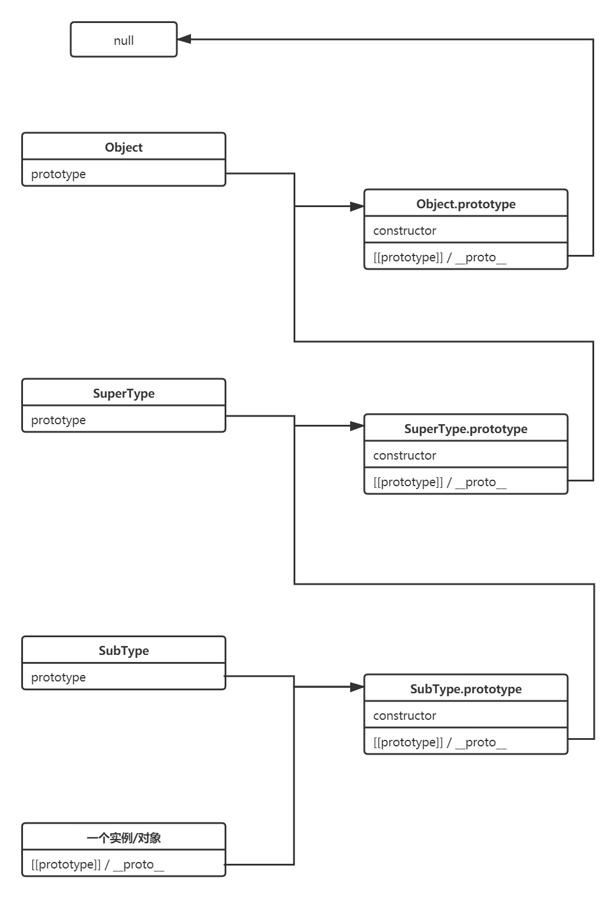
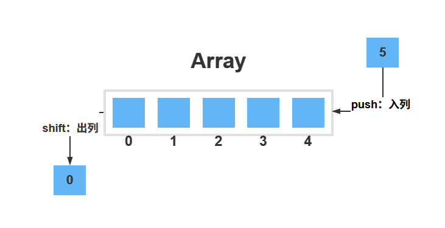

# 数组 Array

数组是按特定顺序排列的多个元素，通常都是相同类型的元素（但在 JS 里可以不同）。

使用整数索引访问元素以指定所需的元素。数组可以是固定长度的，也可以是可调整大小的。

# 链表 LinkedList

链表，也叫列表，是**任何类型**的数据元素的线性集合，每个元素称为节点，其中每个节点都有自己的值，并指向链表中的下一个节点。

与数组相比，链表的主要优点是始终可以有效地插入和删除值，而无需重新定位列表的其余部分。然而，某些其他操作（例如对某个元素的随机访问）在链表上比在数组上慢。

在 JS 中，最常见的链表就是对象的原型链结构：一个对象实例具有`__proto__`属性，其指向初始化其类型的`prototype`属性，而`prototype`本身也具有`__proto__`属性，最终这种继承关系指向`null`。

```js
instance.__proto__ === SubType.prototype;

instance.__proto__.__proto__ === SuperType.prototype;

instance.__proto__.__proto__.__proto__ === Object.prototype;

instance.__proto__.__proto__.__proto__.__proto__ === null;
```



## 单链表


## 双链表


# 队列 Queue

先进先出（FIFO，first in first out）队列，简称为队列。队列支持以下操作：

- 入列：添加元素到队列末尾，相当于数组的`push`操作
- 出列：删除开头元素，相当于数组的`shift`操作
- 获取队列开头和末尾的元素
- 获取队列长度



实现参考：[Queue - The Algorithms (the-algorithms.com)](https://the-algorithms.com/zh_Hans/playground?id=5495)

```js
class Queue {
  #size

  constructor () {
    this.head = null
    this.tail = null
    // 队列长度
    this.#size = 0

    return Object.seal(this)
  }

  get length () {
    return this.#size
  }

  /**
   * @description - 往队列末尾添加元素
   * @param {*} data
   * @returns {number} - 返回队列新的长度
   */
  enqueue (data) {
    const node = { data, next: null }

    if (!this.head && !this.tail) {
      this.head = node
      this.tail = node
    } else {
      this.tail.next = node
      this.tail = node
    }

    return ++this.#size
  }

  /**
   * @description - 移除队列开头元素
   * @returns {*} - 返回被移除的元素
   */
  dequeue () {
    if (this.isEmpty()) {
      throw new Error('Queue is Empty')
    }

    const firstData = this.peekFirst()

    this.head = this.head.next

    if (!this.head) {
      this.tail = null
    }

    this.#size--

    return firstData
  }

  /**
   * @description - 返回队列开头的元素
   * @returns {*}
   */
  peekFirst () {
    if (this.isEmpty()) {
      throw new Error('Queue is Empty')
    }

    return this.head.data
  }

  /**
   * @description - 获取队列末尾的元素
   * @returns {*}
   */
  peekLast () {
    if (this.isEmpty()) {
      throw new Error('Queue is Empty')
    }

    return this.tail.data
  }

  /**
   * @description - 队列转换成数组
   * @returns {Array<*>}
   */
  toArray () {
    const array = []
    let node = this.head

    while (node) {
      array.push(node.data)
      node = node.next
    }

    return array
  }

  /**
  * @description - 队列是否为空
  * @returns {boolean}
  */
  isEmpty () {
    return this.length === 0
  }
}

export default Queue
```


# 栈 Stack

堆栈是一种基本的线性数据结构，它遵循访问对象的顺序。这种顺序称为后进先出(LIFO)或先进后出(FILO，First In Last Out)，要正确区分栈顶的概念：

:::caution

栈顶：相当于数组结尾的元素。

:::


栈支持以下操作：

- 入栈：添加元素到栈顶，相当于数组的`push`方法
- 出栈：从栈顶删除元素，相当于数组的`pop`方法
- 获取栈顶元素，相当于获取数组的最后一个元素

```js
class Stack {
  private stack = [];
  private limit;

  /**
   * constructor of the stack, can set a limit, if not provided there is no limit to the stack.
   * @param {number} [limit=Number.MAX_VALUE] the limit of the stack
   */
  constructor(limit = Number.MAX_VALUE) {
    this.limit = limit;
  }

  /**
   * @function push
   * @description - adds a new element to the stack
   * @param {T} value - the new value to add
   */
  push(value) {
    if (this.length() + 1 > this.limit) {
      throw new Error('Stack Overflow');
    }

    this.stack.push(value);
  }

  /**
   * @function pop
   * @description - remove an element from the top
   * @throws will throw an error if the stack is empty
   * @return {T} removed element
   */
  pop() {
    if (this.length() !== 0) {
      return this.stack.pop() as T;
    }

    throw new Error('Stack Underflow');
  }

  /**
   * @function length
   * @description - number of elements in the stack
   * @return {number} the number of elements in the stack
   */
  length() {
    return this.stack.length;
  }

  /**
   * @function isEmpty
   * @description - check if the stack is empty
   * @return {boolean} returns true if the stack is empty, otherwise false
   */
  isEmpty() {
    return this.length() === 0;
  }

  /**
   * @function top
   * @description - return the last element in the stack without removing it
   * @return {T | null} return the last element or null if the stack is empty
   */
  top() {
    if (this.length() !== 0) {
      return this.stack[this.length() - 1];
    }

    return null;
  }
}
```


# 背包 Bag

