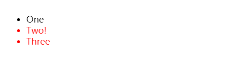
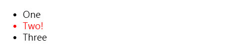

## 选择器的类别

| 选择器                                                       | 示例             | 用法                                                         |
| :----------------------------------------------------------- | :--------------- | :----------------------------------------------------------- |
| [元素选择器](https://developer.mozilla.org/zh-CN/docs/Web/CSS/Type_selectors) | `tag { }`        | 或者叫类型选择器，选择所有该标签名的元素                     |
| [通配选择器](https://developer.mozilla.org/zh-CN/docs/Web/CSS/Universal_selectors) | `* { }`          | 选择所有元素                                                 |
| [类选择器](https://developer.mozilla.org/zh-CN/docs/Web/CSS/Class_selectors) | `.class { }`     | 选择具有该`class`名称的所有元素                              |
| [ID 选择器](https://developer.mozilla.org/zh-CN/docs/Web/CSS/ID_selectors) | `#id{ }`         | 选择具有该`id`的所有元素，一般来说`id`设置都是唯一的         |
| [属性选择器](https://developer.mozilla.org/zh-CN/docs/Web/CSS/Attribute_selectors) | `a[prop] { }`    | 使用标签名+方括号选择具有该属性的元素                        |
| [伪类选择器](https://developer.mozilla.org/zh-CN/docs/Web/CSS/Pseudo-classes) | `div:hover { }`  | 单冒号，**改变已存在的元素的状态**                           |
| [伪元素选择器](https://developer.mozilla.org/zh-CN/docs/Web/CSS/Pseudo-elements) | `div::after { }` | 双冒号，**创建不存在的元素**                                 |
| [后代选择器](https://developer.mozilla.org/zh-CN/docs/Web/CSS/Descendant_combinator) | `article p`      | 会递归选择所有子元素，不需要有严格的父子关系                 |
| [子代选择器](https://developer.mozilla.org/zh-CN/docs/Web/CSS/Child_combinator) | `article > p`    | 只选择具有严格的父子关系的所有子元素                         |
| [相邻兄弟选择器](https://developer.mozilla.org/zh-CN/docs/Web/CSS/Adjacent_sibling_combinator) | `h1 + p`         | 当第二个元素**紧跟在**第一个元素之后，并且两个元素都是属于同一个父元素的子元素时，则第二个元素将被选中 |
| [通用兄弟选择器](https://developer.mozilla.org/zh-CN/docs/Web/CSS/General_sibling_combinator) | `h1 ~ p`         | 元素都是属于同一个父元素的子元素，**位置无须紧邻**           |

### 子代选择器和后代选择器的区别

后代选择器，就是**子子孙孙都包括在内**；使用一个或多个空格作为分隔符；会递归选择所有子元素，不需要有严格的父子关系

```html
div span { background-color: DodgerBlue; }

<div>
  <span
    >Span 1.
    <span>Span 2.</span>
  </span>
</div>
<span>Span 3.</span>
```


子代选择器，**严格选择自己的儿子**；使用`>`作为分隔符；只选择直接子元素，即需要严格的父子关系

```html
div > span { background-color: DodgerBlue; }

<div>
  <span
    >Span 1. In the div.
    <span>Span 2. In the span that's in the div.</span>
  </span>
</div>
<span>Span 3. Not in a div at all</span>
```


### 兄弟选择器

- 使用`~`作为两个选择器的连接符
- 位置**无须紧邻，只须同层级**

```html
li:first-of-type ~ li {
  color: red;
}

<ul>
  <li>One</li>
  <li>Two!</li>
  <li>Three</li>
</ul>
```



### 相邻兄弟选择器

- 使用`+`将两个选择器连接起来
- **同级且紧邻**

```html
li:first-of-type + li {
  color: red;
}

<ul>
  <li>One</li>
  <li>Two!</li>
  <li>Three</li>
</ul>
```



### 伪类和伪元素

- 伪类时使用**单冒号**的关键字，用于当已有元素处于的某个状态时，为其添加对应的样式；比如根据用户行为变化时改变样式（`:hover`）


- 伪元素是**双冒号**的关键字，用于创建一些不在文档树中的元素，并为其添加样式
- 一些早期的伪元素曾使用单冒号的语法，现代的浏览器为了保持后向兼容，支持早期的带有单双冒号语法的伪元素


## 选择器的优先级

**通配选择符**（universal selector）（[`*`](https://developer.mozilla.org/zh-CN/docs/Web/CSS/Universal_selectors)）**关系选择符**（combinators）（[`+`](https://developer.mozilla.org/zh-CN/docs/Web/CSS/Adjacent_sibling_combinator), [`>`](https://developer.mozilla.org/zh-CN/docs/Web/CSS/Child_combinator), [`~`](https://developer.mozilla.org/zh-CN/docs/Web/CSS/General_sibling_combinator)）和 **否定伪类**（negation pseudo-class）（[`:not()`](https://developer.mozilla.org/zh-CN/docs/Web/CSS/:not)）对优先级没有影响，但是，在 `:not()` 内部声明的选择器会影响优先级。

因为选择器之间可以组合使用，最后计算选择器的优先级按照下面四个部分相加 (分量)的方式：

1. 千位： 如果声明在 `style` 的属性（**内联样式**）则该位得一分。这样的声明没有选择器，所以它得分总是 1000。
2. 百位： 选择器中包含**ID**选择器则该位得一分。
3. 十位： 选择器中包含**类选择器、属性选择器或者伪类**则该位得一分，除了否定伪类`:not()`
4. 个位：选择器中包含**元素、伪元素**选择器则该位得一分。


- `!important`规则会覆盖任何其他样式选择，包括内联样式；使用`!important`的选择器之间也具有优先级