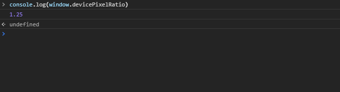
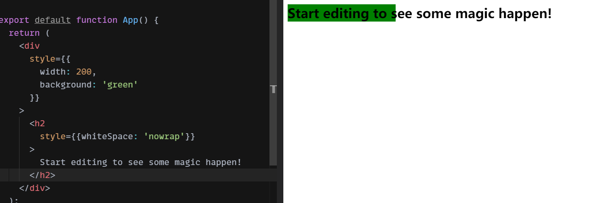
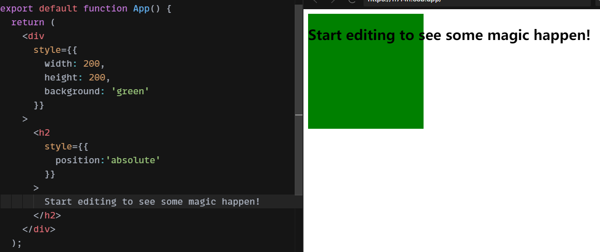
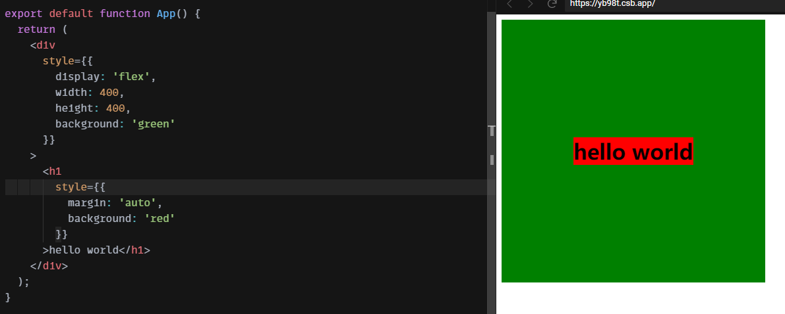

## 像素

在了解长度单位之前，有必要了解一下屏幕参数的单位

### 像素

`pixel`通常被认为是数字图像的最小组成元素，但是这个定义是上下文相关的，因为图像可能用于印刷，或者显示设备表示的图像，或者数码相机中的图像，因为根据像素衍生了很多其他度量单位。

- PPI，`pixels per inch`，每英寸像素数，通常用于 PC 领域。
- DPI，`dots per inch`，每英寸点数，这个度量单位通常用于印刷行业，表示打印机喷出的墨点的放置密度。在印刷领域采用 CMYK （cyan-blue 青色，magenta 品红，yellow 黄色，blick 黑色）组合表示每个墨点的颜色。

#### 物理像素

在电子显示设备上，一像素就是屏幕上的一个发光点，并且通常由 RGB 三原色（红绿蓝）组合而成，这些像素也被称为**物理像素**。物理像素的每一个像素点都有其固定的尺寸。通常物理像素可以作为屏幕硬件设备的显示指标，也就是通过上面所说的 PPI 单位来描述。


#### 逻辑像素

逻辑像素通常用于图形设计领域，例如网页设计中。逻辑像素并没有固定的尺寸，通常在不同设备上的显示也不一致，例如一张`20px*20px`的图片，在 PC 上和手机上的实际显示大小显然不一样。

为了表示逻辑像素和物理像素之间的实际映射关系，显示器制造商指定了一个指标`dpr`(device pixel ratio，设备像素比)来处理逻辑像素实际对应的物理像素值。

### devicePixelRatio

`window.devicePixelRatio`是浏览器对象模型下的一个属性，用于表示当前显示设备的物理分辨率和 CSS 像素分辨率之比，也就是一个 CSS 像素大小和一个物理像素大小的比率，也就是上文所说的物理像素和逻辑像素的处理。由此看出，CSS 里的像素值并不一定表示屏幕上的一个像素点。



## 绝对长度单位

### px

`px`就是`pixel`的缩写，也就是像素的意思。上文说过，这里的像素是逻辑像素，对应的一个`px`单位的像素点占物理设备的像素点可能超过一个。在所有绝对单位中，`px`使用的最多。

### pt

`point`，点（不是磅，point 从来没有磅的意思），`1pt = 1/72inch` ，`1inch = 2.54cm`，也就是`1pt ≈ 0.035cm`

### 其他

其他还有什么`cm`，`mm`，`Q`，`in`，`pc`之类的基本没用到过，不看了。

## 相对字体单位

相对长度单位一般都是相对于其他长度值计算得到的长度

### em

`em`，根据元素本身最终计算出来的`font-size`来进行计算；如果是用在`font-size`上，则是相对于从父元素继承过来的`font-size`值。

### rem

`rem`是`root em`的意思，也就是相对于根元素`<html>`字体大小进行计算的值，当用在根元素`<html>`的`font-size`上表示其初始值。由于`em`设置的`font-size`来自于继承父元素的字体大小，这就导致嵌套的 DOM 结构使用`em`会更加混乱，因为当你修改了父元素的字体大小，使用`em`的子孙元素全都会跟着变化。而`rem`恰好解决了这个问题，因为其只会根据根元素来做出调整。

## 相对 viewport 单位

### viewport

[`viewport`](https://developer.mozilla.org/zh-CN/docs/Web/CSS/Viewport_concepts)就是浏览器中网页的当前可视区域，浏览器的 UI 组件， 菜单栏，以及网页中隐藏的需要滚动的部分都不属于`viewport`，但是**滚动条属于`viewport`的部分**。

也有很多方法获取浏览器的`viewport`的尺寸，来自 —— [how-to-get-the-browser-viewport-dimensions](https://stackoverflow.com/questions/1248081/how-to-get-the-browser-viewport-dimensions)

- <iframe width="100%" height="640" src="https://yari-demos.prod.mdn.mozit.cloud/en-US/docs/Web/API/Element/getBoundingClientRect/_sample_.Scrolling.html" loading="lazy"></iframe>

```css
/* 当viewport宽度等于360px的时候，设置div字体颜色为红色 */
@media (width: 360px) {
  div {
    color: red;
  }
}
```

- [`window.innerWidth`](https://developer.mozilla.org/en-US/docs/Web/API/Window/innerWidth)和[`window.innerHeight`](https://developer.mozilla.org/en-US/docs/Web/API/Window/innerHeight)，和媒体查询的结果一致，基本可以认为是`viewport`的区域大小。

### vh

`vh`是乘以`viewport`高度的`1%`得来的计算值。那么`100vh`就是`viewport`的高度。

### vw

`vw`也就是`viewport width`，相对于`viewport`的宽度的`1%`进行计算，那么`100vw`就是`viewport`的宽度。上文说过滚动条属于`viewport`，所以`vw`也会包含滚动条的宽度。所以实际上网页主体的宽度要小于`vw`，对于如何得到网页真正的宽度，在 ss 上有这样一个讨论 —— [Is it possible to calculate the Viewport Width (vw) without scrollbar?](https://stackoverflow.com/questions/33606565/is-it-possible-to-calculate-the-viewport-width-vw-without-scrollbar)，可以使用`calc`表达式来计算，其实这个问题引申出来的另一个问题是网页在高度变化的时候出现的垂直滚动条导致页面抖动的问题，张鑫旭的博客也是介绍了利用`calc`解决这个问题的方法 —— [CSS vw 让 overflow:auto 页面滚动条出现时不跳动](https://www.zhangxinxu.com/wordpress/2015/01/css-page-scrollbar-toggle-center-no-jumping/comment-page-1/)

```css
body {
  width: calc(100vw - (100vw - 100%));
}
```

### vmin

`vmin`是`vw`和`vh`两者之间的最小值，注意是`vw`和`vh`进行比较。

### vmax

`vmax`是`vw`和`vh`两者之间的最大值。

## 百分比

CSS 里的百分比也是一个非常常用的属性值，在知乎上有这样一个提问 —— [css 样式的百分比都相对于谁](https://www.zhihu.com/question/36079531)，第一个回答总结的非常好，这里直接搬运过来了 😂

### 相对于父元素宽度

`max-width`、`min-width`、`width`、`left`、`right`、`text-indent`、`padding`、`margin`、`grid-template-columns`、`grid-auto-columns`、`column-gap`

### 相对于父元素高度

`max-height`、`min-height`、`height`、`top`、`bottom`、`grid-template-rows`、`grid-auto-rows`、`row-gap`

### 相对于自身宽高

`border-radius`、`background-size`、`border-image-width`、`transform: translate()`、`transform-origin`、`zoom`、`clip-path`

### 相对于继承字体大小

`font-size`，相对于元素从父元素继承而来的字体大小计算值

### 相对于自身字体大小

`line-height`

### 相对于行高

`vertical-align`

## calc()

`calc()`是一个函数，内部使用一个表达式作为参数。表达式可以使用`+`，`-`，`*`，`/`以及`()`这几种运算符，但是需要注意：

- `+` 和 `-` 运算符的两边必须要有**空白字符**；`*` 和 `/` 这两个运算符前后不需要空白字符，但如果考虑到统一性，仍然推荐加上空白符
- 用 0 作除数会使 HTML 解析器抛出异常
- 一个 `calc()` 里面的 `calc()` 就仅仅相当于是一个括号，没有嵌套计算的效果

比方说现在布局页面用`100vh`的高度减去顶栏的高度，而得到剩余部分的高度如下：

```css
.body {
  height: calc(100vh - 50px);
}
```

## auto

`auto`本身可以用于许多属性，例如`width`，`margin`，`flex`，`overflow`等

### width:auto

`width:auto`是块级元素宽度的默认值，其行为如下：

- 根据自身包含的内容来计算宽度

- t 同时，对于容器内部的每一个块级元素都会充分利用父级容器内部的宽度，这点很重要，也就是`width:auto`不光根据内容自适应，同时也会充满容器。

一般不会`width:auto`的元素不会超过父容器宽度。除非发生以下情况：

- 文本设置了禁止换行的属性`white-space:nowrap`



- 非正常布局流，例如绝对定位`position:absolute/fixed`，`position:absolute`可以通过在父元素上设置`position:relative`来解决，但是`position:fixed`就只能设置子元素给定高度了



### height:auto

`height:auto`并不会充分利用父容器内部的高度，其只会根据内容自适应。并且当子元素使用了脱离正常文档流的布局属性以后，父容器的高度计算将不会考虑这些元素。


### margin:auto

`margin:auto`的情况稍微复杂一点，有以下几种情况

#### 定宽左右 margin:auto

对于给定宽度的块级元素，当设置`margin-left:auto`和`margin-right:auto`的时候，其本身会具有水平居中的效果。这是因为根据 CSS 规范的指定：

> If both ['margin-left'](https://www.w3.org/TR/CSS21/box.html#propdef-margin-left) and ['margin-right'](https://www.w3.org/TR/CSS21/box.html#propdef-margin-right) are 'auto', their used values are equal. This horizontally centers the element with respect to the edges of the containing block. —— [w3 - blockwidth](https://www.w3.org/TR/CSS21/visudet.html#blockwidth)


#### position:absolute 的 margin:auto

当绝对定位的定宽定高元素设置`margin:auto`的时候，具有水平垂直居中的效果


#### flex 项的 margin:auto

当`flex`项设置`margin-left:auto`的时候，其具有远离相邻`flex`项的效果

<iframe src="https://codesandbox.io/embed/pedantic-gagarin-n7l4h?fontsize=14&hidenavigation=1&theme=dark"
     title="pedantic-gagarin-n7l4h"
     allow="accelerometer; ambient-light-sensor; camera; encrypted-media; geolocation; gyroscope; hid; microphone; midi; payment; usb; vr; xr-spatial-tracking"
     sandbox="allow-forms allow-modals allow-popups allow-presentation allow-same-origin allow-scripts"
   ></iframe>


当`flex`项设置`margin:auto`的时候，其具有水平垂直居中的效果



### flex:auto

`flex`属性可以用于单独的一个`flex`项上，其为`flex-grow`，`flex-shrink`，`flex-basis`三个属性的缩写。

`flex`属性的默认值为`flex:initial`或`flex: 0 1 auto`，这个含义是`flex`项本身不会自动拉伸以占满容器剩余空间，但是当容器收缩的时候会自动收缩以适应容器宽度，同时该`flex`项的初始宽度根据自身内容来决定。

当设置为`flex:auto`的时候即为`flex: 1 1 auto`，当前`flex`项会拉伸以占据容易所有的剩余空间。

### overflow:auto

`overflow`用于父元素，描述其内部子元素内容溢出时的行为，默认值是`overflow:visible`，这个行为表示溢出容器的子元素内容仍然可见，只不过显示会溢出，效果不好。

当使用`overflow:auto`的时候会在父元素内创建块级格式化上下文，同时浏览器会为容器设置滚动条。

### left:auto

`left`，`right`，`top`，`bottom`这些属性用于配合`position`来调整元素位置，所以分为两种情况。

#### position:relative 的 left:auto

对于`position:relative`的元素，`left`是其`margin box`相对于其在正常布局流中位置的偏移量，设置`left:auto`时表示其位置取决于`right`属性，如果`right`属性也是`auto`，那么元素本身在水平方向上不会发生任何偏移。

#### position:absolute 的 left:auto

对于`position:absolute`的元素，本身相对于最近的设置了`position:relative`的父元素来定位，`left`属性的值表示元素`margin box`相对于父元素本身`border box`的偏移距离。

:::caution

尤其需要注意的是此时`left:auto`的计算偏移量会讲父元素的`padding`也包括在内，所以`left:auto`的效果相比`left:0`的偏移量多出了父元素`padding-left`的距离。

:::