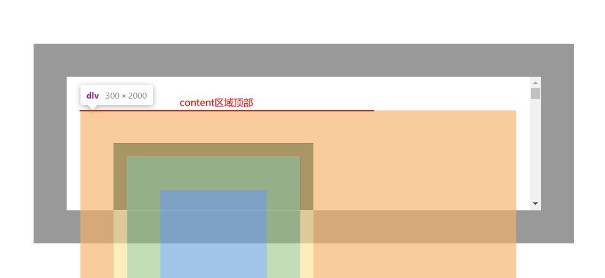
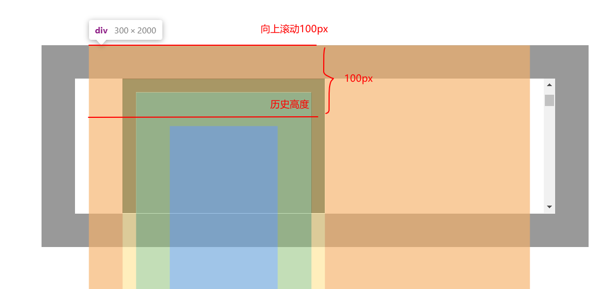

### top

`top`用于 CSS 元素设置位置顶部偏移量。

- `position:static`（初始值）：无效果
- `position:relative`：元素`margin box`相对于其正常流布局位置的顶部偏移量，在正常流布局中，块级盒子会在父元素的`padding box`内部从左往右从上往下放置。
- `position:absolute`：子元素的`margin box`相对于最近的非`position:static`的父元素的`border box`的党部偏移量
- `position:fixed`：子元素的`margin box`相对于视口顶部的偏移量，如果有`iframe`则是相对于`iframe`内部的视口

### scrollTop **writeable**

获取或**设置**一个父元素的`content`区域顶部垂直向上滚动的高度，同理`scrollLeft`也是这样的原理。需要注意以下两点：

- `scrollTop`作用在父元素上，也就是产生滚动条的元素，一般其`overflow`属性不为`visible`
- `scrollTop`表示`content`区域顶部向上滚动的像素数，不要管什么可见不可见的问题

### clientTop **readonly**

`clientTop`表示元素本身`border-top-width`加上顶部滚动条厚度，如果没有滚动条就是顶部`border`的宽度。如果也没有`border`，那就是`0`。

### offsetTop **readonly**

`offsetTop`是一个相对距离，表示元素自身顶部`border`外边缘到`offsetParent`顶部`border`内边缘的距离。`offsetParent`就是最近的父元素。

