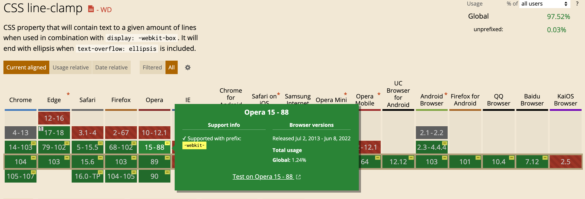

## text-overflow

`text-overflow`，指定如何处理行内溢出容器元素的文本。

需要注意的是`text-overflow`并不会强制文本溢出容器，需要设置`overflow`和`white-space`属性才能做到约束文本溢出，例如：

```css
overflow: hidden;
white-space: nowrap;
```

### clip

`text-overflow:clip`是初始值，·`clip`本身是修剪的意思，也就是正常换行处理。

### ellipsis

以三点`...`(U+2026)表示被修剪掉的文本，如果没有足够的空间显示省略号，则会对其进行裁剪。

### `<string>`👇

`<string>`表示一串自定义显示在修建文本处的字符串。

### fade👇

修剪掉的文本具有淡出效果

<iframe width="100%" height="390" src="https://interactive-examples.mdn.mozilla.net/pages/css/text-overflow.html" loading="lazy"></iframe>

## white-space

`white-space`属性用来处理文本中的空白。通常用于处理一段文本是否进行换行。

### 空格

在 HTML 中，能识别的空格有以下五种：

- `U+0009`：以 tab 键入的制表符，放在字符串中会显示成`\t`
- `U+000D`：Carriage Return，回车键入，也就是`\r`
- `U+000A`：`LF`，Line Feed，换行符，用于 Unix 系统，例如 Mac OS，Linux 等换行输入，也就是`\n`
- `U+000D U+000A`：`CRLF`，用于非 Unix 系统，例如 Windows 的换行输入，也就是`\r\n`
- `U+000C`：Form Feed，换页符，CTRL+ENTER 键入
- `U+0020`：Space，空格键输入生成的换行符
- `U+00A0`：`NBSP`，也就是非断行空格，可以避免因为空格在此处发生断行，在 HTML 可以直接写成`&nbsp`

根据 [HTML 规范](https://www.w3.org/TR/CSS2/text.html#white-space-prop)的描述，HTML 文档中新的一行以`U+000D`（CR），`U+000A`（LF），或者`U+000D`+`U+000A`（CRLF）的形式开启，其中`U+000A`（LF）必须被识别为换行符，

### normal | 初始值

`white-space: normal`是初始值，连续的空白符`U+0020`会被移除掉，制表符`\t`会被处理成空格，换行符会被当作空白符来处理。上述的`\t`，`\r`，以及`\n`周围的空格都会被移除掉

### nowrap

连续的空白符`U+0020`会被**合并**，但文本内的换行无效。

### pre

连续的空白符会被**保留**。在遇到换行符或者[`br`](https://developer.mozilla.org/zh-CN/docs/Web/HTML/Element/br)元素时才会换行。

### pre-wrap

连续的空白符`U+0020`会被**保留**。在遇到换行符或者[`br`](https://developer.mozilla.org/zh-CN/docs/Web/HTML/Element/br)元素，或者需要为了填充「行框盒子([line boxes](https://www.w3.org/TR/CSS2/visuren.html#inline-formatting))」时才会换行。

### pre-line

连续的空白符会被**合并**，**在遇到换行符或者[`br`](https://developer.mozilla.org/zh-CN/docs/Web/HTML/Element/br)元素**，或者需要为了填充「行框盒子([line boxes](https://www.w3.org/TR/CSS2/visuren.html#inline-formatting))」时才会换行。

`white-space:pre-line`这个属性很强大，尤其是在处理换行文本的时候，说到这里，又得说起不同换行符的处理情况：

| 系统    | 常见        | 换行符          |
| ------- | ----------- | --------------- |
| Unix    | Linux服务器 | `\n`            |
| Windows |             | `\r\n`          |
| HTML    |             | `<br/>`或`<br>` |

`\n`或者`\r\n`，如果放在字符串里然后再放到 HTML 的标签中，HTML只会将它们都处理成空格。你可能会想到将`\n`或者  `\r\n`转换成`<br>`来期望 HTML 生成换行的效果，不幸的是，如果转成`<br>`，`<br>`会被直接保留下来显示出来！

这时候最简单的处理方式就是使用`white-space:pre-line`，就可让 HTML 遇到换行符或者`<br>`自动换行了。

### break-spaces

连续的空白符会被保留。在遇到换行符或者[`br`](https://developer.mozilla.org/zh-CN/docs/Web/HTML/Element/br)元素，或者需要为了填充「行框盒子([line boxes](https://www.w3.org/TR/CSS2/visuren.html#inline-formatting))」时才会换行。

- 任何保留的空白序列总是占用空间，包括在行尾，这样保留的空间占用空间而不会挂起，从而影响行内盒子的尺寸
- 每个保留的空格字符后都存在换行机会，包括空格字符之间

<iframe width="100%" height="390" src="https://interactive-examples.mdn.mozilla.net/pages/css/white-space.html" loading="lazy"></iframe>

## word-break

`word-break`设置是否在文本溢出内容框的任何地方出现换行符，也就是控制是否允许在单词内换行。

### normal

`word-break:normal`是默认值，也就是不会随意对单词进行换行，可能会发生溢出。

### break-all

对于非 CJK（Chinese，Japanese，Korean）文本可在任意字符间进行换行。

### keep-all

CJK 文本不进行换行，非 CJK 文本表现同`word-break:normal`

### break-word

已经废弃的 API，效果是`word-break: normal` 和 `overflow-wrap: anywhere` 的合，不论 [`overflow-wrap`](https://developer.mozilla.org/zh-CN/docs/Web/CSS/overflow-wrap)的值是多少。

<iframe width="100%" height="390" src="https://interactive-examples.mdn.mozilla.net/pages/css/word-break.html" loading="lazy"></iframe>

## overflow-wrap/word-wrap

`overflow-wrap`和`word-wrap`是一样的属性，`word-wrap`属性原本属于微软的一个私有属性，在 CSS3 现在的文本规范草案中已经被重名为[`overflow-wrap`](https://developer.mozilla.org/zh-CN/docs/Web/CSS/overflow-wrap) 。 稳定的谷歌 Chrome 和 Opera 浏览器版本支持这种新语法。

### normal

`overflow-wrap:normal`，不会对长的整个单词进行换行处理，可能发生溢出。

### break-word

表示如果行内没有多余的地方容纳该单词到结尾，则那些正常的不能被分割的单词会被强制分割换行。

### anywhere

为了防止溢出，或者一整个长单词，或者一串 URL，可能会在任意地方截断并换行处理。

<iframe width="100%" height="390" src="https://interactive-examples.mdn.mozilla.net/pages/css/overflow-wrap.html" loading="lazy"></iframe>

## line-break

`line-break`设置在使用标点符号和符号时如何中断中文，日文或韩文（CJK）文本的行。

### auto

`line-break:auto`，默认值。

### loose

`line-break:loose`，使用限制最少的换行规则来中断文本。通常用于短线，例如报纸。

### normal

使用最常见的换行规则来中断文本。

### strict

使用最严格的换行规则来中断文本。

### anywhere

任何字符后面都可能进行换行。

## letter-spacing

`letter-spacing`设置文本字符之间的水平间距。字母间距的正值会导致字符散开得更远，而字母间距的负值会使字符更靠近一起。

### normal

`letter-spacing:normal`，默认值，由浏览器以及用户定义的电脑字体决定。

`<length>`是长度单位的统称，可指定在[CSS - length | MDN (mozilla.org)](https://developer.mozilla.org/en-US/docs/Web/CSS/length)中的不同单位值。

## word-spacing

`word-spacing`设置单词之间和标签之间的间隔长度。

### normal

`word-spacing:normal`，默认值，由浏览器以及用户定义的电脑字体决定。

### length

`<length>`是长度单位的统称，可指定在[CSS - length | MDN (mozilla.org)](https://developer.mozilla.org/en-US/docs/Web/CSS/length)中的不同单位值。

## -webkit-line-clamp

`-webkit-line-clamp`可以把**块级盒子**内部的文本内容限定为指定的行数。不过这个属性使用有很多的限制：

- 块级盒子内部`diaplay`属性需要是`-webkit-box` 或者 `-webkit-inline-box`
- `-webkit-box-orient`属性必须指定为`vertical`
- 你需要指定`line-break: anywhere`来引导布局在文本任意处对其进行换行处理，否则以上属性会完全不生效！

`webkit`前缀的属性一般用于 webkit 渲染引擎的浏览器，例如 Chrome，safari；CSS3 还指定了一个`line-clamp`属性用来替换`-webkit-line-clamp`属性，如果是 React，需要注意`webkit`开头的属性值都是大写开头的。

## text-decration

`text-decration`设置文本的装饰线，它是以下属性的简写属性：

- [`text-decoration-color`](https://developer.mozilla.org/en-US/docs/Web/CSS/text-decoration-color)：设置装饰线的颜色
- [`text-decoration-line`](https://developer.mozilla.org/en-US/docs/Web/CSS/text-decoration-line)：设置装饰线的位置，例如下划线或者上划线
- [`text-decoration-style`](https://developer.mozilla.org/en-US/docs/Web/CSS/text-decoration-style)：设置装饰线的样式，例如波浪线，虚线等
- [`text-decoration-thickness`](https://developer.mozilla.org/en-US/docs/Web/CSS/text-decoration-thickness)：设置装饰线的粗细像素

### text-decoration-color

`text-decoration-color`顾名思义，只能取 CSS 里的颜色值[`color`](https://developer.mozilla.org/en-US/docs/Web/CSS/color_value)，例如十六进制的值，RGB 值，颜色值关键字等

### text-decoration-line

`text-decoration-line`设置线的位置，可以使用多个值同时设置多条装饰线

- `text-decoration-line:underline`下划线
- `text-decoration-line:overline`上划线
- `text-decoration-line:line-through`贯穿线

<iframe width="100%" height="360" src="https://interactive-examples.mdn.mozilla.net/pages/css/text-decoration-line.html" loading="lazy"></iframe>

### text-decoration-style

`text-decoration-style`设置线的样式

- `text-decoration-style: solid`实线

- `text-decoration-style: double`双实线
- `text-decoration-style: dotted`点状虚线
- `text-decoration-style: dashed`虚线
- `text-decoration-style: wavy`波浪线

<iframe width="100%" height="360" src="https://interactive-examples.mdn.mozilla.net/pages/css/text-decoration-style.html" loading="lazy"></iframe>

### text-decoration-thickness

`text-decoration-thickness`设置线的粗细，可以使用 CSS 里的长度值`<length>`，百分比值，当设置百分比值的时候，相对于当前元素字体的`1em`（`1em`也就是`1`倍字体大小）。

## line-clamp

`line-clamp`是 CSS3 规范定义的属性，用来指定块级元素内部显示的文本行数，超出指定行数的内容会被浏览器处理折叠，既不渲染也不纳入父元素文本内容的计算（某些情况例如富文本编辑需要计算编辑内容）。

### 兼容性问题



目前主流的浏览器都已支持`line-clamp`属性，但是该属性最初是在 webkit 引擎上以`-webkit-line-clamp`属性名来实现，所以其他渲染引擎的浏览器要使用`line-clamp`都需要添加`-webkit`前缀，同时还必须满足以下两个条件：

:::caution

- 指定：`display:-webkit-box`或`display:-webkit-inline-box`
- 指定：`webkit-box-orient:vertical`

:::

其中`-webkit-box`和`-webkit-inline-box`是`flex`[最早定义](https://www.w3.org/TR/2009/WD-css3-flexbox-20090723/)的属性值，相当于现在的`display:flex`，而`box-orient`则是指定`flex`主轴方向，相当于`flex-direction`。

## writing-mode

设置文本在块级元素中的排布方向，如果要改变整个文档的排布方式，可以在根元素`html`上设置。

### horizontal-tb

水平从左往右排布，正常的网页文本布局方式

### vertical-rl

块级盒子会垂直排布，其内部文本方向从右往左排布

### vertical-lr

块级盒子会垂直排布，其内部文本方向从左往右排布

<iframe width="100%" height="390" src="https://interactive-examples.mdn.mozilla.net/pages/css/writing-mode.html" title="MDN Web Docs Interactive Example" loading="lazy"></iframe>

