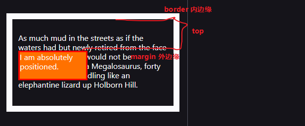
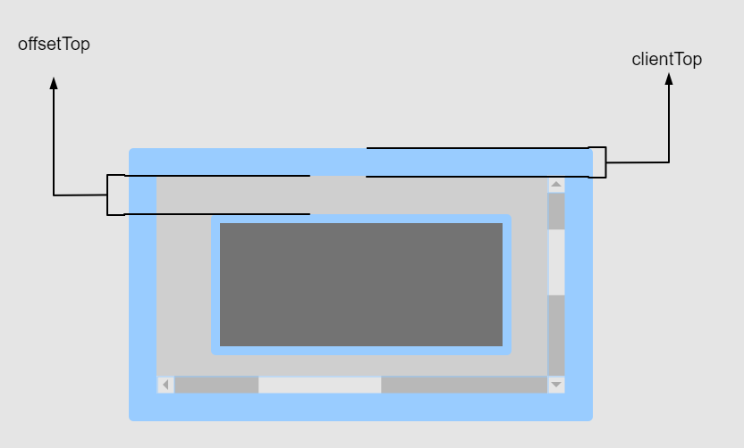
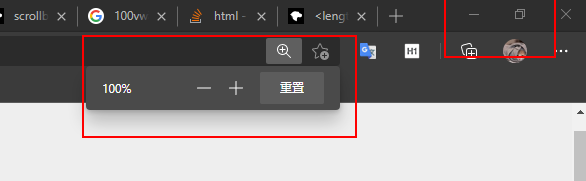
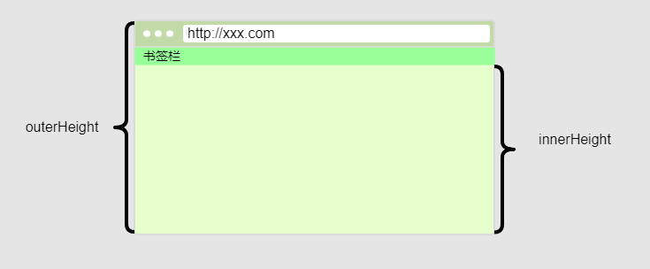

## top

`top`用于 CSS 元素设置位置顶部偏移量。

- `position:static`（初始值）：无效果
- `position:relative`：元素`margin box`相对于其正常流布局位置的顶部偏移量，在正常流布局中，块级盒子会在父元素的`padding box`内部从左往右从上往下放置。
- `position:absolute`：子元素的`margin box`外边缘和最近的非`position:static`的父元素的`border box`内边缘之间的距离



- `position:fixed`：子元素的`margin box`相对于视口顶部的偏移量，如果有`iframe`则是相对于`iframe`内部的视口

<iframe height="200" src="https://interactive-examples.mdn.mozilla.net/pages/css/top.html" title="MDN Web Docs Interactive Example" width="100%" height="376" style={{ background: '#fff'}} loading="lazy"></iframe>

当`top`的值设置成百分比时，相对的是容器元素的高度。

## scrollTop **writeable**

**获取或设置一个父元素内部`content`区域顶部垂直向上滚动的高度**，同理`scrollLeft`也是这样的原理。

```js
const intElemScrollTop = someElement.scrollTop;

element.scrollTop = someValue;
```

需要注意以下两点：

- `scrollTop`作用在父元素上，也就是产生滚动条的元素，一般其`overflow`属性不为`visible`
- `scrollTop`表示`content`区域顶部向上滚动的像素数，不要管什么可见不可见的问题

```mdx-code-block
import Demo from '@/demo/scrollTop';
import CodeBlock from '@site/src/components/CodeBlock';

<CodeBlock>
<Demo />
</CodeBlock>
```

## clientTop **readonly**

`clientTop`表示元素本身`border`上边缘高度加上顶部滚动条高度，如果没有滚动条就是顶部`border`的宽度。如果也没有`border`，那就是`0`。


## offsetTop **readonly**

`offsetTop`是一个相对距离，表示元素自身顶部`border`外边缘到`offsetParent`顶部`border`内边缘的距离。

:::caution

`offsetParent`指的是最靠近的定位祖先元素：

- `position`不为默认值`static`的祖先元素
- 或者`position`为`static`的`td`, `th`, `table`这些元素；

如果找不到最近的祖先元素，则返回`body`元素。

在以下情况中，`offsetParent`会返回`null`：

- 元素本身或者其父元素设置了`display:none`
- `position:fixed`元素的`offsetParent`是`null`
- `body`或者`html`元素的`offsetParent`也是`null`

:::




## window.innerHeight

表示浏览器视口高度像素值，包括水平方向滚动条的高度，不包括浏览器 UI 组件（地址栏，书签栏等），会随着浏览器窗口的缩放比例，以及浏览器本身调节窗口大小而改变。



## window.outerHeight

整个浏览器的高度，包括地址栏，书签栏等部分，且不会随着浏览器缩放比例或者浏览器标签页大小改变而改变，所以这是一个**固定**值。



## scrollHeight **readonly**

一个四舍五入的整数值，表示**元素内容区域的完整高度**，包括溢出父元素的隐藏区域；包含元素的`padding`部分，不包含`border`，`margin`以及水平方向滚动条的高度，如果有伪元素`::before`，`::after`等，也会包含在内。


`scrollHeight`这个属性在使用虚拟滚动渲染大量子元素时非常有用，是进行性能优化最关键的点。

## clientHeight **readonly**

```javascript
CSS height + CSS padding - 水平方向滚动条高度
```

一个四舍五入的整数值，表示**元素内部可视内容区域的像素高度**，包含`padding`，但不包括水平滚动条高度、`border`和`margin`。

根元素`html`的`clientHeight`就是`viewport`的高度，也不包含水平方向滚动条高度。


## offsetHeight **readonly**

一个四舍五入的整数值，包含元素`padding`，`border`和水平滚动条高度，不包含`margin`，伪元素的高度。如果元素隐藏了，例如`display:none`，这个值就是`0`。

