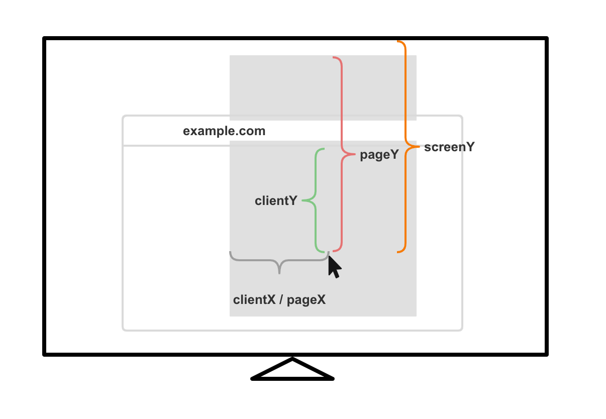

## scrollX & scrollY

> `Window.scrollX` | `window.pageXOffset`

该属性只能用于`window`对象，在现代浏览器中，这个值是一个**双精度浮点型**的数值，可能是小数，它代表的是**当前页面从起始位置开始沿水平或者垂直方向滑动的距离**，可以直接在浏览器的控制台获取这个值。

如果是正值，则代表从左到右，或者从上到下滑动的距离。另外在 js 里可以使用`window.scroll(x, y)`这个方法控制窗口滑动。

```js
// 如果 scrollX 大于 400，则把文档重新滚动到左上角。
if (window.scrollX > 400) {
  window.scroll(0,0);
}
```

## pageX & pageY

> [`MouseEvent.pageX`](https://developer.mozilla.org/en-US/docs/Web/API/MouseEvent/pageX)
>
> [`Touch.pageX`](https://developer.mozilla.org/en-US/docs/Web/API/Touch/pageX)

返回一个单精度浮点数值，`pageX`或者`pageY`属于鼠标或者触摸事件的属性，代表了**鼠标当前点击位置或者触摸位置相对于整个文档左侧或者上方的距离**，如果文档向左侧或者上方发生了滚动，那么滚动距离也会计算在内。

举个例子，如果页面向右滚动 `200px` 并出现了滚动条，这部分在窗口之外，然后鼠标点击距离窗口左边 `100px` 的位置，pageX 所返回的值将是 `300`。

<iframe width="100%" height="300" src="https://yari-demos.prod.mdn.mozit.cloud/en-US/docs/Web/API/MouseEvent/pageX/_sample_.Showing_the_mouse_position_relative_to_page_origin.html" loading="lazy"></iframe>

## clientX & alientY

> [`MouseEvent.clientX`](https://developer.mozilla.org/en-US/docs/Web/API/MouseEvent/clientX)
>
> [`Touch.clientX`](https://developer.mozilla.org/zh-CN/docs/Web/API/Touch/clientX)

`clientX`或者`clientY`属于鼠标或者移动端触摸事件的属性，返回一个双精度浮点数值，代表鼠标当前点击位置或者触摸位置**距离文档可见区域`viewport`左侧或者上侧的距离**。

在页面没有`iframe`的情况下，页面在`viewport`内部可视区域的宽高就是浏览器标签页窗口大小；如果是`iframe`内部的页面，则取决于`iframe`定义的宽高。

如果说一个文档没有滚动条，所有部分都是可见的，那么`clientX === pageX`、`clientY === pageY`。

<iframe src="https://yari-demos.prod.mdn.mozit.cloud/en-US/docs/Web/API/MouseEvent/clientX/_sample_.example.html" style={{ background: "#fff" }} height="300px" width="100%" loading="lazy"></iframe>

## screenX & screenY

> [`Window.screenX`](https://developer.mozilla.org/en-US/docs/Web/API/Window/screenX)
>
> [`Touch.screenX`](https://developer.mozilla.org/en-US/docs/Web/API/Touch/screenX)
>
> [`MouseEvent.screenX`](https://developer.mozilla.org/en-US/docs/web/api/mouseevent/screenx)

`screenX`属于鼠标或者触摸事件的属性，代表了**鼠标当前点击位置或者触摸位置距离屏幕左侧或者上侧的距离**。

<iframe width="100%" src="https://yari-demos.prod.mdn.mozit.cloud/en-US/docs/Web/API/MouseEvent/screenX/_sample_.Example.html" style={{ background: "#fff" }}  loading="lazy"></iframe>

## screen vs client vs page



## offsetX & offsetY

`offsetX`和`offsetY`表示鼠标点击事件触发位置距离事件元素`padding edge`的距离，[点击查看示例](https://www.w3schools.com/jsref/tryit.asp?filename=tryjsref_event_mouse_offsetx)。

## getBoundingClientRect

> [`Element.getBoundingClientRect()`](https://developer.mozilla.org/en-US/docs/Web/API/Element/getBoundingClientRect)

`getBoundingClientRect`用于获取 **DOM 元素在浏览器可视区域`viewport`内**的一些尺寸、坐标位置等属性，返回值是一个[DOMRect - Web APIs | MDN (mozilla.org)](https://developer.mozilla.org/en-US/docs/Web/API/DOMRect)类型的对象，计算的尺寸和坐标会包含元素的`padding`和`border`的值。

- `x/left`：元素左侧距离文档可视区域左侧的距离，如果元素因为横向滚动被浏览器窗口或者`iframe`外区域遮挡，则这个值是负值；
- `right`：元素右侧距离文档可视区域左侧的距离
- `y/top`：元素上侧距离文档可视区域上侧的距离，如果元素因为纵向滚动被浏览器窗口或者`iframe`外区域遮挡，则这个值是负值；
- `bottom`：元素底部距离文档可视区域上侧的距离
- `width/height`：如果是标准盒模型，则是`height+padding+border width/height`；怪异盒模型则只是内容区域的宽高


需要注意的是`DOMRect`的属性只能通过`for...in`来遍历，因为其属性本身来自于继承的`DOMRectReadOnly`类型，所以通过`Object.keys`等方法无法获取其原型链上的属性。

<iframe width="100%" height="500" style={{ background: "#fff" }}  src="https://yari-demos.prod.mdn.mozit.cloud/en-US/docs/Web/API/Element/getBoundingClientRect/_sample_.Scrolling.html" loading="lazy"></iframe>

## getBoundingClientRect 应用

### 获取子元素的相对位置

滑块组件中利用鼠标移动的坐标点`clientX/clientY`和父元素的`left/top`进行计算，可以得出子元素相对于父元素的偏移量，例如监听鼠标`mousemove`

事件：

```js
const handleMove = e => {
	const { clientX } = e;
  const parentNode = e.target.parentNode;
  const { left } = parentNode.getBoundingClientRect();
  const leftPosition = clientX - left;
}

document.addEventListener('mousemove', handleMove);
```

