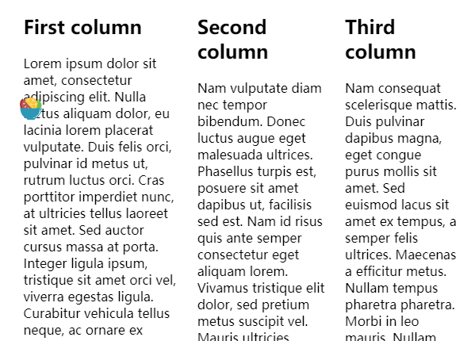

## float的机制

- `float`元素会脱离正常的文档布局流，并吸附在其父容器的左边；在正常布局中位于该浮动元素下的内容，此时会围绕着浮动元素，填满其右侧空间
- 浮动元素仍然对`margin`，`border`等有效

## float常见应用

### 实现文字环绕图片

```css
img {
  float: left;
  margin-right: 30px;
}

<div>
    

    <p> Lorem ipsum dolor sit amet, consectetur adipiscing elit. Nulla luctus aliquam dolor, eu lacinia lorem placerat vulputate. Duis felis orci, pulvinar id metus ut, rutrum luctus orci. Cras porttitor imperdiet nunc, at ultricies tellus laoreet sit amet. Sed auctor cursus massa at porta. Integer ligula ipsum, tristique sit amet orci vel, viverra egestas ligula. Curabitur vehicula tellus neque, ac ornare ex malesuada et. In vitae convallis lacus. Aliquam erat volutpat. Suspendisse ac imperdiet turpis. Aenean finibus sollicitudin eros pharetra congue. Duis ornare egestas augue ut luctus. Proin blandit quam nec lacus varius commodo et a urna. Ut id ornare felis, eget fermentum sapien.</p>
</div>
```


### 实现首字母突出特效

```css
p {
  width: 400px;
  margin: 0 auto;
}

p::first-letter {
  font-size: 3em;
  border: 1px solid black;
  background: red;
  float: left;
  padding: 2px;
  margin-right: 4px;
}

<p>
    This is my very important paragraph. I am a distinguished gentleman
    of such renown that my paragraph needs to be styled in a manner
    befitting my majesty. Bow before my splendour, dear students, and go
    forth and learn CSS!
</p>
```


### 创建多列布局

```css
body {
  width: 90%;
  max-width: 900px;
  margin: 0 auto;
}

div:nth-of-type(1) {
  width: 36%;
  float: left;
}

div:nth-of-type(2) {
  width: 30%;
  float: left;
  margin-left: 4%;
}

div:nth-of-type(3) {
  width: 26%;
  float: right;
}

<div>
  <h2>First column</h2>
  <p> Lorem ipsum dolor sit amet, consectetur adipiscing elit. Nulla luctus aliquam dolor, eu lacinia lorem placerat vulputate. Duis felis orci, pulvinar id metus ut, rutrum luctus orci. Cras porttitor imperdiet nunc, at ultricies tellus laoreet sit amet. Sed auctor cursus massa at porta. Integer ligula ipsum, tristique sit amet orci vel, viverra egestas ligula. Curabitur vehicula tellus neque, ac ornare ex malesuada et. In vitae convallis lacus. Aliquam erat volutpat. Suspendisse ac imperdiet turpis. Aenean finibus sollicitudin eros pharetra congue. Duis ornare egestas augue ut luctus. Proin blandit quam nec lacus varius commodo et a urna. Ut id ornare felis, eget fermentum sapien.</p>
</div>

<div>
  <h2>Second column</h2>
  <p> Lorem ipsum dolor sit amet, consectetur adipiscing elit. Nulla luctus aliquam dolor, eu lacinia lorem placerat vulputate. Duis felis orci, pulvinar id metus ut, rutrum luctus orci. Cras porttitor imperdiet nunc, at ultricies tellus laoreet sit amet. Sed auctor cursus massa at porta. Integer ligula ipsum, tristique sit amet orci vel, viverra egestas ligula. Curabitur vehicula tellus neque, ac ornare ex malesuada et. In vitae convallis lacus. Aliquam erat volutpat. Suspendisse ac imperdiet turpis. Aenean finibus sollicitudin eros pharetra congue. Duis ornare egestas augue ut luctus. Proin blandit quam nec lacus varius commodo et a urna. Ut id ornare felis, eget fermentum sapien.</p>
</div>

<div>
  <h2>Third column</h2>
  <p>Nam vulputate diam nec tempor bibendum. Donec luctus augue eget malesuada ultrices. Phasellus turpis est, posuere sit amet dapibus ut, facilisis sed est. Nam id risus quis ante semper consectetur eget aliquam lorem. Vivamus tristique elit dolor, sed pretium metus suscipit vel. Mauris ultricies lectus sed lobortis finibus. Vivamus eu urna eget velit cursus viverra quis vestibulum sem. Aliquam tincidunt eget purus in interdum. Cum sociis natoque penatibus et magnis dis parturient montes, nascetur ridiculus mus.</p>
</div>
```



## 浮动影响

- **float 元素在正常文档流中所占的有效宽高都是 0，也就是脱离了正常文档流，这也是浮动影响其相邻元素位置排版的根本原因**
- 使用 float 多列布局，可能因为盒模型的宽度计算问题而导致设置`padding`，`margin`等属性后布局可能会被破坏
- float 布局会影响相邻元素在页面中的排布，因为 float 元素脱离了正常的文档流，所以块级元素会按照正常文档流的布局方式与 float 元素发生重叠
- 相邻的非浮动元素不能通过`margin`来创建与浮动元素之间的间隔空间

## 消除浮动带来的影响

- 清除**相邻**元素浮动影响，为相邻元素设置`clear`属性

```css
clear: none;
clear: left;
clear: right;
clear: both;
```

- 清除**相邻**元素浮动影响，通过添加一个无用的`div`块并设置其`clear`属性来清除随后元素的浮动影响

```html
.clearfix { clear: both; }

<div class="clearfix"></div>
<!-- 此后的div将不受浮动影响 -->
<div>
  <p>
    ©2016 your imagination. This isn't really copyright, this is a mockery of
    the very concept. Use as you wish.
  </p>
</div>
```

- 清除**内部图片**浮动影响；如果 div 内有一张浮动的图片，那么 div 的高度会发生塌陷，有以下 5 种方法清除浮动图片造成的影响

```css
No.1   div使用float

<div style="float:left; background:#f0f3f9; padding:20px;">
    
</div>

No.2   div使用position:absolute

<div style="position:absolute; background:#f0f3f9; padding:20px;">
    
</div>

No.3   div使用display:inline-block

<span style="display:inline-block; background:#f0f3f9; padding:20px;">
    
</span>

No.4   div使用overflow，这里auto，hidden都可以，具体看其他内容

<div style="overflow:hidden; background:#f0f3f9; padding:20px;">
    
</div>

No.5   使用伪类:after，以下代码一句都不能少

.clearfix:after {
    content: ".";
    display: block;
    height: 0;
    clear: both;
    visibility: hidden;
}

<div class="clearfix">
    
</div>

No.6   只针对IE6/7以下还可使用zoom，对webkit的浏览器无效

<div style="zoom:1; background:#f0f3f9; padding:20px;">
    
</div>
```
