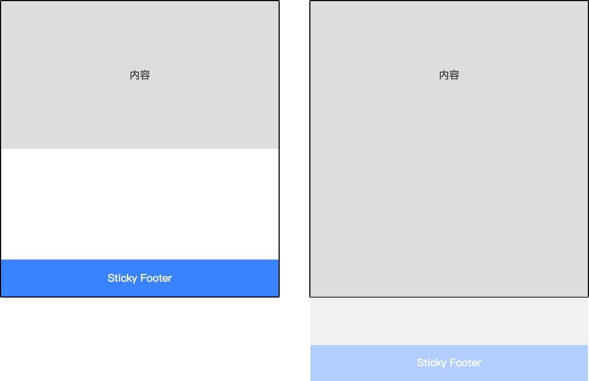

## sticky footer

粘连布局，特点是主题区域`main`跟随一个`footer`，当`main`足够高时，`footer`会跟随滚动；当`main`高度小于视口高度时，`footer`自动粘连在页面底部



### flex

- 最理想的实现方式，简单简洁

```shell
<style>
  * {
    margin: 0;
  }

  html,
  body {
    height: 100%;
  }

  body {
    display: flex;
    flex-direction: column;
  }

  #main {
    flex: 1 0 auto;
    background: gray;
  }

  #footer {
    flex-shrink: 0;
    background: blue;
  }
</style>

<body>
  <div id="main">
    <p>测试</p>
    <p>测试</p>
    <p>测试</p>
  </div>
  <div id="footer">
    <p>footer</p>
  </div>
</body>
```

### 负 margin 实现

- 设置`body`高度`height:100%`，使子元素继承高度
- 设置主体区域`main`最小高度为`height:100%`
- 通过主体区域`main`的`padding-bottom`拉开与`footer`之间的间距，防止在`main`内容超过视口高度时与`footer`发生重叠
- 通过负值`margin`在`main`区域高度
- 保证主体区域`main`外层需要有一层容器包裹，`footer`要和主体区域完全分离，并且需要`footer`固定高度

> 缺点

- 需要多一层 DOM 结构
- `footer`定高不灵活，当内容增多时不会自适应

```shell
<style>
  * {
    margin: 0;
    padding: 0;
  }
  html,
  body {
    height: 100%; //核心代码
    margin: 0;
  }
  #wrap {
    min-height: 100%; //核心代码
    background: #bbbbbb;
    text-align: center;
    overflow: hidden;
  }
  #wrap .main {
    padding-bottom: 50px; //核心代码
  }
  #footer {
    height: 50px;
    line-height: 50px;
    background: deeppink;
    text-align: center;
    margin-top: -50px; //核心代码
  }
</style>

<div id="wrap">
  <div class="main">
    <p>测试</p>
    <p>测试</p>
  </div>
</div>
<div id="footer">footer</div>
```

### 利用 absolute 定位

- 绝对定位相对负 margin 简单一点，不需要底部区域使用负 margin 值，缺点是底部高度固定不灵活

```shell
<style>
  html {
    height: 100%;
  }

  body {
    min-height: 100%;
    position: relative;
  }

  .main {
    padding-bottom: 50px;
    background: gray;
  }

  .foot {
    position: absolute;
    width: 100%;
    bottom: 0;
    height: 50px;
    background: red;
  }
</style>

<body>
  <div class="main">
    <p>测试</p>
    <p>测试</p>
    <p>测试</p>
    <p>测试</p>
  </div>
  <div class="foot"></div>
</body>
```

### 利用 calc()函数

- 最简单的实现方式，但是兼容性不好，截止到目前，IE6~8 不支持，IE8+都是部分支持，需要 polifill

```shell
<style>
  * {
    margin: 0;
  }

  #main {
    min-height: calc(100vh - 50px);
    background: darkgrey;
  }

  #footer {
    height: 50px;
    line-height: 50px;
    background: red;
  }
</style>

<div id="main">
  <p>测试</p>
  <p>测试</p>
  <p>测试</p>
  <p>测试</p>
  <p>测试</p>
</div>
<div id="footer">footer</div>
```

### grid

- 相对简单的方式，但是也是兼容性不好

```shell
<style>
  html {
    height: 100%;
  }

  body {
    min-height: 100%;
    display: grid;
    grid-template-rows: 1fr auto; //底部自适应，剩余空间全部给主体区域main
  }

  #main {
    background: gray;
  }

  #footer {
    grid-row-start: 2;
    grid-row-end: 3;
    background: blue;
  }
</style>

<body>
  <div id="main">
    <p>测试</p>
    <p>测试</p>
    <p>测试</p>
  </div>
  <div id="footer">
    <p>footer</p>
  </div>
</body>
```

