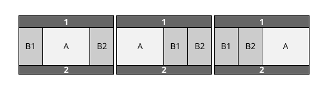
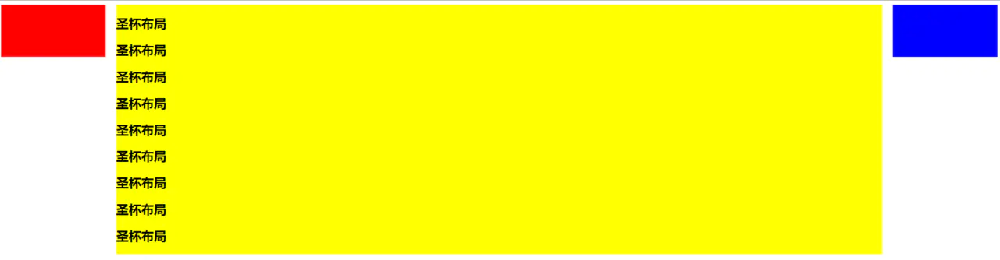
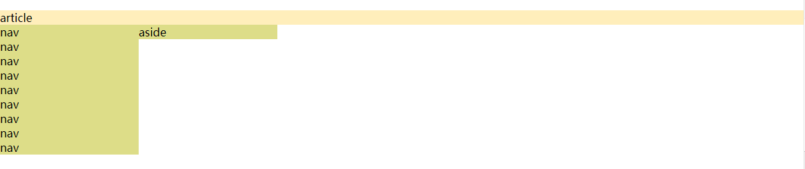
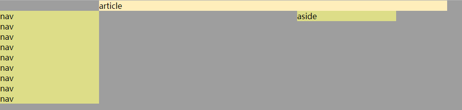
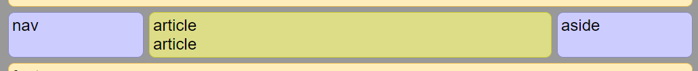

## 三列布局



### 圣杯布局

- 圣杯布局：顾名思义，就是主体带上两边“耳朵”；DOM 结构由三块组成，中间一块先写，保证中间区域先加载，然后带上两侧栏；
- 特点是两边宽度固定，中间自适应；并且中间高度高于两侧高度
- 缺点是内容高度不会自动拉伸自适应其他列的高度，就是会出现一列高一列低的情况



> float

1.  对主体部分三列全部使用`float:left`，并设置每列宽度；由于中间列宽度`100%`，所以会将其他两列挤到下方

    

2.  对主体容器设置`padding:200px`，为左右两侧留出空间

3.  使用相对定位，将左右两侧栏偏移定位



4.  使用`margin: -100%`负值将受 float 影响的左侧栏拉回到和中间区域同一行；同样的，使用`margin-left: -200px;`将右侧栏拉回到和中间区域同一行；但是此时左右两侧栏还是和中间区域是重叠的

5.  最后设置主体中心列高度`min-height: 100%;`

- 这种方式的缺点

1.  十分复杂

2.  如果其中一列内容高度拉长，其他两列的背景并不会自动填充

3.  同时由于 float 的影响，三列之间无法直接使用`margin`拉开间距，只能在设置`overflow:auto`后，并且改变原来设置的相对定位值才能使用`margin`

4.  屏幕宽度小于`630px`以后，也就是移动端的宽度，整个布局完全会被破坏

```shell
<style>
  * {
    margin: 0;
    padding: 0;
  }

  #main {
    padding: 0 200px;
    overflow: hidden;
  }

  #main > nav {
    float: left;
    width: 200px;
    margin-left: -100%;
    position: relative;
    right: 200px;
    background: #dddd88;
  }

  #main > article {
    float: left;
    width: 100%;
    min-height: 100%;
    background: #ffeebb;
  }

  #main > aside {
    float: left;
    width: 200px;
    margin-left: -200px;
    position: relative;
    left: 200px;
    background: #dddd88;
  }
</style>

<body>
  <div id="main">
    <article>
      article
    </article>
    <nav>
      nav
    </nav>
    <aside>
      aside
    </aside>
  </div>
</body>
```

### 双飞翼布局

- 双飞翼布局是对传统圣杯布局的改进，在 float 基础上的改进，解决了 float 在小屏幕上布局崩溃的问题
- 没有使用相对定位`position:relative`，通过`margin`来调整主体部分与两侧区域的分离

```shell
<style>
  #main {
    margin: 0;
    padding: 0;
    overflow: hidden; //overflow时为了清除浮动带来的影响
  }

  .wrapper {
    float: left;
    width: 100%; //关键部分，必须使外层容器占满屏幕宽度，这样才能让内部主体的margin生效
  }

  .wrapper > article {
    margin: 0 220px; //关键部分，margin可以适当大一点，来显示主体部分和两侧部分的间距
  }

  #main > nav {
    float: left;
    width: 200px;
    margin-left: -100%;
    background: #dddd88;
  }

  #main > aside {
    float: left;
    width: 200px;
    margin-left: -200px;
    background: #dddd88;
  }
</style>

<article class="container">
  <div class="center">
    <div class="inner">双飞翼布局</div>
  </div>
  <div class="left"></div>
  <div class="right"></div>
</article>
```

### 等高布局

- 子元素在父元素中高度相等的布局方式
- 抛去具体业务场景，无论是圣杯布局还是双飞翼布局，都无法解决一个问题，三栏中无论哪一栏高度高于其他两列都会出现高度不统一的现象，等高布局就很好的解决了这一问题



> flex 实现

- 目前的主流方式，兼容性好；配合媒体查询可以做到移动端兼容
- 注意指定`order`以及中间部分`flex:1`

```shell
<style>
  #main {
    min-height: 100vh;
    margin: 0px;
    padding: 0px;
    display: -webkit-flex;
    display: flex;
    -webkit-flex-flow: row;
    flex-flow: row;
  }

  #main > article {
    margin: 4px;
    padding: 5px;
    flex: 1; //完全占据容器剩余空间
    -webkit-order: 2;
    order: 2;
  }

  #main > nav {
    margin: 4px;
    padding: 5px;
    width: 200px;
    order: 1;
  }

  #main > aside {
    margin: 4px;
    padding: 5px;
    width: 200px;
    order: 3;
  }

  /* 窄到已不足以支持三栏 */
  @media all and (max-width: 640px) {
    #main {
      -webkit-flex-flow: column;
      flex-direction: column;
    }

    #main > article,
    #main > nav,
    #main > aside {
      /* 恢复到文档内的自然顺序 */
      -webkit-order: 0;
      order: 0;
    }

    #main > nav,
    #main > aside,
    header,
    footer {
      width: 100%;
      min-height: 50px;
      max-height: 50px;
    }
  }
</style>

<body>
  <header>header</header>
  <div id="main">
    <article>article</article>
    <nav>nav</nav>
    <aside>aside</aside>
  </div>
  <footer>footer</footer>
</body>
```

> grid

- 最简单的实现方式，但是学习成本较高
- 兼容性不好，IE10+，甚至微信浏览器都依然不支持大部分 grid 布局的属性


```shell
/* 使用grid将中间部分分为一行四列的结构，just like this */
<style>
  #main {
    display: grid;
    grid-template-columns: 1fr 2fr 1fr; //分成3列，1：2：1
  }

  #main > article {
    grid-column: 1/2; //从列的第一条基线到第二条基线之间区域
    grid-row: 1/2; //从行的第一条基线到第二条基线之间区域
  }

  #main > nav {
    grid-column: 1/2;
    grid-row: 1/2;
  }

  #main > aside {
    grid-column: 3/4; //从列的第三条基线到第四条基线之间区域
    grid-row: 1/2;
  }
</style>

<div id="main">
  <article>article</article>
  <nav>nav</nav>
  <aside>aside</aside>
</div>
```

> table

- 设置`display:table`的容器内部使用`display:table-cell`会使元素自动行内排布，并且同一行列表元素都等高

```shell
<style>
  #main {
    display: table;
    width: 100%;
  }

  #main > article {
    display: table-cell;
  }

  #main > nav {
    display: table-cell;
  }

  #main > aside {
    display: table-cell;
  }
</style>

<div id="main">
  <article>
    <p>article</p>
  </article>
  <nav>
    <p>nav</p>
  </nav>
  <aside>aside</aside>
</div>
```

> 利用正 padding+负 margin

- 因为背景是在 padding 区域显示的，**设置一个大数值的 padding-bottom，再设置相同数值的负的 margin-bottom，最后通过容器的`overflow:hidden` 把溢出背景切掉**
- 属于纯粹通过背景颜色解决视觉上的等高布局方式，可以看到主体部分实际高度并未跟随两侧


```shell
<style>
  #main {
    padding: 0;
    overflow: hidden; //隐藏掉溢出的背景
  }

  .wrapper {
    float: left;
    width: 100%;
    padding-bottom: 9999px;
    margin-bottom: -9999px;
    background-color: yellowgreen; //关键部分，用背景颜色让中间区域看起来和两侧等高，实际主体内容高度并未跟随两侧
  }

  .wrapper > article {
    margin: 0 220px;
  }

  #main > nav {
    float: left;
    width: 200px;
    margin-left: -100%;
    background: #dddd88;
    padding-bottom: 9999px;
    margin-bottom: -9999px;
  }

  #main > aside {
    float: left;
    width: 200px;
    margin-left: -200px;
    background: #dddd88;
    padding-bottom: 9999px;
    margin-bottom: -9999px;
  }
</style>

<div id="main">
  <div class="wrapper">
    <article>
      article <br />
      article
    </article>
  </div>
  <nav>nav</nav>
  <aside>aside</aside>
</div>
```

> absolute

- 双飞翼布局可以通过绝对定位值`display:absolute`来创建，那么等高布局可以在此基础上创建
- absolute 不能撑开容器高度，不推荐使用

```shell
<style>
  #main {
    position: relative;
    overflow: hidden;
  }

  #main > article {
    margin-left: 210px;
    margin-right: 210px;
  }

  #main > nav {
    position: absolute;
    width: 200px;
    left: 0;
    top: 0;
    bottom: 0;
  }

  #main > aside {
    position: absolute;
    width: 200px;
    right: 0;
    top: 0;
    bottom: 0;
  }
</style>

<div id="main" class="clearfix">
  <article>
    article
  </article>
  <nav>nav</nav>
  <aside>aside</aside>
</div>
```

> `calc`

```shell
<style>
  .center {
    float: left;
    width: calc(100% - 400px); //中间列自适应
    background: #ccc;
    height: 200px;
  }
  .left {
    float: left;
    width: 200px;
    height: 200px;
    background: red;
  }
  .right {
    float: left;
    width: 200px;
    height: 200px;
    background: blue;
  }
</style>

<div class="left">left 200px</div>
<div class="center">center=calc(100%-400px)</div>
<div class="right">right 200px</div>
```

