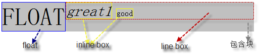
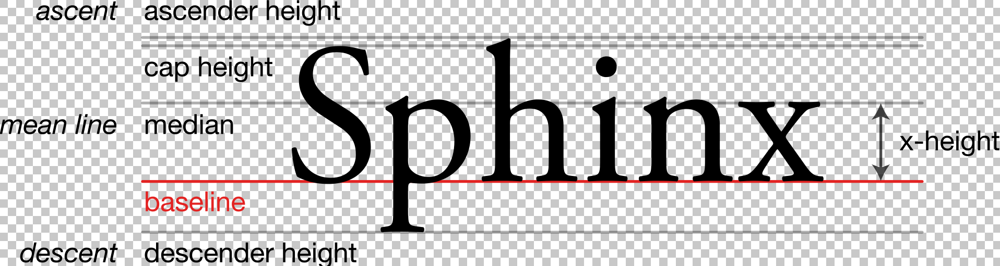
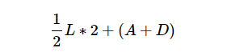

## 行内元素

### 行内级元素

行内级元素多为文本，图片展示，CSS 属性`display`的值为`inline`，`inline-block`，`inline-table`的元素属于行内级元素。行内元素主要有以下这些：

```html
 <span></span> <button></button>

<a></a>

<input /> <label></label>

<select></select>

<textarea></textarea>

<code></code>

<br />

<i></i>

<map></map>

abbr, acronym, cite, dfn, em, kbd, strong, samp, var b, big, small, tt bdo, br,
object, q, script, sub, sup
```

### 行盒

行内级元素生成**行内级盒子**（inline-level boxes）。

行内非可替换元素的内容参与行内级盒子中包含的行内格式化上下文，所以行内非可替换元素生成的盒子被称为**行盒**（inline box）；例如`<span>`等。

可替换行内级元素（``），`display:inline-block`，`display:inline-table`虽然会生成行内级盒子，但并非行盒，这样的行内级盒子被称为**原子行内级盒子**（atomic inline-level boxes）。

### 匿名行盒

直接包含在块容器元素内部的任何文本被看作匿名行内元素（anonymous inline element），它们由包含它们的块级元素生成**匿名行盒**（anonymous inline boxes），因为它们没有直接关联的行内级元素。例如`<p>`内部的部分文本，`<em>`是一个行内级元素，它会生成一个行盒，但是剩余的文本 Some、text 这些被块级元素`<p>`直接包裹，它们只能由`<p>`生成匿名行盒。

```html
<p>Some <em>emphasized</em> text</p>
```


## IFC

> [行内格式化上下文](https://www.w3.org/TR/CSS22/visuren.html#inline-formatting)

行内格式化上下文会**在一个块容器盒子内部没有包含任何块级盒子的时候被创建**。个人理解，如果说 BFC 侧重于整体容器的排布，从上往下一个块一个块堆叠就行了，那么 IFC 就是侧重于水平方向上更细粒度的行内级元素的布局方式。

在行内格式化上下文中，行内级盒子的排布方式如下：

- 从包含块的顶部开始，行内级盒子被一个接一个的水平放置，盒子之间水平方向的`margin`，`border`，`padding`将会使它们产生间隔。容纳一行行内级盒子的矩形区域被称为**线盒**（ line box），多行文本就可以看作多行线盒的垂直堆叠。
- 在垂直方向上盒子的对齐方式可能有多种情况，顶部或者底部对齐，或者都按照文本的基线对齐，取决于`vertical-align`属性，默认是将行内元素的基线和父元素的基线对齐，如果行内元素没有基线，就把它的下边距的边缘`margin-bottom`和父元素的基线对齐。

### 线盒的宽度计算

通常，线盒左边缘接触包含块的左边缘，同时右边缘接触包含块的右边缘，也就是块容器盒内部**每行的线盒宽度都相同**，然而，如果块容器内部包含了浮动元素，浮动元素可能会处于包含块边缘和线盒边缘之间， 因此线盒会因浮动元素缩短实际的宽度。

```html
<p style="background-color:silver; width:500px; overflow:hidden; ">
  <span style="border:1px solid blue; font-size:50px; float:left;">FLOAT</span>
  <em style="border:1px solid yellow; font-size:30px;">great1</em>
  <span style="border:1px solid yellow;">good</span>
</p>
```



当线盒内行内级盒子的总宽度小于线盒的宽度时，它们**在线盒内的排布**取决于块容器盒子的`text-align`属性，`text-align`属性的默认值是`start`，如果书写方向是从左到右，则`start`就和`left`的效果一样，表示所有盒子向左对齐；而如果书写方向是从右向左，则相反。注意`text-align`修改的是行内级盒子在线盒内的对齐方式。

```html
<p
  style="background-color:silver; width:500px; overflow:hidden; text-align: center"
>
  <span style="border:1px solid blue; font-size:50px; float:left;">FLOAT</span>
  <em style="border:1px solid yellow; font-size:30px;">great1</em>
  <span style="border:1px solid yellow;">good</span>
</p>
```


当行内级盒子的总宽度大于线盒的宽度，它就会被分配在两个或多个垂直堆叠的线盒中。不能分割的行内盒子有以下几种情况：

- 连在一起的英文字母会看做一个英文单词，而不能被分隔；连字符除外，连字符左边的部分加上连字符`-`一起看作整体不能拆分，右边的部分可能会换到下一行
- 单个汉字不能拆分
- 指定行内级盒子或者包含块容器盒子的 CSS 属性为`white-space: nowrap;`或者`white-space: pre;`的不能拆分


### 线盒高度的计算

> [Line height calculations](https://www.w3.org/TR/CSS22/visudet.html#line-height)

线盒总是足够容纳行内所有的行内级盒子，一行线盒的高度计算算法如下：

- 首先计算线盒内每个行内级盒子的高度。对于可替换元素，`inline-block`元素，`inline-table`元素计算它们`margin box`的高度；而对于行内盒子（inline box），也就是`display:inline`元素生成的盒子，计算高度就是它的行高`line-height`，关于这点需要看下方对于`line-height`的解释；
- 然后根据`vertical-align`属性将线盒中的行内级盒子进行对齐；

- 此时线盒的高度就是在最上面的行内级盒子的顶部到最下面盒子的底部之间的距离。

## baseline-基线

在英文字体排版中有以下概念：



- `x`字高，x-height，是指英文字母的基本高度
- `x`上边顶着的线称为主线（mean line）；`x`下边顶着的线就是**基线（baseline）**；
- 一个字体超过主线的部分称为升部（ascender），低于基线的部分称为降部（descender）
- 位于基线之上大写字母的高度被称为大写字高（cap height）

中文没有基线的概念，因为中文以前的书写习惯就是从上往下怼的！如果把英文字符和汉字放在一起来看，大致可以看出基线其实比汉字底部要稍微高一点点。


在 CSS 中，基线用于线盒内元素或者文本垂直方向上的对齐。

`baseline`的几种情况：

- 文本属于元素内部的内容，文本的基线参照上面介绍；
- 图片等可替换元素没有基线，`margin-bottom`下边缘就当作基线；

- `inline-block`元素的基线是它内部正常流中最后一个线盒的基线。如果它的`overflow`属性值不是`visible`，或者内部没有正常流的线盒，那么它的基线就是`margin-bottom`的边缘；

- `inline-table`元素的基线是表中第一行的基线

### line-height

> [MDN - line-height](https://developer.mozilla.org/en-US/docs/Web/CSS/line-height)
>
> [张鑫旭 - line-heght 的理解](https://www.zhangxinxu.com/wordpress/2009/11/css行高line-height的一些深入理解及应用)
>
> [Deep dive CSS: font metrics, line-height and vertical-align](https://iamvdo.me/en/blog/css-font-metrics-line-height-and-vertical-align)

对于`line-height`，相关言论有`line-height`就是上下两行文本基线之间的高度，`line-height`就是行高，`line-height`是行间距等等。根据 MDN 英文版的描述如下：

- `line-height`设置线盒的高度，**通常被用于设置文本行之间的距离**。在块级元素中，它指定的是线盒的最小高度，在非可替换的行内元素中，它指定的是用于计算线盒的高度。

实际上在 W3C 规范文档中给出了`line-height`的算法，它是根据行距（leading）来计算的 —— [W3C - Leading and half-leading](https://www.w3.org/TR/CSS22/visudet.html#leading)

- CSS 假定每个字体都具有两部分，字体中位于基线以上的部分高度用`A`表示，位于基线以下部分的高度用`D`表示；

- 用户代理必须根据字体之间的相关基线将字体进行垂直方向的对齐；

- 对于每一个字形，行距（leading）用`L`表示，`L = line-height - (A+D)`。将行距的一半高度值半行距（half leading）`1/2 L`添加到字形的`A`之上，另一半行距添加到`D`的下方，这时候的总高度计算如下：

  

  而`L = line-height - (A+D)`，所以这个高度正好等于行高`line-height`—— [_The height of the inline box encloses all glyphs and their half-leading on each side and is thus exactly 'line-height'_](https://www.w3.org/TR/CSS22/visudet.html#inline-box-height)。

CSS 中`line-height`的默认值是`normal`，这个值的含义是告诉浏览器根据元素内字体大小来指定合适的值，CSS2.2 建议的合适大小是字体大小的`[1.0, 1.2]`倍之间。也可以为`line-height`指定其它类型的值：

- `<number>`：一个单纯的数字；实际的值将转换成字体的`<number>`倍
- `<percentage>`：百分比，也是相对于字体大小
- `<length>`：设置一个具体的长度，要指定单位，例如`px`，`em`，`rem`

:::caution

在 JSX 中使用`line-height`需要特别注意是否应该带上长度单位，如果不带单位，它是不会像`height`那样自动加`px`单位的！

:::

`line-height`可以用在任何元素上，但是在块级容器元素和普通行内级元素上使用的效果不同。

- 在一个由行内级元素组成的块容器元素上设置`line-height`，指定的是其**内部线盒的最小高度**，**它会间接影响块容器盒子的高度**。

- 在非可替换的行内级元素上设置`line-height`，将用于计算包含它的线盒的高度，这点尤其要注意，例如对一个`<span>`设置`line-height`，它能影响线盒的高度，但是它不能影响当前`<span>`形成的行内级盒子高度；但是当把`<span>`设置成`display:inline-block`变成一个容器元素时，设置`line-height`就能影响其生成的容器盒子的高度了。

## vertical-align

`vertical-align`可以**用在行内级元素或者`display:table-cell`元素上**，它影响的是元素自身在线盒内垂直方向上的对齐方式。

在以下值中，对于行内非可替换元素的，用于对齐的盒子是高度为`line-height`的盒子；其他类型的行内元素，用于对齐的盒子是 margin box 盒子。

- 默认值是`baseline`，`baseline`的含义是将元素的基线和父元素的基线对齐，如果行内元素没有基线，就把它的下边距的边缘`margin-bottom`和父元素的基线对齐。

相对于父元素对齐的几个值：

- `middle`：将盒子的中点和父元素盒子的基线加上`x-height`一般的高度的值对齐；很模糊，一般用于解决图片下面空白问题；
- `text-top`：将盒子上边缘和父元素内容区域的上边缘对齐；
- `text-bottom`：将盒子下边缘和父元素内容区域的下边缘对齐；

相对于行内元素所在行的线盒对齐的值：

- `top`：将盒子顶部与线盒顶部对齐；
- `bottom`：将盒子底部与线盒底部对齐；

<iframe width="100%" height="390" src="https://interactive-examples.mdn.mozilla.net/pages/css/vertical-align.html" title="MDN Web Docs Interactive Example" loading="lazy"></iframe>

另外，`transition`只支持`vertical-align`的值是指定具体`length`的情况：

> https://stackoverflow.com/questions/37080499/css-transition-on-vertical-align-property

### 行高的计算

> [Line height calculations](https://www.w3.org/TR/CSS22/visudet.html#line-height)

行高其实就是上文所说的线盒的高度，行高取决于`line-height`和`vertical-align`，在一行字体相同的情况下，可以认为这个高度等于`line-height`；但是字体高度不同时，或者该行具有图片等情况，需要根据`line-height`计算每个行内级盒子的高度，然后再根据每个盒子的`vertical-align`将它们依据自己的标准对齐，最后取一个能容纳所有盒子高度的值就是行高：

```jsx live
class Comp extends Component {
  render() {
    return (
      <p>
        测试
        <span style={{ lineHeight: 1, fontSize: 16 }}>测试</span>
        <span style={{ lineHeight: 2, fontSize: 18 }}>测试</span>
        <span style={{ lineHeight: 3, fontSize: 20 }}>测试</span>
        xxx
      </p>
    );
  }
}
```

### eg

这个例子其实涉及到 IFC 的整个排布方式以及 vertical-align 的基础使用，首先最外层的 div 内部没有包含任何块级元素，包含了两个行内级元素，那么创建 IFC，根据 IFC 的排布方式，盒子再水平方向一个一个排，并且根据`vertical-align`属性进行垂直方向上的对齐；
接下来，按照上文基线的说法，第一个 inline-block 内部没有任何子元素，所以基线按照 margin-bottom 处理，第二个 inline-block 内部包含一行文本行，所以基线按照改行文本行所在线盒的基线处理，依次排布并按照基线进行对齐。

如果在第二个 inline-block 再加一行文本，就会发现其基线如上文所说，根据内部最后一行线盒的基线来确定。

```mdx-code-block
import Demo1 from '@/demo/veticalAlign1'

<Demo1 />
```

```mdx-code-block
import Demo2 from '@/demo/veticalAlign2'

<Demo2 />
```


