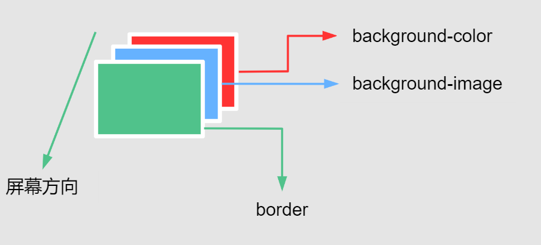
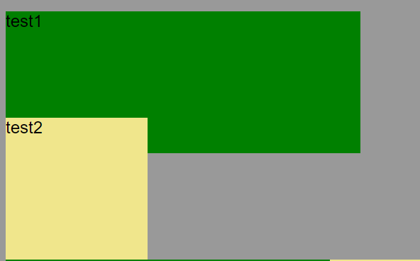
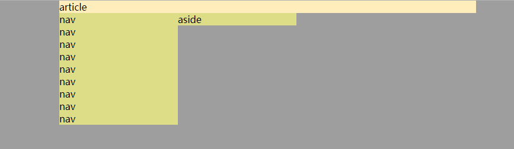
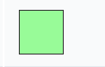
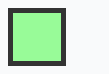

## content

### background

`background`这个属性可以说是 CSS 里最繁琐的，按以下顺序包含的属性及其初始值

- [`background-image`](https://developer.mozilla.org/en-US/docs/Web/CSS/background-image): `none`
- [`background-position`](https://developer.mozilla.org/en-US/docs/Web/CSS/background-position): `0% 0%`
- [`background-size`](https://developer.mozilla.org/en-US/docs/Web/CSS/background-size): `auto auto`
- [`background-repeat`](https://developer.mozilla.org/en-US/docs/Web/CSS/background-repeat): `repeat`
- [`background-origin`](https://developer.mozilla.org/en-US/docs/Web/CSS/background-origin): `padding-box`
- [`background-clip`](https://developer.mozilla.org/en-US/docs/Web/CSS/background-clip): `border-box`
- [`background-attachment`](https://developer.mozilla.org/en-US/docs/Web/CSS/background-attachment): `scroll`
- [`background-color`](https://developer.mozilla.org/en-US/docs/Web/CSS/background-color): `transparent`

`background`**并不用按照严格的属性顺序进行设置**：

- 每个属性值之间使用空格分隔，多个背景之间则使用逗号`,`分隔
- 为每个背景按以上顺序分配每个单独的属性为其初始值
- 由于`background-color`对应的颜色值很特殊，所以`background-color`可以出现在整个一串属性值的任意位置，不过一般都是在开头或者结尾指定

### background-attachment

`background-attachment`这个属性决定元素背景图像是跟随滚动条滚动还是一直固定显示在背景中。

- `scroll`：**默认值**，表示背景相对于元素本身固定，不会随元素本身的滚动条滚动
- `fixed`：表示背景相对于视口固定，即背景区域将会是整个视口，只会跟随页面整体的滚动条滚动，这也是移动端常用的窗口下广告的实现方法之一。
- `local`：表示背景相对于元素的内容固定，背景将会随着元素的内容滚动。如果元素本身没有溢出的子元素，这个值的效果和`scroll`是一样的。

<iframe width="100%" height="360" src="https://interactive-examples.mdn.mozilla.net/pages/css/background-attachment.html" loading="lazy"></iframe>

### background-color

`background-color`设置元素的背景颜色值。

- `transparent`：默认值，透明
- [`<color>`](https://developer.mozilla.org/zh-CN/docs/Web/CSS/color_value)

### background-image

`background-image`为一个元素设置一个或者**多个背景图像**。在绘制时，**先指定的图像会在之后指定的图像上面绘制**，然后按照`z`轴负方向堆叠。需要注意的是。不过需要注意的是这种堆叠绘制的方式并非真的是`z-index`那样的图层关系，它们始终还是在一个图层上。

<iframe  height="360" src="https://interactive-examples.mdn.mozilla.net/pages/css/background-image.html" width="100%" loading="lazy"></iframe>

关于`border`，`background-image`和`background-color`的绘制关系如下：



### background-clip

`background-clip` 设置元素的背景（背景图片或颜色）是否延伸到到`border box`、`padding box`或者只显示在`content-box`里面。

`background-clip`可以设置以下四种值：

- `border-box`：**默认值**，表示`background-image`和`background-color`对`border`生效，但是位于`border`下方，也就是会被`border`本身的`color`或者`image`覆盖
- `padding-box`：表示`background-image`和`background-color`只会对`padding box`内部的内容生效
- `content-box`：表示`background-image`和`background-color`限制在`content-box`内部
- `text`：实验性功能，当文字`color:transparent`透明的时候，`background-image`和`background-color`只会作为内容区域文字的背景

<iframe width="100%" height="360"  src="https://interactive-examples.mdn.mozilla.net/pages/css/background-clip.html" loading="lazy"></iframe>

### background-origin

`background-origin`设置背景的起始坐标点，其具有以下三个属性值：

- `border-box`：表示背景相对于`border`开始绘制，即从`border`左上角开始
- `padding-box`：**默认值**，表示背景相对于`padding`开始绘制
- `content-box`：表示背景相对于`content`区域开始绘制

当`background-attachment:fixed`的时候，也就是背景固定显示在视口内，`background-origin`的设置无效。

<iframe width="100%" height="400" src="https://interactive-examples.mdn.mozilla.net/pages/css/background-origin.html" loading="lazy"></iframe>

### background-position

`background-position`设置每一个背景图片的初始位置，但是相对于`background-origin`设置的起始点。

`background-position`只能使用方位值[`<position>`](https://developer.mozilla.org/en-US/docs/Web/CSS/position_value)，可以设置`1~4`个值。

#### 单值

- `center`：使背景居中
- `top`, `left`, `bottom`, `right`：让背景沿着这些方向对齐，这些值单个出现时，另一方位的值将自动设为`50%`，也就是在这些方向上自动具有居中效果
- [`length`](https://developer.mozilla.org/en-US/docs/Web/CSS/length) 或 [`percentage`](https://developer.mozilla.org/en-US/docs/Web/CSS/percentage)的单个值相对于左边缘的 X 坐标，并将 Y 坐标设置为 50％

#### 双值

- 如果其中一个值是`left`或者`right`，则其表示水平方向，另一个值表示垂直方向；如果其中一个值是`top`或者`bottom`，则其表示垂直方向，另一个值表示水平方向
- 如果两个值都是长度单位或者百分比，则第一个值表示水平方向，第二个值表示垂直方向

#### 四值

第一个和第三个值是方位关键字`top`, `left`, `bottom`, `right`，定义水平方向和垂直方向的位置；第二个和第四个值分别用来对应第一个和第三个定义的方位上的位置偏移量。

- 例如，如果第一个值是`left`或者`right`，则其表示水平方向，那么第三个值设置的偏移量就是在水平方向的偏移量；如果第一个值是`top`或者`bottom`，那么第三个值设置的偏移量就是在垂直方向的偏移量

<iframe width="100%" height="360" src="https://interactive-examples.mdn.mozilla.net/pages/css/background-position.html" loading="lazy"></iframe>

### background-size

`background-size`设置`background-image`的尺寸，其具有以下几种值：

- `auto`：默认值，沿相应方向缩放背景图像，并保持其固有比例

- `contain`：让`background-image`尽量适应容器，但不会裁剪或者拉伸图像；如果容器尺寸比图像原始尺寸要大，则图像显示可能会平铺（也就是不足的部分会重复显示），这时候可以通过设置`background-repeat:no-repeat`来禁止图像平铺
- `cover`：让`background-image`尽量充满容器，如果尺寸不符合容器会拉伸或者裁剪图像
- `<length>`长度
- `<percentage>`百分比

由于`background-image`可以设置多个，所以`background-size`也可以设置多个背景图像的尺寸

- 单值语法可以是`contain`，`cover`，当设置成`auto`，`<length>`和`<percentage>`的时候即表示背景图像的`width`，背景图像的`height`自动设置成`auto`；
- 双值语法，只能是`auto`，`<length>`和`<percentage>`，第一个值表示`width`，第二个值表示`height`
- 如果要区分多张`background-image`的尺寸，需要使用逗号`,`分隔

```css
// 两张背景的尺寸
background-size: auto, auto;

// 一张背景的尺寸
background-size: auto auto;
```

<iframe width="100%" height="360" src="https://interactive-examples.mdn.mozilla.net/pages/css/background-size.html" loading="lazy"></iframe>

### background-repeat

`background-repeat`设置`background-image`的重复方式，重复显示的图像将会忽略`background-position`的设置。

- `repeat`：默认值，图像会在水平和垂直方向上重复来充满元素背景；最后一个图像会被裁剪, 如果它的大小不合适的话
- `space`：图像会尽可能得重复，但是不会裁剪。第一个和最后一个图像会被固定在元素的相应的边上，同时空白会均匀地分布在图像之间

- `round`：随着允许的空间在尺寸上的增长，被重复的图像将会**拉伸(没有空隙)**，直到有足够的空间来添加一个图像
- `no-repeat`：图像不会重复，其位置由`background-position`来决定

#### 单值语法

单值语法有以下表示形式：

| 单值语法    | 双值语法              |
| ----------- | --------------------- |
| `repeat-x`  | `repeat no-repeat`    |
| `repeat-y`  | `no-repeat repeat`    |
| `repeat`    | `repeat repeat`       |
| `space`     | `space space`         |
| `round`     | `round round`         |
| `no-repeat` | `no-repeat no-repeat` |

#### 双值语法

双值语法即第一个值表示水平方向，第二个值表示垂直方向

<iframe  width="100%" height="360" src="https://interactive-examples.mdn.mozilla.net/pages/css/background-repeat.html" loading="lazy"></iframe>

## padding

`padding`一共有四个方向值：

- `padding-top`
- `padding-right`
- `padding-bottom`
- `padding-left`

`padding`的颜色值跟随内容区域的`background`，无法设置自己的颜色。

`padding`的值可以设置成`<length>`里的值，例如 PC 常用的`px`；

`padding`也可以设置成百分比值，设置成百分比值是相对于父元素**内容的宽度**，需要正确理解这里的内容宽度指的是父元素内容区域`content`的宽度，也就是受到`box-sizing`的影响

```css
/* box-sizing:content-box */
content width = width;

/* box-sizing:border-box */
content width = width - padding width;
```

## margin

### px

最常见的`px`，正值表示远离相邻元素，负值表示与相邻元素拉近，可能发生重叠。

### 负 margin

`margin-top/margin-left`被赋予负值时，该**元素自身**将向设置 margin 负值的方向进行平移

```css
/*向上平移10px*/
#main {
  margin-top: -10px;
}

/*向左平移10px*/
#main {
  margin-left: -10px;
}
```

当设置`margin-bottom/right`为负数，**会对负值`margin`方向的相邻元素产生影响**；`margin-bottom`会使后续元素上移，而`margin-right`会使后续元素左移



```html
<style>
  #test1 {
    width: 500px;
    height: 200px;
    margin-bottom: -50px;
    background: green;
  }

  #test2 {
    width: 200px;
    height: 200px;
    background: khaki;
  }
</style>

<div id="test1"></div>
<div id="test2"></div>
```

### 百分比

> The size of the margin as a percentage, relative to the _width_ of the containing block——**取决于其包含块的宽度**

我们来看一个例子，圣杯布局中`margin-left:-100%`的使用；当我们用 float 来定位三栏以后，布局大致呈现如下

```html
<style>
  #main > article {
    float: left;
    width: 100%;
    background: #ffeebb;
  }

  #main > nav {
    float: left;
    width: 200px;
    background: #dddd88;
  }

  #main > aside {
    float: left;
    width: 200px;
    background: #dddd88;
  }
</style>

<div id="main">
  <article>
    article
  </article>
  <nav>
    nav <br />nav <br />nav <br />nav <br />nav <br />nav <br />nav <br />nav
    <br />nav <br />
  </nav>
  <aside>
    aside
  </aside>
</div>
```



我们使用`margin-left:-100%`将左侧栏提升到和中间区域同一高度的位置；由于百分比的含义是**相对于包含容器的宽度的百分比值来计算的**，所以`margin-left:-100%`表示左侧栏整体向左偏移包含块的宽度，而由于主体部分宽度为`width:100%`占据容器全部宽度，所以剩余部分就给了左栏


### auto

设置块级元素的 `width` 可以防止它从左到右撑满整个容器。然后你就可以设置左右外边距为 `auto` 来使其水平居中

```css
#main {
  max-width: 600px; //避免在小屏幕上出现滚动条
  margin: 0 auto;
}
```

在`flex`项上使用可以让`flex`项居右，远离相邻的`flex`项

```css
.last {
  margin-left: auto;
}
```

### margin 失效

- `table-*`
- 行内元素，左右有效，上下无效
- `float`影响
- 绝对定位元素`position:absolute`和`position:fixed`
- `margin collapse`

> 解决方法

- `padding`代替
- `table-*`可以用边框属性

```css
border-collapse: separate;
border-spacing: 5px; //指定边框距离，相当于margin了，值也能是上，右，下，左四个值
```

## border

`border`是`border-width`，`border-style`，`border-color`三个属性的缩写

```css
border: 1px solid #f0f0f0; //细灰色边框常用值
```

### border-width

`border-width`可以设置两种值

#### 单位具体值

遵循上右下左的顺序，分别是`border-top`，`border-right`，`border-bottom`，`border-left`

```css
/* 当给定两个宽度时，该宽度分别依次作用于选定元素的横边与纵边 */

border-width: 2px 1.5em;
```

#### 关键字

| 关键字   | 实例                                                         | 说明     |
| -------- | ------------------------------------------------------------ | -------- |
| `thin`   |  | 细边线   |
| `medium` |  | 中等边线 |
| `thick`  |  | 宽边线   |

### border-style

语法上只支持关键字，默认值是`none`

<iframe width="100%" height="390" src="https://interactive-examples.mdn.mozilla.net/pages/css/border-style.html" title="MDN Web Docs Interactive Example" loading="lazy"></iframe>

### border-color

也是上右下左四个值组成，属性值可以是 CSS `<color>`值，如果不设置的话，默认是黑色。

## border-radius

`border-radius`使用圆形半径或者椭圆半径来确定这个圆形效果，其值依然由四部分组成：

- 左上角：[`border-top-left-radius`](https://developer.mozilla.org/zh-CN/docs/Web/CSS/border-top-left-radius)
- 右上角：[`border-top-right-radius`](https://developer.mozilla.org/zh-CN/docs/Web/CSS/border-bottom-right-radius)
- 右下角：[`border-bottom-right-radius`](https://developer.mozilla.org/zh-CN/docs/Web/CSS/border-bottom-right-radius)
- 左下角：[`border-bottom-left-radius`](https://developer.mozilla.org/zh-CN/docs/Web/CSS/border-bottom-left-radius)

### border-\*-radius

这里的每个`border-*-radius`都具有额外的两个属性值用来定义四个方向上椭圆的`1/4`部分的半径，所以各自都又具有两个属性值：

- 椭圆的`1/4`部分的水平方向的半径值
- 垂直方向的半径值，如果这个值被忽略则自动继承自水平方向的半径值，也就是半角形状将会是圆形


关于几个不同方向的`border-*-radius`的值，需要注意以下几点：

- 如果两个值其中一个为`0`则半角的形状将会是正方形，等于这个属于没起作用
- 如果水平方向指定的是**百分比值**，则相对于元素自身`border box`的`width`；如果垂直方向上指定的是百分比值，则相对于元素自身`border box`的`height`

### border-radius

`border-radius`的缩写形式有以下两种：

1. 使用`/`分隔的两个值，斜线前的值代表四个方向水平方向上的半径值，斜线后的值代表四个方向垂直方向上的半径值

2. 如果没有斜线分割，则表示值同时设置水平方向和垂直方向的半径值，此时的语法格式为四值语法，顺序分别代表`top-left`, `top-right`, `bottom-right`, `bottom-left`，需要注意这种多值的顺序：

- 如果`bottom-left`忽略，则值和`top-right`一致；
- 如果`bottom-right`忽略，则值和`top-left`一致
- 如果`top-right`忽略，则值和`top-left`一致

<iframe width="100%" height="390" src="https://interactive-examples.mdn.mozilla.net/pages/css/border-radius.html" title="MDN Web Docs Interactive Example" loading="lazy"></iframe>

#### 需要注意这么几点

- 即使元素没有`border`，圆角也可能应用到 [`background`](https://developer.mozilla.org/zh-CN/docs/Web/CSS/background) 上面，具体效果受 [`background-clip`](https://developer.mozilla.org/zh-CN/docs/Web/CSS/background-clip) 影响
- 当 [`border-collapse`](https://developer.mozilla.org/zh-CN/docs/Web/CSS/border-collapse) 的值为 `collapse`（相邻的单元格共用同一条边框） 时，`border-radius` 属性不会被应用到表格元素`display:table-cell`上。

## box-shadow

`box-shadow`设置盒子的阴影效果，这个值的规则真的很复杂，首先它的值由五部分组成：X轴偏移量、Y轴偏移量、模糊半径、扩散半径和颜色；其次可以通过逗号`,`分隔来指定多个阴影效果，最后它还具有一些特殊的值。先看一下五部分值的组成：

- `<offset-x>`：水平偏移量，正值阴影位于元素右边，负值阴影位于元素左边
- `<offset-y>`：垂直偏移量，正值阴影位于元素下方，负值阴影位于元素上方
- `<blur-radius>`：设置阴影模糊半径，值可以是`<length>`，值越大，模糊面积越大，阴影就越大越淡，不能为负值
- `<spread-radius>`：设置阴影扩散半径，值可以是`<length>`；取正值时，阴影扩大；取负值时，阴影收缩
- `<color>`：设置阴影部分的颜色

上面的几种值可以进行组合：

- 当只指定两个值的时候表示`<offset-x>`和`<offset-y>`
- 当指定三个值的时候，第三个值就是`<blur-radius>`
- 当指定四个值的时候，第四个值就是`<spread-radius>`

- 后续还可以指定`inset`关键字，以及阴影的颜色值`<color>`

<iframe width="100%" height="360" src="https://interactive-examples.mdn.mozilla.net/pages/css/box-shadow.html" loading="lazy"></iframe>

```css
/* x偏移量 | y偏移量 | 阴影颜色 */
box-shadow: 60px -16px teal;

/* x偏移量 | y偏移量 | 阴影模糊半径 | 阴影颜色 */
box-shadow: 10px 5px 5px black;

/* x偏移量 | y偏移量 | 阴影模糊半径 | 阴影扩散半径 | 阴影颜色 */
box-shadow: 2px 2px 2px 1px rgba(0, 0, 0, 0.2);

/* 插页(阴影向内) | x偏移量 | y偏移量 | 阴影颜色 */
box-shadow: inset 5em 1em gold;

/* 任意数量的阴影，以逗号分隔 */
box-shadow: 3px 3px red, -1em 0 0.4em olive;

/** 无阴影效果 */
box-shadow: none;
```

### 常用值

```css
box-shadow: 0 2px 8px #f0f1f2;
```

## scrollbar

元素的滚动条是嵌入在`padding`和`border`之间的元素，滚动条的厚度会影响元素`content`区域的大小。

对于使用`webkit`作为排版引擎的浏览器（Chrome，Safari），可以使用`::-webkit-scrollbar`来定义**滚动槽**的样式，如果通过`::-webkit-scrollbar`指定`width`则是垂直滚动条的宽度，如果指定`height`则是元素水平滚动条的高度。

其他属性还有：

- `::-webkit-scrollbar-button` — 滚动条上的按钮 (上下箭头).
- `::-webkit-scrollbar-thumb` — 滚动条上的滚动滑块.
- `::-webkit-scrollbar-track` — 滚动条轨道.
- `::-webkit-scrollbar-track-piece` — 滚动条没有滑块的轨道部分.
- `::-webkit-scrollbar-corner` — 当同时有垂直滚动条和水平滚动条时交汇的部分.


