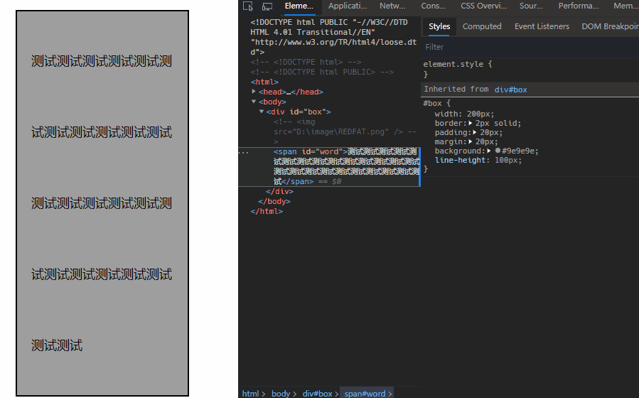

## 盒模型

> [box model](https://www.w3.org/TR/CSS22/box.html)

CSS 的盒模型描述了如何从 DOM 元素生成一个一个的矩形盒子，并通过视觉格式模型进行布局。

### 标准盒模型

CSS 标准盒模型由四个区域组成，每个区域都可细分为`top`，`right`，`bottom`，`left`四个方向，并且对应四个不同的属性来控制：

- 内容区域`content`，对应`content box`内容区域的宽高取决于几个因素：
  - 元素的`width`和`height`属性
  - 盒子是否包含文本或者其它盒子
  - 盒子是否是`display:table`
- 围绕内容区域的`padding`区域，`padding`区域组成`padding box`，由`padding`属性定义，也叫做内边距
- 围绕`padding`的`border`区域，的`border`区域组成`border box`，由`border`属性定义，也叫做边框
- `border`外层的`margin`，`margin`区域组成`margin box`，由`margin`属性定义，也叫做外边距


`content`， `padding`，`border`这些区域的背景取决于当前元素的`background`CSS 属性，`border`区域的样式还可使用`border`CSS 属性来定义；而`margin`则始终是透明的区域。

而行内元素的占用空间尺寸由`line-height`决定，对行内元素设置`line-height`指的是其内部每行文字的高度，而对块级元素设置`line-height`也指的是其内部行内元素的行高，例如下面两种设置`line-height`的方式是等价的

```html
<div id="box" style="line-height:100px">
  <!--  -->
  <span id="word"
    >测试测试测试测试测试测试测试测试测试测试测试测试测试测试测试测试测试测试测试测试测试测试测试测试</span
  >
</div>
```

```html
<div id="box">
  <!--  -->
  <span id="word" style="line-height:100px"
    >测试测试测试测试测试测试测试测试测试测试测试测试测试测试测试测试测试测试测试测试测试测试测试测试</span
  >
</div>
```



### 怪异盒模型

怪异盒模型来源于 IE 盒模型缺陷问题，在 IE6 版本以前的大多数浏览器，包括 IE，NetScape 等对盒模型计算尺寸时，对通过`width`设置的块级元素，将其内容宽度 content width，padding，border 三者的和作为`width`来看，也就是相比实际的标准盒模型，计算出来的盒模型的尺寸要小。

```shell
size = width + margin;
```

这种模式在一些不看重`padding`和`border`属性的场景是很方便的，但是如果你对一个元素同时设置了`width`，`padding`和`border`属性时，就要特别小心这时候的`width`并不会只看作内容区域的宽度，实际内容区域的宽度只占：

```shell
content width = width - (padding + border);
```


## box-sizing

CSS3 引入了`box-sizing`属性，使得开发者可以使用`box-sizing`改变盒子模型的尺寸计算方式，以满足不同场景的业务需求。

### content-box

`content-box`是默认值，采用的是标准盒子模型，遵循标准盒模型的尺寸计算方式：

```shell
size = content width + padding + border + margin;
```

### border-box

`box-sizing:border-box`，是将元素的`padding`，`border`的值计算在`width`内：

```shell
width = content width + padding + border;

size = width + margin;
```

对于`width:auto`和 `height:auto`这样的长度属性值，并不会受到`box-sizing`属性的影响；这时候的`width`和`height`设置的始终是`content`的宽度和高度。

<iframe src="https://interactive-examples.mdn.mozilla.net/pages/css/box-sizing.html" title="MDN Web Docs Interactive Example" width="100%" height="400px" loading="lazy"></iframe>

在日常的开发过程中，首先指定所有元素为`box-sizing:border-box`，在布局上会非常方便。

```css
* { 
  box-sizing: border-box; 
}
```

