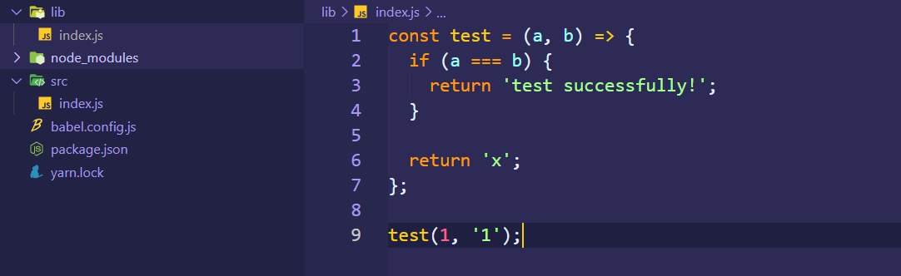

## 编写 babel plugin

> [Writing your first Babel Plugin](https://github.com/jamiebuilds/babel-handbook/blob/master/translations/en/plugin-handbook.md#writing-your-first-babel-plugin)
>
> [babel plugin - 中文手册](https://github.com/jamiebuilds/babel-handbook/blob/master/translations/zh-Hans/plugin-handbook.md)

从上文的介绍中，大致了解了`babel`的一些原理，`AST`的遍历过程，`visitor`模式等。

## 初始化 project

先新建一个名为`babel-plugin-oxygen`的文件夹作为项目根目录，这里使用`babel-plugin-x`前缀开头的`plugin`方便再配置的时候可以使用简写形式。

执行`yarn init`初始化`package.json`的一些配置，其中比较关键的为：

- `"private": false`：打包发布到`npm`必备
- `"version": "1.0.0"`：指定版本，`npm`每次发布都要指定不同的版本号
- `"main": "index.js"`：指定程序入口路径

```json
{
  "name": "babel-plugin-oxygen",
  "version": "1.0.0",
  "main": "index.js",
  "repository": "https://github.com/wood3n/babel-plugin-oxygen.git",
  "author": "wood3n",
  "license": "MIT",
  "private": false
}
```

## 编写入口文件

所谓`plugin`其实也就是一个在`babel`编译代码**转换过程中执行的函数**，所以`plugin`的主程序文件只需要`export`一个函数即可。

`plugin`函数具有以下特点：

- 接收一个`babel`对象作为参数，其内部具有`types`属性，`types`即[`@babel/types`](https://babeljs.io/docs/en/babel-types#install)对象，内部具有一堆访问和操作节点的方法
- 返回一个对象，其具有`visitor`属性，`visitor`本身也是一个对象，其内部具有访问节点的多种方法，这些方法的名称都对应不同的[节点类型](https://github.com/babel/babel/blob/master/packages/babel-parser/ast/spec.md)。每个方法又会接受两个参数：
  - `path`：也就是保存节点关联关系的对象，可以直接访问节点属性
  - `state`：获取通过`babel`配置文件指定的插件配置项

```javascript
module.exports = function({ types: t }) {
  return {
    visitor: {
      Identifier(path, state) {},
      ASTNodeTypeHere(path, state) {},
      // ...
    },
  };
};
```

这里编写一个简单的将`==`转换成`===`的`plugin`

```javascript
// index.js
// transform == to ===

module.exports = function({ types: t }) {
  return {
    visitor: {
      BinaryExpression(path) {
        if (path.node.operator === '==') {
          path.node.operator = '===';
        }
      },
    },
  };
};
```

## 发布

发布到`npm`的流程也就简单两步：登录和发布，注意登录之前将本地`npm`注册源改为`npm`原来的地址：

```
npm config set registry http://registry.npmjs.org

// 淘宝源
npm config set registry http://registry.npmjs.taobao.org
```

### npm login

如果没有`npm`账号，可以在[这里](https://www.npmjs.com/signup)注册一个，然后执行`npm login`会要求输入注册时的账号、密码和 Email。


### npm publish

执行发布的命令是`npm publish --access=public`，`access`是指定发布的`package`的访问权限。因为`npm`在个人或者团体注册的时候会默认将个人或者团体注册作为命名空间限制`package`，这样你的`package`就可以和其它人的`package`同名。

对于非付费用户，必须指定`access=public`，因为其默认值是`restricted`。

```
npm publish --access=public
```


### 验证

如果查看 package 有没有发布成功呢，一方面可以从发布命令行结果知晓，发布后也可以在`npm`官网直接搜索 package 的名称。


## 使用

接下来让我们新建一个项目用来测试使用刚才发布的`plugin`。

测试使用的过程不像编写`plugin`那么简单，不仅需要安装刚才发布的`plugin`，还需要安装`babel`运行的基础工具，因为`plugin`的执行依托这些基础程序：

- `@babel/core`是`babel`的核心程序，负责解析转换生成代码
- `@babel/cli`是`babel`的`nodejs`命令行程序，让我们可以通过命令行执行`babel`编译

```
yarn add @babel/core @babel/cli babel-plugin-oxygen
```

### 配置

在项目根目录新建`bable.config.js`文件，只需要配置使用我们发布的`plugin`即可。

```javascript
module.exports = function(api) {
  api.cache(true);

  return {
    plugins: ['oxygen'],
  };
};
```

这里注意需要指定`api.cache`的配置，该配置旨在提高`babel`的性能，否则`babel`会报如下错误提示


### 编写源码

新建`src/index.js`文件，编写一个测试程序，因为我们的`plugin`是为了将`==`修改成`===`，所以这里写一个带有`==`的程序

```javascript
const test = (a, b) => {
  if (a == b) {
    return 'test successfully!';
  }

  return 'x';
};

test(1, '1');
```

### 执行编译

最后测试程序的目录结构如下

```
.
├─ src
│    └─ index.js
├─ babel.config.js
├─ package.json
└─ yarn.lock
```

执行`@babel/cli`的命令，该命令会获取`src`下`index.js`文件作为入口程序，并将编译的代码输出到`lib`文件夹下

```
./node_modules/.bin/babel src --out-dir lib
```

也可以将该命令写入`package.json`的`scripts`字段下，然后执行`yarn build`

```json
"scripts": {
  "build": "./node_modules/.bin/babel src --out-dir lib"
}
```


执行完以后找到`lib/index.js`文件，可以看到该程序的`==`已经转换成了`===`



## 常用操作

有以下常用的访问和操作节点的方法

### 访问节点

要获取一个节点的属性值，可以在方法内部通过`path.node.xxx`来获取，例如二元操作运算符具有`left`，`right`以及操作符号`operator`三个属性

```javascript
BinaryExpression(path) {
  path.node.left;
  path.node.right;
  path.node.operator;
}
```

要获取父节点，可以通过`path.parent`，具体这些操作可以从[`@babel/traverse`](https://github.com/babel/babel/tree/main/packages/babel-traverse/src/path)中获取。

## other

### 生命周期方法

可以指定在插件运行之前或者运行之后的方法，可以用于分析插件的执行过程，清理插件的执行缓存等

```javascript
module.exports = function({ types: t }) {
  return {
    pre(state) {
      this.cache = new Map();
    },
    visitor: {
      StringLiteral(path) {
        this.cache.set(path.node.value, 1);
      },
    },
    post(state) {
      console.log(this.cache);
    },
  };
};
```

### 获取插件配置项

通过`babel`的配置文件，例如`babel.config.js`可以指定不同`plugin`的配置项

```javascript
{
  plugins: [
    [
      'my-plugin',
      {
        option1: true,
        option2: false,
      },
    ],
  ];
}
```

在`plugin`中可以通过`visitor`的每个方法的第二个参数`state`来获取这些配置项

```javascript
module.exports = function() {
  return {
    visitor: {
      FunctionDeclaration(path, state) {
        console.log(state.opts);
        // { option1: true, option2: false }
      },
    },
  };
};
```