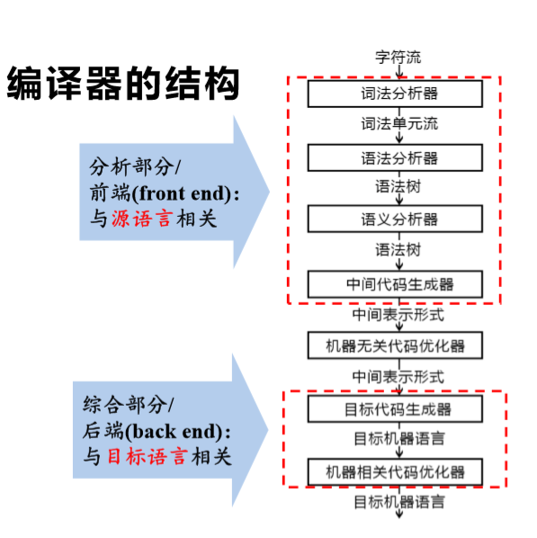

有关编译原理的知识，这里粗略的理解一下。

高级语言在处理成可执行代码之前都要经过编译这一个阶段。编译的定义就是**将一种语言`transform`（转换）成另一种语言**的过程，这里的另一种语言可以是汇编语言，机器语言或者其它任何一种语言。

所以这里就有一个点：编译得到的语言并不一定都是可执行的机器语言。

## 编译器-compiler

编译器是从`compiler`翻译过来的名词，它是将程序源代码转换成目标语言的程序，也就是编译器就是负责编译的程序。



#### 词法分析

词法分析（Lexical Analysis 或者叫`tokenizer`）一般是编译过程的第一步，通过输入源代码，**逐字符**将源代码在组合成一个一个的标识符，关键字，运算符等，最后得到一个由单词和它们对应的语法类型组成的`tokens`数组，例如

```javascript
function test() {
  const a = 1 + 1;
  return a;
}
```

最后得到的一系列`tokens`可以是这样的：

```json
[
  {
    "type": "Keyword", // 关键字
    "value": "function"
  },
  {
    "type": "Identifier", // 标识符
    "value": "test"
  },
  {
    "type": "Punctuator", // 标点符号
    "value": "("
  },
  {
    "type": "Punctuator",
    "value": ")"
  },
  {
    "type": "Punctuator",
    "value": "{"
  },
  {
    "type": "Keyword",
    "value": "const"
  },
  {
    "type": "Identifier",
    "value": "a"
  },
  {
    "type": "Punctuator",
    "value": "="
  },
  {
    "type": "Numeric",
    "value": "1"
  },
  {
    "type": "Punctuator",
    "value": "+"
  },
  {
    "type": "Numeric",
    "value": "1"
  },
  {
    "type": "Punctuator",
    "value": ";"
  },
  {
    "type": "Keyword",
    "value": "return"
  },
  {
    "type": "Identifier",
    "value": "a"
  },
  {
    "type": "Punctuator",
    "value": ";"
  },
  {
    "type": "Punctuator",
    "value": "}"
  }
]
```

#### 语法分析

语法分析（Syntax Analysis）是对`tokens`进行遍历，根据每个`token`的`type`将它们**进行关系组合**，最终生成一个 AST（抽象语法树）的结构。

`AST`这种树形的数据结构在不同语言中的实际表现形式也不相同，但其主要作用就是建立源代码字符的属性以及源代码字符之间的关系。例如上文的函数最终得到下文这样一个树状结构，这里就将每一个不相干的`token`通过树的结构组合起来了。


## 解释器-interpreter

解释器，`interpreter`，它是负责将源代码直接转换成可执行程序的程序，通过输入程序源代码，最后输出就是程序执行的结果。实际上，很多解释器内部都是由“编译器+虚拟机”组成，即先将源代码程序转换成 AST 或者字节码，然后再由虚拟机去执行。

## 解析器-parser

解析器是从`parser`翻译过来的名词，它是负责做语法分析的程序，也就是最终生成`AST`。它是编译器或者解释器的组成部分，也可以用在 IDE 内部。

### [the-super-tiny-compiler](https://github.com/jamiebuilds/the-super-tiny-compiler/blob/master/the-super-tiny-compiler.js)

最小的编译器项目

## 在线解析AST

- [astexplorer](https://astexplorer.net/)
- [TypeScript AST Viewer (ts-ast-viewer.com)