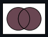
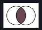
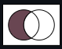

### 什么是 browserslist

[`browserslist`](https://github.com/browserslist/browserslist)在不同的前端工具之间共享配置目标浏览器环境的第三方工具。

### 配置

- 支持直接在`package.json`的`browserslist`字段中配置；优先级最高

```json
  "browserslist": [
    "defaults",
    "not IE 11",
    "maintained node versions"
  ]
```

- 同时也支持使用配置文件`.browserslistrc`；优先级次之

```json
# Browsers that we support

defaults
not IE 11
maintained node versions
```

- 支持不同项目环境下的不同配置，常用`development`和`production`来区分，例如

```javascript
module.exports = {
  development: ['last 1 version'],
  production: ['last 1 version', '> 1%', 'ie 10'],
};
```

### 规则

此外`browserslist`还有以下配置项说明：

- `defaults`：也就是`> 0.5%, last 2 versions, Firefox ESR, not dead`
- `> 5%`：`>`，`>=`, `<` 或 `<=` 这些符号表示基于全球浏览器使用率统计数据进行的选择，例如`> 5%`也就是考虑浏览器市场份额至少在全球`5%`以上
- `cover 99.5%`：浏览器的市场覆盖率达到`99.5%`
- `dead`：浏览器官方更新已经停滞`24`个月以上，例如`IE 10`, `IE_Mob 11`
- `last 2 versions`：永远支持浏览器最新的两个迭代版本，可以指定对应的浏览器，例如`last 2 Chrome versions`
- `node 10`：nodejs `10.x`版本
- 特定浏览器:

  - `iOS 7`
  - `Firefox > 20`
  - `ie 6-8`
  - `Firefox ESR`：firefox 拓展包
  - `PhantomJS 2.1`：safari 特定版本

- 特定 JS 语法特性

  - `supports es6-module`：支持 ES6 module，其他可用的语法特性可以从[`caniuse-lite/data/features`](https://github.com/ben-eb/caniuse-lite/tree/master/data/features)获取

- 特定时间发布的浏览器版本
  - `since 2015`
  - `last 2 years`
- 支持测试版本的浏览器
  - `unreleased versions`

### 配置项组合

`browserslist`的配置项支持使用以下形式的符号或者单词进行组合，它们之间的关系类似于集合

| 符号     | 描述                                                         | 适用范围                               | 示例                                                     |
| -------- | ------------------------------------------------------------ | -------------------------------------- | -------------------------------------------------------- |
| `or`/`,` |  |                                        | `> .5% or last 2 versions`<br />`> .5%, last 2 versions` |
| `and`    |  |                                        | `> .5% and last 2 versions`                              |
| `not`    |  | 可用于任意规则，但是不能用于配置项开头 | `> .5% and not last 2 versions`                          |

### 浏览器列表

以下浏览器都被`browserlist`支持，并且配置时大小写不敏感

- `Android` ：安卓 webview
- `Baidu`
- `BlackBerry` or `bb`
- `Chrome`
- `ChromeAndroid` or `and_chr`：chrome 安卓
- `Edge`
- `Electron`
- `Explorer` or `ie`
- `ExplorerMobile` or `ie_mob`
- `Firefox` or `ff`
- `FirefoxAndroid` or `and_ff`
- `iOS` or `ios_saf`
- `Node`
- `Opera`
- `OperaMini` or `op_mini`
- `OperaMobile` or `op_mob`
- `QQAndroid` or `and_qq`
- `Safari`
- `Samsung`
- `UCAndroid` or `and_uc`
- `kaios`

### 最佳实践

- 可以直接使用`defaults`配置，它代表的是指定市场份额大于`0.5%`并且支持最新两个迭代版本的浏览器
- 建议指定浏览器版本，这样可以使软件本身更好地适应当地的浏览器市场，例如`last 2 Chrome versions`