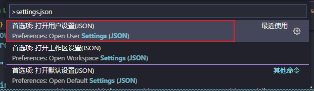

其实`stylelint`和`eslint`配置都差不多，只是有些需要注意的地方

## 安装 stylelint

在项目内安装`stylelint`，这里以`stylelint`提供的标准拓展`stylelint-config-standard`为例

```shell
npm install --save-dev stylelint stylelint-config-standard
```

如果需要格式化`less`，`scss`这些 CSS 预处理器语言，还需要安装其他语言解析工具

```shell
npm install postcss postcss-less --save-dev
```

## 配置 stylelint

配置`stylelint`，可以使用`json`，`js`等文件放在项目根目录，例如`.stylelintrc`

```json
{
  "extends": "stylelint-config-standard",
  "rules": {
    "alpha-value-notation": "number",
    "selector-class-pattern": null
  }
}
```

如果要格式化`less`，`scss`这些 CSS 预处理器语言，还需要[补充自定义解析工具](https://stylelint.io/user-guide/usage/options#customsyntax)

```json
"overrides": [
  {
    "files": [
      "*.scss", 
      "**/*.scss"
    ],
    "customSyntax": "postcss-scss"
  },
  {
    "files": [
      "*.less",
      "**/*.less"
    ],
    "customSyntax": "postcss-less"
  }
]
```

## 安装 vscode-stylelint

安装 vscode 插件`stylelint.vscode-stylelint`

## 配置 vscode-stylelint

配置 vscode 插件`stylelint.vscode-stylelint`

1. 使用命令面板打开 vscode 用户设置`settings.json`



2. 修改以下几项

```json
"editor.codeActionsOnSave": {
  // 保存文件自动使用 stylelint 修复
  "source.fixAll.stylelint": true
},
// 以下指定这几种 css 语法使用 stylelint 格式化
"[css]": {
  "editor.formatOnSave": true,
  "editor.formatOnPaste": true,
  "editor.defaultFormatter": "stylelint.vscode-stylelint",
},
"[less]": {
  "editor.formatOnSave": true,
  "editor.formatOnPaste": true,
  "editor.defaultFormatter": "stylelint.vscode-stylelint",
},
"[scss]": {
  "editor.formatOnSave": true,
  "editor.formatOnPaste": true,
  "editor.defaultFormatter": "stylelint.vscode-stylelint",
},
```

:::caution

注意不要使用`stylelint.config`这个配置项，这个配置项会让`stylelint`插件使用`stylelint.config`的配置，而不会查找项目根目录下的`.stylelintrc`等配置文件。

:::