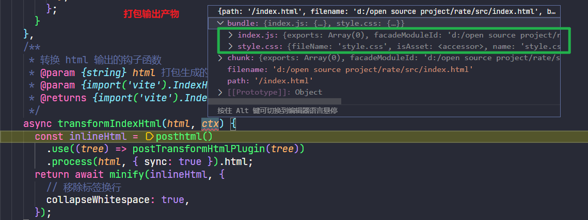

## vite 插件定义

vite 官方对 plugin 的定义包含以下几个方面：

- 一个函数，可以接收任意自定义的参数；

- 插件函数调用后，返回一个对象，包含`name`属性（也就是插件名），以及一些 vite 特定的 hook 方法或者 rollup hook 等方法，该对象通过 vite 配置的`plugins`属性传入 vite 内部影响 vite 构建；
- 可以通过指定`enforce: pre | post`属性来调整插件执行的顺序；
- 插件可以是异步的，也可以是同步的。

## vite 自定义 hook

vite 在 [rollup 插件](https://rollupjs.org/guide/en/#plugins-overview) 的基础上定义了一些额外的插件方法和属性，用来满足不同的构建需求。

类型定义：

```typescript
interface Plugin {
  	// 插件名
    name: string;
    /**
     * 指定插件调用的顺序，见下文插件顺序调用
     */
    enforce?: 'pre' | 'post';
    /**
     * 默认情况下插件在开发（serve）和构建（build）模式中都会调用，通过用 apply 属性指定调用的时机
     */
    apply?: 'serve' | 'build' | ((config: UserConfig, env: ConfigEnv) => boolean);
    /**
     * 在解析 Vite 配置前调用。钩子接收原始用户配置（命令行选项指定的会与配置文件合并）和一个描述配置环境的变量，返回一个将被深度合并到现有配置中的部分配置对象
     */
    config?: (config: UserConfig, env: ConfigEnv) => UserConfig | null | void | Promise<UserConfig | null | void>;
    /**
     * 获取 vite 最终的配置，在解析合并 Vite 配置后调用
     */
    configResolved?: (config: ResolvedConfig) => void | Promise<void>;
    /**
     * 获取开发服务器实例，用于配置开发服务器，只在开发环境调用
     */
    configureServer?: ServerHook;
  	/**
     * 配置预览服务器实例，用于预览本地打包完的页面
     */
    configurePreviewServer: ServerHook;
    /**
     * 获取 html 字符串和 bundle 产物，用于转换打包后的 html 页面
     */
    transformIndexHtml?: IndexHtmlTransform;
    /**
     * 获取开发环境构建产物，用于自定义 HMR 更新处理
     */
    handleHotUpdate?(ctx: HmrContext): Array<ModuleNode> | void | Promise<Array<ModuleNode> | void>;
}
```

## 最佳实践

### minify html

vite 打包不会 minify html 文件，利用 vite 上述提供的 hook - `transformIndexHtml`就可以实现这一功能：

```typescript
import { Plugin } from 'vite';
import { minify } from 'html-minifier-terser';

const VitePluginMinifyHtml: Plugin = () => {
  return {
    name: 'vite-plugin-minify-html',
    /**
     * 转换 html 输出的钩子函数
     * @param {string} html 打包生成的转换前的 html
     * @param {import('vite').IndexHtmlTransformContext} ctx 当前 bundle，chunk 等输出信息
     * @returns {import('vite').IndexHtmlTransformResult} 转换后的 html 字符串
     */
    async transformIndexHtml(html) {
      return await minify(html, {
        // 移除标签换行
        collapseWhitespace: true,
      });
    },
  };
};
```

### inline chunk

vite 没有提供将打包产物内联到 html 文件的能力，我们可以通过`config` hook 修改 vite 的配置，并配合`transformIndexHtml`将 chunk 插入到 html 内部。

```js
const posthtml = require('posthtml');
const postTransformHtmlPlugin = require('../post-transform-html-plugin');
const { minify } = require('html-minifier-terser');

/**
 * 将 html esmodule 载入的 js script 转换成本地加载
 * 利用 transformIndexHtml 钩子函数： https://cn.vitejs.dev/guide/api-plugin.html#transformindexhtml
 */
const VitePluginInlineChunk = () => {
  return {
    name: 'vite-plugin-transform-esm',
    /**
     * 修改 vite 配置
     * @param {import('vite').UserConfig} config
     * @param {import('vite').ConfigEnv} env
     * @returns {import('vite').UserConfig}
     */
    config(config, { mode }) {
      if (mode === 'production') {
        return {
          build: {
            // 图片等资源全部转换成 base64
            assetsInlineLimit: Number.MAX_SAFE_INTEGER,
            // 禁用 css split chunk，打包生成一个 css 文件
            cssCodeSplit: false,
            rollupOptions: {
              output: {
                // 从入口生成的 js chunk 的文件名
                entryFileNames: '[name].js',
                // css 文件名
                assetFileNames: '[name][extname]',
                // 禁用 js split chunks，打包只生成一个 index.js 文件
                // from vite2.9, split vendor chunk need to use splitVendorChunkPlugin: https://cn.vitejs.dev/guide/build.html#chunking-strategy
                manualChunks: () => 'index.js',
              },
            },
          },
        };
      }
    },
    /**
     * 转换 html 输出的钩子函数
     * @param {string} html 打包生成的转换前的 html
     * @param {import('vite').IndexHtmlTransformContext} ctx 当前 bundle，chunk 等输出信息
     * @returns {import('vite').IndexHtmlTransformResult} 转换后的 html 字符串
     */
    async transformIndexHtml(html, ctx) {
     	// 这里利用 posthtml 的能力
      const inlineHtml = posthtml()
        .use((tree) => postTransformHtmlPlugin(tree, ctx))
        .process(html, { sync: true }).html;
      return await minify(inlineHtml, {
        // 移除标签换行
        collapseWhitespace: true,
      });
    },
  };
};

module.exports = VitePluginInlineChunk;
```

经过`config`修改后的 vite 打包构建产物只会包含一个 CSS 文件和一个 JS 文件，然后`posthtml`处理 html 的 AST，并将 CSS 和 JS 代码插入到`index.html`即可。



以下是`postTransformHtmlPlugin `处理 html 的 AST

```js
/**
 * postTransformHtmlPlugin
 * 使用 postHTML 将 js 和 css 进行内联转换
 * @param {import('posthtml').Node} tree
 */
module.exports = function (tree, ctx) {
  // 匹配并移除 header 内部的 script
  tree.match({ tag: 'script', attrs: { type: 'module' } }, (node) => {
    node.tag = false;

    return node;
  });
  
  // 替换 link 为 style
  tree.match({ tag: 'link', attrs: { rel: 'stylesheet' } }, (node) => {
    return {
      tag: 'style',
      content: ctx['style.css'].source,
    };
  });

  // 在 body 底部插入内联 js
  tree.match({ tag: 'body' }, (node) => {
    Object.assign(node, {
      content: node.content.concat({
        tag: 'script',
        attrs: { type: 'text/javascript' },
        content: ctx['index.js'].code
      }),
    });

    return node;
  });
};
```

